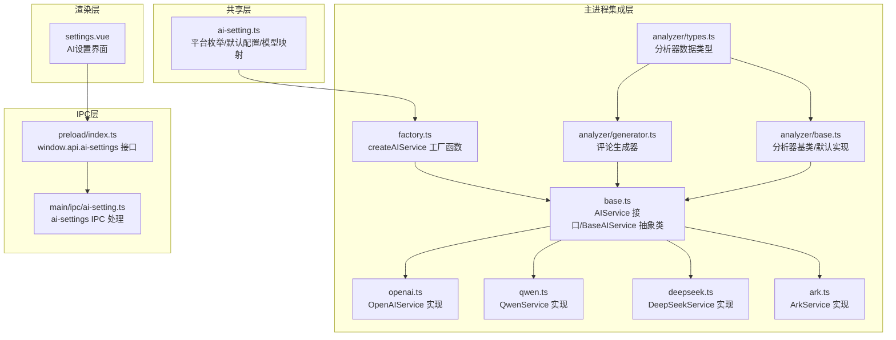
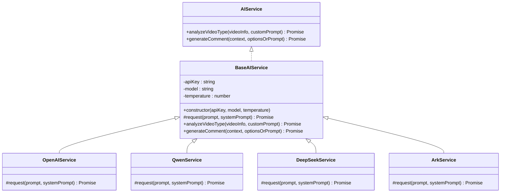
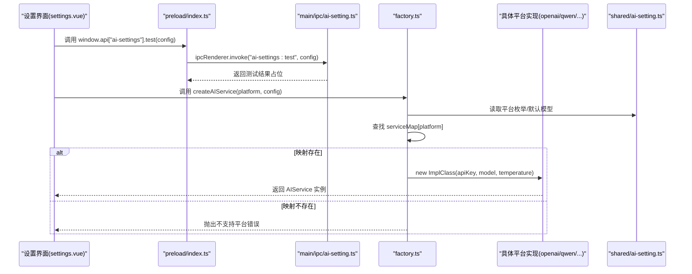
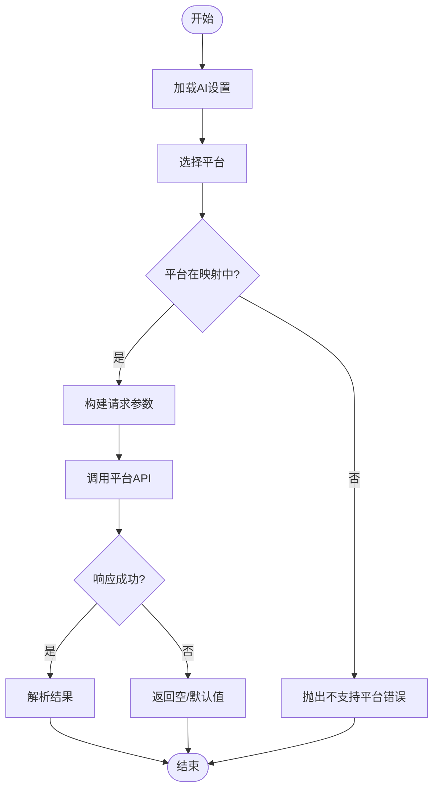
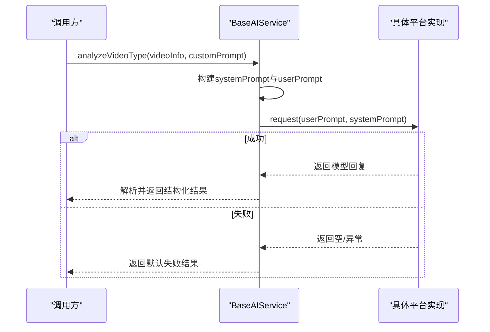
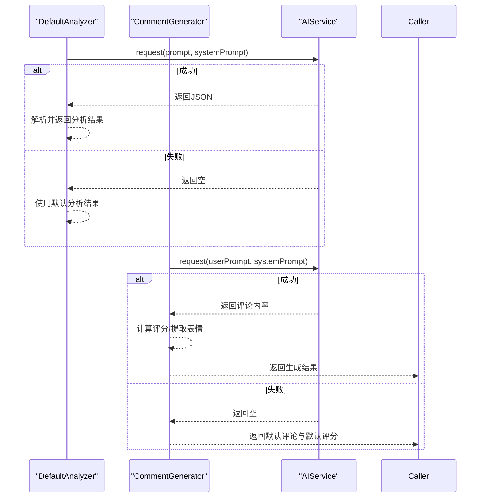
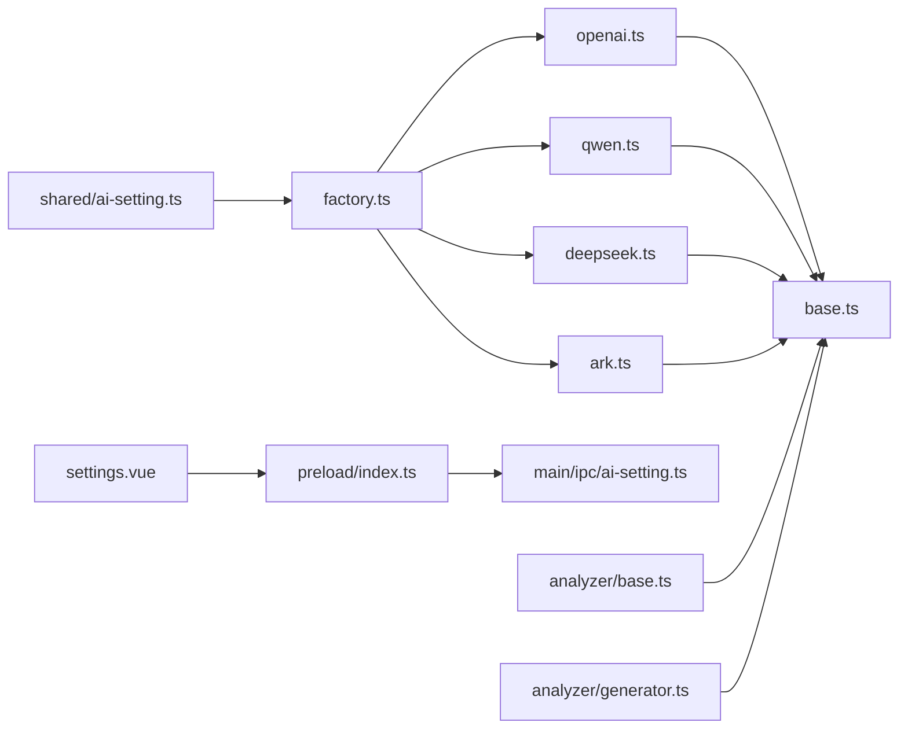

# AI服务工厂

<cite>
**本文引用的文件**
- [factory.ts](file://src/main/integration/ai/factory.ts)
- [base.ts](file://src/main/integration/ai/base.ts)
- [openai.ts](file://src/main/integration/ai/openai.ts)
- [qwen.ts](file://src/main/integration/ai/qwen.ts)
- [deepseek.ts](file://src/main/integration/ai/deepseek.ts)
- [ark.ts](file://src/main/integration/ai/ark.ts)
- [ai-setting.ts](file://src/shared/ai-setting.ts)
- [ai-setting.ts](file://src/main/ipc/ai-setting.ts)
- [index.ts](file://src/preload/index.ts)
- [settings.vue](file://src/renderer/src/pages/settings.vue)
- [generator.ts](file://src/main/integration/ai/analyzer/generator.ts)
- [base.ts](file://src/main/integration/ai/analyzer/base.ts)
- [types.ts](file://src/main/integration/ai/analyzer/types.ts)
</cite>

## 目录
1. [简介](#简介)
2. [项目结构](#项目结构)
3. [核心组件](#核心组件)
4. [架构总览](#架构总览)
5. [详细组件分析](#详细组件分析)
6. [依赖关系分析](#依赖关系分析)
7. [性能与资源优化](#性能与资源优化)
8. [故障排查指南](#故障排查指南)
9. [结论](#结论)
10. [附录](#附录)

## 简介
本文件系统性阐述 AutoOps 中“AI服务工厂”的设计与实现，重点覆盖：
- 工厂模式在多AI平台统一接入中的应用
- AI平台注册机制与动态服务创建流程
- 平台选择策略、配置校验与实例化过程
- 生命周期管理与资源优化策略
- 在AutoOps中的具体应用场景与最佳实践

## 项目结构
AI服务工厂位于主进程集成层，围绕统一接口与抽象基类构建，按平台拆分具体实现，并通过工厂函数完成动态实例化。

图表来源
- [factory.ts:1-27](file://src/main/integration/ai/factory.ts#L1-L27)
- [base.ts:23-131](file://src/main/integration/ai/base.ts#L23-L131)
- [openai.ts:1-45](file://src/main/integration/ai/openai.ts#L1-L45)
- [qwen.ts:1-45](file://src/main/integration/ai/qwen.ts#L1-L45)
- [deepseek.ts:1-45](file://src/main/integration/ai/deepseek.ts#L1-L45)
- [ark.ts:1-45](file://src/main/integration/ai/ark.ts#L1-L45)
- [ai-setting.ts:1-29](file://src/shared/ai-setting.ts#L1-L29)
- [settings.vue:1-140](file://src/renderer/src/pages/settings.vue#L1-L140)
- [index.ts:169-174](file://src/preload/index.ts#L169-L174)
- [ai-setting.ts:1-27](file://src/main/ipc/ai-setting.ts#L1-L27)
- [generator.ts:1-180](file://src/main/integration/ai/analyzer/generator.ts#L1-L180)
- [base.ts:1-183](file://src/main/integration/ai/analyzer/base.ts#L1-L183)
- [types.ts:1-73](file://src/main/integration/ai/analyzer/types.ts#L1-L73)

章节来源
- [factory.ts:1-27](file://src/main/integration/ai/factory.ts#L1-L27)
- [ai-setting.ts:1-29](file://src/shared/ai-setting.ts#L1-L29)

## 核心组件
- 工厂函数 createAIService：根据平台枚举从映射表中选择对应服务类并实例化，提供统一入口。
- 抽象基类 BaseAIService：定义 AIService 接口与通用能力（视频类型分析、评论生成），并封装请求模板与错误兜底。
- 平台实现类：OpenAIService、QwenService、DeepSeekService、ArkService，均继承自 BaseAIService，负责各自平台的HTTP请求细节。
- 分析器与生成器：基于 AIService 提供视频/评论分析与评论生成能力，内部可回退到默认策略。

章节来源
- [factory.ts:16-25](file://src/main/integration/ai/factory.ts#L16-L25)
- [base.ts:23-131](file://src/main/integration/ai/base.ts#L23-L131)
- [openai.ts:3-45](file://src/main/integration/ai/openai.ts#L3-L45)
- [qwen.ts:3-45](file://src/main/integration/ai/qwen.ts#L3-L45)
- [deepseek.ts:3-45](file://src/main/integration/ai/deepseek.ts#L3-L45)
- [ark.ts:3-45](file://src/main/integration/ai/ark.ts#L3-L45)
- [generator.ts:9-53](file://src/main/integration/ai/analyzer/generator.ts#L9-L53)
- [base.ts:10-22](file://src/main/integration/ai/analyzer/base.ts#L10-L22)

## 架构总览
AI服务工厂采用“接口+抽象基类+多实现+工厂映射”的分层设计，确保：
- 统一调用接口：AIService
- 可插拔平台：通过 serviceMap 动态绑定平台与实现
- 可扩展性：新增平台只需实现 BaseAIService 并在映射中注册
- 可观测与可恢复：统一的请求模板、超时控制与错误兜底

图表来源
- [base.ts:23-131](file://src/main/integration/ai/base.ts#L23-L131)
- [openai.ts:3-45](file://src/main/integration/ai/openai.ts#L3-L45)
- [qwen.ts:3-45](file://src/main/integration/ai/qwen.ts#L3-L45)
- [deepseek.ts:3-45](file://src/main/integration/ai/deepseek.ts#L3-L45)
- [ark.ts:3-45](file://src/main/integration/ai/ark.ts#L3-L45)

## 详细组件分析

### 工厂模式与平台注册机制
- 平台枚举与默认配置：共享层定义平台枚举、默认配置与各平台可用模型列表。
- 工厂映射：工厂文件维护平台到实现类的映射表；新增平台仅需在此处登记。
- 动态实例化：工厂函数根据传入平台键值从映射表取类构造器并实例化，同时注入配置参数。

图表来源
- [settings.vue:50-64](file://src/renderer/src/pages/settings.vue#L50-L64)
- [index.ts:169-174](file://src/preload/index.ts#L169-L174)
- [ai-setting.ts:1-27](file://src/main/ipc/ai-setting.ts#L1-L27)
- [factory.ts:9-25](file://src/main/integration/ai/factory.ts#L9-L25)
- [ai-setting.ts:1-29](file://src/shared/ai-setting.ts#L1-L29)

章节来源
- [factory.ts:9-25](file://src/main/integration/ai/factory.ts#L9-L25)
- [ai-setting.ts:1-29](file://src/shared/ai-setting.ts#L1-L29)

### 平台选择策略与配置验证
- 平台选择：前端设置页通过下拉框选择平台，自动联动模型列表。
- 配置来源：设置页从存储加载配置，保存后写入存储；测试按钮触发 IPC 测试（当前为占位）。
- 配置验证：工厂在实例化前依赖映射表进行平台合法性检查；平台实现类负责网络请求与响应解析。

图表来源
- [settings.vue:82-118](file://src/renderer/src/pages/settings.vue#L82-L118)
- [factory.ts:20-24](file://src/main/integration/ai/factory.ts#L20-L24)
- [openai.ts:8-44](file://src/main/integration/ai/openai.ts#L8-L44)

章节来源
- [settings.vue:17-64](file://src/renderer/src/pages/settings.vue#L17-L64)
- [ai-setting.ts:10-22](file://src/shared/ai-setting.ts#L10-L22)
- [factory.ts:20-24](file://src/main/integration/ai/factory.ts#L20-L24)

### 统一接口与通用能力
- 接口定义：AIService 规定两类能力——视频类型分析与评论生成。
- 抽象实现：BaseAIService 统一封装系统提示词构建、用户提示词拼装、错误处理与默认回退策略。
- 平台差异：各平台实现仅关注请求细节（URL、头部、消息体），保持行为一致性。

图表来源
- [base.ts:41-60](file://src/main/integration/ai/base.ts#L41-L60)
- [base.ts:116-130](file://src/main/integration/ai/base.ts#L116-L130)
- [openai.ts:4-44](file://src/main/integration/ai/openai.ts#L4-L44)

章节来源
- [base.ts:23-131](file://src/main/integration/ai/base.ts#L23-L131)

### 分析器与生成器的应用场景
- 分析器：提供视频分析、评论分析与情感分析能力，支持在无平台实现时回退到默认策略。
- 生成器：基于视频与评论分析结果，结合用户偏好生成评论，并计算评分与建议表情等。

图表来源
- [base.ts:24-182](file://src/main/integration/ai/analyzer/base.ts#L24-L182)
- [generator.ts:26-53](file://src/main/integration/ai/analyzer/generator.ts#L26-L53)
- [types.ts:16-72](file://src/main/integration/ai/analyzer/types.ts#L16-L72)

章节来源
- [base.ts:24-182](file://src/main/integration/ai/analyzer/base.ts#L24-L182)
- [generator.ts:9-180](file://src/main/integration/ai/analyzer/generator.ts#L9-L180)
- [types.ts:1-73](file://src/main/integration/ai/analyzer/types.ts#L1-L73)

## 依赖关系分析
- 工厂依赖共享层的平台枚举与默认配置，确保平台合法性与默认行为一致。
- 各平台实现依赖抽象基类，共享统一的提示词构建与错误处理策略。
- 渲染层通过 preload 的 window.api 与主进程 IPC 交互，间接驱动工厂创建服务实例。
- 分析器与生成器依赖 AIService 接口，形成“策略组合”：可选平台实现 + 默认回退策略。

图表来源
- [ai-setting.ts:1-29](file://src/shared/ai-setting.ts#L1-L29)
- [factory.ts:1-27](file://src/main/integration/ai/factory.ts#L1-L27)
- [openai.ts:1-45](file://src/main/integration/ai/openai.ts#L1-L45)
- [qwen.ts:1-45](file://src/main/integration/ai/qwen.ts#L1-L45)
- [deepseek.ts:1-45](file://src/main/integration/ai/deepseek.ts#L1-L45)
- [ark.ts:1-45](file://src/main/integration/ai/ark.ts#L1-L45)
- [base.ts:28-131](file://src/main/integration/ai/base.ts#L28-L131)
- [settings.vue:1-140](file://src/renderer/src/pages/settings.vue#L1-L140)
- [index.ts:169-174](file://src/preload/index.ts#L169-L174)
- [ai-setting.ts:1-27](file://src/main/ipc/ai-setting.ts#L1-L27)
- [base.ts:10-182](file://src/main/integration/ai/analyzer/base.ts#L10-L182)
- [generator.ts:1-180](file://src/main/integration/ai/analyzer/generator.ts#L1-L180)

章节来源
- [factory.ts:1-27](file://src/main/integration/ai/factory.ts#L1-L27)
- [base.ts:28-131](file://src/main/integration/ai/base.ts#L28-L131)

## 性能与资源优化
- 超时与中断：各平台实现统一使用 AbortController 控制请求超时，避免长时间阻塞。
- 错误兜底：当请求失败或解析异常时，返回默认安全内容，保证上层流程稳定。
- 模型与温度：通过共享配置集中管理模型与温度，便于统一优化与A/B对比。
- 并发与批量：生成器支持批量生成，利用 Promise.all 并行提升吞吐（注意平台限流与成本控制）。

章节来源
- [openai.ts:5-6](file://src/main/integration/ai/openai.ts#L5-L6)
- [qwen.ts:5-6](file://src/main/integration/ai/qwen.ts#L5-L6)
- [deepseek.ts:5-6](file://src/main/integration/ai/deepseek.ts#L5-L6)
- [ark.ts:5-6](file://src/main/integration/ai/ark.ts#L5-L6)
- [base.ts:48-60](file://src/main/integration/ai/base.ts#L48-L60)
- [generator.ts:169-179](file://src/main/integration/ai/analyzer/generator.ts#L169-L179)

## 故障排查指南
- 平台不可用：检查工厂映射表是否存在对应平台键值；确认共享层平台枚举与前端选择一致。
- 请求失败：查看平台实现的响应状态与异常日志；确认API Key、模型名与网络连通性。
- 解析异常：确认返回内容符合预期格式；观察基类解析逻辑的容错分支。
- 设置测试：当前IPC测试接口返回占位结果，可在后续完善为真实连通性检测。

章节来源
- [factory.ts:21-23](file://src/main/integration/ai/factory.ts#L21-L23)
- [openai.ts:32-43](file://src/main/integration/ai/openai.ts#L32-L43)
- [base.ts:57-59](file://src/main/integration/ai/base.ts#L57-L59)
- [ai-setting.ts:24-26](file://src/main/ipc/ai-setting.ts#L24-L26)

## 结论
AI服务工厂通过“接口+抽象基类+工厂映射+平台实现”的分层设计，实现了多AI平台的统一接入与可插拔扩展。其优势在于：
- 统一调用接口与通用能力封装
- 工厂映射简化平台注册与实例化
- 明确的错误兜底与超时控制
- 与分析器/生成器协同，形成完整的AI能力闭环

在AutoOps中，工厂为任务执行链路提供稳定的AI能力支撑，建议在新增平台时遵循现有抽象与命名规范，确保一致的生命周期与可观测性。

## 附录
- 最佳实践
  - 新增平台：实现 BaseAIService，完善 request 方法，更新工厂映射与共享配置。
  - 配置管理：集中维护平台枚举与默认配置，避免硬编码。
  - 错误处理：统一使用超时控制与默认回退策略，保障稳定性。
  - 性能优化：合理设置温度与模型，结合批量生成与缓存策略提升吞吐。