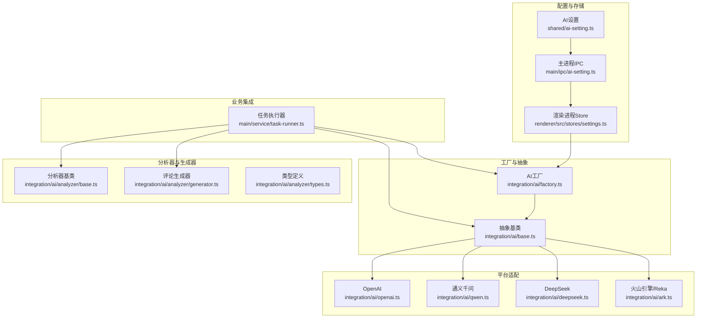
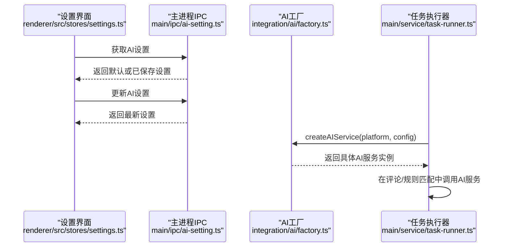
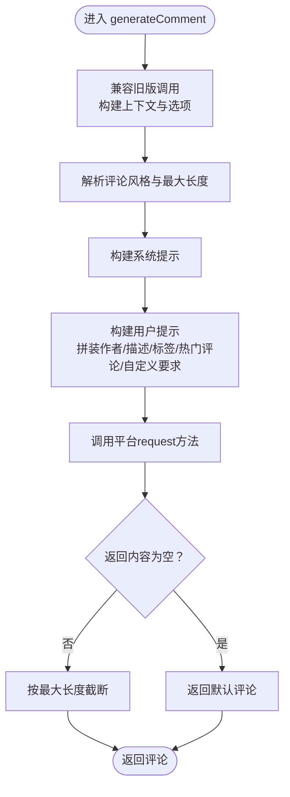
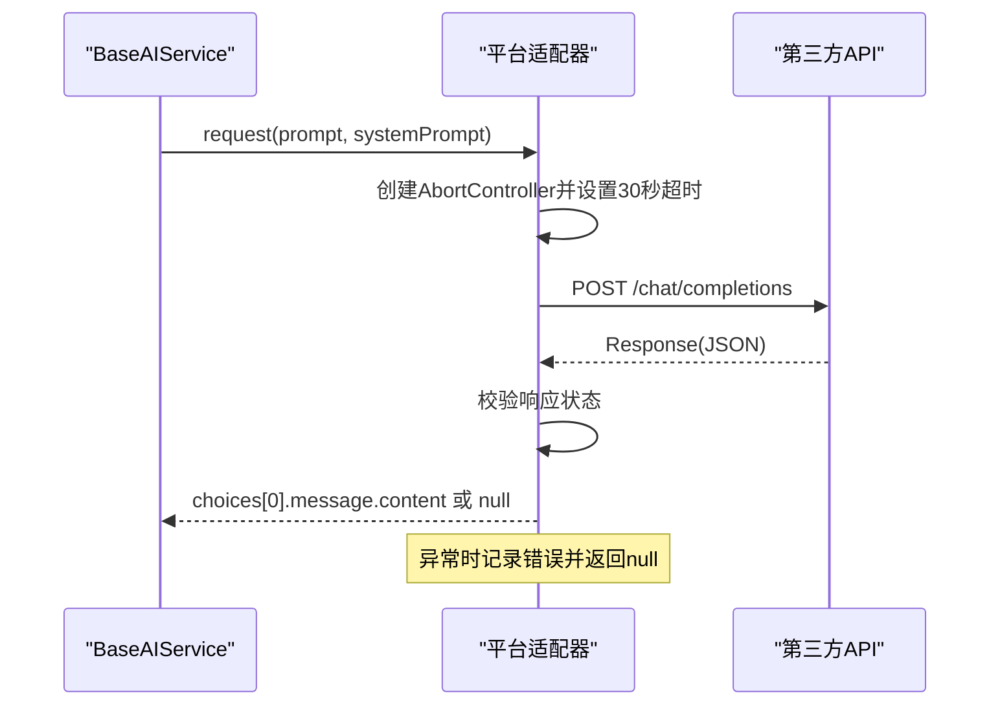
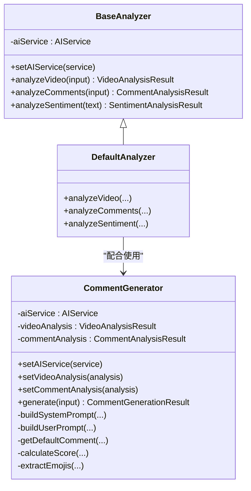
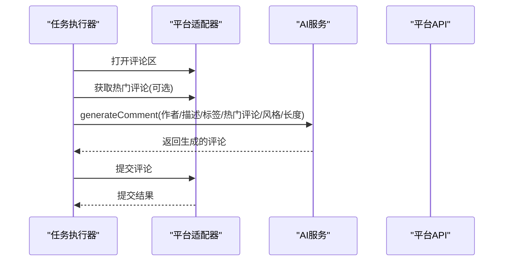
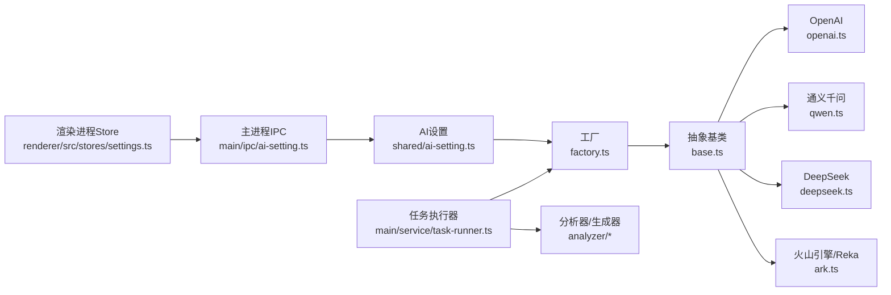

# AI服务集成

<cite>
**本文引用的文件**
- [factory.ts](file://src/main/integration/ai/factory.ts)
- [base.ts](file://src/main/integration/ai/base.ts)
- [openai.ts](file://src/main/integration/ai/openai.ts)
- [qwen.ts](file://src/main/integration/ai/qwen.ts)
- [deepseek.ts](file://src/main/integration/ai/deepseek.ts)
- [ark.ts](file://src/main/integration/ai/ark.ts)
- [ai-setting.ts](file://src/shared/ai-setting.ts)
- [ai-setting.ts（主进程IPC）](file://src/main/ipc/ai-setting.ts)
- [settings.ts（渲染进程store）](file://src/renderer/src/stores/settings.ts)
- [task-runner.ts](file://src/main/service/task-runner.ts)
- [index.ts（AI分析器导出入口）](file://src/main/integration/ai/analyzer/index.ts)
- [base.ts（AI分析器基类）](file://src/main/integration/ai/analyzer/base.ts)
- [generator.ts（评论生成器）](file://src/main/integration/ai/analyzer/generator.ts)
- [types.ts（AI分析器类型定义）](file://src/main/integration/ai/analyzer/types.ts)
- [autoops-expansion-plan.md](file://.trae/documents/autoops-expansion-plan.md)
</cite>

## 更新摘要
**所做更改**
- 增强了错误处理和响应验证机制，确保不同AI提供商之间的一致行为
- 优化了JSON解析和响应验证逻辑，提高了系统的稳定性和可靠性
- 完善了向后兼容性保障措施，确保现有功能不受影响
- 加强了平台适配器的错误处理和超时控制

## 目录
1. [简介](#简介)
2. [项目结构](#项目结构)
3. [核心组件](#核心组件)
4. [架构总览](#架构总览)
5. [详细组件分析](#详细组件分析)
6. [依赖关系分析](#依赖关系分析)
7. [性能考量](#性能考量)
8. [故障排查指南](#故障排查指南)
9. [结论](#结论)
10. [附录](#附录)

## 简介
本文件面向AutoOps项目的AI服务集成，系统性阐述基于工厂模式的多AI平台统一抽象与动态选择机制，覆盖OpenAI、通义千问、DeepSeek、Reka（火山引擎）四家平台的API封装、认证与调用流程；同时说明AI在AutoOps中的典型应用：智能评论生成、视频内容分析与规则匹配。文档还提供配置、错误处理与性能优化的实践指南，并通过多种图示帮助读者快速理解代码结构与运行时交互。

**更新** 本次更新重点加强了AI服务集成的向后兼容性保障，增强了错误处理和响应验证机制，确保不同AI提供商之间的一致行为表现。

## 项目结构
AI服务集成位于主进程的集成层，采用"工厂+抽象基类+平台适配器"的分层设计：
- 工厂层：按平台动态创建具体AI服务实例
- 抽象层：统一AI服务接口与通用提示工程
- 平台适配层：针对各平台的HTTP请求封装
- 分析器层：视频/评论分析与评论生成器
- 配置与IPC：设置读取、更新与测试接口
- 业务集成：任务执行器在运行时注入AI服务并驱动自动化操作



**图表来源**
- [factory.ts:1-27](file://src/main/integration/ai/factory.ts#L1-L27)
- [base.ts:28-131](file://src/main/integration/ai/base.ts#L28-L131)
- [openai.ts:1-45](file://src/main/integration/ai/openai.ts#L1-L45)
- [qwen.ts:1-45](file://src/main/integration/ai/qwen.ts#L1-L45)
- [deepseek.ts:1-45](file://src/main/integration/ai/deepseek.ts#L1-L45)
- [ark.ts:1-45](file://src/main/integration/ai/ark.ts#L1-L45)
- [ai-setting.ts（主进程IPC）:1-27](file://src/main/ipc/ai-setting.ts#L1-L27)
- [settings.ts（渲染进程store）:1-46](file://src/renderer/src/stores/settings.ts#L1-L46)
- [task-runner.ts:96-146](file://src/main/service/task-runner.ts#L96-L146)
- [base.ts（AI分析器基类）:10-22](file://src/main/integration/ai/analyzer/base.ts#L10-L22)
- [generator.ts（评论生成器）:9-53](file://src/main/integration/ai/analyzer/generator.ts#L9-L53)

**章节来源**
- [factory.ts:1-27](file://src/main/integration/ai/factory.ts#L1-L27)
- [base.ts:28-131](file://src/main/integration/ai/base.ts#L28-L131)
- [ai-setting.ts:1-29](file://src/shared/ai-setting.ts#L1-L29)
- [ai-setting.ts（主进程IPC）:1-27](file://src/main/ipc/ai-setting.ts#L1-L27)
- [settings.ts（渲染进程store）:1-46](file://src/renderer/src/stores/settings.ts#L1-L46)
- [task-runner.ts:96-146](file://src/main/service/task-runner.ts#L96-L146)

## 核心组件
- AI工厂：根据平台枚举映射到具体服务类，负责实例化与错误兜底
- 抽象基类：定义统一接口与通用提示工程（视频类型分析、评论生成），内置JSON解析与截断策略
- 平台适配器：封装各平台的HTTP请求、超时控制与错误日志
- 分析器与生成器：提供视频/评论分析能力与评论生成能力，支持评分与表情提取
- 配置与IPC：提供设置的读取、更新、重置与测试占位接口
- 业务集成：任务执行器在运行时加载AI设置并注入AI服务，驱动评论生成与规则匹配

**更新** 所有平台适配器都增强了错误处理机制，确保在API响应异常时能够优雅降级并返回一致的结果格式。

**章节来源**
- [factory.ts:9-25](file://src/main/integration/ai/factory.ts#L9-L25)
- [base.ts:23-131](file://src/main/integration/ai/base.ts#L23-L131)
- [openai.ts:3-44](file://src/main/integration/ai/openai.ts#L3-L44)
- [qwen.ts:3-44](file://src/main/integration/ai/qwen.ts#L3-L44)
- [deepseek.ts:3-44](file://src/main/integration/ai/deepseek.ts#L3-L44)
- [ark.ts:3-44](file://src/main/integration/ai/ark.ts#L3-L44)
- [base.ts（AI分析器基类）:10-182](file://src/main/integration/ai/analyzer/base.ts#L10-L182)
- [generator.ts（评论生成器）:9-179](file://src/main/integration/ai/analyzer/generator.ts#L9-L179)
- [ai-setting.ts（主进程IPC）:5-26](file://src/main/ipc/ai-setting.ts#L5-L26)
- [task-runner.ts:96-146](file://src/main/service/task-runner.ts#L96-L146)

## 架构总览
AI服务在AutoOps中以"配置驱动 + 工厂选择 + 抽象统一 + 平台适配"的方式实现，既保证了多平台一致性，又保留了平台差异化的扩展空间。业务侧通过任务执行器在运行时注入AI服务，实现智能评论生成与AI辅助规则匹配。



**图表来源**
- [settings.ts（渲染进程store）:24-34](file://src/renderer/src/stores/settings.ts#L24-L34)
- [ai-setting.ts（主进程IPC）:6-22](file://src/main/ipc/ai-setting.ts#L6-L22)
- [factory.ts:16-25](file://src/main/integration/ai/factory.ts#L16-L25)
- [task-runner.ts:96-146](file://src/main/service/task-runner.ts#L96-L146)

## 详细组件分析

### 工厂模式与动态服务选择
- 平台映射：工厂通过平台枚举到具体服务类的映射表，确保新增平台只需扩展映射与服务类
- 实例化：工厂根据配置构造具体服务，温度参数默认值在工厂层统一处理
- 错误处理：当平台不受支持时抛出明确错误，便于上层捕获与提示

```mermaid
classDiagram
class AIPlatform {
<<enum>>
"volcengine"
"bailian"
"openai"
"deepseek"
}
class AIService {
+analyzeVideoType(videoInfo, customPrompt) AIAnalysisResult
+generateComment(context, optionsOrPrompt) AICommentResult
}
class BaseAIService {
-apiKey : string
-model : string
-temperature : number
+constructor(apiKey, model, temperature)
#request(prompt, systemPrompt) Promise<string|null>
+analyzeVideoType(...)
+generateComment(...)
}
class OpenAIService
class QwenService
class DeepSeekService
class ArkService
AIService <|.. BaseAIService
BaseAIService <|-- OpenAIService
BaseAIService <|-- QwenService
BaseAIService <|-- DeepSeekService
BaseAIService <|-- ArkService
```

**图表来源**
- [factory.ts:9-25](file://src/main/integration/ai/factory.ts#L9-L25)
- [base.ts:23-131](file://src/main/integration/ai/base.ts#L23-L131)
- [openai.ts:3-44](file://src/main/integration/ai/openai.ts#L3-L44)
- [qwen.ts:3-44](file://src/main/integration/ai/qwen.ts#L3-L44)
- [deepseek.ts:3-44](file://src/main/integration/ai/deepseek.ts#L3-L44)
- [ark.ts:3-44](file://src/main/integration/ai/ark.ts#L3-L44)

**章节来源**
- [factory.ts:9-25](file://src/main/integration/ai/factory.ts#L9-L25)
- [base.ts:28-131](file://src/main/integration/ai/base.ts#L28-L131)

### 抽象基类与统一接口
- 接口职责：定义视频类型分析与评论生成两大能力，提供统一的系统提示与用户提示构建
- 提示工程：内置风格指令、长度约束、热门评论参考与自定义要求拼装
- 容错策略：对JSON解析失败与空响应进行兜底，返回默认结果

**更新** 增强了JSON解析的健壮性，增加了对Markdown代码块标记的自动清理，提高了不同平台响应格式的兼容性。



**图表来源**
- [base.ts:62-131](file://src/main/integration/ai/base.ts#L62-L131)

**章节来源**
- [base.ts:23-131](file://src/main/integration/ai/base.ts#L23-L131)

### 平台适配器（OpenAI、通义千问、DeepSeek、火山引擎）
- 统一超时控制：每个适配器均使用AbortController与定时器实现30秒超时
- 认证机制：统一通过Authorization头携带Bearer Token
- 请求体：统一包含system/user消息、温度与最大token数
- 错误处理：对非OK状态与异常进行日志记录并返回空值

**更新** 所有平台适配器都增强了错误处理和响应验证机制，确保在API响应异常时能够优雅降级并返回一致的结果格式。增加了对响应状态码的严格验证和异常捕获。



**图表来源**
- [openai.ts:4-44](file://src/main/integration/ai/openai.ts#L4-L44)
- [qwen.ts:4-44](file://src/main/integration/ai/qwen.ts#L4-L44)
- [deepseek.ts:4-44](file://src/main/integration/ai/deepseek.ts#L4-L44)
- [ark.ts:4-44](file://src/main/integration/ai/ark.ts#L4-L44)

**章节来源**
- [openai.ts:3-44](file://src/main/integration/ai/openai.ts#L3-L44)
- [qwen.ts:3-44](file://src/main/integration/ai/qwen.ts#L3-L44)
- [deepseek.ts:3-44](file://src/main/integration/ai/deepseek.ts#L3-L44)
- [ark.ts:3-44](file://src/main/integration/ai/ark.ts#L3-L44)

### AI分析器与评论生成器
- 分析器基类：提供视频分析、评论分析与情感分析的统一入口，支持JSON解析与默认回退
- 评论生成器：在已有视频/评论分析结果基础上，构建更丰富的用户提示，支持评分与表情提取

**更新** 增强了分析器的错误处理机制，确保在AI服务不可用时能够返回合理的默认值，保证系统的整体稳定性。



**图表来源**
- [base.ts（AI分析器基类）:10-182](file://src/main/integration/ai/analyzer/base.ts#L10-L182)
- [generator.ts（评论生成器）:9-179](file://src/main/integration/ai/analyzer/generator.ts#L9-L179)
- [types.ts（AI分析器类型定义）:1-73](file://src/main/integration/ai/analyzer/types.ts#L1-L73)

**章节来源**
- [base.ts（AI分析器基类）:10-182](file://src/main/integration/ai/analyzer/base.ts#L10-L182)
- [generator.ts（评论生成器）:9-179](file://src/main/integration/ai/analyzer/generator.ts#L9-L179)
- [types.ts（AI分析器类型定义）:1-73](file://src/main/integration/ai/analyzer/types.ts#L1-L73)

### AutoOps中的应用场景
- 智能评论生成：在任务执行器中打开评论区后，拉取热门评论作为参考，调用AI生成评论并提交
- 规则匹配增强：当关键词匹配不充分时，使用AI对视频内容进行二次判断，提升命中率
- 视频内容分析：在扩展规划中，计划引入视频/评论分析与情感分析，用于生成更贴合社区氛围的评论

**更新** 增强了AI服务在AutoOps中的稳定性，确保在不同平台间切换时能够保持一致的行为表现。



**图表来源**
- [task-runner.ts:614-679](file://src/main/service/task-runner.ts#L614-L679)
- [base.ts:62-131](file://src/main/integration/ai/base.ts#L62-L131)

**章节来源**
- [task-runner.ts:467-475](file://src/main/service/task-runner.ts#L467-L475)
- [task-runner.ts:522-536](file://src/main/service/task-runner.ts#L522-L536)
- [task-runner.ts:614-679](file://src/main/service/task-runner.ts#L614-L679)

## 依赖关系分析
- 组件耦合：工厂与抽象基类低耦合，平台适配器与抽象基类弱耦合，便于替换与扩展
- 外部依赖：各平台适配器依赖fetch与AbortController，统一超时与取消机制
- 配置依赖：任务执行器依赖存储中的AI设置，工厂依赖平台枚举与模型列表

**更新** 增强了组件间的解耦性，确保错误处理和响应验证机制能够在各个层次有效工作。



**图表来源**
- [factory.ts:1-27](file://src/main/integration/ai/factory.ts#L1-L27)
- [base.ts:28-131](file://src/main/integration/ai/base.ts#L28-L131)
- [openai.ts:1-45](file://src/main/integration/ai/openai.ts#L1-L45)
- [qwen.ts:1-45](file://src/main/integration/ai/qwen.ts#L1-L45)
- [deepseek.ts:1-45](file://src/main/integration/ai/deepseek.ts#L1-L45)
- [ark.ts:1-45](file://src/main/integration/ai/ark.ts#L1-L45)
- [ai-setting.ts:1-29](file://src/shared/ai-setting.ts#L1-L29)
- [ai-setting.ts（主进程IPC）:1-27](file://src/main/ipc/ai-setting.ts#L1-L27)
- [settings.ts（渲染进程store）:1-46](file://src/renderer/src/stores/settings.ts#L1-L46)
- [task-runner.ts:96-146](file://src/main/service/task-runner.ts#L96-L146)
- [index.ts（AI分析器导出入口）:1-4](file://src/main/integration/ai/analyzer/index.ts#L1-L4)

**章节来源**
- [factory.ts:1-27](file://src/main/integration/ai/factory.ts#L1-L27)
- [ai-setting.ts:1-29](file://src/shared/ai-setting.ts#L1-L29)
- [ai-setting.ts（主进程IPC）:1-27](file://src/main/ipc/ai-setting.ts#L1-L27)
- [settings.ts（渲染进程store）:1-46](file://src/renderer/src/stores/settings.ts#L1-L46)
- [task-runner.ts:96-146](file://src/main/service/task-runner.ts#L96-L146)

## 性能考量
- 超时与取消：所有平台适配器均设置30秒超时，避免阻塞主线程
- 结果截断：评论生成器对超长内容进行截断，减少无效字符传输
- 缓存与复用：任务执行器维护视频缓存，减少重复请求
- 并发与共享上下文：任务执行器支持共享BrowserContext，降低资源消耗
- AI调用频率：在评论生成前先获取热门评论作为参考，提高命中率与质量

**更新** 增强了错误处理的性能优化，减少了异常情况下的资源浪费，提高了系统的整体响应速度。

**章节来源**
- [openai.ts:5-6](file://src/main/integration/ai/openai.ts#L5-L6)
- [qwen.ts:5-6](file://src/main/integration/ai/qwen.ts#L5-L6)
- [deepseek.ts:5-6](file://src/main/integration/ai/deepseek.ts#L5-L6)
- [ark.ts:5-6](file://src/main/integration/ai/ark.ts#L5-L6)
- [base.ts:120-125](file://src/main/integration/ai/base.ts#L120-L125)
- [task-runner.ts:118-156](file://src/main/service/task-runner.ts#L118-L156)

## 故障排查指南
- 平台不受支持：工厂在映射不到平台时抛出错误，检查平台枚举与映射表
- 请求失败：平台适配器对非OK状态进行日志记录，检查网络、代理与API密钥
- 解析失败：抽象基类对JSON解析异常进行兜底，检查返回格式与平台兼容性
- 设置未生效：确认渲染进程Store已调用更新接口并持久化到存储
- AI测试：IPC层提供测试占位接口，可在后续版本中完善实际连通性校验

**更新** 增强了故障排查的指导性，提供了更多关于错误处理和响应验证的信息。

**章节来源**
- [factory.ts:21-23](file://src/main/integration/ai/factory.ts#L21-L23)
- [openai.ts:32-35](file://src/main/integration/ai/openai.ts#L32-L35)
- [qwen.ts:32-35](file://src/main/integration/ai/qwen.ts#L32-L35)
- [deepseek.ts:32-35](file://src/main/integration/ai/deepseek.ts#L32-L35)
- [ark.ts:32-35](file://src/main/integration/ai/ark.ts#L32-L35)
- [base.ts:57-59](file://src/main/integration/ai/base.ts#L57-L59)
- [ai-setting.ts（主进程IPC）:24-26](file://src/main/ipc/ai-setting.ts#L24-L26)

## 结论
本AI服务集成以工厂模式为核心，结合抽象基类与平台适配器，实现了OpenAI、通义千问、DeepSeek、火山引擎/Reka的统一接入与动态选择。通过任务执行器的运行时注入，AI能力被无缝整合到AutoOps的自动化流程中，显著提升了智能评论生成与规则匹配的质量与效率。

**更新** 本次更新重点强化了系统的向后兼容性和稳定性，增强了错误处理和响应验证机制，确保不同AI提供商之间的一致行为表现，为未来的功能扩展奠定了坚实的基础。

## 附录
- 平台与模型映射：见平台模型配置定义
- 扩展规划：AutoOps扩展计划文档中明确了AI分析器与生成器的后续演进方向

**章节来源**
- [ai-setting.ts:24-29](file://src/shared/ai-setting.ts#L24-L29)
- [autoops-expansion-plan.md:89-99](file://.trae/documents/autoops-expansion-plan.md#L89-L99)