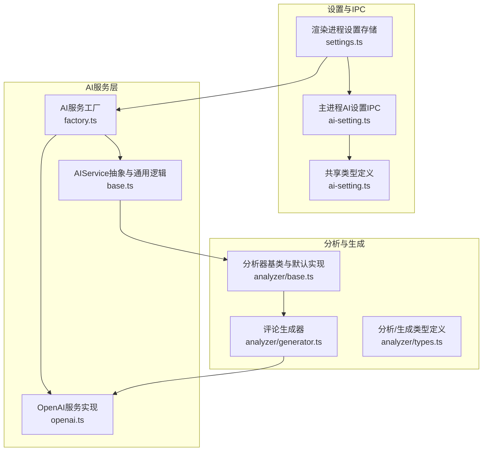
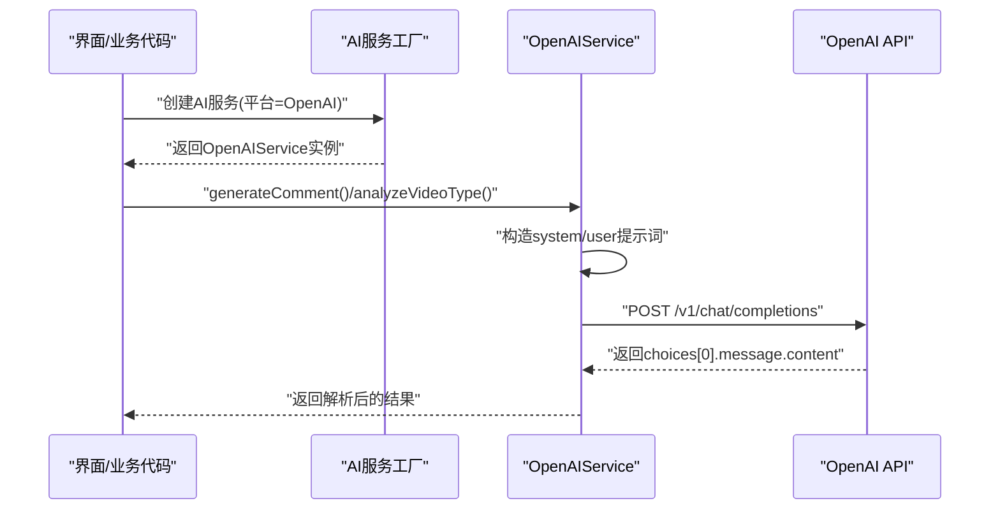
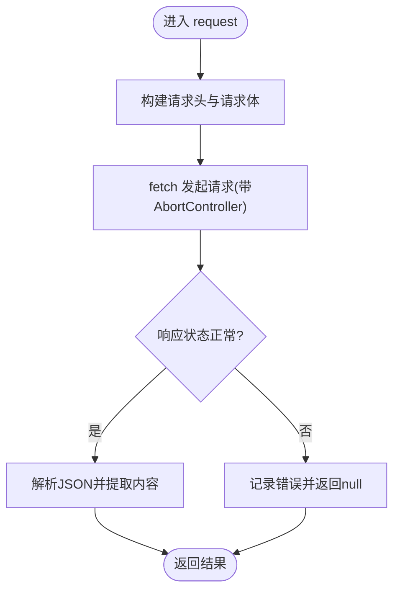
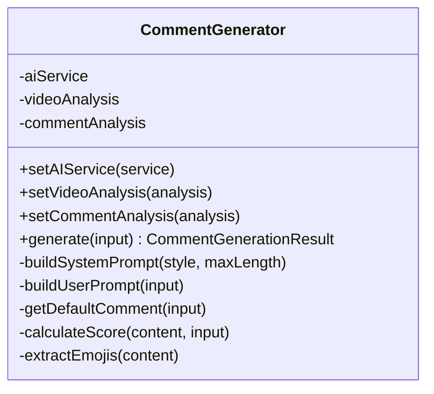
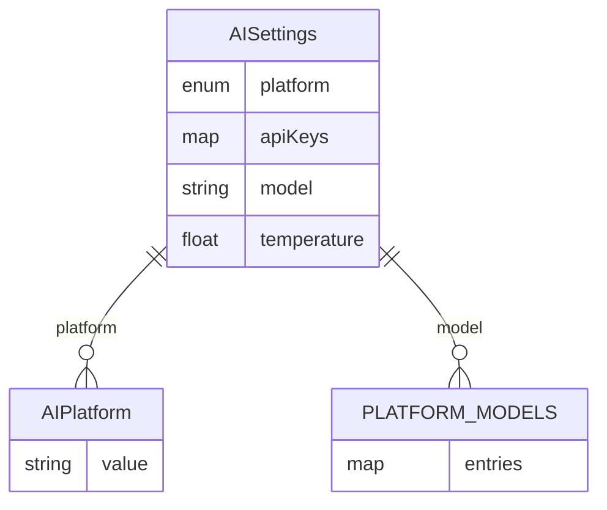
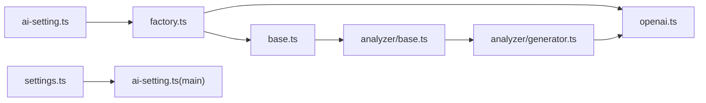

# OpenAI集成

<cite>
**本文引用的文件**
- [openai.ts](file://src/main/integration/ai/openai.ts)
- [base.ts（AI基础接口与抽象类）](file://src/main/integration/ai/base.ts)
- [factory.ts](file://src/main/integration/ai/factory.ts)
- [analyzer/base.ts](file://src/main/integration/ai/analyzer/base.ts)
- [analyzer/generator.ts](file://src/main/integration/ai/analyzer/generator.ts)
- [analyzer/types.ts](file://src/main/integration/ai/analyzer/types.ts)
- [ai-setting.ts（共享类型定义）](file://src/shared/ai-setting.ts)
- [settings.ts（渲染进程设置存储）](file://src/renderer/src/stores/settings.ts)
- [ai-setting.ts（主进程IPC）](file://src/main/ipc/ai-setting.ts)
</cite>

## 目录
1. [简介](#简介)
2. [项目结构](#项目结构)
3. [核心组件](#核心组件)
4. [架构总览](#架构总览)
5. [详细组件分析](#详细组件分析)
6. [依赖关系分析](#依赖关系分析)
7. [性能考量](#性能考量)
8. [故障排除指南](#故障排除指南)
9. [结论](#结论)
10. [附录](#附录)

## 简介
本文件系统性阐述 AutoOps 中 OpenAI 集成的实现与应用，涵盖以下方面：
- OpenAI 服务的接入方式、API 密钥配置、模型参数与温度设置
- 调用流程、错误处理与超时控制
- 在 AutoOps 中的具体场景：智能评论生成、内容分析与规则匹配
- OpenAI 分析器与生成器的实现细节与使用方法
- 最佳实践与常见问题排查

## 项目结构
AutoOps 的 AI 能力通过“平台服务层 + 分析器/生成器层 + 设置与IPC层”组织：
- 平台服务层：统一的 AIService 接口与各平台实现（OpenAI、通义千问、火山方舟、DeepSeek）
- 分析器/生成器层：视频分析、评论分析、情感分析与评论生成器
- 设置与IPC层：跨进程读写 AI 设置，提供默认值与平台可用模型

图表来源
- [factory.ts:1-27](file://src/main/integration/ai/factory.ts#L1-L27)
- [base.ts:28-131](file://src/main/integration/ai/base.ts#L28-L131)
- [openai.ts:1-45](file://src/main/integration/ai/openai.ts#L1-L45)
- [analyzer/base.ts:10-183](file://src/main/integration/ai/analyzer/base.ts#L10-L183)
- [analyzer/generator.ts:9-180](file://src/main/integration/ai/analyzer/generator.ts#L9-L180)
- [analyzer/types.ts:1-73](file://src/main/integration/ai/analyzer/types.ts#L1-L73)
- [ai-setting.ts:1-29](file://src/shared/ai-setting.ts#L1-L29)
- [settings.ts:1-46](file://src/renderer/src/stores/settings.ts#L1-L46)
- [ai-setting.ts:1-27](file://src/main/ipc/ai-setting.ts#L1-L27)

章节来源
- [factory.ts:1-27](file://src/main/integration/ai/factory.ts#L1-L27)
- [base.ts:28-131](file://src/main/integration/ai/base.ts#L28-L131)
- [openai.ts:1-45](file://src/main/integration/ai/openai.ts#L1-L45)
- [analyzer/base.ts:10-183](file://src/main/integration/ai/analyzer/base.ts#L10-L183)
- [analyzer/generator.ts:9-180](file://src/main/integration/ai/analyzer/generator.ts#L9-L180)
- [analyzer/types.ts:1-73](file://src/main/integration/ai/analyzer/types.ts#L1-L73)
- [ai-setting.ts:1-29](file://src/shared/ai-setting.ts#L1-L29)
- [settings.ts:1-46](file://src/renderer/src/stores/settings.ts#L1-L46)
- [ai-setting.ts:1-27](file://src/main/ipc/ai-setting.ts#L1-L27)

## 核心组件
- AIService 抽象与通用能力
  - 定义统一接口：视频类型分析与评论生成
  - 提供通用提示词构建、风格指令、超长截断等通用逻辑
- OpenAIService 实现
  - 基于 fetch 向 OpenAI Chat Completions 接口发起请求
  - 支持 AbortController 控制与 30 秒超时
  - 从响应中提取第一条 assistant 回复内容
- 工厂与平台映射
  - createAIService 根据平台选择对应服务类实例
  - 默认模型与温度可通过设置注入
- 分析器与生成器
  - DefaultAnalyzer：封装视频/评论/情感三类分析的系统提示词与结果解析
  - CommentGenerator：基于视频与评论分析结果生成评论，内置评分与表情提取
- 类型与设置
  - 共享类型定义 AIPlatform、AISettings 与平台可用模型
  - 渲染进程 Pinia Store 与主进程 IPC 协同管理设置

章节来源
- [base.ts:23-131](file://src/main/integration/ai/base.ts#L23-L131)
- [openai.ts:3-45](file://src/main/integration/ai/openai.ts#L3-L45)
- [factory.ts:9-25](file://src/main/integration/ai/factory.ts#L9-L25)
- [analyzer/base.ts:10-183](file://src/main/integration/ai/analyzer/base.ts#L10-L183)
- [analyzer/generator.ts:9-180](file://src/main/integration/ai/analyzer/generator.ts#L9-L180)
- [ai-setting.ts:1-29](file://src/shared/ai-setting.ts#L1-L29)

## 架构总览
下图展示 OpenAI 在 AutoOps 中的端到端调用链路与组件交互。

图表来源
- [factory.ts:16-25](file://src/main/integration/ai/factory.ts#L16-L25)
- [openai.ts:4-44](file://src/main/integration/ai/openai.ts#L4-L44)
- [base.ts:41-131](file://src/main/integration/ai/base.ts#L41-L131)

## 详细组件分析

### OpenAI 服务实现（OpenAIService）
- 关键特性
  - 使用 AbortController 与 30 秒超时，防止长时间阻塞
  - 通过 Authorization Bearer 头传递 API Key
  - 采用 JSON 请求体，包含 model、messages、temperature、max_tokens 等参数
  - 对非 OK 响应与异常进行日志记录并返回空值
- 返回处理
  - 从 choices[0].message.content 提取回复文本
  - 若解析失败或为空，上层默认降级为安全内容

图表来源
- [openai.ts:4-44](file://src/main/integration/ai/openai.ts#L4-L44)

章节来源
- [openai.ts:3-45](file://src/main/integration/ai/openai.ts#L3-L45)

### AI 服务抽象与通用逻辑（BaseAIService）
- 统一接口
  - analyzeVideoType：基于规则判断是否需要关注并引流
  - generateComment：兼容字符串与上下文对象两种调用方式；支持风格、长度与自定义提示
- 通用提示词与风格指令
  - 内置幽默/严肃/提问/赞美/混合五种风格说明
  - 限制评论长度、口语化、emoji 使用与避免重复
- 错误与降级
  - 解析失败或请求失败时返回兜底内容

章节来源
- [base.ts:23-131](file://src/main/integration/ai/base.ts#L23-L131)

### AI 服务工厂与平台映射（createAIService）
- 平台到类映射
  - openai -> OpenAIService
  - volcengine -> ArkService
  - bailian -> QwenService
  - deepseek -> DeepSeekService
- 参数注入
  - 从设置中读取 apiKey、model、temperature 并传入构造函数

章节来源
- [factory.ts:9-25](file://src/main/integration/ai/factory.ts#L9-L25)
- [ai-setting.ts:3-22](file://src/shared/ai-setting.ts#L3-L22)

### 视频/评论/情感分析器（DefaultAnalyzer）
- 视频分析
  - 输入：标题/描述、作者、标签、互动数据、参考评论
  - 输出：分类、主题、受众、互动水平、评论情绪、推荐风格、避词、置信度
  - 解析 JSON 结果并提供默认兜底
- 评论分析
  - 输入：评论列表（最多 20 条，含点赞数与内容）
  - 输出：热门话题、情感分布、热门风格、流行表达、受众性格、建议语气、可借鉴评论
- 情感分析
  - 输入：文本
  - 输出：总体情感、情感得分、情感关键词
- 异常处理
  - 任意解析失败均返回默认值，保证稳定性

章节来源
- [analyzer/base.ts:24-183](file://src/main/integration/ai/analyzer/base.ts#L24-L183)

### 评论生成器（CommentGenerator）
- 输入组合
  - 视频分析结果（分类、主题、受众、互动、推荐风格、避词）
  - 评论分析结果（热门话题、流行表达、受众性格、建议语气、可借鉴评论）
  - 用户输入：上下文、参考评论、用户要求、风格、最大长度
- 生成流程
  - 构造系统提示词（风格指令、长度限制、语气要求）
  - 构造用户提示词（整合视频/评论分析与用户输入）
  - 调用 AIService.request 获取回复
  - 计算评分（长度、问号、中文、emoji、避词）
  - 提取建议表情包
- 多评论生成
  - 提供 generateMultipleComments 并发生成多个候选评论

图表来源
- [analyzer/generator.ts:9-180](file://src/main/integration/ai/analyzer/generator.ts#L9-L180)

章节来源
- [analyzer/generator.ts:9-180](file://src/main/integration/ai/analyzer/generator.ts#L9-L180)

### 类型与设置（共享与存储）
- 平台与默认设置
  - 支持平台：volcengine、bailian、openai、deepseek
  - 默认平台与模型、默认温度
  - 各平台可用模型清单
- 渲染进程设置存储
  - Pinia Store 提供加载/更新/重置 AI 设置
- 主进程 IPC
  - 提供 ai-settings:get/update/reset 的 IPC 处理
  - 测试入口占位（预留）

图表来源
- [ai-setting.ts:1-29](file://src/shared/ai-setting.ts#L1-L29)

章节来源
- [ai-setting.ts:1-29](file://src/shared/ai-setting.ts#L1-L29)
- [settings.ts:24-45](file://src/renderer/src/stores/settings.ts#L24-L45)
- [ai-setting.ts:5-27](file://src/main/ipc/ai-setting.ts#L5-L27)

## 依赖关系分析
- 组件耦合
  - OpenAIService 仅依赖 BaseAIService 的抽象接口与通用提示词构建
  - DefaultAnalyzer 与 CommentGenerator 通过 AIService 抽象解耦具体平台
  - 工厂负责平台到实现类的映射，便于扩展新平台
- 外部依赖
  - OpenAI Chat Completions API
  - Electron IPC 与本地存储
- 潜在循环依赖
  - 当前结构清晰，未见循环导入

图表来源
- [factory.ts:1-27](file://src/main/integration/ai/factory.ts#L1-L27)
- [openai.ts:1-45](file://src/main/integration/ai/openai.ts#L1-L45)
- [base.ts:28-131](file://src/main/integration/ai/base.ts#L28-L131)
- [analyzer/base.ts:1-183](file://src/main/integration/ai/analyzer/base.ts#L1-L183)
- [analyzer/generator.ts:1-180](file://src/main/integration/ai/analyzer/generator.ts#L1-L180)
- [ai-setting.ts:1-29](file://src/shared/ai-setting.ts#L1-L29)
- [settings.ts:1-46](file://src/renderer/src/stores/settings.ts#L1-L46)
- [ai-setting.ts:1-27](file://src/main/ipc/ai-setting.ts#L1-L27)

章节来源
- [factory.ts:1-27](file://src/main/integration/ai/factory.ts#L1-L27)
- [openai.ts:1-45](file://src/main/integration/ai/openai.ts#L1-L45)
- [base.ts:28-131](file://src/main/integration/ai/base.ts#L28-L131)
- [analyzer/base.ts:1-183](file://src/main/integration/ai/analyzer/base.ts#L1-L183)
- [analyzer/generator.ts:1-180](file://src/main/integration/ai/analyzer/generator.ts#L1-L180)
- [ai-setting.ts:1-29](file://src/shared/ai-setting.ts#L1-L29)
- [settings.ts:1-46](file://src/renderer/src/stores/settings.ts#L1-L46)
- [ai-setting.ts:1-27](file://src/main/ipc/ai-setting.ts#L1-L27)

## 性能考量
- 超时与中断
  - OpenAI 请求设置 30 秒超时，避免 UI 阻塞
  - 使用 AbortController 可在外部取消请求
- 并发与批量
  - 评论生成提供并发生成多个候选的工具函数，提升效率
- 结果截断与评分
  - 通用生成器对超长内容进行截断，减少无效传输
  - 评分综合长度、问号、中文、emoji 与避词策略，辅助质量评估
- 模型与温度
  - 通过设置调整 temperature 与模型，平衡创造性与稳定性

章节来源
- [openai.ts:5-6](file://src/main/integration/ai/openai.ts#L5-L6)
- [base.ts:116-130](file://src/main/integration/ai/base.ts#L116-L130)
- [analyzer/generator.ts:169-180](file://src/main/integration/ai/analyzer/generator.ts#L169-L180)
- [analyzer/generator.ts:129-160](file://src/main/integration/ai/analyzer/generator.ts#L129-L160)

## 故障排除指南
- 无法连接 OpenAI
  - 检查 API Key 是否正确配置（平台键名需与共享类型一致）
  - 确认网络可达性与代理设置
  - 查看控制台错误日志（请求失败/异常）
- 请求超时
  - 30 秒超时为默认阈值，必要时可在服务层扩展
  - 检查上游模型响应速度与负载
- 返回内容为空或解析失败
  - OpenAI 返回为空或非 JSON 时会降级为默认内容
  - 检查系统提示词与模型输出格式是否匹配
- 评论过长或不符合规范
  - 通用生成器会自动截断并按评分打分
  - 调整 maxLength 与风格参数
- 设置未生效
  - 确认渲染进程已调用加载/更新设置
  - 主进程 IPC 是否成功写入存储

章节来源
- [openai.ts:32-43](file://src/main/integration/ai/openai.ts#L32-L43)
- [base.ts:48-59](file://src/main/integration/ai/base.ts#L48-L59)
- [base.ts:116-130](file://src/main/integration/ai/base.ts#L116-L130)
- [ai-setting.ts:5-27](file://src/main/ipc/ai-setting.ts#L5-L27)

## 结论
AutoOps 的 OpenAI 集成以清晰的抽象层与工厂模式实现平台解耦，结合分析器与生成器形成“分析-生成”的闭环。通过统一的设置与 IPC 管理，用户可便捷地切换平台与模型，并在评论生成、内容分析与规则匹配等场景中获得稳定与高效的体验。建议在生产环境中配合更完善的测试与监控体系，持续优化提示词与评分策略。

## 附录

### OpenAI 在 AutoOps 的应用场景
- 智能评论生成
  - 基于视频与评论分析结果，生成符合受众与氛围的评论
- 内容分析与规则匹配
  - 判断视频是否值得关注与引流，结合系统提示词与用户规则
- 情感分析
  - 对文本进行情感倾向与关键词抽取，辅助内容策略制定

章节来源
- [analyzer/base.ts:24-147](file://src/main/integration/ai/analyzer/base.ts#L24-L147)
- [base.ts:41-60](file://src/main/integration/ai/base.ts#L41-L60)
- [analyzer/generator.ts:26-53](file://src/main/integration/ai/analyzer/generator.ts#L26-L53)