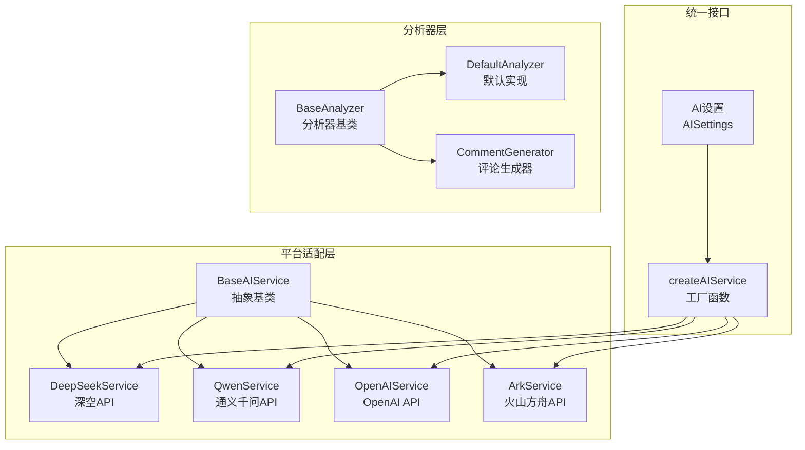
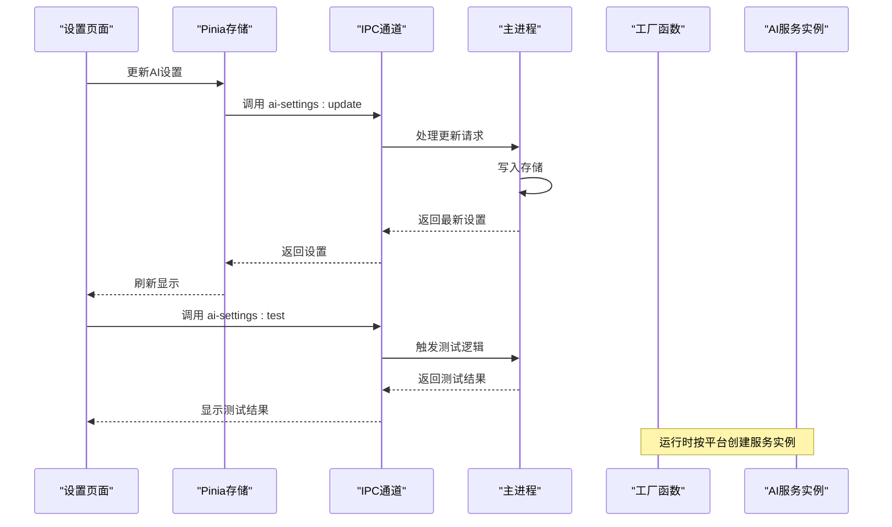
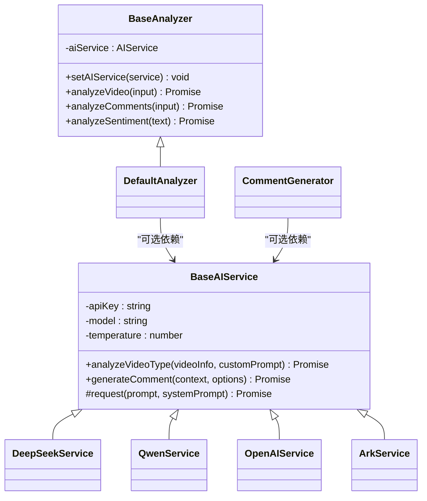
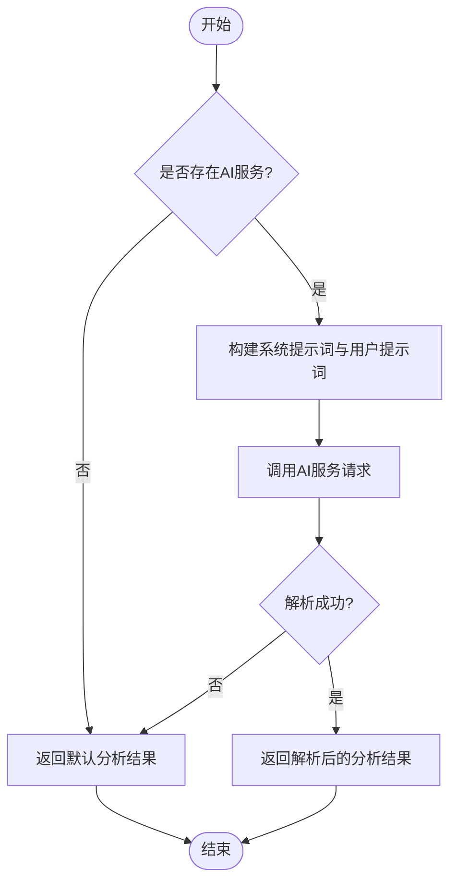
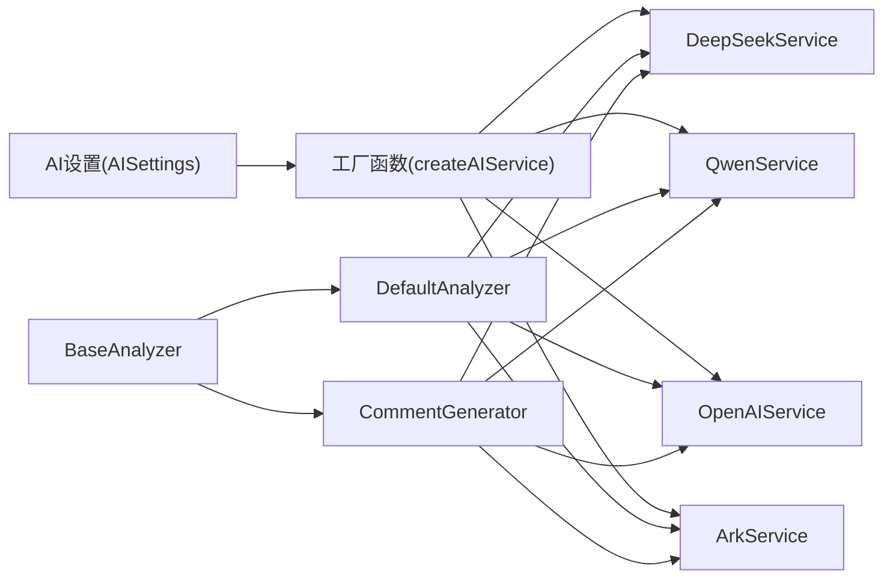

# 其他AI平台集成

<cite>
**本文引用的文件**
- [deepseek.ts](file://src/main/integration/ai/deepseek.ts)
- [qwen.ts](file://src/main/integration/ai/qwen.ts)
- [openai.ts](file://src/main/integration/ai/openai.ts)
- [ark.ts](file://src/main/integration/ai/ark.ts)
- [base.ts](file://src/main/integration/ai/base.ts)
- [factory.ts](file://src/main/integration/ai/factory.ts)
- [ai-setting.ts](file://src/shared/ai-setting.ts)
- [ai-setting.ts（主进程）](file://src/main/ipc/ai-setting.ts)
- [settings.ts（渲染进程存储）](file://src/renderer/src/stores/settings.ts)
- [settings.vue（设置页面）](file://src/renderer/src/pages/settings.vue)
- [task-runner.ts](file://src/main/service/task-runner.ts)
- [base.ts（分析器基类）](file://src/main/integration/ai/analyzer/base.ts)
- [generator.ts（评论生成器）](file://src/main/integration/ai/analyzer/generator.ts)
- [types.ts（分析器类型定义）](file://src/main/integration/ai/analyzer/types.ts)
</cite>

## 目录
1. [简介](#简介)
2. [项目结构](#项目结构)
3. [核心组件](#核心组件)
4. [架构总览](#架构总览)
5. [详细组件分析](#详细组件分析)
6. [依赖关系分析](#依赖关系分析)
7. [性能考量](#性能考量)
8. [故障排查指南](#故障排查指南)
9. [结论](#结论)
10. [附录](#附录)

## 简介
本文件面向AutoOps系统中“其他AI平台集成”的实现与使用，重点覆盖DeepSeek、通义千问（Qwen）、OpenAI、火山方舟（Ark）等平台的集成方式，说明其API特点、配置方法、使用场景与在AutoOps中的应用价值，并阐述统一接口设计、平台选择策略、配置示例、性能对比与使用建议。同时，文档还解释AI分析器基类的设计与扩展机制，帮助开发者快速接入新平台或定制分析流程。

## 项目结构
AutoOps的AI能力由“平台适配层 + 统一接口 + 分析器层”构成：
- 平台适配层：为每个第三方AI平台提供具体实现，均继承自统一的抽象基类，负责HTTP请求、参数封装与响应解析。
- 统一接口：通过工厂函数按平台创建对应服务实例，屏蔽平台差异。
- 分析器层：提供视频分析、评论分析与情感分析等高级能力，可选地依赖AI服务完成复杂推理。

**图表来源**
- [factory.ts:1-27](file://src/main/integration/ai/factory.ts#L1-L27)
- [base.ts:28-37](file://src/main/integration/ai/base.ts#L28-L37)
- [deepseek.ts:3-45](file://src/main/integration/ai/deepseek.ts#L3-L45)
- [qwen.ts:3-45](file://src/main/integration/ai/qwen.ts#L3-L45)
- [openai.ts:3-45](file://src/main/integration/ai/openai.ts#L3-L45)
- [ark.ts:3-45](file://src/main/integration/ai/ark.ts#L3-L45)
- [ai-setting.ts:1-29](file://src/shared/ai-setting.ts#L1-L29)
- [base.ts（分析器基类）:10-22](file://src/main/integration/ai/analyzer/base.ts#L10-L22)
- [generator.ts（评论生成器）:9-24](file://src/main/integration/ai/analyzer/generator.ts#L9-L24)

**章节来源**
- [factory.ts:1-27](file://src/main/integration/ai/factory.ts#L1-L27)
- [base.ts:28-37](file://src/main/integration/ai/base.ts#L28-L37)
- [ai-setting.ts:1-29](file://src/shared/ai-setting.ts#L1-L29)

## 核心组件
- 抽象基类与统一接口
  - 抽象基类提供统一的分析与评论生成功能，子类仅需实现底层请求方法。
  - 工厂函数按平台创建具体服务实例，支持平台枚举与默认配置。
- 平台适配器
  - DeepSeekService、QwenService、OpenAIService、ArkService分别对接各平台的聊天补全接口。
- 分析器与评论生成器
  - BaseAnalyzer定义视频/评论/情感分析的统一接口；DefaultAnalyzer提供默认实现。
  - CommentGenerator基于视频与评论分析结果生成高质量评论，并计算评分与表情包建议。

**章节来源**
- [base.ts:28-131](file://src/main/integration/ai/base.ts#L28-L131)
- [factory.ts:16-25](file://src/main/integration/ai/factory.ts#L16-L25)
- [base.ts（分析器基类）:10-22](file://src/main/integration/ai/analyzer/base.ts#L10-L22)
- [generator.ts（评论生成器）:9-53](file://src/main/integration/ai/analyzer/generator.ts#L9-L53)

## 架构总览
AutoOps通过“设置驱动 + 工厂创建 + 服务调用”的模式实现多平台统一接入。前端设置页面读取/更新AI设置，主进程持久化存储；运行时根据设置动态创建对应平台的服务实例，供任务执行与分析器使用。

**图表来源**
- [settings.vue（设置页面）:39-64](file://src/renderer/src/pages/settings.vue#L39-L64)
- [settings.ts（渲染进程存储）:24-34](file://src/renderer/src/stores/settings.ts#L24-L34)
- [ai-setting.ts（主进程）:5-27](file://src/main/ipc/ai-setting.ts#L5-L27)

## 详细组件分析

### 抽象基类与统一接口设计
- 设计要点
  - 统一的分析与评论生成接口，屏蔽平台差异。
  - 子类只需实现底层请求方法，复用统一的提示词构建与结果解析逻辑。
  - 工厂函数集中管理平台映射，便于扩展新平台。
- 扩展机制
  - 新增平台：新增服务类继承抽象基类，实现请求方法；在工厂映射中注册；在共享设置中添加平台枚举与默认模型。
  - 新增分析器：继承分析器基类，实现视频/评论/情感分析方法；或复用默认实现并注入AI服务。

**图表来源**
- [base.ts:28-39](file://src/main/integration/ai/base.ts#L28-L39)
- [deepseek.ts:3-45](file://src/main/integration/ai/deepseek.ts#L3-L45)
- [qwen.ts:3-45](file://src/main/integration/ai/qwen.ts#L3-L45)
- [openai.ts:3-45](file://src/main/integration/ai/openai.ts#L3-L45)
- [ark.ts:3-45](file://src/main/integration/ai/ark.ts#L3-L45)
- [base.ts（分析器基类）:10-22](file://src/main/integration/ai/analyzer/base.ts#L10-L22)
- [generator.ts（评论生成器）:9-16](file://src/main/integration/ai/analyzer/generator.ts#L9-L16)

**章节来源**
- [base.ts:28-131](file://src/main/integration/ai/base.ts#L28-L131)
- [factory.ts:9-14](file://src/main/integration/ai/factory.ts#L9-L14)

### DeepSeek（深空）集成
- API特点
  - 使用标准聊天补全接口，支持system/user消息结构与温度、最大token等参数。
  - 默认超时控制与错误处理，返回内容从choices数组提取。
- 配置方法
  - 在AI设置中选择平台为深空，填写对应API Key与模型（如deepseek-chat），温度范围可在设置页调整。
- 使用场景
  - 需要国内可用、低延迟的中文对话与内容分析场景。
- 应用价值与适用条件
  - 对中文语境理解较好，适合抖音生态的口语化评论生成与视频筛选。
  - 适用于预算敏感、对响应速度有要求的任务。

**章节来源**
- [deepseek.ts:3-45](file://src/main/integration/ai/deepseek.ts#L3-L45)
- [ai-setting.ts:24-29](file://src/shared/ai-setting.ts#L24-L29)

### 通义千问（Qwen）集成
- API特点
  - 采用兼容模式的聊天补全端点，参数结构与深空一致。
- 配置方法
  - 选择平台为通义，填写DashScope API Key与模型（如qwen-plus、qwen-max）。
- 使用场景
  - 需要更强中文理解与多模态能力的场景。
- 应用价值与适用条件
  - 在复杂文案生成与多轮对话中表现稳定，适合精细化评论策略。

**章节来源**
- [qwen.ts:3-45](file://src/main/integration/ai/qwen.ts#L3-L45)
- [ai-setting.ts:24-29](file://src/shared/ai-setting.ts#L24-L29)

### OpenAI集成
- API特点
  - 使用官方OpenAI聊天补全接口，参数与行为与其他平台一致。
- 配置方法
  - 选择平台为OpenAI，填写OpenAI API Key与模型（如gpt-4o、gpt-4o-mini）。
- 使用场景
  - 需要英文能力强、指令遵循性高的场景。
- 应用价值与适用条件
  - 在英文内容分析与创意文案生成方面优势明显，适合国际化内容运营。

**章节来源**
- [openai.ts:3-45](file://src/main/integration/ai/openai.ts#L3-L45)
- [ai-setting.ts:24-29](file://src/shared/ai-setting.ts#L24-L29)

### 火山方舟（Ark）集成
- API特点
  - 使用火山引擎的聊天补全接口，参数结构一致。
- 配置方法
  - 选择平台为火山方舟，填写对应API Key与模型（如doubao系列）。
- 使用场景
  - 需要国内合规与高并发的场景。
- 应用价值与适用条件
  - 在国内网络环境下具备较好的稳定性与合规性。

**章节来源**
- [ark.ts:3-45](file://src/main/integration/ai/ark.ts#L3-L45)
- [ai-setting.ts:24-29](file://src/shared/ai-setting.ts#L24-L29)

### 分析器基类与扩展机制
- 设计
  - BaseAnalyzer定义视频、评论、情感三类分析接口；DefaultAnalyzer提供默认实现，内部通过统一的request方法调用AI服务。
  - CommentGenerator基于视频与评论分析结果生成评论，内置评分与表情包提取逻辑。
- 扩展
  - 可替换AI服务：通过setAIService注入任意平台服务，实现跨平台切换。
  - 可定制提示词：在分析器实现中调整system/user提示词，以适配不同业务需求。
  - 可组合使用：先用DefaultAnalyzer做初步分析，再结合业务规则二次加工。

**图表来源**
- [base.ts（分析器基类）:24-66](file://src/main/integration/ai/analyzer/base.ts#L24-L66)
- [generator.ts（评论生成器）:26-53](file://src/main/integration/ai/analyzer/generator.ts#L26-L53)

**章节来源**
- [base.ts（分析器基类）:10-183](file://src/main/integration/ai/analyzer/base.ts#L10-L183)
- [generator.ts（评论生成器）:9-180](file://src/main/integration/ai/analyzer/generator.ts#L9-L180)

## 依赖关系分析
- 平台适配层依赖统一基类，确保请求协议一致性。
- 工厂函数集中管理平台映射，避免业务层分散配置。
- 分析器层可选依赖AI服务，形成松耦合设计。
- 设置与存储通过IPC在前后端传递，保证配置的一致性。

**图表来源**
- [factory.ts:9-14](file://src/main/integration/ai/factory.ts#L9-L14)
- [base.ts（分析器基类）:10-22](file://src/main/integration/ai/analyzer/base.ts#L10-L22)
- [generator.ts（评论生成器）:9-16](file://src/main/integration/ai/analyzer/generator.ts#L9-L16)

**章节来源**
- [factory.ts:1-27](file://src/main/integration/ai/factory.ts#L1-L27)
- [ai-setting.ts:1-29](file://src/shared/ai-setting.ts#L1-L29)

## 性能考量
- 超时与中断
  - 各平台服务均设置30秒超时与AbortController中断，避免长时间阻塞。
- 错误处理
  - 对非OK响应与异常进行日志记录与降级返回，保障系统稳定性。
- 温度与长度
  - 温度影响输出多样性，建议在创意类任务提高温度，在规则类任务降低温度。
  - 最大token与评论长度限制有助于控制成本与输出质量。
- 并发与限流
  - 建议在任务调度层控制并发度，避免触发平台限流。

**章节来源**
- [deepseek.ts:4-6](file://src/main/integration/ai/deepseek.ts#L4-L6)
- [qwen.ts:4-6](file://src/main/integration/ai/qwen.ts#L4-L6)
- [openai.ts:4-6](file://src/main/integration/ai/openai.ts#L4-L6)
- [ark.ts:4-6](file://src/main/integration/ai/ark.ts#L4-L6)

## 故障排查指南
- 设置未生效
  - 检查前端设置页面是否成功调用更新接口，确认后端存储键值存在。
- 测试连接无效
  - 当前测试接口返回占位信息，尚未实现实际连通性检测，建议在业务调用中观察错误日志。
- 请求失败
  - 查看平台服务类的日志输出，确认HTTP状态码与响应体结构是否符合预期。
- 结果异常
  - 检查系统提示词与用户提示词拼装逻辑，确保JSON格式正确且被解析。

**章节来源**
- [ai-setting.ts（主进程）:24-26](file://src/main/ipc/ai-setting.ts#L24-L26)
- [settings.vue（设置页面）:50-64](file://src/renderer/src/pages/settings.vue#L50-L64)
- [deepseek.ts:32-42](file://src/main/integration/ai/deepseek.ts#L32-L42)
- [qwen.ts:32-42](file://src/main/integration/ai/qwen.ts#L32-L42)
- [openai.ts:32-42](file://src/main/integration/ai/openai.ts#L32-L42)
- [ark.ts:32-42](file://src/main/integration/ai/ark.ts#L32-L42)

## 结论
AutoOps通过统一的抽象基类与工厂模式，实现了对DeepSeek、Qwen、OpenAI、火山方舟等多平台的无缝集成。分析器层进一步提升了系统的智能化水平，支持视频分析、评论分析与情感分析等高级功能。平台选择应综合考虑网络环境、语言能力、成本与合规等因素；通过统一接口与可插拔设计，系统具备良好的扩展性与维护性。

## 附录

### 配置示例与最佳实践
- 配置入口
  - 前端设置页面提供平台、模型、温度等配置项；保存后通过IPC写入主进程存储。
- 平台选择策略
  - 中文场景优先深空或Qwen；国际化场景优先OpenAI；国内合规优先火山方舟。
- 使用建议
  - 在任务执行前进行一次轻量测试，验证模型与提示词效果。
  - 对于高并发场景，合理设置温度与最大token，平衡质量与成本。
  - 将分析器结果与业务规则结合，避免完全依赖AI输出。

**章节来源**
- [settings.vue（设置页面）:67-140](file://src/renderer/src/pages/settings.vue#L67-L140)
- [settings.ts（渲染进程存储）:24-34](file://src/renderer/src/stores/settings.ts#L24-L34)
- [ai-setting.ts（主进程）:5-22](file://src/main/ipc/ai-setting.ts#L5-L22)
- [ai-setting.ts:10-22](file://src/shared/ai-setting.ts#L10-L22)