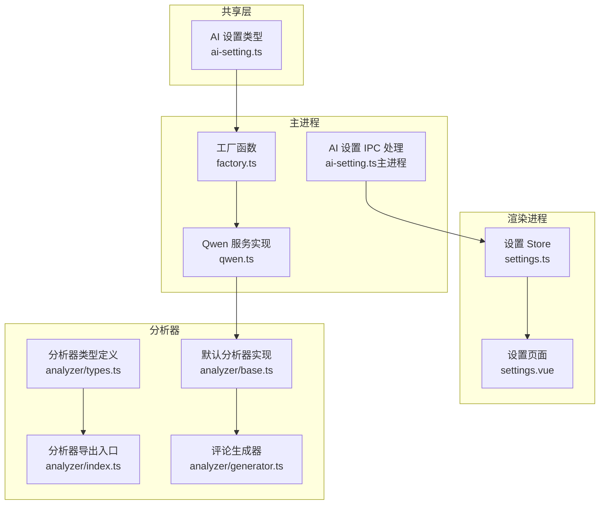
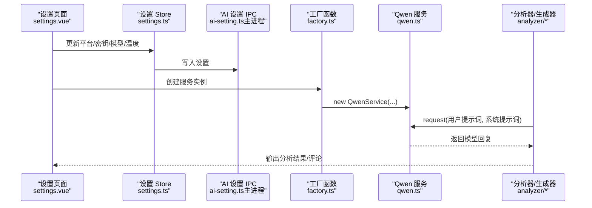
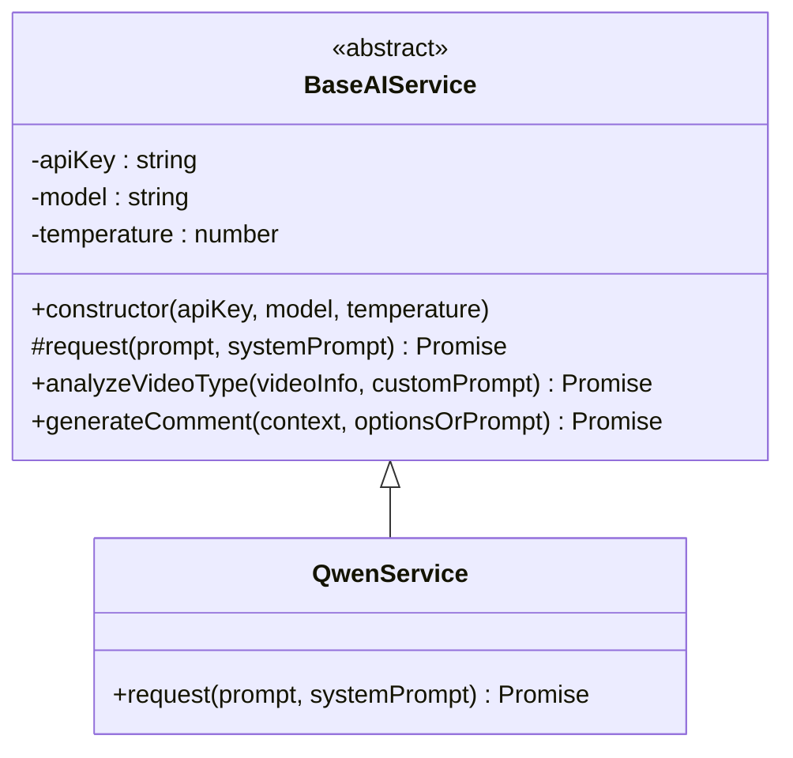
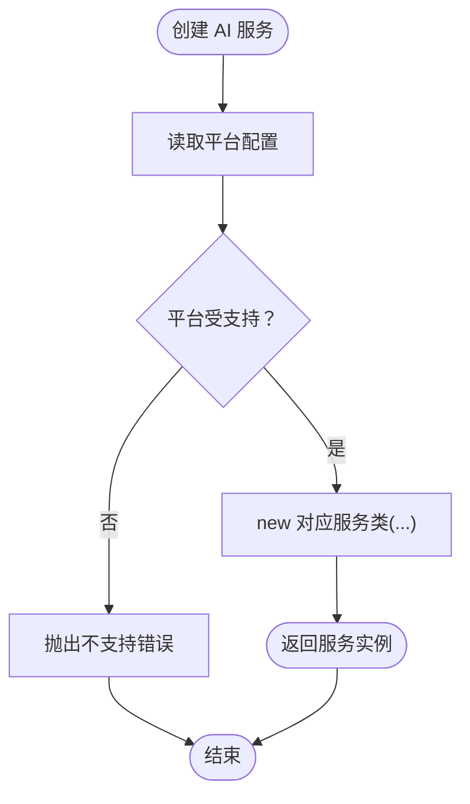
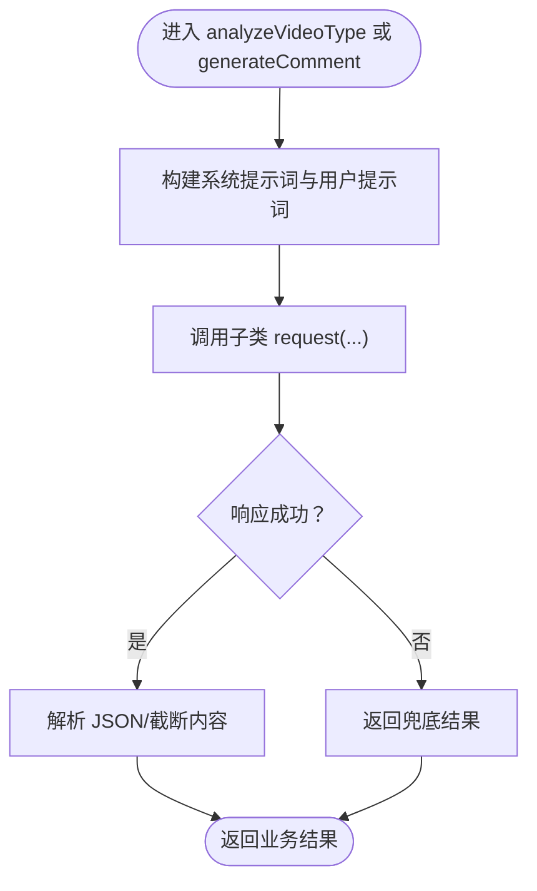
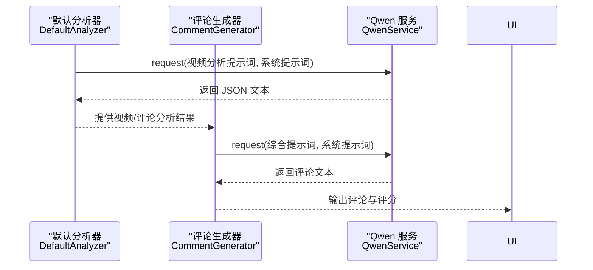
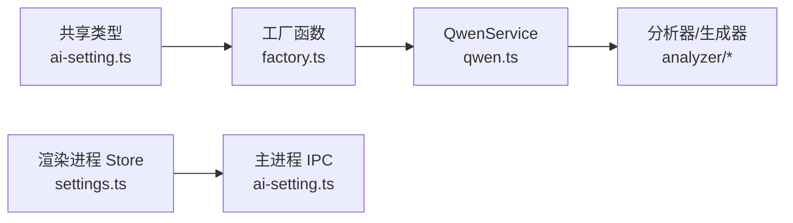

# 通义千问集成

<cite>
**本文引用的文件**
- [qwen.ts](file://src/main/integration/ai/qwen.ts)
- [base.ts](file://src/main/integration/ai/base.ts)
- [factory.ts](file://src/main/integration/ai/factory.ts)
- [ai-setting.ts](file://src/shared/ai-setting.ts)
- [ai-setting.ts（主进程 IPC）](file://src/main/ipc/ai-setting.ts)
- [settings.ts（渲染进程 Store）](file://src/renderer/src/stores/settings.ts)
- [settings.vue（设置页面）](file://src/renderer/src/pages/settings.vue)
- [analyzer/index.ts](file://src/main/integration/ai/analyzer/index.ts)
- [analyzer/types.ts](file://src/main/integration/ai/analyzer/types.ts)
- [analyzer/base.ts](file://src/main/integration/ai/analyzer/base.ts)
- [analyzer/generator.ts](file://src/main/integration/ai/analyzer/generator.ts)
</cite>

## 目录
1. [简介](#简介)
2. [项目结构](#项目结构)
3. [核心组件](#核心组件)
4. [架构总览](#架构总览)
5. [详细组件分析](#详细组件分析)
6. [依赖关系分析](#依赖关系分析)
7. [性能考虑](#性能考虑)
8. [故障排除指南](#故障排除指南)
9. [结论](#结论)
10. [附录](#附录)

## 简介
本文件系统性阐述 AutoOps 中通义千问（阿里云百炼）的集成实现，覆盖以下方面：
- 通义千问服务的 API 配置与调用参数设置
- 在 AutoOps 中的应用场景与使用方法（视频内容分析、评论生成等）
- 集成流程、错误处理与性能优化策略
- 配置指南与使用示例
- 通义千问分析器的类型定义与使用规范

通义千问作为阿里云百炼平台的中文大模型服务，在 AutoOps 的视频内容分析与评论生成场景中，提供中文语境下的高适配能力与本地化特性。

## 项目结构
AutoOps 将 AI 能力抽象为统一接口，并通过工厂模式按平台动态创建具体服务实例。通义千问服务继承自统一基类，遵循相同的调用协议与错误处理机制。

图表来源
- [factory.ts:1-27](file://src/main/integration/ai/factory.ts#L1-L27)
- [qwen.ts:1-45](file://src/main/integration/ai/qwen.ts#L1-L45)
- [ai-setting.ts（主进程 IPC）:1-27](file://src/main/ipc/ai-setting.ts#L1-L27)
- [settings.ts（渲染进程 Store）:1-46](file://src/renderer/src/stores/settings.ts#L1-L46)
- [settings.vue（设置页面）:75-105](file://src/renderer/src/pages/settings.vue#L75-L105)
- [analyzer/index.ts:1-4](file://src/main/integration/ai/analyzer/index.ts#L1-L4)
- [analyzer/types.ts:1-73](file://src/main/integration/ai/analyzer/types.ts#L1-L73)
- [analyzer/base.ts:1-183](file://src/main/integration/ai/analyzer/base.ts#L1-L183)
- [analyzer/generator.ts:1-180](file://src/main/integration/ai/analyzer/generator.ts#L1-L180)

章节来源
- [factory.ts:1-27](file://src/main/integration/ai/factory.ts#L1-L27)
- [qwen.ts:1-45](file://src/main/integration/ai/qwen.ts#L1-L45)
- [ai-setting.ts（主进程 IPC）:1-27](file://src/main/ipc/ai-setting.ts#L1-L27)
- [settings.ts（渲染进程 Store）:1-46](file://src/renderer/src/stores/settings.ts#L1-L46)
- [settings.vue（设置页面）:75-105](file://src/renderer/src/pages/settings.vue#L75-L105)
- [analyzer/index.ts:1-4](file://src/main/integration/ai/analyzer/index.ts#L1-L4)
- [analyzer/types.ts:1-73](file://src/main/integration/ai/analyzer/types.ts#L1-L73)
- [analyzer/base.ts:1-183](file://src/main/integration/ai/analyzer/base.ts#L1-L183)
- [analyzer/generator.ts:1-180](file://src/main/integration/ai/analyzer/generator.ts#L1-L180)

## 核心组件
- 统一 AI 接口与基类：定义分析与评论生成的标准方法签名与通用逻辑（如提示词构建、结果截断、错误兜底）。
- 通义千问服务实现：基于统一基类，封装 DashScope 兼容模式的请求细节（URL、头部、消息体、超时与中断控制）。
- 工厂函数：依据平台枚举创建对应服务实例，便于扩展其他平台。
- 分析器与评论生成器：面向业务场景的高层封装，负责将输入数据转换为系统提示词与用户提示词，并组织输出结构。
- 配置体系：共享的 AI 设置类型、默认值与模型映射；主进程 IPC 与渲染进程 Store 协同维护设置持久化与更新。

章节来源
- [base.ts:23-131](file://src/main/integration/ai/base.ts#L23-L131)
- [qwen.ts:3-45](file://src/main/integration/ai/qwen.ts#L3-L45)
- [factory.ts:16-25](file://src/main/integration/ai/factory.ts#L16-L25)
- [analyzer/base.ts:10-22](file://src/main/integration/ai/analyzer/base.ts#L10-L22)
- [analyzer/generator.ts:9-53](file://src/main/integration/ai/analyzer/generator.ts#L9-L53)
- [ai-setting.ts:1-29](file://src/shared/ai-setting.ts#L1-L29)

## 架构总览
通义千问集成采用“统一接口 + 平台实现 + 工厂创建 + 分析器编排”的分层架构。渲染进程通过 Store 读写 AI 设置，主进程通过 IPC 提供持久化能力；业务层通过分析器与生成器调用具体服务实现。

图表来源
- [settings.vue（设置页面）:75-105](file://src/renderer/src/pages/settings.vue#L75-L105)
- [settings.ts（渲染进程 Store）:24-30](file://src/renderer/src/stores/settings.ts#L24-L30)
- [ai-setting.ts（主进程 IPC）:5-22](file://src/main/ipc/ai-setting.ts#L5-L22)
- [factory.ts:16-25](file://src/main/integration/ai/factory.ts#L16-L25)
- [qwen.ts:3-45](file://src/main/integration/ai/qwen.ts#L3-L45)
- [analyzer/base.ts:41-60](file://src/main/integration/ai/analyzer/base.ts#L41-L60)
- [analyzer/generator.ts:37-53](file://src/main/integration/ai/analyzer/generator.ts#L37-L53)

## 详细组件分析

### 通义千问服务实现（QwenService）
- 继承统一基类，实现平台特定的请求方法。
- 使用 DashScope 兼容模式的聊天补全端点，发送 system/user 消息，携带 Authorization 与 Content-Type。
- 设置请求超时与中断控制，增强稳定性。
- 对响应状态与异常进行捕获与日志记录，失败时返回空值以便上层兜底。

图表来源
- [base.ts:28-131](file://src/main/integration/ai/base.ts#L28-L131)
- [qwen.ts:3-45](file://src/main/integration/ai/qwen.ts#L3-L45)

章节来源
- [qwen.ts:3-45](file://src/main/integration/ai/qwen.ts#L3-L45)
- [base.ts:39-60](file://src/main/integration/ai/base.ts#L39-L60)

### 工厂函数与平台映射
- 工厂函数根据平台枚举创建对应服务实例，确保新增平台时只需扩展映射与实现类。
- 通义千问映射到 QwenService，配合共享的 AI 平台类型与默认设置。

图表来源
- [factory.ts:16-25](file://src/main/integration/ai/factory.ts#L16-L25)
- [ai-setting.ts:1-2](file://src/shared/ai-setting.ts#L1-L2)

章节来源
- [factory.ts:9-14](file://src/main/integration/ai/factory.ts#L9-L14)
- [factory.ts:16-25](file://src/main/integration/ai/factory.ts#L16-L25)
- [ai-setting.ts:1-2](file://src/shared/ai-setting.ts#L1-L2)

### 统一基类与通用逻辑
- 统一接口定义分析与评论生成的方法签名。
- 基类内置系统提示词模板与用户提示词拼装逻辑，支持多种评论风格与长度约束。
- 对 JSON 解析与异常进行统一处理，失败时返回安全的兜底结果。

图表来源
- [base.ts:41-60](file://src/main/integration/ai/base.ts#L41-L60)
- [base.ts:62-131](file://src/main/integration/ai/base.ts#L62-L131)

章节来源
- [base.ts:23-131](file://src/main/integration/ai/base.ts#L23-L131)

### 分析器与评论生成器
- 默认分析器：面向视频与评论的 JSON 结构化输出，包含分类、主题、受众、互动水平、情感倾向、推荐风格、避免关键词等字段。
- 评论生成器：在已有视频与评论分析结果基础上，结合用户需求与示例，生成高质量评论，并计算评分与建议表情符号。

图表来源
- [analyzer/base.ts:24-66](file://src/main/integration/ai/analyzer/base.ts#L24-L66)
- [analyzer/generator.ts:26-53](file://src/main/integration/ai/analyzer/generator.ts#L26-L53)
- [qwen.ts:3-45](file://src/main/integration/ai/qwen.ts#L3-L45)

章节来源
- [analyzer/base.ts:10-183](file://src/main/integration/ai/analyzer/base.ts#L10-L183)
- [analyzer/generator.ts:1-180](file://src/main/integration/ai/analyzer/generator.ts#L1-L180)

### 类型定义与使用规范
- 视频分析输入/输出、评论分析输入/输出、情感分析结果、评论生成输入/输出等类型清晰定义，便于前后端协作与静态校验。
- 使用规范：
  - 输入字段尽量提供完整上下文，提升分析与生成质量。
  - 评论生成时合理设置风格、长度与示例，有助于获得更贴合社区氛围的内容。
  - 避免关键词列表用于规避敏感或不当内容。

章节来源
- [analyzer/types.ts:1-73](file://src/main/integration/ai/analyzer/types.ts#L1-L73)

## 依赖关系分析
- 平台映射：工厂函数将平台枚举映射到具体服务类，通义千问对应 QwenService。
- 配置依赖：AI 设置由共享类型定义，渲染进程 Store 与主进程 IPC 协作完成读写。
- 分析器依赖：默认分析器与评论生成器依赖统一基类的提示词构建与错误处理能力。

图表来源
- [ai-setting.ts:1-29](file://src/shared/ai-setting.ts#L1-L29)
- [factory.ts:16-25](file://src/main/integration/ai/factory.ts#L16-L25)
- [qwen.ts:3-45](file://src/main/integration/ai/qwen.ts#L3-L45)
- [settings.ts（渲染进程 Store）:24-30](file://src/renderer/src/stores/settings.ts#L24-L30)
- [ai-setting.ts（主进程 IPC）:5-22](file://src/main/ipc/ai-setting.ts#L5-L22)
- [analyzer/base.ts:10-22](file://src/main/integration/ai/analyzer/base.ts#L10-L22)
- [analyzer/generator.ts:9-16](file://src/main/integration/ai/analyzer/generator.ts#L9-L16)

章节来源
- [factory.ts:9-14](file://src/main/integration/ai/factory.ts#L9-L14)
- [ai-setting.ts:1-29](file://src/shared/ai-setting.ts#L1-L29)
- [settings.ts（渲染进程 Store）:24-30](file://src/renderer/src/stores/settings.ts#L24-L30)
- [ai-setting.ts（主进程 IPC）:5-22](file://src/main/ipc/ai-setting.ts#L5-L22)

## 性能考虑
- 超时与中断：所有服务实现均设置请求超时与 AbortController，避免长时间阻塞。
- 结果截断与兜底：评论生成器对超长内容进行截断，基类在解析失败时返回安全兜底，保证用户体验。
- 批量生成：提供批量生成函数，通过并发请求提升效率。
- 模型与温度：合理设置 temperature 与 max_tokens，平衡创造性与稳定性。

章节来源
- [qwen.ts:4-6](file://src/main/integration/ai/qwen.ts#L4-L6)
- [base.ts:116-131](file://src/main/integration/ai/base.ts#L116-L131)
- [analyzer/generator.ts:169-180](file://src/main/integration/ai/analyzer/generator.ts#L169-L180)

## 故障排除指南
- 请求失败：检查平台、API Key、网络连通性与模型可用性；查看控制台日志定位状态码。
- 解析失败：确认返回内容为期望的 JSON 结构，必要时调整系统提示词以稳定输出格式。
- 兜底行为：当服务不可用或解析失败时，系统会返回预设的安全内容，确保流程继续。
- 设置问题：通过设置页面更新 AI 平台与密钥，或重置为默认值后重新配置。

章节来源
- [qwen.ts:32-43](file://src/main/integration/ai/qwen.ts#L32-L43)
- [base.ts:57-59](file://src/main/integration/ai/base.ts#L57-L59)
- [base.ts:127-129](file://src/main/integration/ai/base.ts#L127-L129)
- [ai-setting.ts（主进程 IPC）:18-22](file://src/main/ipc/ai-setting.ts#L18-L22)

## 结论
通义千问在 AutoOps 中通过统一接口与工厂模式实现无缝集成，具备良好的扩展性与稳定性。其在中文内容处理与本地化场景下表现优异，配合分析器与生成器可高效支撑视频内容分析与评论生成等业务需求。建议在生产环境中结合超时控制、错误兜底与合理的参数配置，持续优化性能与稳定性。

## 附录

### 配置指南
- 平台选择：在设置页面选择“阿里云百炼（bailian）”，模型列表将自动切换至百炼可用模型。
- API Key：在对应平台粘贴 API Key，保存后生效。
- 温度与模型：根据业务需求调整 temperature 与模型，以平衡创造性与稳定性。
- 默认值：未配置时使用共享类型的默认值，确保首次使用即可运行。

章节来源
- [settings.vue（设置页面）:75-105](file://src/renderer/src/pages/settings.vue#L75-L105)
- [ai-setting.ts:10-22](file://src/shared/ai-setting.ts#L10-L22)
- [ai-setting.ts:24-29](file://src/shared/ai-setting.ts#L24-L29)
- [ai-setting.ts（主进程 IPC）:5-22](file://src/main/ipc/ai-setting.ts#L5-L22)
- [settings.ts（渲染进程 Store）:24-30](file://src/renderer/src/stores/settings.ts#L24-L30)

### 使用示例（步骤说明）
- 打开设置页面，选择“阿里云百炼”平台并填写 API Key。
- 在任务执行前，通过工厂函数创建服务实例。
- 使用默认分析器对视频进行分析，得到结构化结果。
- 使用评论生成器在已有分析结果基础上生成评论，设置风格与长度。
- 若服务不可用，系统将返回兜底内容，保障流程顺畅。

章节来源
- [factory.ts:16-25](file://src/main/integration/ai/factory.ts#L16-L25)
- [analyzer/base.ts:24-66](file://src/main/integration/ai/analyzer/base.ts#L24-L66)
- [analyzer/generator.ts:26-53](file://src/main/integration/ai/analyzer/generator.ts#L26-L53)
- [base.ts:116-131](file://src/main/integration/ai/base.ts#L116-L131)