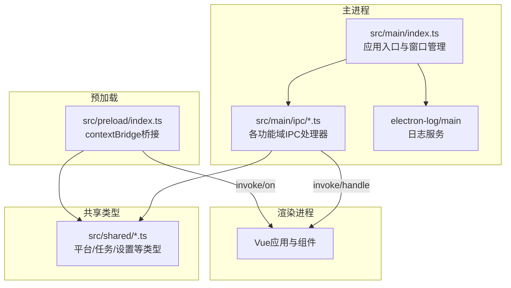
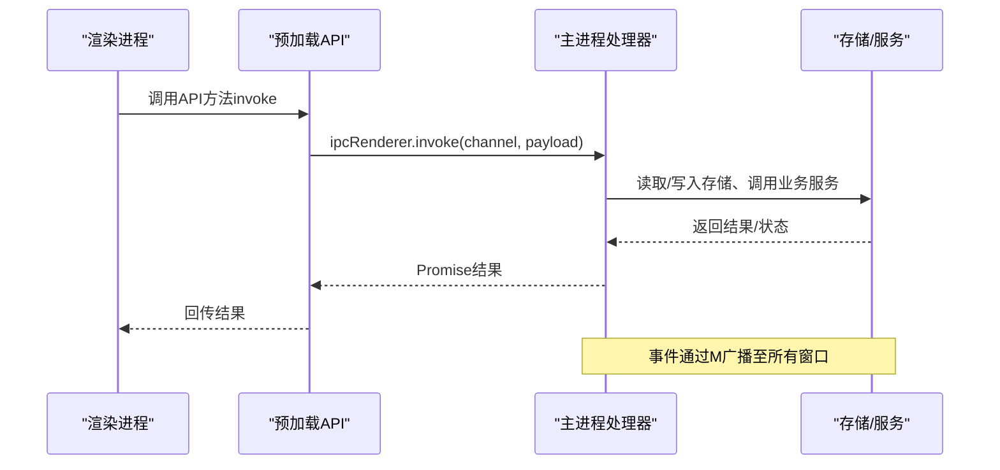
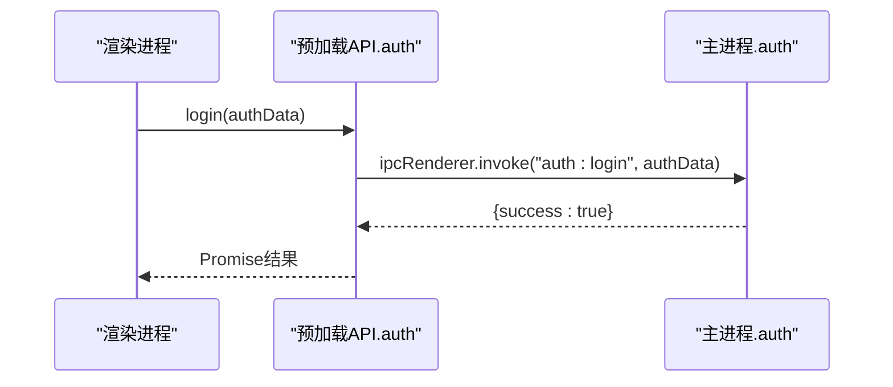
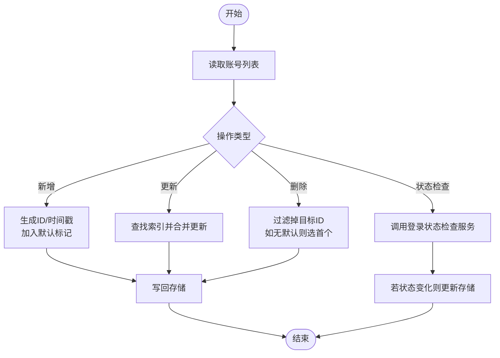
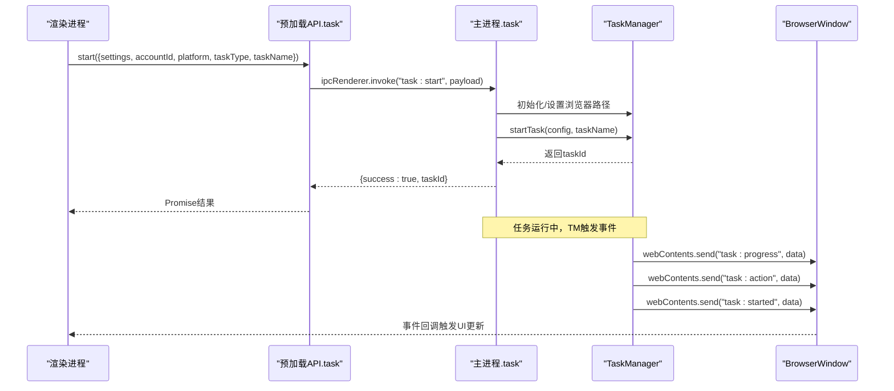
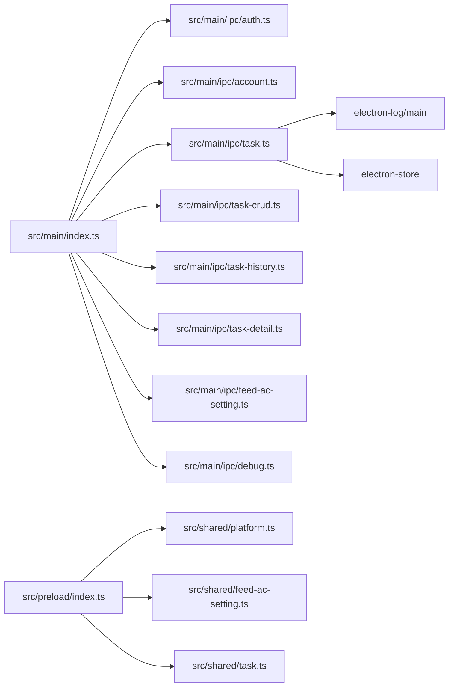

# IPC架构设计

<cite>
**本文引用的文件**
- [src/main/index.ts](file://src/main/index.ts)
- [src/preload/index.ts](file://src/preload/index.ts)
- [src/main/ipc/account.ts](file://src/main/ipc/account.ts)
- [src/main/ipc/task.ts](file://src/main/ipc/task.ts)
- [src/main/ipc/auth.ts](file://src/main/ipc/auth.ts)
- [src/main/ipc/task-crud.ts](file://src/main/ipc/task-crud.ts)
- [src/main/ipc/task-detail.ts](file://src/main/ipc/task-detail.ts)
- [src/main/ipc/task-history.ts](file://src/main/ipc/task-history.ts)
- [src/main/ipc/feed-ac-setting.ts](file://src/main/ipc/feed-ac-setting.ts)
- [src/main/ipc/debug.ts](file://src/main/ipc/debug.ts)
- [src/shared/platform.ts](file://src/shared/platform.ts)
- [src/shared/feed-ac-setting.ts](file://src/shared/feed-ac-setting.ts)
- [src/shared/task.ts](file://src/shared/task.ts)
- [package.json](file://package.json)
</cite>

## 目录
1. [简介](#简介)
2. [项目结构](#项目结构)
3. [核心组件](#核心组件)
4. [架构总览](#架构总览)
5. [详细组件分析](#详细组件分析)
6. [依赖关系分析](#依赖关系分析)
7. [性能考虑](#性能考虑)
8. [故障排查指南](#故障排查指南)
9. [结论](#结论)
10. [附录](#附录)

## 简介
本文件系统性阐述该Electron应用的IPC（进程间通信）架构设计，覆盖主进程与渲染进程的职责划分、IPC通道组织结构、消息传递协议、安全机制、数据校验与错误处理策略，以及对异步通信、事件广播与状态同步的支持方式。文档同时提供实现细节、性能优化建议与调试技巧，帮助开发者在不直接阅读源码的情况下快速理解并维护该IPC体系。

## 项目结构
该应用采用“按功能域分层”的组织方式：
- 主进程入口负责窗口创建、日志初始化与IPC处理器注册
- 预加载脚本通过contextBridge暴露受控API给渲染进程
- 各功能域的IPC处理器集中于src/main/ipc目录下，按业务模块拆分
- 共享类型定义位于src/shared目录，确保主/渲染进程类型一致性

图表来源
- [src/main/index.ts:1-106](file://src/main/index.ts#L1-L106)
- [src/preload/index.ts:1-234](file://src/preload/index.ts#L1-L234)

章节来源
- [src/main/index.ts:1-106](file://src/main/index.ts#L1-L106)
- [src/preload/index.ts:1-234](file://src/preload/index.ts#L1-L234)

## 核心组件
- 主进程入口与窗口管理
  - 创建BrowserWindow，启用上下文隔离与禁用Node集成，设置webPreferences
  - 注册所有IPC处理器，统一初始化日志
- 预加载脚本与API桥接
  - 使用contextBridge.exposeInMainWorld暴露受限API对象，封装ipcRenderer.invoke与ipcRenderer.on
  - 为每个IPC通道提供明确的接口签名，便于类型约束与IDE提示
- 功能域IPC处理器
  - 按业务域拆分：认证(auth)、账号(account)、任务(task系列)、设置(feed-ac-setting)、历史(task-history)、详情(task-detail)、调试(debug)等
  - 主进程以ipcMain.handle提供RPC能力；以BrowserWindow广播事件给所有渲染窗口
- 共享类型定义
  - 平台类型、任务类型、设置版本与迁移逻辑、任务模板与调度信息等

章节来源
- [src/main/index.ts:1-106](file://src/main/index.ts#L1-L106)
- [src/preload/index.ts:1-234](file://src/preload/index.ts#L1-L234)
- [src/shared/platform.ts:1-260](file://src/shared/platform.ts#L1-L260)
- [src/shared/feed-ac-setting.ts:1-179](file://src/shared/feed-ac-setting.ts#L1-L179)
- [src/shared/task.ts:1-62](file://src/shared/task.ts#L1-L62)

## 架构总览
整体采用“主进程中心化+预加载桥接”的模式：
- 渲染进程通过预加载暴露的API发起请求（invoke）
- 主进程对应处理器完成业务逻辑与持久化，返回结果或触发事件广播
- 事件通过BrowserWindow.webContents.send向所有窗口广播，实现全局状态同步

图表来源
- [src/preload/index.ts:130-234](file://src/preload/index.ts#L130-L234)
- [src/main/ipc/task.ts:81-240](file://src/main/ipc/task.ts#L81-L240)

章节来源
- [src/preload/index.ts:1-234](file://src/preload/index.ts#L1-L234)
- [src/main/ipc/task.ts:1-243](file://src/main/ipc/task.ts#L1-L243)

## 详细组件分析

### 认证与鉴权（auth）
- 主要职责
  - 提供登录态查询、登录、登出与获取鉴权信息的RPC接口
  - 基于electron-store进行持久化
- 安全要点
  - 仅暴露必要接口，避免直接访问底层存储
  - 登录时写入鉴权数据，登出时清空
- 错误处理
  - 接口失败时返回结构化错误字段，便于前端展示

图表来源
- [src/main/ipc/auth.ts:1-23](file://src/main/ipc/auth.ts#L1-L23)
- [src/preload/index.ts:130-136](file://src/preload/index.ts#L130-L136)

章节来源
- [src/main/ipc/auth.ts:1-23](file://src/main/ipc/auth.ts#L1-L23)
- [src/preload/index.ts:130-136](file://src/preload/index.ts#L130-L136)

### 账号管理（account）
- 主要职责
  - 账号列表、新增、更新、删除、设默认、查询默认、按平台过滤、活跃账号筛选
  - 单个账号状态检查与批量状态检查
- 数据模型
  - 账号结构包含平台、状态、过期时间、存储状态等字段
- 安全与校验
  - 更新操作对不存在ID抛出错误，保证数据一致性
  - 删除账号时自动维护默认账号
- 性能
  - 状态检查通过异步调用外部服务，成功后更新内存与存储

图表来源
- [src/main/ipc/account.ts:20-127](file://src/main/ipc/account.ts#L20-L127)

章节来源
- [src/main/ipc/account.ts:1-128](file://src/main/ipc/account.ts#L1-L128)

### 任务系统（task系列）
- 组件构成
  - 任务管理器（TaskManager）：集中管理任务生命周期、并发度、队列与调度
  - 任务运行器（TaskRunner）：具体执行任务的引擎
  - 事件广播：进度、动作、暂停/恢复、启动/停止、入队、定时触发
- 通道组织
  - RPC请求：task:start、task:stop、task:pause、task:resume、task:status、task:list-running、task:get-status、task:queue-size、task:remove-from-queue、task:schedule、task:cancel-schedule、task:get-schedules、task:set-concurrency、task:get-concurrency、task:stop-all
  - 事件广播：task:progress、task:action、task:paused、task:resumed、task:started、task:stopped、task:queued、task:scheduleTriggered
- 异步与状态同步
  - 通过BrowserWindow.getAllWindows()遍历窗口，逐个发送事件，确保所有窗口实时同步状态
  - 任务状态查询兼容单任务与全量场景
- 错误处理
  - 对异常进行捕获并返回结构化错误，避免崩溃传播

图表来源
- [src/main/ipc/task.ts:81-240](file://src/main/ipc/task.ts#L81-L240)
- [src/preload/index.ts:137-161](file://src/preload/index.ts#L137-L161)

章节来源
- [src/main/ipc/task.ts:1-243](file://src/main/ipc/task.ts#L1-L243)
- [src/preload/index.ts:137-161](file://src/preload/index.ts#L137-L161)

### 任务CRUD与模板（task-crud）
- 主要职责
  - 任务的增删改查、按账号/平台过滤、克隆任务
  - 任务模板的保存与删除
- 数据模型
  - 任务与模板均包含平台、任务类型、配置（FeedAcSettingsV3）、时间戳等
- 版本兼容
  - 通过generateTaskId/generateTemplateId生成稳定ID，避免跨版本冲突

章节来源
- [src/main/ipc/task-crud.ts:1-108](file://src/main/ipc/task-crud.ts#L1-L108)
- [src/shared/task.ts:1-62](file://src/shared/task.ts#L1-L62)

### 任务历史与详情（task-history & task-detail）
- 任务历史
  - 支持全量查询、按ID查询、新增、更新、删除、清空
- 任务详情
  - 新增视频记录（含评论计数联动）、更新任务状态（含结束时间）

章节来源
- [src/main/ipc/task-history.ts:1-45](file://src/main/ipc/task-history.ts#L1-L45)
- [src/main/ipc/task-detail.ts:1-39](file://src/main/ipc/task-detail.ts#L1-L39)

### 设置管理（feed-ac-setting）
- 主要职责
  - 获取/更新/重置/导出/导入FeedAC设置
  - 版本兼容：自动将V2迁移到V3，确保默认值与结构一致
- 安全与校验
  - 更新时合并当前设置与传入部分，避免覆盖未变更字段

章节来源
- [src/main/ipc/feed-ac-setting.ts:1-44](file://src/main/ipc/feed-ac-setting.ts#L1-L44)
- [src/shared/feed-ac-setting.ts:148-174](file://src/shared/feed-ac-setting.ts#L148-L174)

### 调试（debug）
- 提供环境信息查询（平台、架构、版本等），辅助诊断问题

章节来源
- [src/main/ipc/debug.ts:1-12](file://src/main/ipc/debug.ts#L1-L12)

## 依赖关系分析
- 主进程入口依赖各功能域IPC处理器，统一注册并初始化日志
- 预加载脚本依赖共享类型定义，确保API签名与业务模型一致
- 任务系统依赖electron-store进行持久化，依赖日志库输出运行时信息
- 平台与设置类型定义贯穿主/渲染进程，保证类型安全

图表来源
- [src/main/index.ts:1-106](file://src/main/index.ts#L1-L106)
- [src/preload/index.ts:1-234](file://src/preload/index.ts#L1-L234)
- [src/shared/platform.ts:1-260](file://src/shared/platform.ts#L1-L260)
- [src/shared/feed-ac-setting.ts:1-179](file://src/shared/feed-ac-setting.ts#L1-L179)
- [src/shared/task.ts:1-62](file://src/shared/task.ts#L1-L62)

章节来源
- [src/main/index.ts:1-106](file://src/main/index.ts#L1-L106)
- [src/preload/index.ts:1-234](file://src/preload/index.ts#L1-L234)

## 性能考虑
- 事件广播的开销控制
  - 任务事件通过遍历所有窗口发送，窗口数量较多时可能带来额外开销。建议：
    - 在UI侧按需订阅事件（预加载已提供onX回调的注销函数）
    - 将高频事件合并或节流（例如进度事件）
- 并发与队列
  - 通过setConcurrency/getConcurrency控制任务并发度，避免资源争用
  - 合理设置队列大小与移除策略，防止积压
- 存储与序列化
  - 大型设置或历史记录建议分片存储或延迟加载
- 日志与诊断
  - 使用electron-log按级别输出，避免在生产环境输出过多调试日志

## 故障排查指南
- 常见问题定位
  - 无法发起RPC请求：检查预加载API是否正确暴露，通道名是否匹配
  - 事件未到达：确认主进程是否正确遍历窗口并发送事件
  - 任务状态不同步：检查是否存在多个窗口实例，确认事件广播逻辑
- 错误返回与日志
  - 主进程处理器对异常进行捕获并返回结构化错误，渲染端可据此提示用户
  - 主进程监听来自渲染的日志通道，统一输出到日志系统
- 调试技巧
  - 使用debug:getEnv获取运行环境信息
  - 在预加载层添加事件监听器，打印收到的事件内容与时间戳
  - 对高频RPC调用增加超时与重试策略

章节来源
- [src/main/ipc/task.ts:81-240](file://src/main/ipc/task.ts#L81-L240)
- [src/main/index.ts:92-106](file://src/main/index.ts#L92-L106)
- [src/main/ipc/debug.ts:1-12](file://src/main/ipc/debug.ts#L1-L12)
- [src/preload/index.ts:124-128](file://src/preload/index.ts#L124-L128)

## 结论
该IPC架构以“主进程中心化+预加载桥接”为核心，围绕认证、账号、任务、设置、历史与调试等业务域构建了清晰的通道组织与消息协议。通过事件广播实现了跨窗口的状态同步，结合严格的错误处理与日志体系，保障了系统的稳定性与可观测性。建议在高并发与多窗口场景下进一步优化事件广播与日志输出，以获得更佳的用户体验与性能表现。

## 附录
- 关键配置与依赖
  - 应用入口与窗口参数、日志初始化、IPC处理器注册
  - 预加载API暴露、事件监听器封装
  - 共享类型定义（平台、任务、设置）与版本迁移

章节来源
- [src/main/index.ts:1-106](file://src/main/index.ts#L1-L106)
- [src/preload/index.ts:1-234](file://src/preload/index.ts#L1-L234)
- [src/shared/platform.ts:1-260](file://src/shared/platform.ts#L1-L260)
- [src/shared/feed-ac-setting.ts:1-179](file://src/shared/feed-ac-setting.ts#L1-L179)
- [src/shared/task.ts:1-62](file://src/shared/task.ts#L1-L62)
- [package.json:1-86](file://package.json#L1-L86)