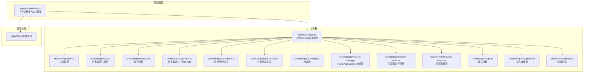
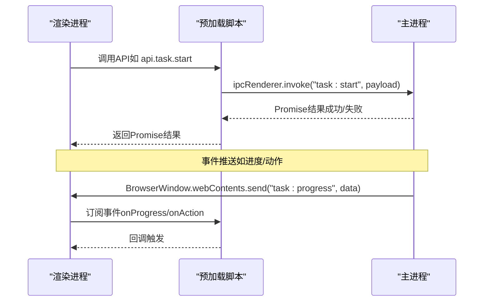
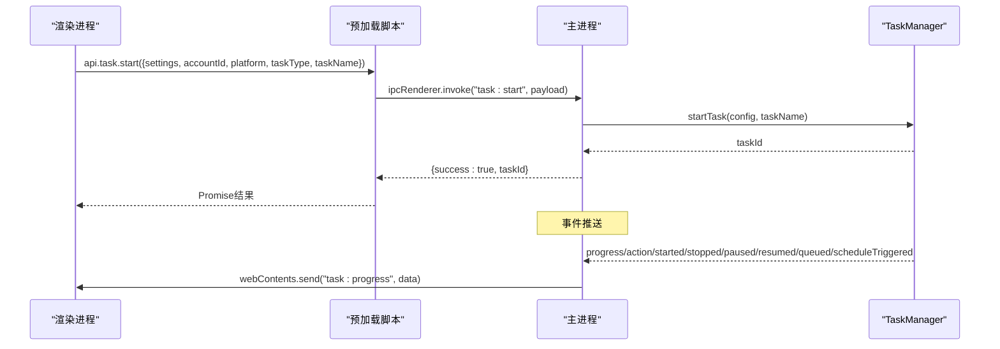
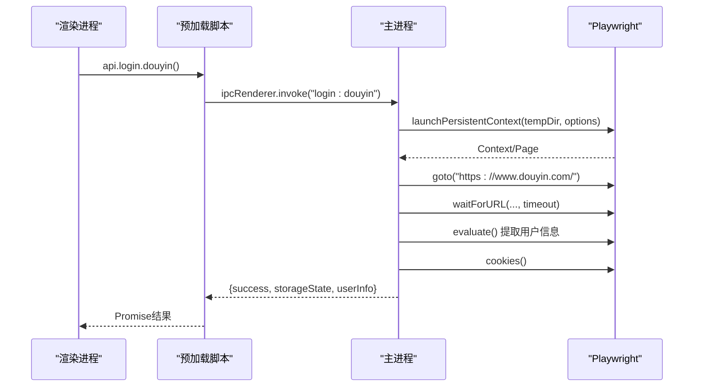
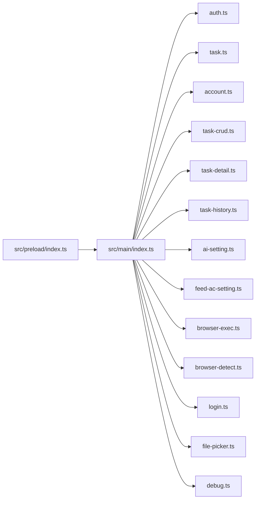

# IPC通信机制

<cite>
**本文档引用的文件**
- [src/main/index.ts](file://src/main/index.ts)
- [src/preload/index.ts](file://src/preload/index.ts)
- [src/main/ipc/auth.ts](file://src/main/ipc/auth.ts)
- [src/main/ipc/task.ts](file://src/main/ipc/task.ts)
- [src/main/ipc/account.ts](file://src/main/ipc/account.ts)
- [src/main/ipc/task-crud.ts](file://src/main/ipc/task-crud.ts)
- [src/main/ipc/task-detail.ts](file://src/main/ipc/task-detail.ts)
- [src/main/ipc/task-history.ts](file://src/main/ipc/task-history.ts)
- [src/main/ipc/ai-setting.ts](file://src/main/ipc/ai-setting.ts)
- [src/main/ipc/feed-ac-setting.ts](file://src/main/ipc/feed-ac-setting.ts)
- [src/main/ipc/browser-exec.ts](file://src/main/ipc/browser-exec.ts)
- [src/main/ipc/browser-detect.ts](file://src/main/ipc/browser-detect.ts)
- [src/main/ipc/login.ts](file://src/main/ipc/login.ts)
- [src/main/ipc/file-picker.ts](file://src/main/ipc/file-picker.ts)
- [src/main/ipc/debug.ts](file://src/main/ipc/debug.ts)
</cite>

## 目录
1. [简介](#简介)
2. [项目结构](#项目结构)
3. [核心组件](#核心组件)
4. [架构总览](#架构总览)
5. [详细组件分析](#详细组件分析)
6. [依赖关系分析](#依赖关系分析)
7. [性能考虑](#性能考虑)
8. [故障排除指南](#故障排除指南)
9. [结论](#结论)
10. [附录](#附录)

## 简介
本文件系统性梳理该Electron应用的IPC（进程间通信）机制，覆盖主进程与渲染进程之间的通信架构、IPC通道设计、消息传递协议与数据序列化方式；深入解析各IPC处理器的功能职责（任务管理、账号管理、设置管理、工具接口等）；总结安全机制、错误处理与性能优化策略，并提供使用示例、调试技巧与最佳实践。

## 项目结构
该应用采用“按功能域划分”的IPC模块组织方式，主进程在统一入口注册各类IPC处理器，渲染进程通过预加载脚本暴露的API访问主进程能力。整体结构清晰、职责明确，便于扩展与维护。

图表来源
- [src/main/index.ts:54-76](file://src/main/index.ts#L54-L76)
- [src/preload/index.ts:95-187](file://src/preload/index.ts#L95-L187)

章节来源
- [src/main/index.ts:1-106](file://src/main/index.ts#L1-L106)
- [src/preload/index.ts:1-187](file://src/preload/index.ts#L1-L187)

## 核心组件
- 应用入口与窗口初始化：负责创建BrowserWindow、设置webPreferences、注册全局日志转发以及加载各IPC处理器。
- 预加载脚本：通过contextBridge将受控API暴露给渲染进程，统一封装invoke与on事件监听。
- IPC处理器：按功能域拆分，每个模块独立注册handle方法，实现具体业务逻辑。

章节来源
- [src/main/index.ts:22-52](file://src/main/index.ts#L22-L52)
- [src/preload/index.ts:95-187](file://src/preload/index.ts#L95-L187)

## 架构总览
主进程与渲染进程之间通过Electron IPC进行异步通信。渲染进程通过预加载暴露的API发起invoke请求或订阅事件；主进程以ipcMain.handle响应请求，必要时通过BrowserWindow.webContents.send向渲染进程推送事件。

图表来源
- [src/preload/index.ts:102-116](file://src/preload/index.ts#L102-L116)
- [src/main/ipc/task.ts:22-76](file://src/main/ipc/task.ts#L22-L76)

## 详细组件分析

### 认证管理（auth）
- 功能职责：提供认证状态查询、登录写入、登出清理、获取认证信息。
- 通道设计：
  - 查询：auth:hasAuth → 返回布尔值
  - 登录：auth:login → 写入存储并返回结果对象
  - 登出：auth:logout → 清空存储并返回结果对象
  - 获取：auth:getAuth → 返回当前认证数据
- 数据序列化：认证数据直接作为参数传入，主进程写入持久化存储。
- 错误处理：无显式异常抛出，失败场景通过返回对象中的success字段与error字段指示。
- 安全机制：存储键名常量化，避免硬编码；仅暴露必要接口。

章节来源
- [src/main/ipc/auth.ts:4-23](file://src/main/ipc/auth.ts#L4-L23)

### 任务管理（task）
- 功能职责：任务启动、停止、暂停/恢复、状态查询、并发控制、队列管理、定时调度、事件推送。
- 通道设计：
  - 启动：task:start → 返回{success, taskId?}
  - 停止：task:stop → 支持单任务或全部停止
  - 暂停/恢复：task:pause / task:resume
  - 状态：task:status / task:get-status / task:list-running
  - 并发：task:set-concurrency / task:get-concurrency
  - 队列：task:queue-size / task:remove-from-queue
  - 调度：task:schedule / task:cancel-schedule / task:get-schedules
  - 事件：task:progress / task:action / task:started / task:stopped / task:paused / task:resumed / task:queued / task:scheduleTriggered
- 数据序列化：任务配置与状态对象通过JSON序列化传输；事件数据为普通对象。
- 错误处理：try/catch包裹关键操作，返回统一结构{success, error?}。
- 性能优化：全局TaskManager单例，事件广播至所有窗口，减少重复实例化。
- 安全机制：严格限制主进程内部状态，不直接暴露内部类实例。

图表来源
- [src/main/ipc/task.ts:82-132](file://src/main/ipc/task.ts#L82-L132)
- [src/main/ipc/task.ts:22-76](file://src/main/ipc/task.ts#L22-L76)

章节来源
- [src/main/ipc/task.ts:1-243](file://src/main/ipc/task.ts#L1-L243)

### 账号管理（account）
- 功能职责：账号列表、新增、更新、删除、设默认、查询默认、按平台筛选、查询活跃账号。
- 通道设计：
  - 列表：account:list
  - 新增：account:add
  - 更新：account:update
  - 删除：account:delete（自动维护至少一个默认账号）
  - 设默认：account:setDefault
  - 查询默认：account:getDefault
  - 按ID：account:getById
  - 按平台：account:getByPlatform
  - 活跃账号：account:getActiveAccounts
- 数据序列化：账号对象包含复杂字段（cookies、storageState等），通过存储层统一序列化。
- 错误处理：更新不存在的账号时抛出错误，调用方需捕获处理。
- 安全机制：账号敏感信息（cookies、storageState）仅在主进程内处理与存储。

章节来源
- [src/main/ipc/account.ts:32-100](file://src/main/ipc/account.ts#L32-L100)

### 任务模板与任务CRUD（task-crud）
- 功能职责：任务模板保存/删除；任务的增删改查与克隆。
- 通道设计：
  - 任务：task:getAll / getById / getByAccount / getByPlatform / create / update / delete / duplicate
  - 模板：task-template:getAll / save / delete
- 数据序列化：任务与模板对象通过存储层持久化，返回原始对象或数组。
- 错误处理：更新不存在的任务返回null；删除/更新返回统一结果对象。

章节来源
- [src/main/ipc/task-crud.ts:8-108](file://src/main/ipc/task-crud.ts#L8-L108)

### 任务明细（task-detail）
- 功能职责：根据任务ID获取明细记录；追加视频记录（含评论计数）；更新任务状态（完成/停止/错误时记录结束时间）。
- 通道设计：
  - 查询：task-detail:get
  - 追加视频记录：task-detail:addVideoRecord
  - 更新状态：task-detail:updateStatus
- 数据序列化：明细记录对象通过存储层持久化。

章节来源
- [src/main/ipc/task-detail.ts:5-39](file://src/main/ipc/task-detail.ts#L5-L39)

### 任务历史（task-history）
- 功能职责：任务历史记录的增删改查与清空。
- 通道设计：
  - 查询：task-history:getAll / getById
  - 新增：task-history:add
  - 更新：task-history:update
  - 删除：task-history:delete
  - 清空：task-history:clear
- 数据序列化：历史记录数组通过存储层持久化。

章节来源
- [src/main/ipc/task-history.ts:5-45](file://src/main/ipc/task-history.ts#L5-L45)

### AI设置（ai-setting）
- 功能职责：获取默认AI设置、更新部分设置、重置为默认、测试占位。
- 通道设计：
  - 获取：ai-settings:get
  - 更新：ai-settings:update
  - 重置：ai-settings:reset
  - 测试：ai-settings:test（占位）
- 数据序列化：设置对象通过存储层持久化。

章节来源
- [src/main/ipc/ai-setting.ts:5-27](file://src/main/ipc/ai-setting.ts#L5-L27)

### Feed-AutoComment设置（feed-ac-setting）
- 功能职责：确保设置版本为V3，提供获取/更新/重置/导出/导入。
- 通道设计：
  - 获取：feed-ac-settings:get
  - 更新：feed-ac-settings:update
  - 重置：feed-ac-settings:reset
  - 导出：feed-ac-settings:export
  - 导入：feed-ac-settings:import
- 数据序列化：支持V2到V3迁移，统一以V3格式存储。

章节来源
- [src/main/ipc/feed-ac-setting.ts:16-44](file://src/main/ipc/feed-ac-setting.ts#L16-L44)

### 浏览器执行路径（browser-exec）
- 功能职责：读取/设置浏览器可执行路径。
- 通道设计：
  - 读取：browser-exec:get
  - 设置：browser-exec:set
- 数据序列化：字符串路径直接存储。

章节来源
- [src/main/ipc/browser-exec.ts:4-13](file://src/main/ipc/browser-exec.ts#L4-L13)

### 浏览器检测（browser-detect）
- 功能职责：跨平台检测已安装浏览器，返回名称、路径、版本。
- 通道设计：
  - 检测：browser:detect
- 数据序列化：浏览器信息对象数组。
- 安全机制：仅在主进程内执行系统命令与文件系统检查，避免在渲染进程暴露敏感操作。

章节来源
- [src/main/ipc/browser-detect.ts:105-118](file://src/main/ipc/browser-detect.ts#L105-L118)

### 登录流程（login）
- 功能职责：基于Playwright启动临时上下文，引导用户登录抖音，提取用户信息与cookies，返回storageState供后续使用。
- 通道设计：
  - 登录：login:douyin → 返回{success, storageState?, userInfo?, error?}
  - 获取URL：login:getUrl → 返回目标站点URL
- 数据序列化：storageState为包含cookies数组的对象，序列化为字符串后返回。
- 错误处理：捕获异常并返回错误信息；超时等待URL变化时进行降级判断。
- 安全机制：临时用户数据目录隔离；headless关闭但不展示UI；仅在主进程内执行浏览器自动化。

图表来源
- [src/main/ipc/login.ts:17-167](file://src/main/ipc/login.ts#L17-L167)

章节来源
- [src/main/ipc/login.ts:1-173](file://src/main/ipc/login.ts#L1-L173)

### 文件选择器（file-picker）
- 功能职责：打开文件/文件夹选择对话框，返回选中路径与文件名。
- 通道设计：
  - 选择文件：file-picker:selectFile
  - 选择目录：file-picker:selectDirectory
- 数据序列化：返回对象包含canceled、filePath/dirPath、fileName/dirName。

章节来源
- [src/main/ipc/file-picker.ts:4-37](file://src/main/ipc/file-picker.ts#L4-L37)

### 调试（debug）
- 功能职责：返回当前运行环境信息（平台、架构、版本）。
- 通道设计：
  - 获取环境：debug:getEnv
- 数据序列化：环境信息对象。

章节来源
- [src/main/ipc/debug.ts:3-12](file://src/main/ipc/debug.ts#L3-L12)

## 依赖关系分析
- 主进程入口集中注册所有IPC处理器，形成清晰的依赖拓扑。
- 预加载脚本聚合所有API，渲染进程仅通过统一接口访问，降低耦合。
- 多个模块共享存储工具（存储键名常量化），保证一致性。

图表来源
- [src/main/index.ts:54-76](file://src/main/index.ts#L54-L76)
- [src/preload/index.ts:95-187](file://src/preload/index.ts#L95-L187)

章节来源
- [src/main/index.ts:54-76](file://src/main/index.ts#L54-L76)
- [src/preload/index.ts:95-187](file://src/preload/index.ts#L95-L187)

## 性能考虑
- 单例模式：任务管理器采用全局单例，避免重复初始化带来的资源消耗。
- 事件广播：通过遍历所有窗口推送事件，确保多窗口同步，但需注意窗口数量增长时的广播成本。
- 异步处理：所有IPC处理均为异步，避免阻塞主进程事件循环。
- 存储访问：对频繁读写的设置与任务数据建议在内存中缓存，减少磁盘IO。
- 日志：统一使用日志库记录错误与调试信息，便于定位性能瓶颈。

## 故障排除指南
- 任务启动失败：检查浏览器执行路径是否配置；查看日志输出；确认任务配置版本兼容性。
- 登录异常：确认浏览器路径正确；检查网络与页面URL等待超时；查看storageState生成与cookies提取日志。
- 事件未到达：确认渲染进程已订阅对应事件；检查主进程是否正确广播到所有窗口。
- 存储异常：核对存储键名与类型；检查数据序列化/反序列化是否一致。
- 权限问题：浏览器检测与系统命令执行需要适当权限；确保应用以足够权限运行。

章节来源
- [src/main/ipc/task.ts:98-102](file://src/main/ipc/task.ts#L98-L102)
- [src/main/ipc/login.ts:21-23](file://src/main/ipc/login.ts#L21-L23)

## 结论
该IPC体系以模块化方式组织，职责清晰、扩展性强。通过预加载脚本统一暴露API，既保证了安全性，又提供了良好的开发体验。建议在后续迭代中进一步完善错误传播与事件去重、引入更细粒度的权限控制与数据校验，持续提升稳定性与可观测性。

## 附录

### 使用示例（路径指引）
- 启动任务
  - 渲染端调用：[src/preload/index.ts:102-105](file://src/preload/index.ts#L102-L105)
  - 主进程处理：[src/main/ipc/task.ts:82-132](file://src/main/ipc/task.ts#L82-L132)
- 订阅任务进度
  - 渲染端订阅：[src/preload/index.ts:106-115](file://src/preload/index.ts#L106-L115)
  - 主进程广播：[src/main/ipc/task.ts:22-76](file://src/main/ipc/task.ts#L22-L76)
- 账号管理
  - 新增账号：[src/preload/index.ts:139](file://src/preload/index.ts#L139)
  - 主进程处理：[src/main/ipc/account.ts:37-49](file://src/main/ipc/account.ts#L37-L49)
- 设置管理
  - 获取Feed-AutoComment设置：[src/preload/index.ts:117-123](file://src/preload/index.ts#L117-L123)
  - 主进程处理：[src/main/ipc/feed-ac-setting.ts:16-44](file://src/main/ipc/feed-ac-setting.ts#L16-L44)

### 调试技巧
- 在渲染端通过日志通道上报：[src/main/index.ts:92-106](file://src/main/index.ts#L92-L106)
- 使用调试通道获取运行环境：[src/preload/index.ts:182-184](file://src/preload/index.ts#L182-L184)
- 主进程日志：统一使用日志库记录错误与信息，便于定位问题。

### 最佳实践
- 统一错误返回结构，便于前端统一处理。
- 对大对象传输进行必要的序列化与反序列化校验。
- 事件命名规范，避免冲突；订阅者及时移除监听。
- 对外部系统调用（如浏览器检测、登录）增加超时与降级策略。
- 将敏感数据（cookies、storageState）限制在主进程内处理，避免泄露。