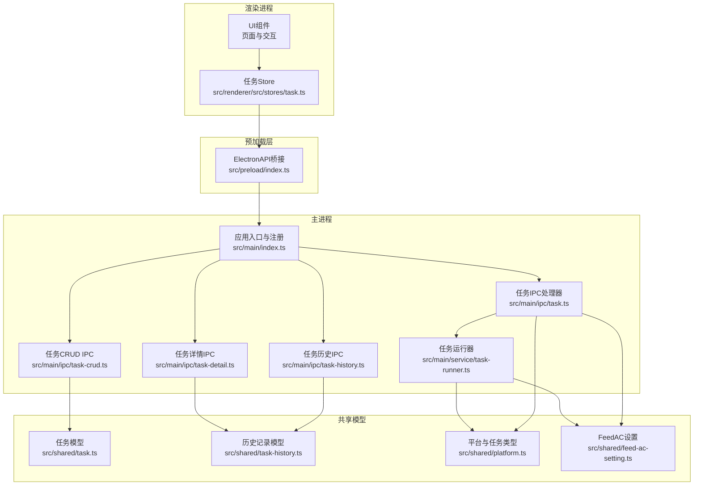
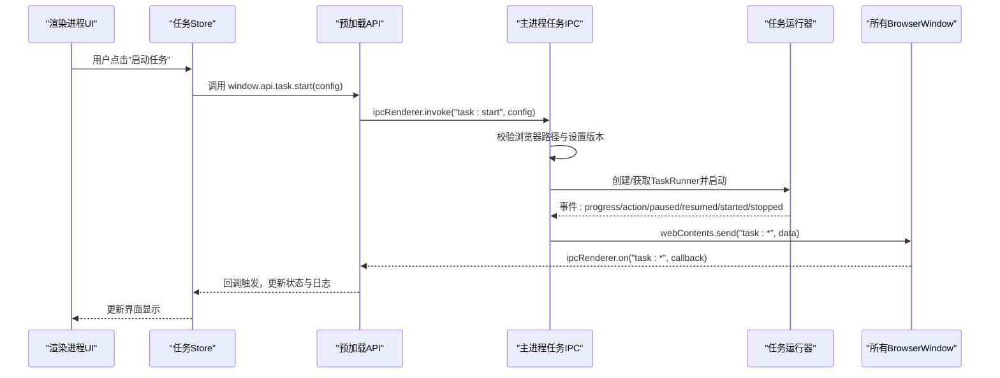
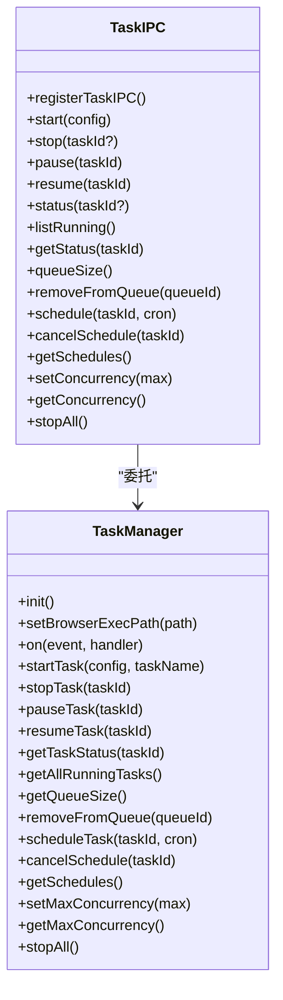
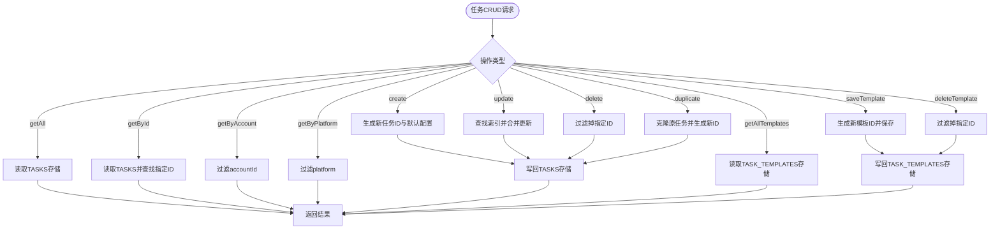
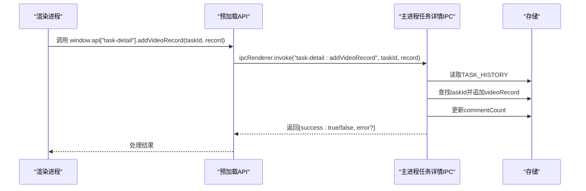
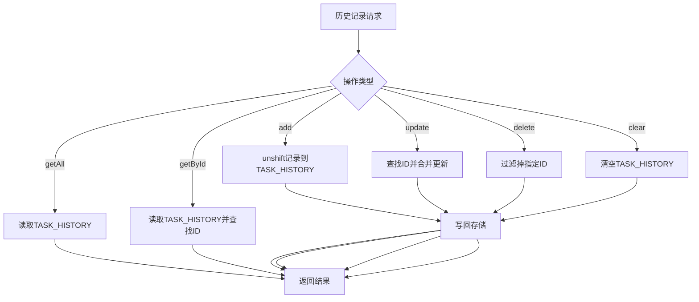
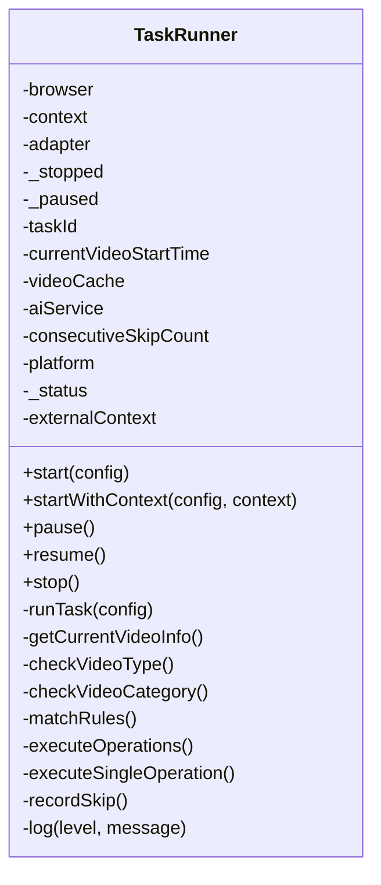
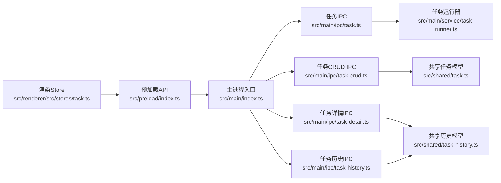

# 任务管理IPC

<cite>
**本文档引用的文件**
- [src/main/index.ts](file://src/main/index.ts)
- [src/preload/index.ts](file://src/preload/index.ts)
- [src/main/ipc/task.ts](file://src/main/ipc/task.ts)
- [src/main/ipc/task-crud.ts](file://src/main/ipc/task-crud.ts)
- [src/main/ipc/task-detail.ts](file://src/main/ipc/task-detail.ts)
- [src/main/ipc/task-history.ts](file://src/main/ipc/task-history.ts)
- [src/main/service/task-runner.ts](file://src/main/service/task-runner.ts)
- [src/shared/task.ts](file://src/shared/task.ts)
- [src/shared/task-history.ts](file://src/shared/task-history.ts)
- [src/shared/platform.ts](file://src/shared/platform.ts)
- [src/shared/feed-ac-setting.ts](file://src/shared/feed-ac-setting.ts)
- [src/renderer/src/stores/task.ts](file://src/renderer/src/stores/task.ts)
</cite>

## 目录
1. [简介](#简介)
2. [项目结构](#项目结构)
3. [核心组件](#核心组件)
4. [架构总览](#架构总览)
5. [详细组件分析](#详细组件分析)
6. [依赖关系分析](#依赖关系分析)
7. [性能考虑](#性能考虑)
8. [故障排除指南](#故障排除指南)
9. [结论](#结论)
10. [附录](#附录)

## 简介
本文件系统性阐述任务管理IPC的设计与实现，覆盖任务的创建、读取、更新、删除等CRUD操作，以及任务详情查询、任务历史记录、任务状态同步等IPC通信机制。重点解释复杂数据结构（如FeedAC设置、任务模板、历史记录）的传输与持久化，以及实时状态更新的实现方式。文档同时提供使用示例、错误处理策略与性能优化建议，帮助开发者快速理解并高效使用该IPC体系。

## 项目结构
任务管理IPC围绕主进程IPC处理器、预加载桥接层、共享数据模型与渲染进程存储层协同工作：
- 主进程：集中注册各类IPC处理器，负责业务逻辑与事件转发
- 预加载层：通过contextBridge暴露受控API给渲染进程
- 渲染进程：Pinia Store封装任务状态与日志，统一调度IPC调用
- 共享模型：定义任务、历史记录、平台与设置等跨层数据结构

**图表来源**
- [src/main/index.ts:54-76](file://src/main/index.ts#L54-L76)
- [src/preload/index.ts:130-234](file://src/preload/index.ts#L130-L234)
- [src/main/ipc/task.ts:81-240](file://src/main/ipc/task.ts#L81-L240)
- [src/main/ipc/task-crud.ts:8-108](file://src/main/ipc/task-crud.ts#L8-L108)
- [src/main/ipc/task-detail.ts:5-39](file://src/main/ipc/task-detail.ts#L5-L39)
- [src/main/ipc/task-history.ts:5-45](file://src/main/ipc/task-history.ts#L5-L45)
- [src/main/service/task-runner.ts:25-760](file://src/main/service/task-runner.ts#L25-L760)
- [src/shared/task.ts:12-62](file://src/shared/task.ts#L12-L62)
- [src/shared/task-history.ts:14-26](file://src/shared/task-history.ts#L14-L26)
- [src/shared/platform.ts:1-260](file://src/shared/platform.ts#L1-L260)
- [src/shared/feed-ac-setting.ts:62-179](file://src/shared/feed-ac-setting.ts#L62-L179)

**章节来源**
- [src/main/index.ts:54-76](file://src/main/index.ts#L54-L76)
- [src/preload/index.ts:130-234](file://src/preload/index.ts#L130-L234)

## 核心组件
- 任务IPC处理器：提供任务启动、停止、暂停、恢复、状态查询、并发控制、定时调度等功能
- 任务CRUD IPC：提供任务与模板的增删改查与复制
- 任务详情IPC：提供单个任务历史记录的查询与更新
- 任务历史IPC：提供历史记录的全量查询、按ID查询、新增、更新、删除与清空
- 任务运行器：封装Playwright自动化流程，负责实际任务执行与事件发射
- 预加载API桥接：统一暴露渲染进程可用的IPC接口与事件订阅
- 渲染进程Store：集中管理任务状态、日志、运行中任务列表与并发配置

**章节来源**
- [src/main/ipc/task.ts:81-240](file://src/main/ipc/task.ts#L81-L240)
- [src/main/ipc/task-crud.ts:8-108](file://src/main/ipc/task-crud.ts#L8-L108)
- [src/main/ipc/task-detail.ts:5-39](file://src/main/ipc/task-detail.ts#L5-L39)
- [src/main/ipc/task-history.ts:5-45](file://src/main/ipc/task-history.ts#L5-L45)
- [src/main/service/task-runner.ts:25-760](file://src/main/service/task-runner.ts#L25-L760)
- [src/preload/index.ts:130-234](file://src/preload/index.ts#L130-L234)
- [src/renderer/src/stores/task.ts:23-315](file://src/renderer/src/stores/task.ts#L23-L315)

## 架构总览
任务管理IPC采用“主进程处理器 + 预加载桥接 + 渲染进程Store”的三层架构：
- 主进程处理器：集中处理业务逻辑，维护TaskManager单例，转发事件到所有窗口
- 预加载桥接：将主进程IPC接口映射为安全的渲染进程API，并提供事件订阅
- 渲染进程Store：统一调度IPC调用，订阅实时事件，维护本地状态与日志

**图表来源**
- [src/main/ipc/task.ts:81-240](file://src/main/ipc/task.ts#L81-L240)
- [src/main/service/task-runner.ts:25-760](file://src/main/service/task-runner.ts#L25-L760)
- [src/preload/index.ts:130-234](file://src/preload/index.ts#L130-L234)
- [src/renderer/src/stores/task.ts:138-201](file://src/renderer/src/stores/task.ts#L138-L201)

## 详细组件分析

### 任务IPC处理器（task.ts）
- 单例TaskManager管理：延迟初始化，设置浏览器可执行路径，转发进度、动作、暂停、恢复、启动、停止、排队、定时触发等事件到所有窗口
- 任务生命周期管理：start/stop/pause/resume/status/list-running/get-status/queue-size/remove-from-queue/schedule/cancel-schedule/get-schedules/set-concurrency/get-concurrency/stop-all
- 设置版本迁移：支持从V2到V3的FeedAC设置迁移
- 错误处理：捕获异常并返回结构化错误信息

**图表来源**
- [src/main/ipc/task.ts:81-240](file://src/main/ipc/task.ts#L81-L240)
- [src/main/service/task-runner.ts:25-760](file://src/main/service/task-runner.ts#L25-L760)

**章节来源**
- [src/main/ipc/task.ts:81-240](file://src/main/ipc/task.ts#L81-L240)

### 任务CRUD IPC（task-crud.ts）
- 任务CRUD：getAll/getById/getByAccount/getByPlatform/create/update/delete/duplicate
- 任务模板：getAll/save/delete
- 默认设置：使用getDefaultFeedAcSettingsV3生成默认配置
- 数据持久化：通过store与StorageKey常量进行键值存储

**图表来源**
- [src/main/ipc/task-crud.ts:8-108](file://src/main/ipc/task-crud.ts#L8-L108)
- [src/shared/task.ts:42-62](file://src/shared/task.ts#L42-L62)

**章节来源**
- [src/main/ipc/task-crud.ts:8-108](file://src/main/ipc/task-crud.ts#L8-L108)
- [src/shared/task.ts:12-62](file://src/shared/task.ts#L12-L62)

### 任务详情IPC（task-detail.ts）
- 单任务历史记录查询：根据taskId查找对应记录
- 视频记录追加：向历史记录添加视频操作记录并更新统计
- 状态更新：更新任务状态并在结束时记录结束时间

**图表来源**
- [src/main/ipc/task-detail.ts:5-39](file://src/main/ipc/task-detail.ts#L5-L39)
- [src/shared/task-history.ts:14-26](file://src/shared/task-history.ts#L14-L26)

**章节来源**
- [src/main/ipc/task-detail.ts:5-39](file://src/main/ipc/task-detail.ts#L5-L39)
- [src/shared/task-history.ts:14-26](file://src/shared/task-history.ts#L14-L26)

### 任务历史IPC（task-history.ts）
- 历史记录管理：getAll/getById/add/update/delete/clear
- 新增时插入到数组头部，便于按时间倒序展示
- 更新与删除基于ID匹配

**图表来源**
- [src/main/ipc/task-history.ts:5-45](file://src/main/ipc/task-history.ts#L5-L45)
- [src/shared/task-history.ts:14-26](file://src/shared/task-history.ts#L14-L26)

**章节来源**
- [src/main/ipc/task-history.ts:5-45](file://src/main/ipc/task-history.ts#L5-L45)
- [src/shared/task-history.ts:14-26](file://src/shared/task-history.ts#L14-L26)

### 任务运行器（task-runner.ts）
- 浏览器与上下文管理：支持独立创建或共享BrowserContext，用于多任务并行
- 事件发射：progress/action/paused/resumed/stopped
- 任务循环：按设置执行操作，支持组合任务与概率控制，自动跳过广告/直播/图集，支持AI评论
- 视频缓存与监听：监听Feed接口响应，缓存视频元数据
- 存储状态：任务结束后保存浏览器上下文状态

**图表来源**
- [src/main/service/task-runner.ts:25-760](file://src/main/service/task-runner.ts#L25-L760)

**章节来源**
- [src/main/service/task-runner.ts:25-760](file://src/main/service/task-runner.ts#L25-L760)

### 预加载API桥接（preload/index.ts）
- 统一暴露：auth、task、feed-ac-settings、ai-settings、browser-exec、browser、account、login、file-picker、task-history、task-detail、taskCRUD、task-template、debug等接口
- 事件订阅：onProgress/onAction/onPaused/onResumed/onStarted/onStopped/onQueued/onScheduleTriggered
- 安全封装：通过contextBridge.exposeInMainWorld暴露受限API

**章节来源**
- [src/preload/index.ts:130-234](file://src/preload/index.ts#L130-L234)

### 渲染进程任务Store（renderer/src/stores/task.ts）
- 任务状态：tasks/templates/currentTaskId/isRunning/taskId/logs/runningTasks/maxConcurrency
- 生命周期：loadTasks/loadTemplates/createTask/updateTask/deleteTask/duplicateTask/saveAsTemplate/deleteTemplate
- 任务控制：start/stop/pauseTask/resumeTask/scheduleTask/cancelSchedule/setConcurrency/stopAll
- 事件监听：注册与清理任务事件回调，维护日志队列

**章节来源**
- [src/renderer/src/stores/task.ts:23-315](file://src/renderer/src/stores/task.ts#L23-L315)

## 依赖关系分析
- 主进程入口集中注册所有IPC处理器，确保生命周期一致
- 预加载API桥接与渲染进程Store形成双向通信：Store发起IPC调用，预加载层转发到主进程；主进程事件通过预加载层回传到Store
- 任务运行器与TaskManager解耦，通过事件驱动实现状态同步
- 共享模型贯穿三层：任务、历史记录、平台与设置定义了稳定的跨层契约

**图表来源**
- [src/main/index.ts:54-76](file://src/main/index.ts#L54-L76)
- [src/main/ipc/task.ts:81-240](file://src/main/ipc/task.ts#L81-L240)
- [src/main/ipc/task-crud.ts:8-108](file://src/main/ipc/task-crud.ts#L8-L108)
- [src/main/ipc/task-detail.ts:5-39](file://src/main/ipc/task-detail.ts#L5-L39)
- [src/main/ipc/task-history.ts:5-45](file://src/main/ipc/task-history.ts#L5-L45)
- [src/main/service/task-runner.ts:25-760](file://src/main/service/task-runner.ts#L25-L760)
- [src/shared/task.ts:12-62](file://src/shared/task.ts#L12-L62)
- [src/shared/task-history.ts:14-26](file://src/shared/task-history.ts#L14-L26)
- [src/preload/index.ts:130-234](file://src/preload/index.ts#L130-L234)
- [src/renderer/src/stores/task.ts:23-315](file://src/renderer/src/stores/task.ts#L23-L315)

**章节来源**
- [src/main/index.ts:54-76](file://src/main/index.ts#L54-L76)

## 性能考虑
- 并发控制：通过TaskManager的并发上限限制同时运行的任务数量，避免资源争用
- 事件节流：主进程将事件广播至所有窗口，渲染层应合理订阅与清理监听，避免重复处理
- 浏览器上下文复用：TaskRunner支持共享BrowserContext，减少浏览器实例开销
- 视频缓存：监听Feed响应并缓存视频元数据，降低重复抓取成本
- 日志截断：渲染Store对日志数组进行截断，防止内存膨胀
- 设置迁移：V2到V3的设置迁移仅在首次使用时发生，避免重复转换

[本节为通用性能建议，无需特定文件引用]

## 故障排除指南
- 启动失败：检查浏览器可执行路径是否配置，查看主进程日志中的错误信息
- 任务无法停止：确认taskId是否正确传递，检查TaskManager的stopTask实现
- 事件未到达：确认预加载层事件订阅是否正确注册与清理，检查主进程事件发送通道
- 数据不一致：检查存储键名与数据结构一致性，确保CRUD操作的原子性
- 并发问题：调整并发上限，观察任务队列与运行状态变化

**章节来源**
- [src/main/ipc/task.ts:81-240](file://src/main/ipc/task.ts#L81-L240)
- [src/preload/index.ts:130-234](file://src/preload/index.ts#L130-L234)
- [src/renderer/src/stores/task.ts:120-136](file://src/renderer/src/stores/task.ts#L120-L136)

## 结论
任务管理IPC通过清晰的分层设计与事件驱动机制，实现了复杂任务生命周期的可靠管理。共享数据模型保证了跨层一致性，预加载桥接提供了安全可控的API访问。结合并发控制、事件订阅与日志管理，系统能够稳定地支撑多任务并行与实时状态同步需求。

[本节为总结性内容，无需特定文件引用]

## 附录

### 使用示例（概念性）
- 启动任务：调用window.api.task.start，传入settings、accountId、taskType、taskName
- 查询状态：调用window.api.task.status或window.api.task.getStatus
- 停止任务：调用window.api.task.stop，支持按taskId或全部停止
- 订阅事件：使用window.api.task.onStarted/onStopped/onProgress等回调
- 任务CRUD：通过window.api.taskCRUD.getAll/create/update/delete/duplicate
- 任务历史：通过window.api["task-history"].getAll/getById/add/update/delete/clear
- 任务详情：通过window.api["task-detail"].get/addVideoRecord/updateStatus

[本节为使用说明，无需特定文件引用]

### 数据结构要点
- 任务模型：包含id、name、accountId、platform、taskType、config、schedule、createdAt、updatedAt
- 历史记录：包含id、startTime、endTime、status、commentCount、videoRecords、settings
- FeedAC设置：支持V2/V3版本，包含规则组、屏蔽词、操作配置、视频分类等
- 平台与任务类型：支持抖音、快手、小红书、微信视频号及多种任务类型

**章节来源**
- [src/shared/task.ts:12-62](file://src/shared/task.ts#L12-L62)
- [src/shared/task-history.ts:14-26](file://src/shared/task-history.ts#L14-L26)
- [src/shared/feed-ac-setting.ts:62-179](file://src/shared/feed-ac-setting.ts#L62-L179)
- [src/shared/platform.ts:1-260](file://src/shared/platform.ts#L1-L260)