# 浏览器工具IPC

<cite>
**本文引用的文件**
- [src/main/index.ts](file://src/main/index.ts)
- [src/preload/index.ts](file://src/preload/index.ts)
- [src/main/ipc/browser-exec.ts](file://src/main/ipc/browser-exec.ts)
- [src/main/ipc/browser-detect.ts](file://src/main/ipc/browser-detect.ts)
- [src/main/ipc/file-picker.ts](file://src/main/ipc/file-picker.ts)
- [src/main/ipc/login.ts](file://src/main/ipc/login.ts)
- [src/main/ipc/account.ts](file://src/main/ipc/account.ts)
- [src/main/ipc/task.ts](file://src/main/ipc/task.ts)
- [src/main/ipc/task-crud.ts](file://src/main/ipc/task-crud.ts)
- [src/main/ipc/task-detail.ts](file://src/main/ipc/task-detail.ts)
- [src/main/ipc/task-history.ts](file://src/main/ipc/task-history.ts)
- [src/main/ipc/debug.ts](file://src/main/ipc/debug.ts)
- [src/shared/platform.ts](file://src/shared/platform.ts)
- [src/shared/task.ts](file://src/shared/task.ts)
</cite>

## 目录
1. [简介](#简介)
2. [项目结构](#项目结构)
3. [核心组件](#核心组件)
4. [架构总览](#架构总览)
5. [详细组件分析](#详细组件分析)
6. [依赖关系分析](#依赖关系分析)
7. [性能考量](#性能考量)
8. [故障排查指南](#故障排查指南)
9. [结论](#结论)
10. [附录](#附录)

## 简介
本文件系统化梳理浏览器工具IPC（进程间通信）机制，覆盖以下方面：
- 浏览器执行命令与自动检测
- 页面元素检测与文件选择器
- 账号管理与登录流程
- 任务编排与运行控制
- 调试工具的IPC接口设计与实现
- 复杂DOM操作与页面交互模拟的IPC处理方式
- 使用示例、错误处理与性能优化策略

目标是帮助开发者快速理解IPC边界、数据流与扩展点，同时提供可操作的排障与优化建议。

## 项目结构
Electron应用采用主进程注册IPC处理器、渲染进程通过桥接API调用的方式组织。主进程负责业务逻辑与外部系统交互（如Playwright浏览器实例），渲染进程负责UI与用户交互。

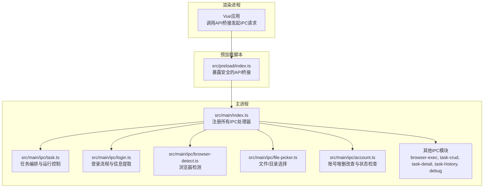

图表来源
- [src/main/index.ts:54-76](file://src/main/index.ts#L54-L76)
- [src/preload/index.ts:131-235](file://src/preload/index.ts#L131-L235)

章节来源
- [src/main/index.ts:1-106](file://src/main/index.ts#L1-L106)
- [src/preload/index.ts:1-235](file://src/preload/index.ts#L1-L235)

## 核心组件
- 主进程入口与处理器注册：集中初始化日志、窗口、以及所有IPC处理器。
- 预加载脚本桥接：在隔离上下文中暴露受控API，统一封装invoke与on监听。
- 平台与任务共享类型：定义平台、任务类型、选择器、端点等跨层契约。

章节来源
- [src/main/index.ts:54-76](file://src/main/index.ts#L54-L76)
- [src/preload/index.ts:131-235](file://src/preload/index.ts#L131-L235)
- [src/shared/platform.ts:1-260](file://src/shared/platform.ts#L1-L260)
- [src/shared/task.ts:1-62](file://src/shared/task.ts#L1-L62)

## 架构总览
下图展示从渲染进程到主进程，再到Playwright浏览器实例的关键调用链路与事件广播。

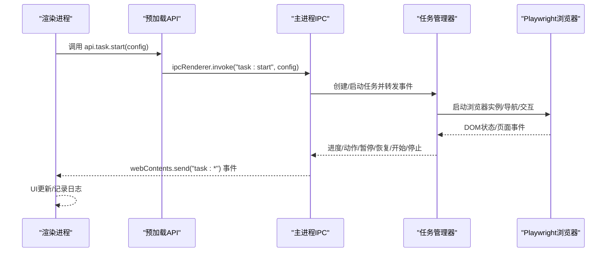

图表来源
- [src/main/ipc/task.ts:81-134](file://src/main/ipc/task.ts#L81-L134)
- [src/preload/index.ts:138-162](file://src/preload/index.ts#L138-L162)

章节来源
- [src/main/ipc/task.ts:13-79](file://src/main/ipc/task.ts#L13-L79)
- [src/preload/index.ts:138-162](file://src/preload/index.ts#L138-L162)

## 详细组件分析

### 浏览器执行命令与检测
- 浏览器执行路径管理：主进程提供读取/写入浏览器可执行路径的IPC，用于后续任务启动时指定浏览器。
- 浏览器自动检测：扫描常见安装路径与注册表项，返回可用浏览器列表（名称、路径、版本去重）。

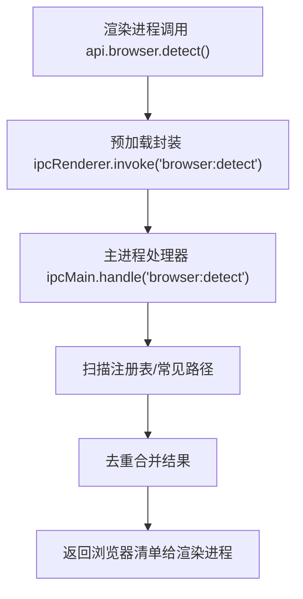

图表来源
- [src/main/ipc/browser-detect.ts:105-117](file://src/main/ipc/browser-detect.ts#L105-L117)
- [src/preload/index.ts:180-182](file://src/preload/index.ts#L180-L182)

章节来源
- [src/main/ipc/browser-exec.ts:4-13](file://src/main/ipc/browser-exec.ts#L4-L13)
- [src/main/ipc/browser-detect.ts:12-117](file://src/main/ipc/browser-detect.ts#L12-L117)
- [src/preload/index.ts:59-65](file://src/preload/index.ts#L59-L65)

### 文件选择器IPC
- 文件选择：支持过滤器参数，返回取消状态、文件路径与文件名。
- 目录选择：返回取消状态、目录路径与目录名。

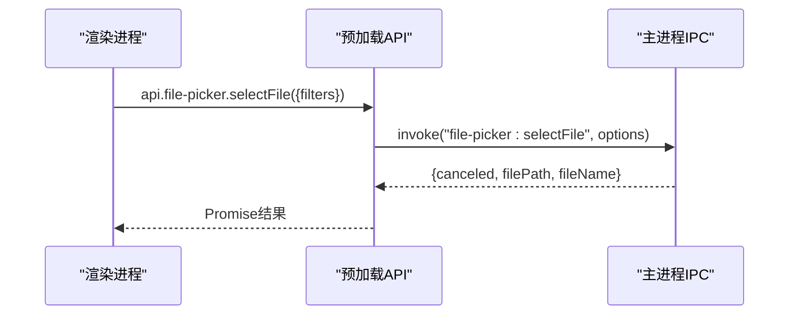

图表来源
- [src/main/ipc/file-picker.ts:4-20](file://src/main/ipc/file-picker.ts#L4-L20)
- [src/preload/index.ts:198-201](file://src/preload/index.ts#L198-L201)

章节来源
- [src/main/ipc/file-picker.ts:1-37](file://src/main/ipc/file-picker.ts#L1-L37)
- [src/preload/index.ts:79-92](file://src/preload/index.ts#L79-L92)

### 登录与页面元素检测
- 抖音登录：基于Playwright启动临时用户数据目录，等待用户完成登录，提取昵称、头像、唯一ID与Cookies，返回storageState供后续任务复用。
- 页面元素检测：在页面上下文内尝试多种选择器与URL模式，进行健壮性重试与降级处理。

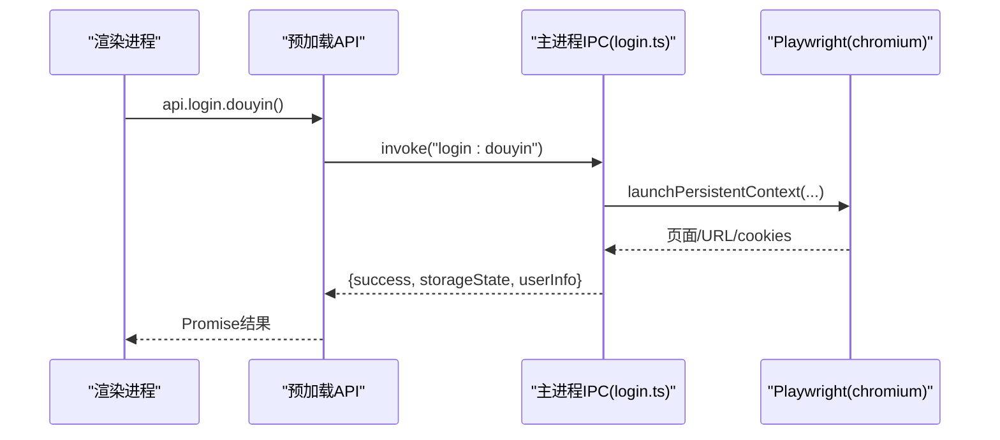

图表来源
- [src/main/ipc/login.ts:85-192](file://src/main/ipc/login.ts#L85-L192)
- [src/preload/index.ts:195-197](file://src/preload/index.ts#L195-L197)

章节来源
- [src/main/ipc/login.ts:18-83](file://src/main/ipc/login.ts#L18-L83)
- [src/main/ipc/login.ts:85-192](file://src/main/ipc/login.ts#L85-L192)

### 账号管理IPC
- 增删改查与默认账号设置
- 按平台筛选与活跃账号查询
- 单个/批量账号状态检查与持久化更新

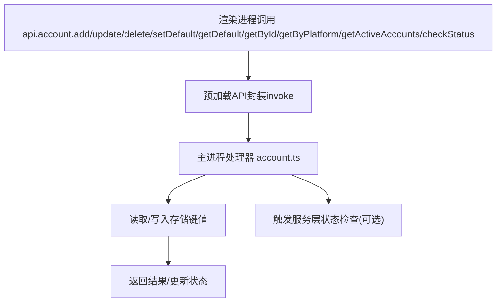

图表来源
- [src/main/ipc/account.ts:32-127](file://src/main/ipc/account.ts#L32-L127)
- [src/preload/index.ts:183-194](file://src/preload/index.ts#L183-L194)

章节来源
- [src/main/ipc/account.ts:1-128](file://src/main/ipc/account.ts#L1-L128)
- [src/preload/index.ts:66-77](file://src/preload/index.ts#L66-L77)

### 任务编排与运行控制IPC
- 任务启动/停止/暂停/恢复/状态查询/并发度设置
- 事件广播：进度、动作、暂停/恢复、开始/结束、入队、定时触发
- 设置迁移：从旧版本设置迁移到新版本

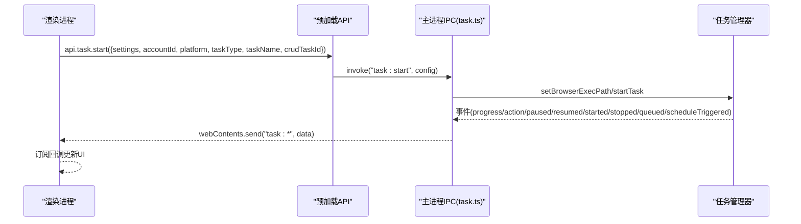

图表来源
- [src/main/ipc/task.ts:81-242](file://src/main/ipc/task.ts#L81-L242)
- [src/preload/index.ts:138-162](file://src/preload/index.ts#L138-L162)

章节来源
- [src/main/ipc/task.ts:13-79](file://src/main/ipc/task.ts#L13-L79)
- [src/shared/task.ts:50-62](file://src/shared/task.ts#L50-L62)

### 任务CRUD与详情/历史IPC
- 任务CRUD：创建、更新、删除、复制、按账户/平台查询
- 任务模板保存/删除
- 任务详情：追加视频记录、更新状态
- 任务历史：增删改查、清空

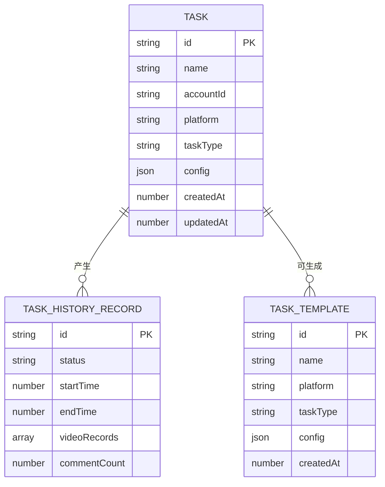

图表来源
- [src/shared/task.ts:12-31](file://src/shared/task.ts#L12-L31)
- [src/main/ipc/task-crud.ts:8-107](file://src/main/ipc/task-crud.ts#L8-L107)
- [src/main/ipc/task-detail.ts:5-39](file://src/main/ipc/task-detail.ts#L5-L39)
- [src/main/ipc/task-history.ts:5-45](file://src/main/ipc/task-history.ts#L5-L45)

章节来源
- [src/main/ipc/task-crud.ts:1-108](file://src/main/ipc/task-crud.ts#L1-L108)
- [src/main/ipc/task-detail.ts:1-39](file://src/main/ipc/task-detail.ts#L1-L39)
- [src/main/ipc/task-history.ts:1-45](file://src/main/ipc/task-history.ts#L1-L45)

### 调试工具IPC接口
- 获取环境信息：平台、架构、Electron/Node版本等

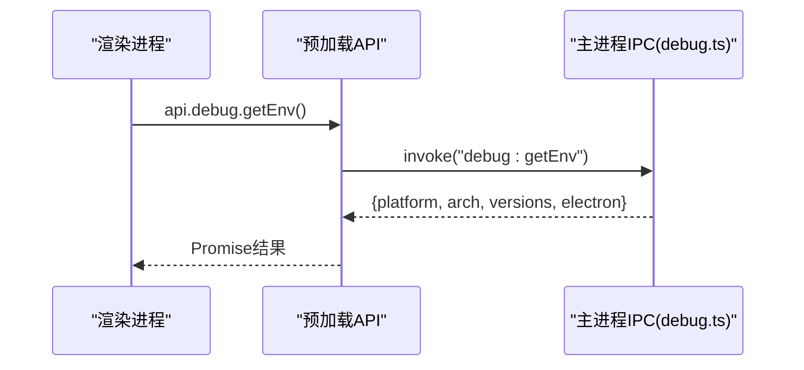

图表来源
- [src/main/ipc/debug.ts:3-12](file://src/main/ipc/debug.ts#L3-L12)
- [src/preload/index.ts:229-231](file://src/preload/index.ts#L229-L231)

章节来源
- [src/main/ipc/debug.ts:1-12](file://src/main/ipc/debug.ts#L1-L12)
- [src/preload/index.ts:120-122](file://src/preload/index.ts#L120-L122)

### 复杂DOM操作与页面交互模拟
- 平台选择器与键盘快捷键：各平台定义了关键选择器（如点赞、收藏、关注、评论输入/提交、侧栏卡片）与快捷键，便于在页面上下文内进行交互。
- 交互流程示意（以某平台为例）：

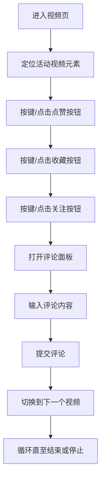

图表来源
- [src/shared/platform.ts:53-86](file://src/shared/platform.ts#L53-L86)
- [src/shared/platform.ts:88-200](file://src/shared/platform.ts#L88-L200)

章节来源
- [src/shared/platform.ts:1-260](file://src/shared/platform.ts#L1-L260)

## 依赖关系分析
- 主进程入口集中注册所有IPC处理器，确保生命周期内统一管理。
- 预加载脚本作为“安全网关”，仅暴露白名单方法，避免直接访问Node/Electron能力。
- 任务管理器在主进程中单例化，负责事件分发与渲染窗口广播。
- 登录流程依赖Playwright，需要正确的依赖版本与可执行路径。

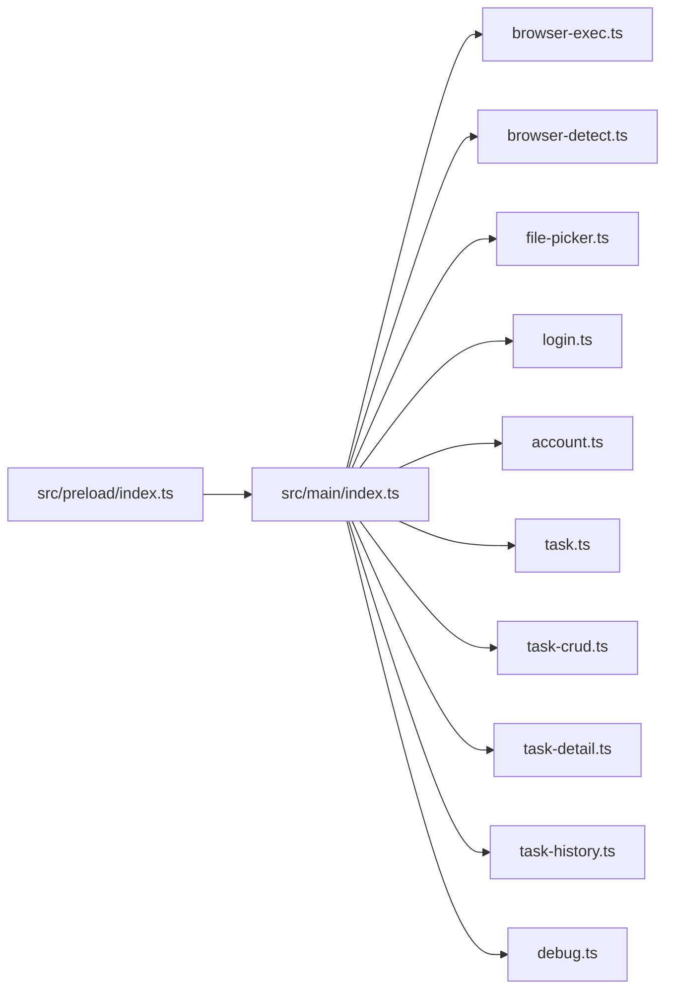

图表来源
- [src/main/index.ts:54-76](file://src/main/index.ts#L54-L76)
- [src/preload/index.ts:131-235](file://src/preload/index.ts#L131-L235)

章节来源
- [src/main/index.ts:54-76](file://src/main/index.ts#L54-L76)
- [src/preload/index.ts:131-235](file://src/preload/index.ts#L131-L235)

## 性能考量
- 事件风暴抑制：任务事件广播可能频繁，建议在渲染层做节流/去抖与批量更新。
- 并发度控制：通过设置最大并发数限制同时运行的任务数量，避免资源争用。
- 存储访问：批量读写存储键值，减少多次IO。
- 浏览器实例复用：尽量避免频繁启停浏览器，必要时清理上下文与页面。
- DOM查询优化：优先使用稳定的选择器，减少回退与重试次数；对高频查询进行缓存。
- 日志分级：区分info/warn/error/debug，生产环境降低日志级别。

## 故障排查指南
- 无法找到Playwright模块
  - 现象：运行时报错找不到模块。
  - 原因：依赖包为@playwright/test，但导入路径写成了playwright。
  - 处理：修正导入路径为@playwright/test，并安装对应版本。
  - 参考
    - [src/main/ipc/login.ts:94](file://src/main/ipc/login.ts#L94)

- 任务启动失败（浏览器路径未配置）
  - 现象：返回错误提示“浏览器路径未配置”。
  - 处理：先通过browser-exec设置浏览器可执行路径，再启动任务。
  - 参考
    - [src/main/ipc/task.ts:99-103](file://src/main/ipc/task.ts#L99-L103)
    - [src/main/ipc/browser-exec.ts:9-12](file://src/main/ipc/browser-exec.ts#L9-L12)

- 登录超时或无法提取用户信息
  - 现象：等待URL超时或昵称为空。
  - 处理：增加重试次数与延时，确认页面已跳转至个人主页或用户资料页。
  - 参考
    - [src/main/ipc/login.ts:117-150](file://src/main/ipc/login.ts#L117-L150)

- 任务事件未到达渲染进程
  - 现象：UI不更新。
  - 处理：确认订阅回调是否正确绑定；检查主进程是否向所有窗口发送事件。
  - 参考
    - [src/main/ipc/task.ts:22-76](file://src/main/ipc/task.ts#L22-L76)

- 文件选择器返回取消
  - 现象：canceled为true。
  - 处理：检查过滤器参数与用户取消行为。
  - 参考
    - [src/main/ipc/file-picker.ts:11-13](file://src/main/ipc/file-picker.ts#L11-L13)

章节来源
- [src/main/ipc/login.ts:94](file://src/main/ipc/login.ts#L94)
- [src/main/ipc/task.ts:99-103](file://src/main/ipc/task.ts#L99-L103)
- [src/main/ipc/browser-exec.ts:9-12](file://src/main/ipc/browser-exec.ts#L9-L12)
- [src/main/ipc/login.ts:117-150](file://src/main/ipc/login.ts#L117-L150)
- [src/main/ipc/task.ts:22-76](file://src/main/ipc/task.ts#L22-L76)
- [src/main/ipc/file-picker.ts:11-13](file://src/main/ipc/file-picker.ts#L11-L13)

## 结论
该IPC体系以主进程为中心，围绕浏览器自动化、任务编排、账号管理与调试工具构建了清晰的职责边界。通过预加载脚本提供的安全API，渲染进程可以可靠地发起请求与接收事件。对于复杂DOM交互，平台选择器与键盘快捷键提供了可扩展的抽象。建议在实际部署中重点关注依赖一致性、事件风暴治理与资源并发控制，以获得更稳定的自动化体验。

## 附录
- 使用示例（路径指引）
  - 设置浏览器执行路径
    - 渲染进程调用：[src/preload/index.ts:176-179](file://src/preload/index.ts#L176-L179)
    - 主进程处理：[src/main/ipc/browser-exec.ts:4-13](file://src/main/ipc/browser-exec.ts#L4-L13)
  - 选择文件
    - 渲染进程调用：[src/preload/index.ts:198-201](file://src/preload/index.ts#L198-L201)
    - 主进程处理：[src/main/ipc/file-picker.ts:4-20](file://src/main/ipc/file-picker.ts#L4-L20)
  - 抖音登录
    - 渲染进程调用：[src/preload/index.ts:195-197](file://src/preload/index.ts#L195-L197)
    - 主进程处理：[src/main/ipc/login.ts:85-192](file://src/main/ipc/login.ts#L85-L192)
  - 启动任务
    - 渲染进程调用：[src/preload/index.ts:138-140](file://src/preload/index.ts#L138-L140)
    - 主进程处理：[src/main/ipc/task.ts:81-134](file://src/main/ipc/task.ts#L81-L134)
  - 订阅任务事件
    - 渲染进程调用：[src/preload/index.ts:154-162](file://src/preload/index.ts#L154-L162)
    - 主进程广播：[src/main/ipc/task.ts:22-76](file://src/main/ipc/task.ts#L22-L76)