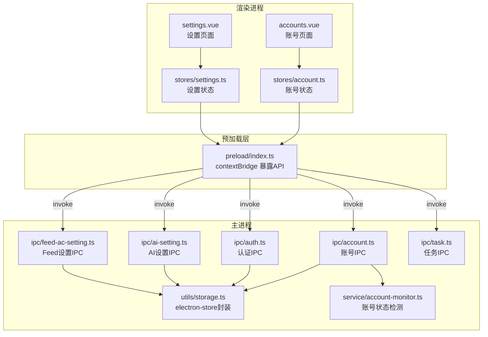
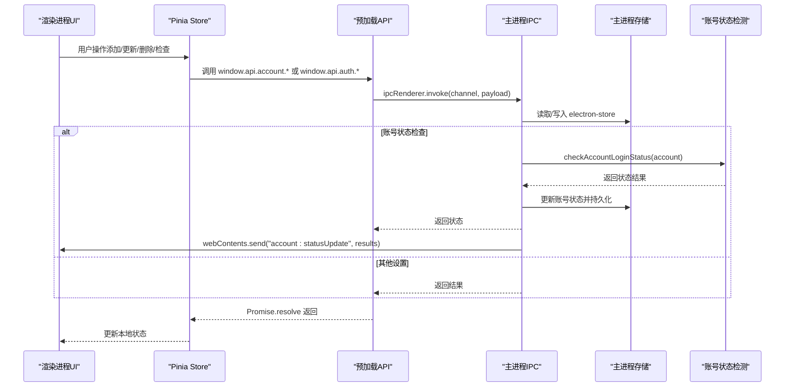
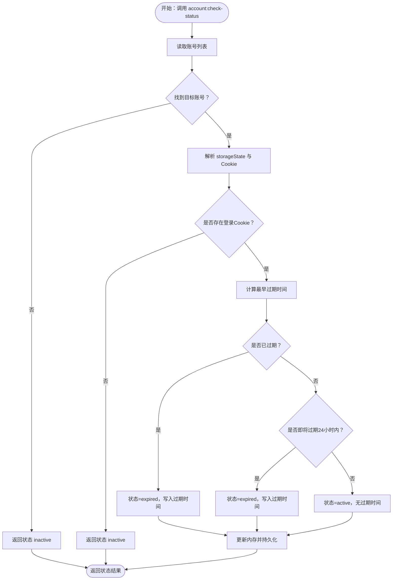
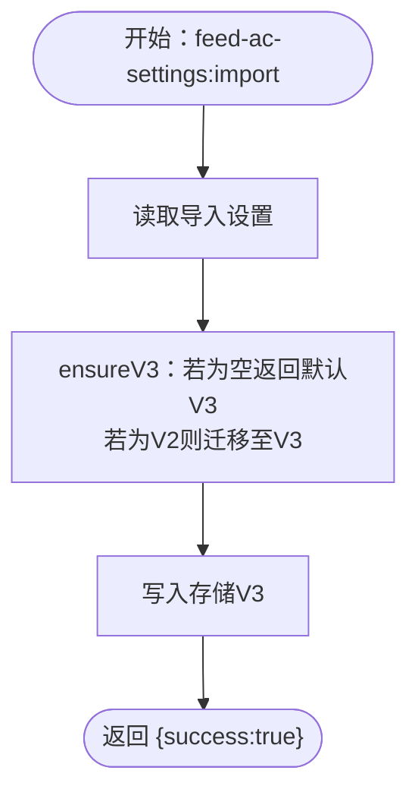
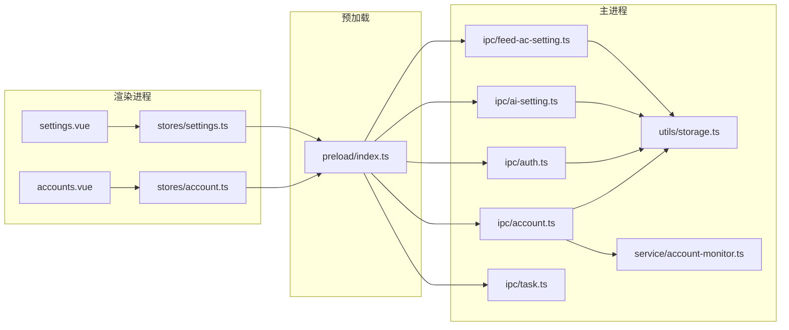

# 账号和设置IPC

<cite>
**本文档引用的文件**
- [src/main/ipc/account.ts](file://src/main/ipc/account.ts)
- [src/main/ipc/auth.ts](file://src/main/ipc/auth.ts)
- [src/main/ipc/ai-setting.ts](file://src/main/ipc/ai-setting.ts)
- [src/main/ipc/feed-ac-setting.ts](file://src/main/ipc/feed-ac-setting.ts)
- [src/main/ipc/task.ts](file://src/main/ipc/task.ts)
- [src/preload/index.ts](file://src/preload/index.ts)
- [src/main/utils/storage.ts](file://src/main/utils/storage.ts)
- [src/shared/account.ts](file://src/shared/account.ts)
- [src/shared/ai-setting.ts](file://src/shared/ai-setting.ts)
- [src/shared/feed-ac-setting.ts](file://src/shared/feed-ac-setting.ts)
- [src/main/service/account-monitor.ts](file://src/main/service/account-monitor.ts)
- [src/renderer/src/stores/account.ts](file://src/renderer/src/stores/account.ts)
- [src/renderer/src/stores/settings.ts](file://src/renderer/src/stores/settings.ts)
- [src/renderer/src/pages/accounts.vue](file://src/renderer/src/pages/accounts.vue)
- [src/renderer/src/pages/settings.vue](file://src/renderer/src/pages/settings.vue)
</cite>

## 目录
1. [简介](#简介)
2. [项目结构](#项目结构)
3. [核心组件](#核心组件)
4. [架构总览](#架构总览)
5. [详细组件分析](#详细组件分析)
6. [依赖关系分析](#依赖关系分析)
7. [性能考量](#性能考量)
8. [故障排除指南](#故障排除指南)
9. [结论](#结论)
10. [附录](#附录)

## 简介
本文件面向需要在桌面应用中实现“账号管理与设置管理”的开发者，系统性阐述基于 Electron 的 IPC 通信机制，覆盖以下主题：
- 账号管理：账号的增删改查、默认账号设置、按平台查询、活跃账号筛选、登录状态检查与批量检查
- 认证处理：应用级认证状态的读取、登录、登出与持久化
- 设置管理：AI 设置与 Feed 自动评论设置的读取、更新、重置、导入导出与版本迁移
- 安全与权限：敏感数据存储位置、跨进程通信边界、渲染进程 API 暴露策略
- 使用示例：前端如何通过 window.api 调用后端 IPC 接口
- 数据验证与安全：字段约束、默认值、版本兼容与迁移策略

## 项目结构
该工程采用主进程-预加载-渲染进程三层架构，IPC 接口集中在主进程的 ipc 目录，通过 preload 暴露给渲染进程；共享数据结构位于 shared 目录，存储层统一由 utils/storage 管理。

**图表来源**
- [src/renderer/src/pages/accounts.vue](file://src/renderer/src/pages/accounts.vue)
- [src/renderer/src/pages/settings.vue](file://src/renderer/src/pages/settings.vue)
- [src/renderer/src/stores/account.ts](file://src/renderer/src/stores/account.ts)
- [src/renderer/src/stores/settings.ts](file://src/renderer/src/stores/settings.ts)
- [src/preload/index.ts](file://src/preload/index.ts)
- [src/main/ipc/account.ts](file://src/main/ipc/account.ts)
- [src/main/ipc/auth.ts](file://src/main/ipc/auth.ts)
- [src/main/ipc/ai-setting.ts](file://src/main/ipc/ai-setting.ts)
- [src/main/ipc/feed-ac-setting.ts](file://src/main/ipc/feed-ac-setting.ts)
- [src/main/ipc/task.ts](file://src/main/ipc/task.ts)
- [src/main/utils/storage.ts](file://src/main/utils/storage.ts)
- [src/main/service/account-monitor.ts](file://src/main/service/account-monitor.ts)

**章节来源**
- [src/preload/index.ts:130-234](file://src/preload/index.ts#L130-L234)
- [src/main/ipc/account.ts:32-127](file://src/main/ipc/account.ts#L32-L127)
- [src/main/ipc/auth.ts:4-23](file://src/main/ipc/auth.ts#L4-L23)
- [src/main/ipc/ai-setting.ts:5-27](file://src/main/ipc/ai-setting.ts#L5-L27)
- [src/main/ipc/feed-ac-setting.ts:16-44](file://src/main/ipc/feed-ac-setting.ts#L16-L44)
- [src/main/ipc/task.ts:81-240](file://src/main/ipc/task.ts#L81-L240)
- [src/main/utils/storage.ts:16-53](file://src/main/utils/storage.ts#L16-L53)

## 核心组件
- 账号IPC：提供账号列表、新增、更新、删除、设置默认、查询默认、按ID/平台查询、活跃账号筛选、单个/批量状态检查等接口
- 认证IPC：提供认证存在性检查、登录写入、登出清空、读取认证数据等接口
- AI设置IPC：提供读取、更新、重置、测试占位接口
- Feed自动评论设置IPC：提供读取、更新、重置、导出、导入、版本迁移（V2→V3）等接口
- 预加载API桥接：将主进程IPC能力以 window.api 形式暴露给渲染进程，统一方法名与参数签名
- 存储层：基于 electron-store 统一键空间，支持认证、账号、AI设置、Feed设置等键值
- 账号状态监测：解析账号 storageState 中 Cookie 过期时间，判定登录态状态并广播更新

**章节来源**
- [src/main/ipc/account.ts:32-127](file://src/main/ipc/account.ts#L32-L127)
- [src/main/ipc/auth.ts:4-23](file://src/main/ipc/auth.ts#L4-L23)
- [src/main/ipc/ai-setting.ts:5-27](file://src/main/ipc/ai-setting.ts#L5-L27)
- [src/main/ipc/feed-ac-setting.ts:16-44](file://src/main/ipc/feed-ac-setting.ts#L16-L44)
- [src/preload/index.ts:130-234](file://src/preload/index.ts#L130-L234)
- [src/main/utils/storage.ts:33-53](file://src/main/utils/storage.ts#L33-L53)
- [src/main/service/account-monitor.ts:17-109](file://src/main/service/account-monitor.ts#L17-L109)

## 架构总览
下图展示从渲染进程发起请求到主进程处理并持久化的完整链路，以及状态变更向渲染进程广播的回传路径。

**图表来源**
- [src/renderer/src/stores/account.ts:41-105](file://src/renderer/src/stores/account.ts#L41-L105)
- [src/renderer/src/stores/settings.ts:12-45](file://src/renderer/src/stores/settings.ts#L12-L45)
- [src/preload/index.ts:130-234](file://src/preload/index.ts#L130-L234)
- [src/main/ipc/account.ts:101-126](file://src/main/ipc/account.ts#L101-L126)
- [src/main/ipc/auth.ts:5-22](file://src/main/ipc/auth.ts#L5-L22)
- [src/main/ipc/ai-setting.ts:6-26](file://src/main/ipc/ai-setting.ts#L6-L26)
- [src/main/ipc/feed-ac-setting.ts:17-43](file://src/main/ipc/feed-ac-setting.ts#L17-L43)
- [src/main/utils/storage.ts:16-53](file://src/main/utils/storage.ts#L16-L53)
- [src/main/service/account-monitor.ts:80-109](file://src/main/service/account-monitor.ts#L80-L109)

## 详细组件分析

### 账号管理IPC
- 接口清单
  - 账号列表：返回全部账号
  - 新增账号：生成唯一ID、记录创建时间、首个账号自动设为默认、状态初始化
  - 更新账号：按ID部分更新字段
  - 删除账号：过滤掉目标ID；若删除后无默认账号则将第一个账号设为默认
  - 设置默认：将指定ID设为默认，其余清空
  - 查询默认：返回标记为默认的账号或首个账号
  - 按ID查询：返回匹配账号或空
  - 按平台查询：返回该平台下的账号集合
  - 活跃账号：返回状态为“active”的账号集合
  - 单个状态检查：解析 storageState 中 Cookie 过期时间，更新本地状态并持久化
  - 批量状态检查：遍历活跃/过期账号，异步并发检查，完成后广播更新
- 关键数据结构
  - 账号接口 Account：包含平台、头像、存储状态、Cookie、创建时间、是否默认、状态、过期时间等
  - 存储键：ACCOUNTS
- 安全与权限
  - 渲染进程仅能通过 window.api 调用，避免直接访问主进程内部逻辑
  - 账号状态检查依赖 storageState 中的 Cookie 信息，属于敏感数据，应避免在日志中打印完整内容
- 使用示例（路径）
  - 添加账号：[src/renderer/src/pages/accounts.vue:110-139](file://src/renderer/src/pages/accounts.vue#L110-L139)
  - 删除/设默认/检查状态：[src/renderer/src/pages/accounts.vue:92-160](file://src/renderer/src/pages/accounts.vue#L92-L160)
  - Store 封装：[src/renderer/src/stores/account.ts:50-98](file://src/renderer/src/stores/account.ts#L50-L98)
  - 主进程实现：[src/main/ipc/account.ts:32-127](file://src/main/ipc/account.ts#L32-L127)
  - 状态检测：[src/main/service/account-monitor.ts:17-75](file://src/main/service/account-monitor.ts#L17-L75)

**图表来源**
- [src/main/ipc/account.ts:101-121](file://src/main/ipc/account.ts#L101-L121)
- [src/main/service/account-monitor.ts:17-75](file://src/main/service/account-monitor.ts#L17-L75)

**章节来源**
- [src/main/ipc/account.ts:32-127](file://src/main/ipc/account.ts#L32-L127)
- [src/shared/account.ts:3-39](file://src/shared/account.ts#L3-L39)
- [src/main/utils/storage.ts:33-44](file://src/main/utils/storage.ts#L33-L44)
- [src/main/service/account-monitor.ts:17-109](file://src/main/service/account-monitor.ts#L17-L109)
- [src/renderer/src/pages/accounts.vue:110-160](file://src/renderer/src/pages/accounts.vue#L110-L160)
- [src/renderer/src/stores/account.ts:41-105](file://src/renderer/src/stores/account.ts#L41-L105)

### 认证处理IPC
- 接口清单
  - hasAuth：判断是否存在认证数据
  - login：写入认证数据
  - logout：清空认证数据
  - getAuth：读取认证数据
- 存储键：AUTH
- 使用场景
  - 应用启动时检查是否已登录
  - 登录流程完成后写入认证数据
  - 登出时清理认证数据
- 使用示例（路径）
  - 渲染进程调用：[src/preload/index.ts:131-136](file://src/preload/index.ts#L131-L136)
  - 主进程实现：[src/main/ipc/auth.ts:4-23](file://src/main/ipc/auth.ts#L4-L23)

**章节来源**
- [src/main/ipc/auth.ts:4-23](file://src/main/ipc/auth.ts#L4-L23)
- [src/main/utils/storage.ts:33-44](file://src/main/utils/storage.ts#L33-L44)
- [src/preload/index.ts:131-136](file://src/preload/index.ts#L131-L136)

### 设置管理IPC

#### AI 设置
- 接口清单
  - ai-settings:get：读取AI设置，不存在则返回默认值
  - ai-settings:update：部分更新AI设置并持久化
  - ai-settings:reset：重置为默认值
  - ai-settings:test：占位接口（当前返回提示信息）
- 默认值与模型映射
  - 默认平台：DeepSeek
  - 默认模型：deepseek-chat
  - 默认温度：0.9
  - 平台-模型映射：不同平台可用模型列表
- 使用示例（路径）
  - 页面交互与保存：[src/renderer/src/pages/settings.vue:32-64](file://src/renderer/src/pages/settings.vue#L32-L64)
  - Store 封装：[src/renderer/src/stores/settings.ts:24-34](file://src/renderer/src/stores/settings.ts#L24-L34)
  - 主进程实现：[src/main/ipc/ai-setting.ts:5-27](file://src/main/ipc/ai-setting.ts#L5-L27)
  - 默认值与模型映射：[src/shared/ai-setting.ts:10-29](file://src/shared/ai-setting.ts#L10-L29)

**章节来源**
- [src/main/ipc/ai-setting.ts:5-27](file://src/main/ipc/ai-setting.ts#L5-L27)
- [src/shared/ai-setting.ts:10-29](file://src/shared/ai-setting.ts#L10-L29)
- [src/renderer/src/pages/settings.vue:32-64](file://src/renderer/src/pages/settings.vue#L32-L64)
- [src/renderer/src/stores/settings.ts:24-34](file://src/renderer/src/stores/settings.ts#L24-L34)

#### Feed 自动评论设置
- 接口清单
  - feed-ac-settings:get：读取设置，确保为V3版本（必要时迁移）
  - feed-ac-settings:update：部分更新并持久化
  - feed-ac-settings:reset：重置为V3默认值
  - feed-ac-settings:export：导出当前设置（V3）
  - feed-ac-settings:import：导入V2/V3并迁移至V3
- 版本与迁移
  - V2 → V3：自动迁移字段、默认操作配置、新增控制项
  - 默认值：包含任务类型、操作配置数组、跳过策略、等待时间、AI评论参数、视频分类配置等
- 使用示例（路径）
  - Store 封装：[src/renderer/src/stores/settings.ts:12-22](file://src/renderer/src/stores/settings.ts#L12-L22)
  - 主进程实现：[src/main/ipc/feed-ac-setting.ts:16-44](file://src/main/ipc/feed-ac-setting.ts#L16-L44)
  - 默认值与迁移：[src/shared/feed-ac-setting.ts:115-174](file://src/shared/feed-ac-setting.ts#L115-L174)

**图表来源**
- [src/main/ipc/feed-ac-setting.ts:39-43](file://src/main/ipc/feed-ac-setting.ts#L39-L43)
- [src/shared/feed-ac-setting.ts:148-174](file://src/shared/feed-ac-setting.ts#L148-L174)

**章节来源**
- [src/main/ipc/feed-ac-setting.ts:16-44](file://src/main/ipc/feed-ac-setting.ts#L16-L44)
- [src/shared/feed-ac-setting.ts:115-174](file://src/shared/feed-ac-setting.ts#L115-L174)
- [src/renderer/src/stores/settings.ts:12-22](file://src/renderer/src/stores/settings.ts#L12-L22)

### 预加载API桥接
- 职责：将主进程IPC通道以 window.api 的形式暴露给渲染进程，统一方法名与参数签名
- 覆盖范围：auth、account、feed-ac-settings、ai-settings、task、browser、file-picker、task-history、task-detail、taskCRUD、task-template、debug 等
- 安全性：仅暴露白名单内的IPC通道，避免渲染进程直接访问主进程内部对象

**章节来源**
- [src/preload/index.ts:130-234](file://src/preload/index.ts#L130-L234)

### 存储层
- 统一封装：electron-store + 键枚举
- 关键键值：AUTH、ACCOUNTS、AI_SETTINGS、FEED_AC_SETTINGS、BROWSER_EXEC_PATH、TASK_HISTORY、TASKS、TASK_TEMPLATES、TASK_CONCURRENCY、TASK_SCHEDULES
- 默认值：各键的默认初始值

**章节来源**
- [src/main/utils/storage.ts:16-53](file://src/main/utils/storage.ts#L16-L53)

## 依赖关系分析

**图表来源**
- [src/renderer/src/pages/accounts.vue](file://src/renderer/src/pages/accounts.vue)
- [src/renderer/src/pages/settings.vue](file://src/renderer/src/pages/settings.vue)
- [src/renderer/src/stores/account.ts](file://src/renderer/src/stores/account.ts)
- [src/renderer/src/stores/settings.ts](file://src/renderer/src/stores/settings.ts)
- [src/preload/index.ts](file://src/preload/index.ts)
- [src/main/ipc/account.ts](file://src/main/ipc/account.ts)
- [src/main/ipc/auth.ts](file://src/main/ipc/auth.ts)
- [src/main/ipc/ai-setting.ts](file://src/main/ipc/ai-setting.ts)
- [src/main/ipc/feed-ac-setting.ts](file://src/main/ipc/feed-ac-setting.ts)
- [src/main/ipc/task.ts](file://src/main/ipc/task.ts)
- [src/main/utils/storage.ts](file://src/main/utils/storage.ts)
- [src/main/service/account-monitor.ts](file://src/main/service/account-monitor.ts)

**章节来源**
- [src/preload/index.ts:130-234](file://src/preload/index.ts#L130-L234)
- [src/main/ipc/account.ts:32-127](file://src/main/ipc/account.ts#L32-L127)
- [src/main/ipc/auth.ts:4-23](file://src/main/ipc/auth.ts#L4-L23)
- [src/main/ipc/ai-setting.ts:5-27](file://src/main/ipc/ai-setting.ts#L5-L27)
- [src/main/ipc/feed-ac-setting.ts:16-44](file://src/main/ipc/feed-ac-setting.ts#L16-L44)
- [src/main/ipc/task.ts:81-240](file://src/main/ipc/task.ts#L81-L240)
- [src/main/utils/storage.ts:16-53](file://src/main/utils/storage.ts#L16-L53)
- [src/main/service/account-monitor.ts:17-109](file://src/main/service/account-monitor.ts#L17-L109)

## 性能考量
- 账号状态批量检查：主进程对活跃/过期账号进行并发检查，并在完成后一次性广播更新，减少多次渲染刷新
- 存储层：electron-store 作为键值存储，建议避免在高频路径中频繁序列化大对象
- 渲染进程：通过 Pinia Store 缓存账号与设置，减少重复 IPC 调用
- 日志：账号状态检查异常时记录错误，避免在生产环境打印敏感数据

[本节为通用指导，无需列出具体文件来源]

## 故障排除指南
- 账号状态异常
  - 现象：状态显示为 inactive 或 expired
  - 排查：确认 storageState 是否存在且包含登录 Cookie；检查 Cookie 过期时间
  - 参考：[src/main/service/account-monitor.ts:17-75](file://src/main/service/account-monitor.ts#L17-L75)
- 批量状态更新未生效
  - 现象：界面未即时更新
  - 排查：确认主进程是否正确广播 account:statusUpdate；检查渲染进程监听逻辑
  - 参考：[src/main/ipc/account.ts:124-126](file://src/main/ipc/account.ts#L124-L126)，[src/main/service/account-monitor.ts:103-109](file://src/main/service/account-monitor.ts#L103-L109)
- 设置导入失败
  - 现象：导入V2设置后未生效
  - 排查：确认导入接口是否执行 ensureV3 迁移；检查存储键 FEED_AC_SETTINGS
  - 参考：[src/main/ipc/feed-ac-setting.ts:39-43](file://src/main/ipc/feed-ac-setting.ts#L39-L43)，[src/shared/feed-ac-setting.ts:148-174](file://src/shared/feed-ac-setting.ts#L148-L174)
- 认证数据丢失
  - 现象：重启后未登录
  - 排查：确认 AUTH 键是否被清空；检查登录/登出流程
  - 参考：[src/main/ipc/auth.ts:5-22](file://src/main/ipc/auth.ts#L5-L22)，[src/main/utils/storage.ts:33-44](file://src/main/utils/storage.ts#L33-L44)

**章节来源**
- [src/main/service/account-monitor.ts:17-109](file://src/main/service/account-monitor.ts#L17-L109)
- [src/main/ipc/account.ts:124-126](file://src/main/ipc/account.ts#L124-L126)
- [src/main/ipc/feed-ac-setting.ts:39-43](file://src/main/ipc/feed-ac-setting.ts#L39-L43)
- [src/shared/feed-ac-setting.ts:148-174](file://src/shared/feed-ac-setting.ts#L148-L174)
- [src/main/ipc/auth.ts:5-22](file://src/main/ipc/auth.ts#L5-L22)
- [src/main/utils/storage.ts:33-44](file://src/main/utils/storage.ts#L33-L44)

## 结论
本系统通过清晰的 IPC 分层设计，实现了账号与设置的完整生命周期管理：从渲染进程的 UI 操作，经由预加载层的安全桥接，到达主进程的数据持久化与业务逻辑处理，并在必要时向渲染进程广播状态更新。账号状态检查与设置版本迁移体现了对复杂业务场景的稳健支持。建议在后续迭代中补充 AI 设置测试接口的具体实现，并强化对敏感数据的日志脱敏与权限校验。

[本节为总结性内容，无需列出具体文件来源]

## 附录

### 使用示例索引
- 账号管理
  - 添加账号：[src/renderer/src/pages/accounts.vue:110-139](file://src/renderer/src/pages/accounts.vue#L110-L139)
  - 删除/设默认/检查状态：[src/renderer/src/pages/accounts.vue:92-160](file://src/renderer/src/pages/accounts.vue#L92-L160)
  - Store 封装：[src/renderer/src/stores/account.ts:50-98](file://src/renderer/src/stores/account.ts#L50-L98)
- 设置管理
  - AI 设置保存与测试：[src/renderer/src/pages/settings.vue:32-64](file://src/renderer/src/pages/settings.vue#L32-L64)
  - Store 封装：[src/renderer/src/stores/settings.ts:24-34](file://src/renderer/src/stores/settings.ts#L24-L34)

### 数据验证与安全
- 字段约束
  - 账号状态：枚举值 active/inactive/expired/checking
  - AI 设置：平台枚举、模型列表、温度范围（0-2）
  - Feed 设置：任务类型、操作配置、跳过策略、等待时间、AI评论参数、视频分类配置
- 默认值
  - 账号：首个账号自动设为默认；状态默认 active
  - AI：默认平台、模型、温度
  - Feed：V3 默认配置与迁移
- 安全考虑
  - 渲染进程仅能通过 window.api 调用受控 IPC
  - storageState 中的 Cookie 属于敏感数据，避免在日志中打印
  - 认证数据通过 AUTH 键统一管理，登出时清空

**章节来源**
- [src/shared/account.ts:3-39](file://src/shared/account.ts#L3-L39)
- [src/shared/ai-setting.ts:1-29](file://src/shared/ai-setting.ts#L1-L29)
- [src/shared/feed-ac-setting.ts:62-174](file://src/shared/feed-ac-setting.ts#L62-L174)
- [src/main/ipc/account.ts:37-49](file://src/main/ipc/account.ts#L37-L49)
- [src/main/ipc/ai-setting.ts:10-22](file://src/main/ipc/ai-setting.ts#L10-L22)
- [src/main/ipc/feed-ac-setting.ts:17-33](file://src/main/ipc/feed-ac-setting.ts#L17-L33)
- [src/main/ipc/auth.ts:5-22](file://src/main/ipc/auth.ts#L5-L22)
- [src/main/utils/storage.ts:33-44](file://src/main/utils/storage.ts#L33-L44)