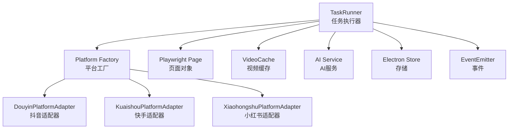
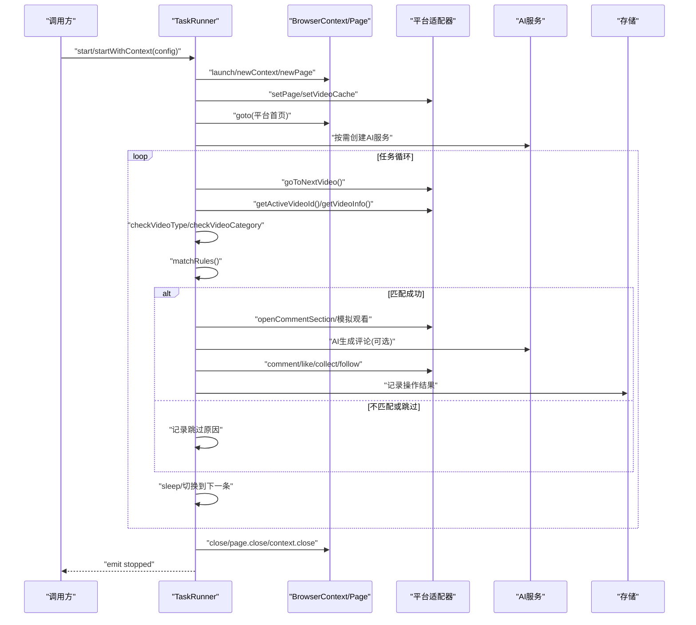
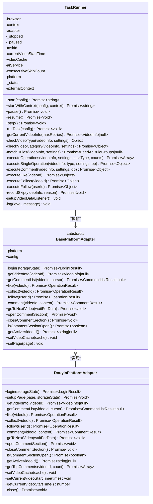
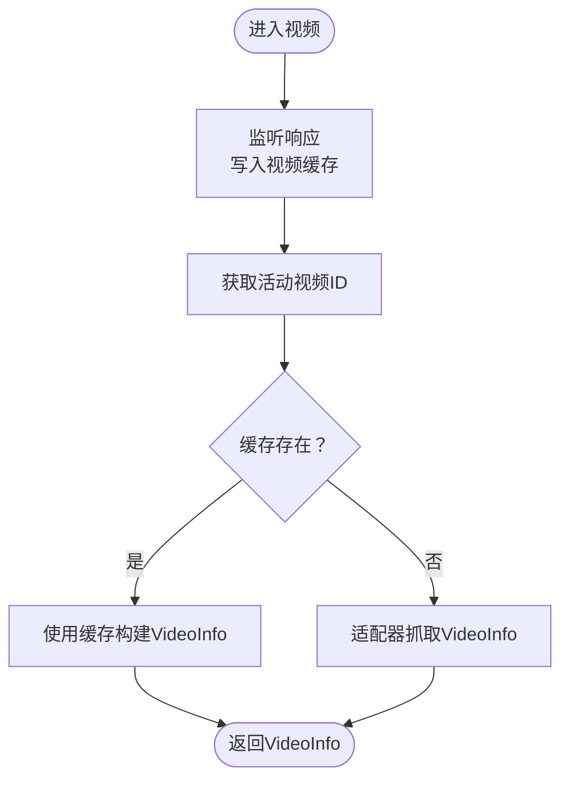
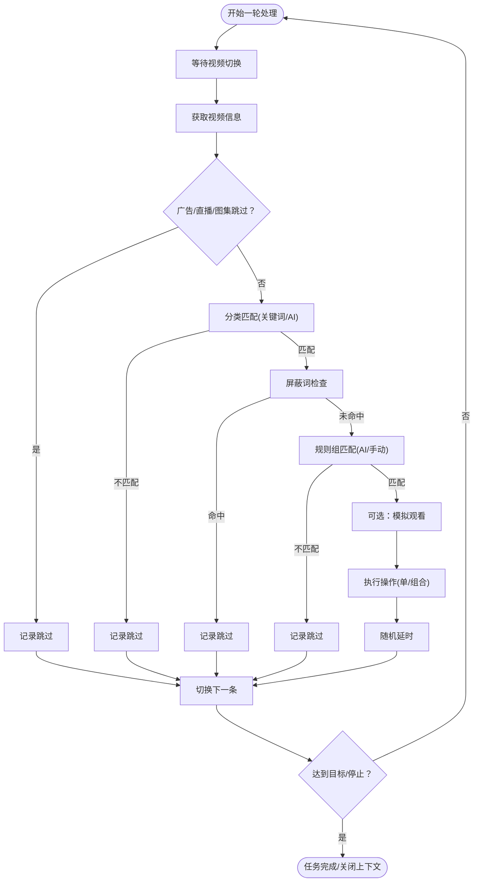
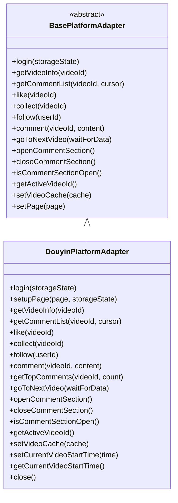
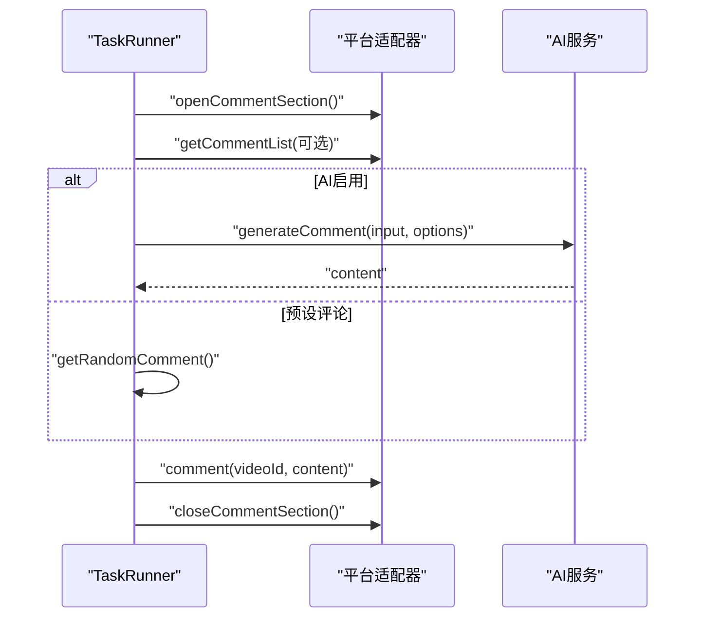
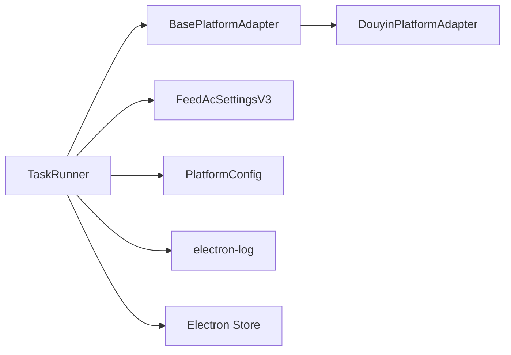

# 任务执行器

<cite>
**本文引用的文件**
- [src/main/service/task-runner.ts](file://src/main/service/task-runner.ts)
- [src/main/platform/base.ts](file://src/main/platform/base.ts)
- [src/main/platform/factory.ts](file://src/main/platform/factory.ts)
- [src/main/platform/douyin/index.ts](file://src/main/platform/douyin/index.ts)
- [src/shared/platform.ts](file://src/shared/platform.ts)
- [src/shared/feed-ac-setting.ts](file://src/shared/feed-ac-setting.ts)
</cite>

## 目录
1. [简介](#简介)
2. [项目结构](#项目结构)
3. [核心组件](#核心组件)
4. [架构总览](#架构总览)
5. [详细组件分析](#详细组件分析)
6. [依赖关系分析](#依赖关系分析)
7. [性能考量](#性能考量)
8. [故障排除指南](#故障排除指南)
9. [结论](#结论)
10. [附录](#附录)

## 简介
本文件面向“任务执行器（TaskRunner）”的技术文档，系统性阐述其设计与实现，覆盖浏览器自动化流程、视频数据采集机制、任务调度算法、错误处理策略、任务生命周期、视频缓存机制、适配器模式应用、AI服务集成与操作执行逻辑。文档同时提供可操作的配置与使用建议、性能优化要点与常见问题排查方法。

## 项目结构
围绕任务执行器的关键文件组织如下：
- 任务执行器：负责任务生命周期管理、浏览器启动与上下文维护、页面导航、事件监听、规则匹配、操作执行与状态上报。
- 平台适配层：抽象出平台无关的适配器接口，并针对抖音等平台提供具体实现；统一管理选择器、键盘快捷键、API端点等配置。
- 配置模型：定义平台常量、平台配置、任务类型、规则组、设置项等，支撑任务运行参数与行为控制。
- 设置迁移：提供从旧版本设置到新版本设置的迁移工具，确保向后兼容。

图表来源
- [src/main/service/task-runner.ts:55-113](file://src/main/service/task-runner.ts#L55-L113)
- [src/main/platform/factory.ts:7-18](file://src/main/platform/factory.ts#L7-L18)
- [src/main/platform/douyin/index.ts:56-67](file://src/main/platform/douyin/index.ts#L56-L67)

章节来源
- [src/main/service/task-runner.ts:55-113](file://src/main/service/task-runner.ts#L55-L113)
- [src/main/platform/factory.ts:7-18](file://src/main/platform/factory.ts#L7-L18)
- [src/shared/platform.ts:88-200](file://src/shared/platform.ts#L88-L200)

## 核心组件
- 任务执行器（TaskRunner）
  - 负责启动/暂停/恢复/停止任务，维护任务状态与计数，驱动主循环，执行规则匹配与操作。
  - 提供两种启动模式：独立浏览器实例与共享上下文（并行多任务）。
  - 内置事件发射，用于进度、动作、暂停/恢复/停止等通知。
- 平台适配器（BasePlatformAdapter/DouyinPlatformAdapter）
  - 抽象平台差异，统一登录、视频信息获取、评论区交互、点赞/收藏/关注、切片视频等能力。
  - 维护页面对象、选择器与键盘快捷键、视频缓存。
- 平台工厂（createPlatformAdapter）
  - 根据平台枚举创建对应适配器实例，保证扩展性与一致性。
- 配置与规则（FeedAcSettingsV3、FeedAcRuleGroups、PlatformConfig）
  - 定义任务类型、规则组、屏蔽词、AI评论开关、操作概率与上限、视频类型跳过策略、等待时间等。
- 存储与日志
  - 使用 Electron Store 持久化认证状态；使用 electron-log 输出日志并广播进度事件。

章节来源
- [src/main/service/task-runner.ts:25-50](file://src/main/service/task-runner.ts#L25-L50)
- [src/main/platform/base.ts:24-80](file://src/main/platform/base.ts#L24-L80)
- [src/main/platform/factory.ts:7-18](file://src/main/platform/factory.ts#L7-L18)
- [src/shared/feed-ac-setting.ts:37-70](file://src/shared/feed-ac-setting.ts#L37-L70)
- [src/shared/platform.ts:88-200](file://src/shared/platform.ts#L88-L200)

## 架构总览
TaskRunner 以事件驱动为核心，结合 Playwright 的页面与响应拦截，实现“监听视频流—匹配规则—执行操作”的闭环。平台适配器封装各平台差异，统一对外接口；AI 服务可选集成，增强内容识别与评论生成。

图表来源
- [src/main/service/task-runner.ts:55-113](file://src/main/service/task-runner.ts#L55-L113)
- [src/main/platform/douyin/index.ts:379-404](file://src/main/platform/douyin/index.ts#L379-L404)
- [src/main/platform/base.ts:40-43](file://src/main/platform/base.ts#L40-L43)

## 详细组件分析

### 任务执行器（TaskRunner）设计与实现
- 生命周期与状态
  - 状态机：running/paused/stopped/completed/failed，支持暂停/恢复/停止。
  - 事件：progress/action/paused/resumed/stopped，便于上层监控与日志。
- 浏览器与上下文
  - 支持独立启动浏览器与共享上下文；根据是否外部传入上下文决定是否关闭浏览器实例。
  - 登录态持久化：任务结束保存 storageState，下次可复用。
- 视频数据采集
  - 响应拦截：监听平台 feed 接口，将视频列表写入共享 Map 缓存，供后续读取。
  - 读取策略：优先从缓存取，缺失则回退到适配器抓取；并清理已消费的缓存项。
- 任务调度算法
  - 固定目标：maxCount 控制完成次数；循环直到达到目标或被停止。
  - 暂停/恢复：内部 while 循环轮询暂停标志，避免阻塞。
  - 连续跳过保护：超过阈值自动暂停，防止卡死或异常。
  - 随机性：操作概率、随机等待、组合任务首中即停等策略提升自然度。
- 错误处理
  - try/catch 包裹关键路径；网络/解析异常降级；验证码弹窗等待；AI 失败回退。
- AI 集成
  - 按设置启用；支持热门评论参考、风格与长度控制；失败时回退到预设评论池。
- 操作执行
  - 单任务与组合任务两种模式；支持评论/点赞/收藏/关注；组合任务可配置概率与上限。

图表来源
- [src/main/service/task-runner.ts:25-113](file://src/main/service/task-runner.ts#L25-L113)
- [src/main/platform/base.ts:24-80](file://src/main/platform/base.ts#L24-L80)
- [src/main/platform/douyin/index.ts:56-67](file://src/main/platform/douyin/index.ts#L56-L67)

章节来源
- [src/main/service/task-runner.ts:25-113](file://src/main/service/task-runner.ts#L25-L113)
- [src/main/platform/base.ts:24-80](file://src/main/platform/base.ts#L24-L80)
- [src/main/platform/douyin/index.ts:56-67](file://src/main/platform/douyin/index.ts#L56-L67)

### 视频数据采集机制
- 响应拦截
  - 监听 feed 接口响应，解析 aweme_list，批量写入 Map 缓存。
- 读取与回退
  - 优先从缓存取当前视频；若缺失，回退到适配器抓取；消费后清理缓存。
- 等待策略
  - 切换视频后等待新视频 ID 变化与 feed 数据到达，避免空数据导致误判。

图表来源
- [src/main/service/task-runner.ts:160-180](file://src/main/service/task-runner.ts#L160-L180)
- [src/main/platform/douyin/index.ts:136-153](file://src/main/platform/douyin/index.ts#L136-L153)
- [src/main/service/task-runner.ts:373-418](file://src/main/service/task-runner.ts#L373-L418)

章节来源
- [src/main/service/task-runner.ts:160-180](file://src/main/service/task-runner.ts#L160-L180)
- [src/main/platform/douyin/index.ts:136-153](file://src/main/platform/douyin/index.ts#L136-L153)
- [src/main/service/task-runner.ts:373-418](file://src/main/service/task-runner.ts#L373-L418)

### 任务调度算法与规则匹配
- 主循环
  - 每次循环先等待视频切换等待时间；获取视频信息；进行类型/分类/屏蔽词/规则匹配；执行操作；随机延时并切换下一条。
- 规则匹配
  - 支持手动规则（字段+关键字+逻辑关系）与 AI 规则（自定义提示词）；支持规则组嵌套。
- 组合任务
  - 按概率依次尝试多个操作，可配置首中即停策略。

图表来源
- [src/main/service/task-runner.ts:235-371](file://src/main/service/task-runner.ts#L235-L371)
- [src/main/service/task-runner.ts:503-559](file://src/main/service/task-runner.ts#L503-L559)
- [src/main/service/task-runner.ts:561-590](file://src/main/service/task-runner.ts#L561-L590)

章节来源
- [src/main/service/task-runner.ts:235-371](file://src/main/service/task-runner.ts#L235-L371)
- [src/main/service/task-runner.ts:503-559](file://src/main/service/task-runner.ts#L503-L559)
- [src/main/service/task-runner.ts:561-590](file://src/main/service/task-runner.ts#L561-L590)

### 适配器模式与平台扩展
- 抽象接口
  - 统一登录、视频信息、评论列表、点赞/收藏/关注、评论、切片视频、评论区开合等接口。
- 抖音适配器
  - 基于键盘快捷键与选择器驱动；监听 feed 与评论相关 API；提供热门评论提取与验证码弹窗处理。
- 工厂函数
  - 根据平台枚举创建对应适配器，便于扩展新平台。

图表来源
- [src/main/platform/base.ts:24-80](file://src/main/platform/base.ts#L24-L80)
- [src/main/platform/douyin/index.ts:56-67](file://src/main/platform/douyin/index.ts#L56-L67)

章节来源
- [src/main/platform/base.ts:24-80](file://src/main/platform/base.ts#L24-L80)
- [src/main/platform/douyin/index.ts:56-67](file://src/main/platform/douyin/index.ts#L56-L67)

### AI 服务集成与评论生成
- 启用条件
  - 全局 AI 设置开启且任务允许 AI 评论；可按操作单独启用。
- 输入与输出
  - 输入：作者名、视频描述、标签、热门评论参考；输出：生成的评论文本。
- 回退策略
  - AI 失败时回退到预设评论池；热门评论不足时可判定为活跃度不足而跳过评论。

图表来源
- [src/main/service/task-runner.ts:614-679](file://src/main/service/task-runner.ts#L614-L679)
- [src/main/platform/douyin/index.ts:185-193](file://src/main/platform/douyin/index.ts#L185-L193)

章节来源
- [src/main/service/task-runner.ts:614-679](file://src/main/service/task-runner.ts#L614-L679)
- [src/main/platform/douyin/index.ts:185-193](file://src/main/platform/douyin/index.ts#L185-L193)

### 配置与使用示例（路径指引）
- 配置结构
  - 任务类型：comment/like/collect/follow/watch/combo
  - 规则组：支持手动规则与 AI 规则，支持嵌套与逻辑关系
  - 屏蔽词：描述关键词与作者关键词
  - AI 评论：参考条数、风格、最大长度、提示词
  - 操作：概率、最大次数、是否启用 AI
  - 视频类型跳过：广告/直播/图集
  - 运行参数：最大次数、连续跳过阈值、视频切换等待时间
- 使用步骤（路径指引）
  - 启动任务：[start:55-113](file://src/main/service/task-runner.ts#L55-L113)
  - 使用共享上下文：[startWithContext:118-156](file://src/main/service/task-runner.ts#L118-L156)
  - 规则匹配：[matchRules/matchRuleGroup:503-559](file://src/main/service/task-runner.ts#L503-L559)
  - 操作执行：[executeOperations/executeSingleOperation:561-612](file://src/main/service/task-runner.ts#L561-L612)
  - 评论生成：[executeComment:614-679](file://src/main/service/task-runner.ts#L614-L679)
  - 平台适配器：[DouyinPlatformAdapter:56-67](file://src/main/platform/douyin/index.ts#L56-L67)
  - 平台工厂：[createPlatformAdapter:7-18](file://src/main/platform/factory.ts#L7-L18)
  - 设置模型：[FeedAcSettingsV3:37-70](file://src/shared/feed-ac-setting.ts#L37-L70)

章节来源
- [src/shared/feed-ac-setting.ts:37-70](file://src/shared/feed-ac-setting.ts#L37-L70)
- [src/main/service/task-runner.ts:55-113](file://src/main/service/task-runner.ts#L55-L113)
- [src/main/service/task-runner.ts:503-559](file://src/main/service/task-runner.ts#L503-L559)
- [src/main/service/task-runner.ts:561-612](file://src/main/service/task-runner.ts#L561-L612)
- [src/main/service/task-runner.ts:614-679](file://src/main/service/task-runner.ts#L614-L679)
- [src/main/platform/douyin/index.ts:56-67](file://src/main/platform/douyin/index.ts#L56-L67)
- [src/main/platform/factory.ts:7-18](file://src/main/platform/factory.ts#L7-L18)

## 依赖关系分析
- 组件耦合
  - TaskRunner 依赖平台适配器与设置模型；适配器依赖平台配置与 Playwright 页面。
  - 事件驱动降低耦合，便于扩展与测试。
- 外部依赖
  - Playwright：浏览器自动化与页面交互
  - Electron Store：本地存储
  - electron-log：日志与进度事件
- 潜在循环依赖
  - 当前结构清晰，无明显循环依赖；平台工厂仅创建实例，不反向依赖 TaskRunner。

图表来源
- [src/main/service/task-runner.ts:25-50](file://src/main/service/task-runner.ts#L25-L50)
- [src/main/platform/base.ts:24-80](file://src/main/platform/base.ts#L24-L80)
- [src/main/platform/douyin/index.ts:56-67](file://src/main/platform/douyin/index.ts#L56-L67)
- [src/shared/feed-ac-setting.ts:37-70](file://src/shared/feed-ac-setting.ts#L37-L70)
- [src/shared/platform.ts:88-200](file://src/shared/platform.ts#L88-L200)

章节来源
- [src/main/service/task-runner.ts:25-50](file://src/main/service/task-runner.ts#L25-L50)
- [src/main/platform/base.ts:24-80](file://src/main/platform/base.ts#L24-L80)
- [src/main/platform/douyin/index.ts:56-67](file://src/main/platform/douyin/index.ts#L56-L67)
- [src/shared/feed-ac-setting.ts:37-70](file://src/shared/feed-ac-setting.ts#L37-L70)
- [src/shared/platform.ts:88-200](file://src/shared/platform.ts#L88-L200)

## 性能考量
- 视频缓存命中率
  - 通过响应拦截提前填充缓存，减少重复抓取；注意及时清理已消费项，避免内存膨胀。
- 切换等待与随机延时
  - 合理设置视频切换等待时间与随机延时，平衡吞吐与稳定性。
- 组合任务概率
  - 通过概率与首中即停策略控制整体节奏，避免过于频繁的操作。
- AI 调用频率
  - 仅在必要时调用 AI，失败回退到本地预设，降低外部依赖风险。
- 并行多任务
  - 使用共享上下文模式可提升资源利用率，但需谨慎处理并发状态与验证码弹窗。

## 故障排除指南
- 无法获取视频信息
  - 检查 feed 监听是否生效；确认缓存是否被正确填充；必要时回退到适配器抓取。
- 评论发布失败
  - 关注验证码弹窗等待；检查评论输入框定位；确认网络响应解析。
- AI 生成失败
  - 检查 API 密钥与模型配置；适当降低请求频率；启用回退评论池。
- 任务长时间暂停
  - 检查连续跳过阈值与屏蔽词配置；查看日志中的跳过原因。
- 登录态丢失
  - 确认 storageState 持久化与加载逻辑；必要时重新登录。

章节来源
- [src/main/service/task-runner.ts:106-110](file://src/main/service/task-runner.ts#L106-L110)
- [src/main/platform/douyin/index.ts:335-342](file://src/main/platform/douyin/index.ts#L335-L342)
- [src/main/service/task-runner.ts:667-670](file://src/main/service/task-runner.ts#L667-L670)

## 结论
TaskRunner 通过事件驱动与适配器模式，实现了跨平台、可扩展、可配置的任务自动化执行框架。其内置的视频缓存、规则匹配、AI 集成与稳健的错误处理，使其在复杂场景下仍能保持稳定与高效。建议在生产环境中结合日志与事件监控，持续优化规则与参数，以获得最佳效果。

## 附录
- 平台配置与选择器
  - 参考：[PLATFORM_CONFIGS:88-200](file://src/shared/platform.ts#L88-L200)
- 默认设置与迁移
  - 参考：[getDefaultFeedAcSettingsV3/migrateToV3:88-145](file://src/shared/feed-ac-setting.ts#L88-L145)
- 任务类型与操作映射
  - 参考：[TaskType/操作名称映射:723-744](file://src/main/service/task-runner.ts#L723-L744)