# 任务执行器

<cite>
**本文引用的文件**
- [src/main/service/task-runner.ts](file://src/main/service/task-runner.ts)
- [src/main/service/task-manager.ts](file://src/main/service/task-manager.ts)
- [src/main/platform/base.ts](file://src/main/platform/base.ts)
- [src/main/platform/factory.ts](file://src/main/platform/factory.ts)
- [src/main/platform/douyin/index.ts](file://src/main/platform/douyin/index.ts)
- [src/shared/platform.ts](file://src/shared/platform.ts)
- [src/shared/feed-ac-setting.ts](file://src/shared/feed-ac-setting.ts)
- [src/shared/task-history.ts](file://src/shared/task-history.ts)
</cite>

## 更新摘要
**变更内容**
- 新增外部上下文支持，允许TaskRunner使用外部传入的BrowserContext进行并行任务执行
- 增强状态跟踪系统，包括详细的视频操作记录和任务历史记录
- 改进错误处理机制，提供更好的异常管理和状态恢复
- 优化并发任务管理，支持更精细的并发控制和资源管理
- 新增视频记录和历史追踪功能，便于任务监控和审计

## 目录
1. [简介](#简介)
2. [项目结构](#项目结构)
3. [核心组件](#核心组件)
4. [架构总览](#架构总览)
5. [详细组件分析](#详细组件分析)
6. [外部上下文支持](#外部上下文支持)
7. [增强的状态跟踪系统](#增强的状态跟踪系统)
8. [改进的错误处理机制](#改进的错误处理机制)
9. [并发任务执行系统](#并发任务执行系统)
10. [智能队列机制](#智能队列机制)
11. [依赖关系分析](#依赖关系分析)
12. [性能考量](#性能考量)
13. [故障排除指南](#故障排除指南)
14. [结论](#结论)
15. [附录](#附录)

## 简介
本文件面向"任务执行器（TaskRunner）"的技术文档，系统性阐述其设计与实现，覆盖浏览器自动化流程、视频数据采集机制、任务调度算法、错误处理策略、任务生命周期、视频缓存机制、适配器模式应用、AI服务集成与操作执行逻辑。文档同时提供可操作的配置与使用建议、性能优化要点与常见问题排查方法。

**更新** 本版本新增了外部上下文支持、增强的状态跟踪系统、改进的错误处理机制和优化的并发任务管理，实现了从单一任务执行到企业级并发任务管理的全面升级。

## 项目结构
围绕任务执行器的关键文件组织如下：
- 任务执行器：负责任务生命周期管理、浏览器启动与上下文维护、页面导航、事件监听、规则匹配、操作执行与状态上报。
- 任务管理器：新增的并发任务管理系统，负责任务队列管理、并发控制、账号策略控制、定时任务调度和资源管理。
- 平台适配层：抽象出平台无关的适配器接口，并针对抖音等平台提供具体实现；统一管理选择器、键盘快捷键、API端点等配置。
- 配置模型：定义平台常量、平台配置、任务类型、规则组、设置项等，支撑任务运行参数与行为控制。
- 设置迁移：提供从旧版本设置到新版本设置的迁移工具，确保向后兼容。
- 历史记录：新增视频操作记录和任务历史追踪功能，支持任务审计和统计分析。

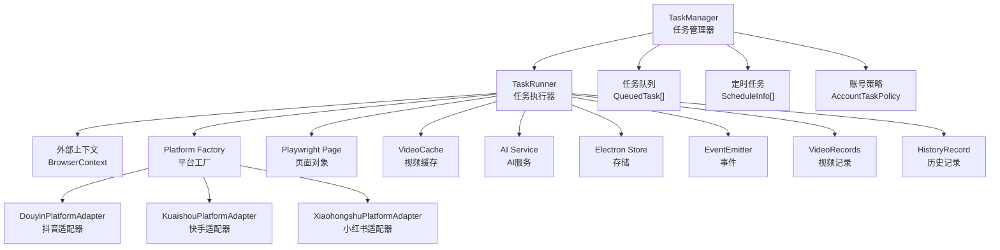

**图表来源**
- [src/main/service/task-manager.ts:49-59](file://src/main/service/task-manager.ts#L49-L59)
- [src/main/service/task-runner.ts:27-50](file://src/main/service/task-runner.ts#L27-L50)
- [src/main/platform/factory.ts:7-18](file://src/main/platform/factory.ts#L7-L18)
- [src/main/platform/douyin/index.ts:60-71](file://src/main/platform/douyin/index.ts#L60-L71)
- [src/shared/task-history.ts:18-37](file://src/shared/task-history.ts#L18-L37)

**章节来源**
- [src/main/service/task-runner.ts:27-50](file://src/main/service/task-runner.ts#L27-L50)
- [src/main/service/task-manager.ts:49-59](file://src/main/service/task-manager.ts#L49-L59)
- [src/main/platform/factory.ts:7-18](file://src/main/platform/factory.ts#L7-L18)
- [src/shared/platform.ts:88-200](file://src/shared/platform.ts#L88-L200)
- [src/shared/task-history.ts:18-37](file://src/shared/task-history.ts#L18-L37)

## 核心组件
- 任务执行器（TaskRunner）
  - 负责启动/暂停/恢复/停止任务，维护任务状态与计数，驱动主循环，执行规则匹配与操作。
  - **新增** 支持两种启动模式：独立浏览器实例与共享上下文（并行多任务）。
  - **新增** 详细的视频操作记录和历史追踪功能。
  - 内置事件发射，用于进度、动作、暂停/恢复/停止等通知。
- 任务管理器（TaskManager）
  - **新增** 并发任务管理核心，负责任务队列调度、并发控制、账号策略管理。
  - 支持最大并发数设置、任务排队、智能调度和资源回收。
  - 提供定时任务功能，支持Cron表达式和周期性任务执行。
  - **新增** 任务历史记录持久化和状态跟踪。
- 平台适配器（BasePlatformAdapter/DouyinPlatformAdapter）
  - 抽象平台差异，统一登录、视频信息获取、评论区交互、点赞/收藏/关注、切片视频等能力。
  - 维护页面对象、选择器与键盘快捷键、视频缓存。
- 平台工厂（createPlatformAdapter）
  - 根据平台枚举创建对应适配器实例，保证扩展性与一致性。
- 配置与规则（FeedAcSettingsV3、FeedAcRuleGroups、PlatformConfig）
  - 定义任务类型、规则组、屏蔽词、AI评论开关、操作概率与上限、视频类型跳过策略、等待时间等。
- 存储与日志
  - 使用 Electron Store 持久化认证状态；使用 electron-log 输出日志并广播进度事件。
- **新增** 历史记录系统
  - 支持视频操作记录、任务历史追踪、统计分析和审计功能。

**章节来源**
- [src/main/service/task-runner.ts:27-50](file://src/main/service/task-runner.ts#L27-L50)
- [src/main/service/task-manager.ts:49-59](file://src/main/service/task-manager.ts#L49-L59)
- [src/main/platform/base.ts:24-80](file://src/main/platform/base.ts#L24-L80)
- [src/main/platform/factory.ts:7-18](file://src/main/platform/factory.ts#L7-L18)
- [src/shared/feed-ac-setting.ts:62-97](file://src/shared/feed-ac-setting.ts#L62-L97)
- [src/shared/platform.ts:88-200](file://src/shared/platform.ts#L88-L200)
- [src/shared/task-history.ts:18-37](file://src/shared/task-history.ts#L18-L37)

## 架构总览
TaskRunner 以事件驱动为核心，结合 Playwright 的页面与响应拦截，实现"监听视频流—匹配规则—执行操作"的闭环。TaskManager 作为并发控制中心，管理多个 TaskRunner 实例的生命周期、资源分配和任务调度。平台适配器封装各平台差异，统一对外接口；AI 服务可选集成，增强内容识别与评论生成。**新增** 外部上下文支持使得多个任务可以共享同一个浏览器实例，提高资源利用率。

```mermaid
sequenceDiagram
participant U as "调用方"
participant TM as "TaskManager"
participant TR as "TaskRunner"
participant EC as "External Context"
participant AD as "平台适配器"
participant AI as "AI服务"
U->>TM : "startTask(config, taskName)"
TM->>TM : "检查并发限制"
alt 可以直接启动
TM->>EC : "createContext(browser)"
TM->>TR : "new TaskRunner()"
TR->>TR : "startWithContext(config, context)"
TR->>AD : "setPage/setVideoCache"
TR->>EC : "goto(平台首页)"
TR->>AI : "按需创建AI服务"
loop 任务循环
TR->>AD : "goToNextVideo()"
TR->>AD : "getActiveVideoId()/getVideoInfo()"
TR->>TR : "checkVideoType/checkVideoCategory"
TR->>TR : "matchRules()"
alt 匹配成功
TR->>AD : "openCommentSection/模拟观看"
TR->>AI : "AI生成评论(可选)"
TR->>AD : "comment/like/collect/follow"
TR->>TR : "recordSuccess/recordSkip"
else 不匹配或跳过
TR->>TR : "记录跳过原因"
end
TR->>TR : "sleep/切换到下一条"
end
TR->>EC : "close/page.close(context.close)"
TM->>TM : "processQueue()"
TM-->>U : "emit taskStarted/taskStopped"
```

**图表来源**
- [src/main/service/task-manager.ts:180-259](file://src/main/service/task-manager.ts#L180-L259)
- [src/main/service/task-runner.ts:162-207](file://src/main/service/task-runner.ts#L162-L207)
- [src/main/platform/douyin/index.ts:131-138](file://src/main/platform/douyin/index.ts#L131-L138)
- [src/main/platform/base.ts:40-43](file://src/main/platform/base.ts#L40-L43)

## 详细组件分析

### 任务执行器（TaskRunner）设计与实现
- 生命周期与状态
  - 状态机：running/paused/stopped/completed/failed，支持暂停/恢复/停止。
  - 事件：progress/action/paused/resumed/stopped，便于上层监控与日志。
  - **新增** 详细的视频操作记录和历史追踪功能。
- 浏览器与上下文
  - **新增** 支持独立启动浏览器与共享上下文；根据是否外部传入上下文决定是否关闭浏览器实例。
  - **新增** 外部上下文模式下，任务完成后只关闭页面和上下文，不关闭共享浏览器实例。
  - 登录态持久化：任务结束保存 storageState，下次可复用。
- 视频数据采集
  - 响应拦截：监听平台 feed 接口，将视频列表写入共享 Map 缓存，供后续读取。
  - 读取策略：优先从缓存取，缺失则回退到适配器抓取；并清理已消费的缓存项。
- 任务调度算法
  - 固定目标：maxCount 控制完成次数；循环直到达到目标或被停止。
  - 暂停/恢复：内部 while 循环轮询暂停标志，避免阻塞。
  - 连续跳过保护：超过阈值自动暂停，防止卡死或异常。
  - 随机性：操作概率、随机等待、组合任务首中即停等策略提升自然度。
- **新增** 错误处理
  - try/catch 包裹关键路径；网络/解析异常降级；验证码弹窗等待；AI 失败回退。
  - **新增** 更好的状态管理和错误恢复机制。
- AI 集成
  - 按设置启用；支持热门评论参考、风格与长度控制；失败时回退到预设评论池。
- 操作执行
  - 单任务与组合任务两种模式；支持评论/点赞/收藏/关注；组合任务可配置概率与上限。
- **新增** 视频记录与历史追踪
  - 详细的视频操作记录，包括成功和跳过的视频。
  - 任务历史记录持久化，支持统计分析和审计。

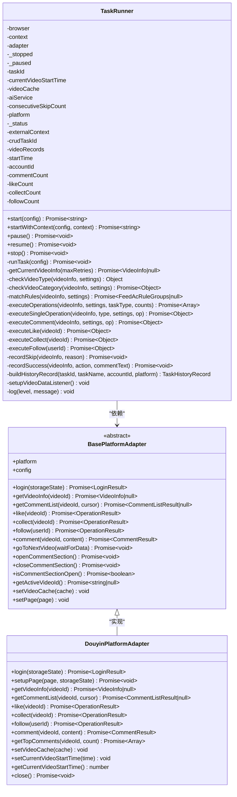

**图表来源**
- [src/main/service/task-runner.ts:27-50](file://src/main/service/task-runner.ts#L27-L50)
- [src/main/platform/base.ts:24-80](file://src/main/platform/base.ts#L24-L80)
- [src/main/platform/douyin/index.ts:60-71](file://src/main/platform/douyin/index.ts#L60-L71)

**章节来源**
- [src/main/service/task-runner.ts:27-50](file://src/main/service/task-runner.ts#L27-L50)
- [src/main/platform/base.ts:24-80](file://src/main/platform/base.ts#L24-L80)
- [src/main/platform/douyin/index.ts:60-71](file://src/main/platform/douyin/index.ts#L60-L71)

### 视频数据采集机制
- 响应拦截
  - 监听 feed 接口响应，解析 aweme_list，批量写入 Map 缓存。
- 读取与回退
  - 优先从缓存取当前视频；若缺失，回退到适配器抓取；消费后清理缓存。
- 等待策略
  - 切换视频后等待新视频 ID 变化与 feed 数据到达，避免空数据导致误判。


**图表来源**
- [src/main/service/task-runner.ts:453-512](file://src/main/service/task-runner.ts#L453-L512)
- [src/main/platform/douyin/index.ts:140-160](file://src/main/platform/douyin/index.ts#L140-L160)
- [src/main/service/task-runner.ts:211-238](file://src/main/service/task-runner.ts#L211-L238)

**章节来源**
- [src/main/service/task-runner.ts:453-512](file://src/main/service/task-runner.ts#L453-L512)
- [src/main/platform/douyin/index.ts:140-160](file://src/main/platform/douyin/index.ts#L140-L160)
- [src/main/service/task-runner.ts:211-238](file://src/main/service/task-runner.ts#L211-L238)

### 任务调度算法与规则匹配
- 主循环
  - 每次循环先等待视频切换等待时间；获取视频信息；进行类型/分类/屏蔽词/规则匹配；执行操作；随机延时并切换下一条。
- 规则匹配
  - 支持手动规则（字段+关键字+逻辑关系）与 AI 规则（自定义提示词）；支持规则组嵌套。
- 组合任务
  - 按概率依次尝试多个操作，可配置首中即停策略。

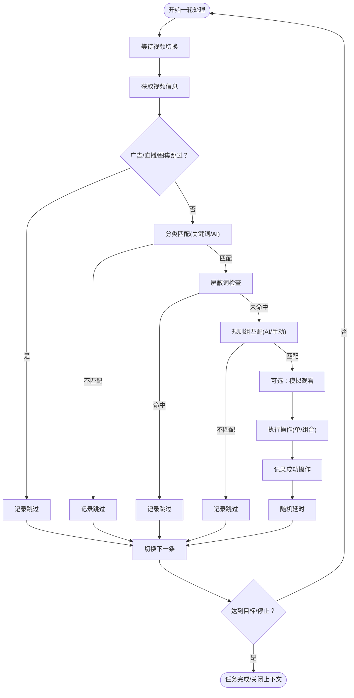

**图表来源**
- [src/main/service/task-runner.ts:293-451](file://src/main/service/task-runner.ts#L293-L451)
- [src/main/service/task-runner.ts:699-755](file://src/main/service/task-runner.ts#L699-L755)
- [src/main/service/task-runner.ts:757-808](file://src/main/service/task-runner.ts#L757-L808)

**章节来源**
- [src/main/service/task-runner.ts:293-451](file://src/main/service/task-runner.ts#L293-L451)
- [src/main/service/task-runner.ts:699-755](file://src/main/service/task-runner.ts#L699-L755)
- [src/main/service/task-runner.ts:757-808](file://src/main/service/task-runner.ts#L757-L808)

### 适配器模式与平台扩展
- 抽象接口
  - 统一登录、视频信息、评论列表、点赞/收藏/关注、评论、切片视频、评论区开合等接口。
- 抖音适配器
  - 基于键盘快捷键与选择器驱动；监听 feed 与评论相关 API；提供热门评论提取与验证码弹窗处理。
- 工厂函数
  - 根据平台枚举创建对应适配器，便于扩展新平台。

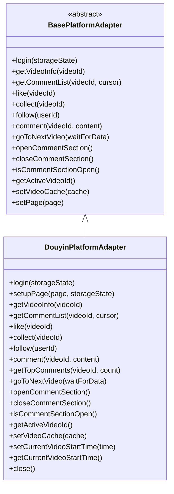

**图表来源**
- [src/main/platform/base.ts:24-80](file://src/main/platform/base.ts#L24-L80)
- [src/main/platform/douyin/index.ts:60-71](file://src/main/platform/douyin/index.ts#L60-L71)

**章节来源**
- [src/main/platform/base.ts:24-80](file://src/main/platform/base.ts#L24-L80)
- [src/main/platform/douyin/index.ts:60-71](file://src/main/platform/douyin/index.ts#L60-L71)

### AI 服务集成与评论生成
- 启用条件
  - 全局 AI 设置开启且任务允许 AI 评论；可按操作单独启用。
- 输入与输出
  - 输入：作者名、视频描述、标签、热门评论参考；输出：生成的评论文本。
- 回退策略
  - AI 失败时回退到预设评论池；热门评论不足时可判定为活跃度不足而跳过评论。

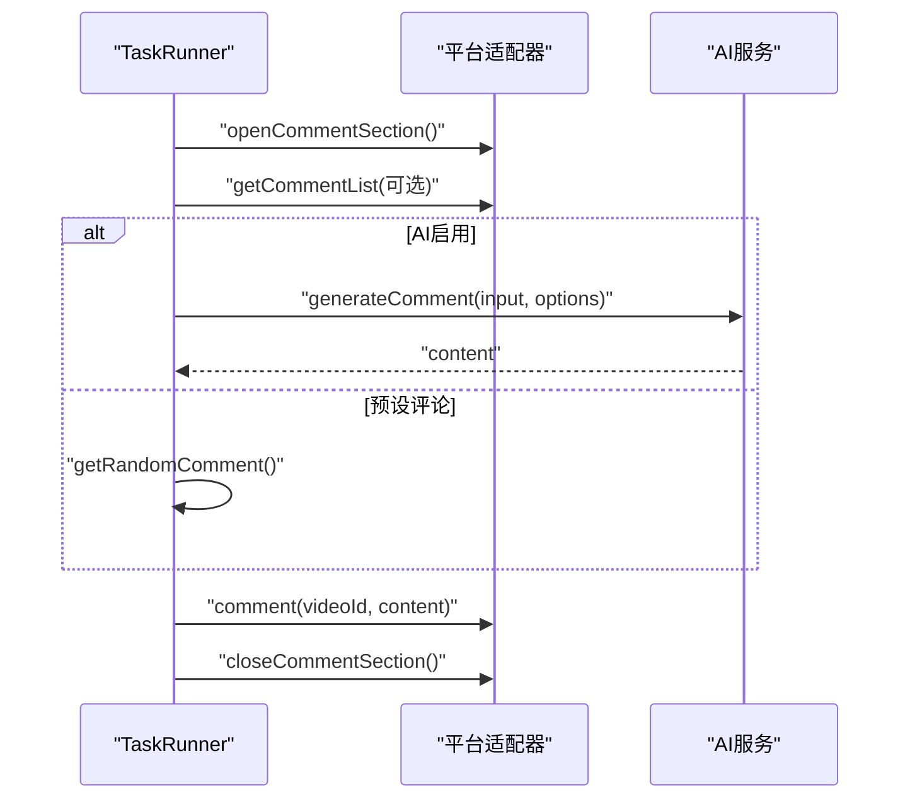

**图表来源**
- [src/main/service/task-runner.ts:810-881](file://src/main/service/task-runner.ts#L810-L881)
- [src/main/platform/douyin/index.ts:191-200](file://src/main/platform/douyin/index.ts#L191-L200)

**章节来源**
- [src/main/service/task-runner.ts:810-881](file://src/main/service/task-runner.ts#L810-L881)
- [src/main/platform/douyin/index.ts:191-200](file://src/main/platform/douyin/index.ts#L191-L200)

### 配置与使用示例（路径指引）
- 配置结构
  - 任务类型：comment/like/collect/follow/watch/combo
  - 规则组：支持手动规则与 AI 规则，支持嵌套与逻辑关系
  - 屏蔽词：描述关键词与作者关键词
  - AI 评论：参考条数、风格、最大长度、提示词
  - 操作：概率、最大次数、是否启用 AI
  - 视频类型跳过：广告/直播/图集
  - 运行参数：最大次数、连续跳过阈值、视频切换等待时间
- 使用步骤（路径指引）
  - 启动任务：[start:73-157](file://src/main/service/task-runner.ts#L73-L157)
  - **新增** 使用共享上下文：[startWithContext:162-207](file://src/main/service/task-runner.ts#L162-L207)
  - 规则匹配：[matchRules/matchRuleGroup:699-755](file://src/main/service/task-runner.ts#L699-L755)
  - 操作执行：[executeOperations/executeSingleOperation:757-808](file://src/main/service/task-runner.ts#L757-L808)
  - 评论生成：[executeComment:810-881](file://src/main/service/task-runner.ts#L810-L881)
  - 平台适配器：[DouyinPlatformAdapter:60-71](file://src/main/platform/douyin/index.ts#L60-L71)
  - 平台工厂：[createPlatformAdapter:7-18](file://src/main/platform/factory.ts#L7-L18)
  - 设置模型：[FeedAcSettingsV3:62-97](file://src/shared/feed-ac-setting.ts#L62-L97)

**章节来源**
- [src/shared/feed-ac-setting.ts:62-97](file://src/shared/feed-ac-setting.ts#L62-L97)
- [src/main/service/task-runner.ts:73-157](file://src/main/service/task-runner.ts#L73-L157)
- [src/main/service/task-runner.ts:699-755](file://src/main/service/task-runner.ts#L699-L755)
- [src/main/service/task-runner.ts:757-808](file://src/main/service/task-runner.ts#L757-L808)
- [src/main/service/task-runner.ts:810-881](file://src/main/service/task-runner.ts#L810-L881)
- [src/main/platform/douyin/index.ts:60-71](file://src/main/platform/douyin/index.ts#L60-L71)
- [src/main/platform/factory.ts:7-18](file://src/main/platform/factory.ts#L7-L18)

## 外部上下文支持

### 外部上下文模式设计
TaskRunner 现在支持两种启动模式，其中外部上下文模式是本次更新的重要特性：

- **独立模式** (`start`方法)
  - 自动创建新的浏览器实例和上下文
  - 任务完成后会关闭浏览器实例
  - 适用于单任务执行场景

- **共享上下文模式** (`startWithContext`方法)
  - 使用外部传入的 BrowserContext
  - 任务完成后只关闭页面和上下文，不关闭共享浏览器实例
  - 支持并行多任务执行，提高资源利用率

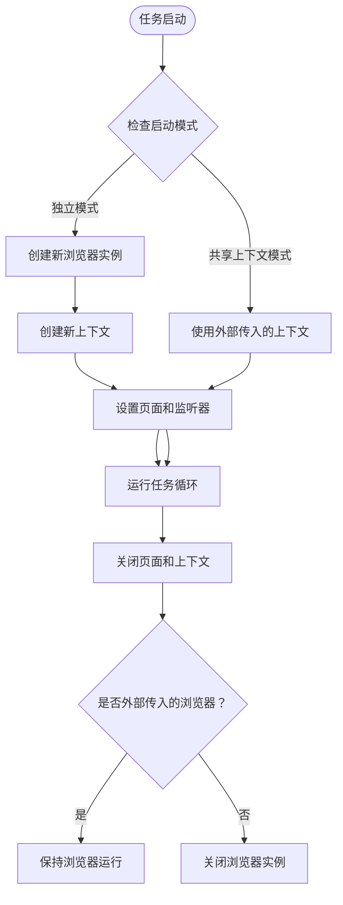

**图表来源**
- [src/main/service/task-runner.ts:73-157](file://src/main/service/task-runner.ts#L73-L157)
- [src/main/service/task-runner.ts:162-207](file://src/main/service/task-runner.ts#L162-L207)
- [src/main/service/task-runner.ts:270-291](file://src/main/service/task-runner.ts#L270-L291)

**章节来源**
- [src/main/service/task-runner.ts:73-157](file://src/main/service/task-runner.ts#L73-L157)
- [src/main/service/task-runner.ts:162-207](file://src/main/service/task-runner.ts#L162-L207)
- [src/main/service/task-runner.ts:270-291](file://src/main/service/task-runner.ts#L270-L291)

### 外部上下文的优势
- **资源优化**：多个任务共享同一个浏览器实例，减少内存占用
- **性能提升**：避免重复启动浏览器的成本
- **状态共享**：多个任务可以共享登录状态和缓存数据
- **并发控制**：通过 TaskManager 的并发控制机制，确保任务间的资源隔离

**章节来源**
- [src/main/service/task-runner.ts:162-207](file://src/main/service/task-runner.ts#L162-L207)
- [src/main/service/task-manager.ts:113-129](file://src/main/service/task-manager.ts#L113-L129)

## 增强的状态跟踪系统

### 视频操作记录
TaskRunner 现在提供了详细的视频操作记录功能，包括成功操作和跳过原因的完整追踪：

- **视频记录结构**
  - 视频基本信息：ID、作者、描述、标签、分享链接
  - 操作状态：点赞、收藏、关注、评论标记
  - 时间信息：观看时长、记录时间戳
  - 跳过原因：详细的跳过原因说明

- **记录策略**
  - 成功操作：更新现有记录或创建新记录
  - 跳过操作：记录跳过原因和详细信息
  - 实时更新：每次操作后立即更新记录

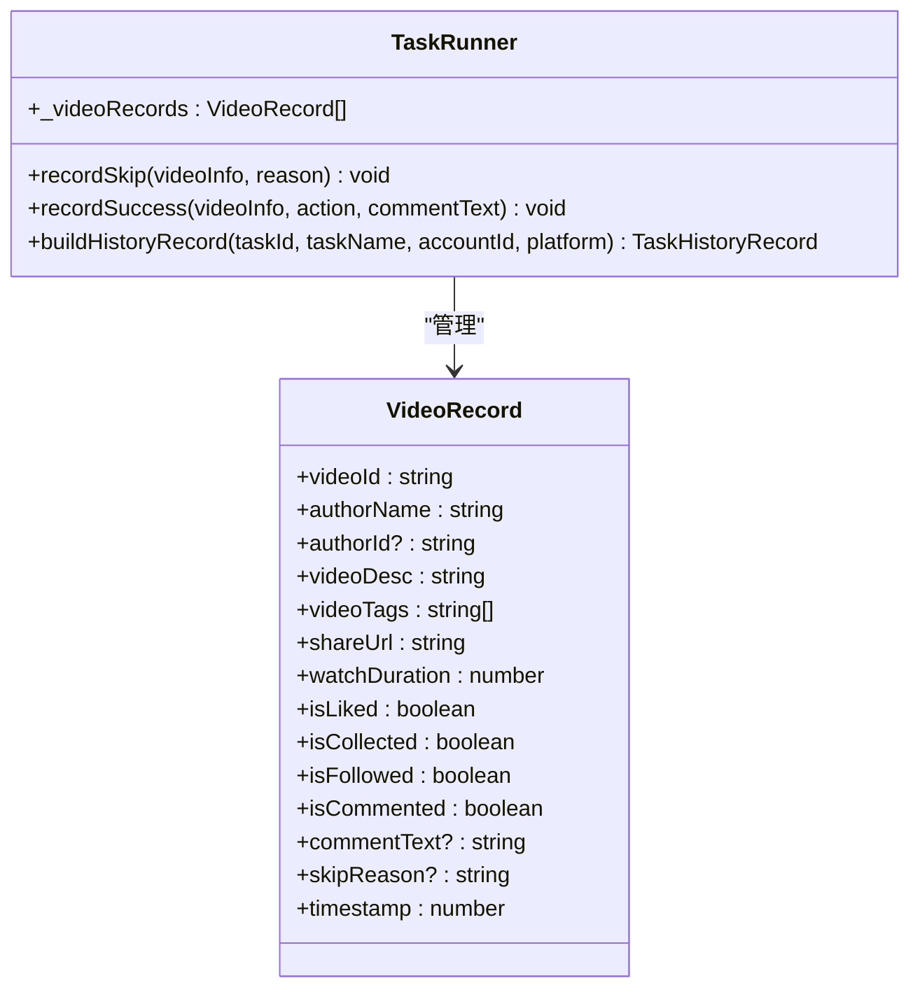

**图表来源**
- [src/shared/task-history.ts:1-16](file://src/shared/task-history.ts#L1-L16)
- [src/main/service/task-runner.ts:903-966](file://src/main/service/task-runner.ts#L903-L966)

**章节来源**
- [src/shared/task-history.ts:1-16](file://src/shared/task-history.ts#L1-L16)
- [src/main/service/task-runner.ts:903-966](file://src/main/service/task-runner.ts#L903-L966)

### 任务历史记录
TaskRunner 提供了完整的任务历史记录功能，支持任务审计和统计分析：

- **历史记录结构**
  - 基本信息：任务ID、任务名称、账号关联、平台标识
  - 时间信息：开始时间、结束时间、状态
  - 统计信息：各类操作的数量统计
  - 详细记录：完整的视频操作记录数组

- **持久化存储**
  - 使用 Electron Store 进行本地持久化
  - 支持任务详情查看和状态更新
  - 自动去重和时间戳管理

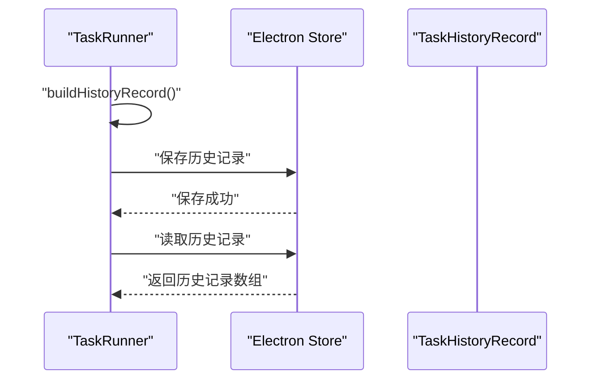

**图表来源**
- [src/main/service/task-runner.ts:971-988](file://src/main/service/task-runner.ts#L971-L988)
- [src/main/ipc/task-detail.ts:6-39](file://src/main/ipc/task-detail.ts#L6-L39)

**章节来源**
- [src/main/service/task-runner.ts:971-988](file://src/main/service/task-runner.ts#L971-L988)
- [src/main/ipc/task-detail.ts:6-39](file://src/main/ipc/task-detail.ts#L6-L39)

## 改进的错误处理机制

### 错误处理策略
TaskRunner 现在提供了更完善的错误处理机制，包括：

- **账号状态检查**
  - 任务开始前检查账号是否存在
  - 验证账号登录状态是否有效
  - 提供明确的错误信息和状态码

- **异常捕获与恢复**
  - 任务循环中的异常捕获
  - 自动状态恢复和清理
  - 详细的错误日志记录

- **验证码处理**
  - 智能验证码检测
  - 自动刷新和状态恢复
  - 验证码处理后的特殊处理逻辑

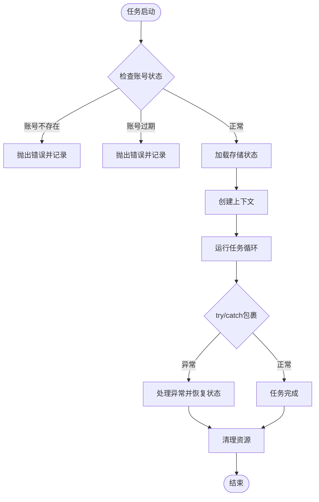

**图表来源**
- [src/main/service/task-runner.ts:92-122](file://src/main/service/task-runner.ts#L92-L122)
- [src/main/service/task-runner.ts:150-154](file://src/main/service/task-runner.ts#L150-L154)
- [src/main/service/task-runner.ts:873-876](file://src/main/service/task-runner.ts#L873-L876)

**章节来源**
- [src/main/service/task-runner.ts:92-122](file://src/main/service/task-runner.ts#L92-L122)
- [src/main/service/task-runner.ts:150-154](file://src/main/service/task-runner.ts#L150-L154)
- [src/main/service/task-runner.ts:873-876](file://src/main/service/task-runner.ts#L873-L876)

### 状态管理改进
- **状态机完善**
  - 更清晰的状态转换逻辑
  - 完整的状态枚举定义
  - 状态变化的事件通知

- **资源清理**
  - 更可靠的资源清理机制
  - 外部上下文模式下的资源管理
  - 异常情况下的强制清理

**章节来源**
- [src/main/service/task-runner.ts:25-26](file://src/main/service/task-runner.ts#L25-L26)
- [src/main/service/task-runner.ts:270-291](file://src/main/service/task-runner.ts#L270-L291)

## 并发任务执行系统

### TaskManager 设计与实现
TaskManager 是新增的核心并发控制系统，负责管理多个 TaskRunner 实例的生命周期、资源分配和任务调度。

- 并发控制
  - 最大并发数限制：通过 `maxConcurrency` 控制同时运行的任务数量
  - 动态调整：支持运行时修改并发数并立即生效
  - 资源回收：自动管理共享浏览器实例和上下文生命周期
- 任务队列管理
  - 智能排队：当达到并发上限时自动排队等待
  - 优先级处理：支持队列中任务的重新排序和移除
  - 状态跟踪：实时监控队列大小和等待时间
- 账号策略控制
  - 并发限制：每个账号的最大并发任务数
  - 冷却时间：任务间的最小间隔时间
  - 账号隔离：确保不同账号任务的资源隔离
- 定时任务调度
  - Cron 表达式：支持标准 Cron 语法的任务调度
  - 周期执行：自动触发指定时间间隔的任务执行
  - 配置持久化：定时任务配置自动保存和恢复
- **新增** 任务历史记录
  - 自动保存任务历史记录
  - 支持任务状态更新和详情查看
  - 提供完整的审计功能

```mermaid
classDiagram
class TaskManager {
-browser
-runners : Map~string, TaskRunner~
-taskQueue : QueuedTask[]
-schedules : Map~string, ScheduleInfo~
-maxConcurrency : number
-accountPolicies : Map~string, AccountTaskPolicy~
-accountLastRunTime : Map~string, number~
+init() Promise~void~
+setMaxConcurrency(max : number) void
+startTask(config, taskName) Promise~string~
+pauseTask(taskId) Promise~{success : boolean}~
+resumeTask(taskId) Promise~{success : boolean}~
+stopTask(taskId) Promise~{success : boolean}~
+stopAll() Promise~void~
+scheduleTask(taskId, cron) Promise~{success : boolean}~
+cancelSchedule(taskId) Promise~{success : boolean}~
+processQueue() Promise~void~
+forwardRunnerEvents(taskId, runner) void
+buildHistoryRecord(taskId, taskName, accountId, platform) TaskHistoryRecord
}
class QueuedTask {
-queueId : string
-config : TaskRunConfig
-taskName : string
-enqueuedAt : number
}
class ScheduleInfo {
-taskId : string
-cron : string
-enabled : boolean
-nextRunAt : number
-lastRunAt : number
-timerId : ReturnType~setInterval~
}
class AccountTaskPolicy {
-maxConcurrentTasks : number
-cooldownMs : number
}
TaskManager --> QueuedTask : "管理"
TaskManager --> ScheduleInfo : "调度"
TaskManager --> AccountTaskPolicy : "策略"
```

**图表来源**
- [src/main/service/task-manager.ts:49-59](file://src/main/service/task-manager.ts#L49-L59)
- [src/main/service/task-manager.ts:23-28](file://src/main/service/task-manager.ts#L23-L28)
- [src/main/service/task-manager.ts:30-37](file://src/main/service/task-manager.ts#L30-L37)
- [src/main/service/task-manager.ts:39-47](file://src/main/service/task-manager.ts#L39-L47)

**章节来源**
- [src/main/service/task-manager.ts:49-59](file://src/main/service/task-manager.ts#L49-L59)
- [src/main/service/task-manager.ts:23-28](file://src/main/service/task-manager.ts#L23-L28)
- [src/main/service/task-manager.ts:30-37](file://src/main/service/task-manager.ts#L30-L37)
- [src/main/service/task-manager.ts:39-47](file://src/main/service/task-manager.ts#L39-L47)

### 并发控制机制
- 资源池管理
  - 共享浏览器实例：TaskManager 维护一个共享的 Chromium 实例
  - 上下文隔离：每个任务创建独立的 BrowserContext 确保资源隔离
  - 自动回收：任务结束后自动释放上下文和页面资源
- 并发限制策略
  - 全局并发：受 `maxConcurrency` 限制，控制同时运行的任务数
  - 账号并发：每个账号独立的并发限制，防止账号间相互影响
  - 冷却机制：任务间的最小间隔时间，避免过度频繁的操作
- 动态调度
  - 实时监控：监控运行中任务数量和队列状态
  - 智能扩容：当有空闲资源时自动启动排队任务
  - 资源预警：当接近并发上限时发出预警信号

**章节来源**
- [src/main/service/task-manager.ts:113-129](file://src/main/service/task-manager.ts#L113-L129)
- [src/main/service/task-manager.ts:163-175](file://src/main/service/task-manager.ts#L163-L175)
- [src/main/service/task-manager.ts:392-415](file://src/main/service/task-manager.ts#L392-L415)

### 定时任务系统
- Cron 表达式支持
  - 标准语法：完全支持标准 Cron 表达式格式
  - 时间计算：使用 cron-parser 库精确计算下次执行时间
  - 错误处理：无效表达式时抛出明确的错误信息
- 执行机制
  - 定时检查：每分钟检查一次定时任务状态
  - 自动触发：到达执行时间时自动启动对应任务
  - 状态记录：记录每次执行的时间和结果
- 配置管理
  - 持久化存储：定时任务配置自动保存到 Electron Store
  - 恢复机制：应用重启后自动恢复所有定时任务
  - 动态管理：支持运行时添加、删除和修改定时任务

**章节来源**
- [src/main/service/task-manager.ts:438-486](file://src/main/service/task-manager.ts#L438-L486)
- [src/main/service/task-manager.ts:511-515](file://src/main/service/task-manager.ts#L511-L515)

## 智能队列机制

### 队列管理策略
TaskManager 实现了智能的任务队列管理，确保在高负载情况下仍能保持系统的稳定性和响应性。

- 队列状态监控
  - 实时队列大小：通过 `getQueueSize()` 方法获取当前等待任务数量
  - 等待时间统计：记录每个任务的排队等待时间
  - 优先级排序：支持按任务重要性或等待时间进行排序
- 智能调度算法
  - 账号优先：优先处理具有更高优先级的账号任务
  - 资源感知：根据当前可用资源动态调整调度策略
  - 队列重组：当遇到不可启动的任务时，重新排列队列顺序
- 任务控制
  - 队列移除：支持从队列中移除特定任务
  - 状态查询：实时查询队列中任务的状态和进度
  - 批量操作：支持对队列中的多个任务进行批量控制

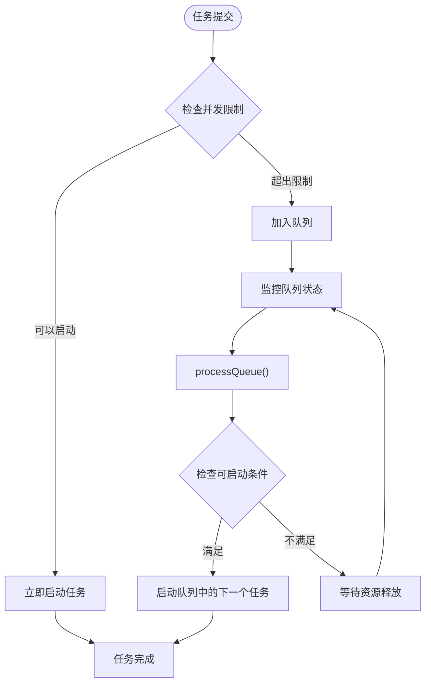

**图表来源**
- [src/main/service/task-manager.ts:180-259](file://src/main/service/task-manager.ts#L180-L259)
- [src/main/service/task-manager.ts:392-415](file://src/main/service/task-manager.ts#L392-L415)

**章节来源**
- [src/main/service/task-manager.ts:180-259](file://src/main/service/task-manager.ts#L180-L259)
- [src/main/service/task-manager.ts:392-415](file://src/main/service/task-manager.ts#L392-L415)

### 账号策略控制
为了更好地管理多账号环境下的任务执行，TaskManager 实现了灵活的账号策略控制系统。

- 策略配置
  - 并发限制：每个账号的最大同时运行任务数
  - 冷却时间：任务间的最小间隔时间（毫秒）
  - 默认策略：未配置时使用统一的默认策略
- 实时控制
  - 动态调整：支持运行时修改账号策略
  - 策略查询：实时获取任意账号的当前策略
  - 资源隔离：确保不同账号的资源使用相互独立
- 策略验证
  - 参数校验：确保策略参数在有效范围内
  - 冲突检测：避免策略配置之间的冲突
  - 自动修复：当策略失效时自动恢复到安全状态

**章节来源**
- [src/main/service/task-manager.ts:39-47](file://src/main/service/task-manager.ts#L39-L47)
- [src/main/service/task-manager.ts:534-544](file://src/main/service/task-manager.ts#L534-L544)

## 依赖关系分析
- 组件耦合
  - TaskRunner 依赖平台适配器与设置模型；适配器依赖平台配置与 Playwright 页面。
  - TaskManager 作为中央协调器，管理多个 TaskRunner 实例的生命周期。
  - 事件驱动降低耦合，便于扩展与测试。
  - **新增** TaskRunner 与历史记录系统的集成。
- 外部依赖
  - Playwright：浏览器自动化与页面交互
  - Electron Store：本地存储
  - electron-log：日志与进度事件
  - cron-parser：定时任务解析
- 潜在循环依赖
  - 当前结构清晰，无明显循环依赖；平台工厂仅创建实例，不反向依赖 TaskRunner。
  - **新增** TaskManager 与 TaskRunner 的双向事件通信。

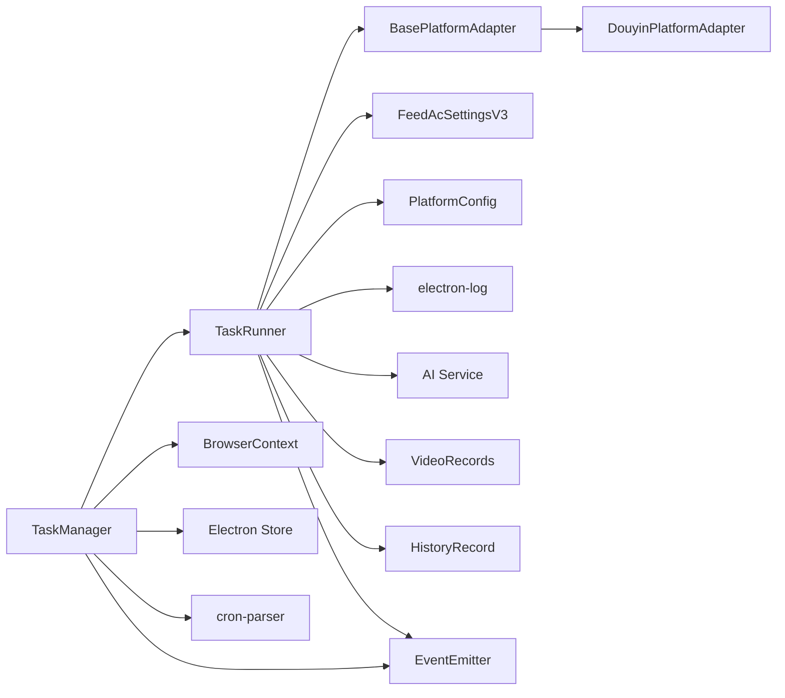

**图表来源**
- [src/main/service/task-manager.ts:49-59](file://src/main/service/task-manager.ts#L49-L59)
- [src/main/service/task-runner.ts:27-50](file://src/main/service/task-runner.ts#L27-L50)
- [src/main/platform/base.ts:24-80](file://src/main/platform/base.ts#L24-L80)
- [src/main/platform/douyin/index.ts:60-71](file://src/main/platform/douyin/index.ts#L60-L71)
- [src/shared/feed-ac-setting.ts:62-97](file://src/shared/feed-ac-setting.ts#L62-L97)
- [src/shared/platform.ts:88-200](file://src/shared/platform.ts#L88-L200)
- [src/shared/task-history.ts:18-37](file://src/shared/task-history.ts#L18-L37)

**章节来源**
- [src/main/service/task-manager.ts:49-59](file://src/main/service/task-manager.ts#L49-L59)
- [src/main/service/task-runner.ts:27-50](file://src/main/service/task-runner.ts#L27-L50)
- [src/main/platform/base.ts:24-80](file://src/main/platform/base.ts#L24-L80)
- [src/main/platform/douyin/index.ts:60-71](file://src/main/platform/douyin/index.ts#L60-L71)
- [src/shared/feed-ac-setting.ts:62-97](file://src/shared/feed-ac-setting.ts#L62-L97)
- [src/shared/platform.ts:88-200](file://src/shared/platform.ts#L88-L200)
- [src/shared/task-history.ts:18-37](file://src/shared/task-history.ts#L18-L37)

## 性能考量
- 视频缓存命中率
  - 通过响应拦截提前填充缓存，减少重复抓取；注意及时清理已消费项，避免内存膨胀。
- 切换等待与随机延时
  - 合理设置视频切换等待时间与随机延时，平衡吞吐与稳定性。
- 组合任务概率
  - 通过概率与首中即停策略控制整体节奏，避免过于频繁的操作。
- AI 调用频率
  - 仅在必要时调用 AI，失败回退到本地预设，降低外部依赖风险。
- **新增** 外部上下文优化
  - 共享浏览器实例可显著提升资源利用率，但需谨慎处理并发状态与验证码弹窗。
  - 外部上下文模式下，任务完成后只关闭页面和上下文，不关闭共享浏览器实例。
- **新增** 并发优化
  - 最大并发数调优：根据系统资源合理设置并发数，避免资源争用
  - 队列管理：优化队列调度算法，减少任务等待时间
  - 资源回收：及时释放不再使用的浏览器实例和上下文
  - 账号隔离：确保不同账号任务的资源隔离，避免相互影响
- **新增** 状态跟踪优化
  - 视频记录采用增量更新策略，避免重复写入
  - 历史记录持久化采用异步写入，不影响任务执行性能

## 故障排除指南
- 无法获取视频信息
  - 检查 feed 监听是否生效；确认缓存是否被正确填充；必要时回退到适配器抓取。
- 评论发布失败
  - 关注验证码弹窗等待；检查评论输入框定位；确认网络响应解析。
- AI 生成失败
  - 检查 API 密钥与模型配置；适当降低请求频率；启用回退评论池。
- 任务长时间暂停
  - 检查连续跳过阈值与屏蔽词配置；查看日志中的跳过原因。
- 登录态丢失
  - 确认 storageState 持久化与加载逻辑；必要时重新登录。
- **新增** 外部上下文相关问题
  - 验证外部上下文的有效性；检查共享浏览器实例状态
  - 确认任务完成后的资源清理是否正确
  - 检查并发任务间的资源竞争情况
- **新增** 并发相关问题
  - 并发数设置过高：检查系统资源使用情况，适当降低并发数
  - 任务长时间排队：检查队列状态和资源使用情况
  - 账号冲突：检查账号策略配置，确保合理的并发限制
  - 定时任务异常：检查 Cron 表达式格式和系统时间同步
- **新增** 状态跟踪问题
  - 检查视频记录是否正确更新
  - 验证历史记录的持久化是否正常
  - 确认任务状态的事件通知是否正确传递

**章节来源**
- [src/main/service/task-runner.ts:106-110](file://src/main/service/task-runner.ts#L106-L110)
- [src/main/platform/douyin/index.ts:131-138](file://src/main/platform/douyin/index.ts#L131-L138)
- [src/main/service/task-runner.ts:863-867](file://src/main/service/task-runner.ts#L863-L867)
- [src/main/service/task-manager.ts:193-205](file://src/main/service/task-manager.ts#L193-L205)

## 结论
TaskRunner 通过事件驱动与适配器模式，实现了跨平台、可扩展、可配置的任务自动化执行框架。TaskManager 的引入进一步增强了系统的并发处理能力和企业级特性，包括智能队列管理、并发控制、账号策略控制和定时任务功能。**新增** 的外部上下文支持使得多个任务可以共享浏览器资源，显著提升了系统性能。增强的状态跟踪系统提供了完整的任务审计和统计功能。改进的错误处理机制确保了系统的稳定性和可靠性。其内置的视频缓存、规则匹配、AI 集成与稳健的错误处理，使其在复杂场景下仍能保持稳定与高效。建议在生产环境中结合日志与事件监控，持续优化规则与参数，以获得最佳效果。

## 附录
- 平台配置与选择器
  - 参考：[PLATFORM_CONFIGS:88-200](file://src/shared/platform.ts#L88-L200)
- 默认设置与迁移
  - 参考：[getDefaultFeedAcSettingsV3/migrateToV3:115-174](file://src/shared/feed-ac-setting.ts#L115-L174)
- 任务类型与操作映射
  - 参考：[TaskType/操作名称映射:990-1011](file://src/main/service/task-runner.ts#L990-L1011)
- **新增** 并发配置
  - 参考：[TaskManager 并发控制:98-108](file://src/main/service/task-manager.ts#L98-L108)
  - 参考：[账号策略配置:534-544](file://src/main/service/task-manager.ts#L534-L544)
- **新增** 外部上下文支持
  - 参考：[startWithContext:162-207](file://src/main/service/task-runner.ts#L162-L207)
  - 参考：[外部上下文模式:270-291](file://src/main/service/task-runner.ts#L270-L291)
- **新增** 状态跟踪系统
  - 参考：[视频记录:903-966](file://src/main/service/task-runner.ts#L903-L966)
  - 参考：[历史记录:971-988](file://src/main/service/task-runner.ts#L971-L988)
  - 参考：[历史记录接口:18-37](file://src/shared/task-history.ts#L18-L37)