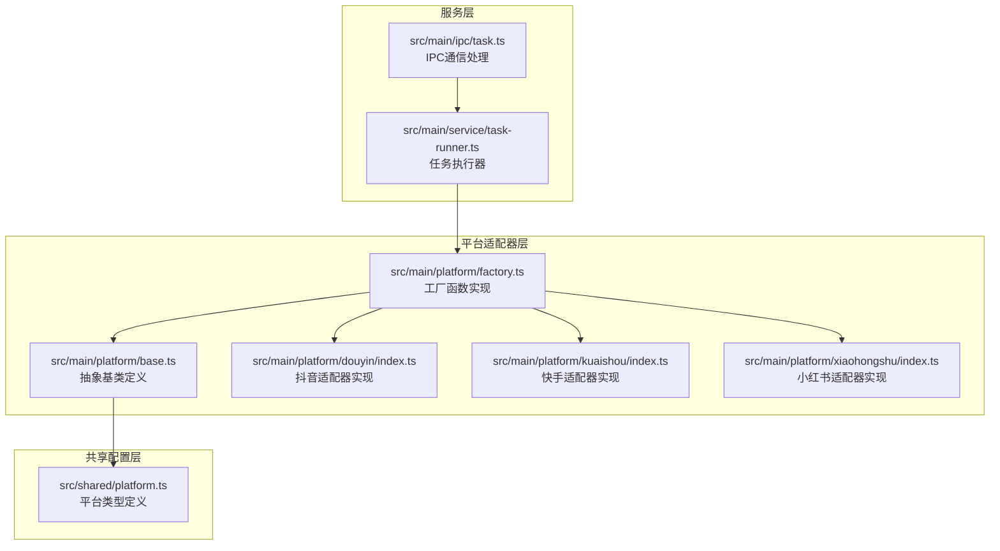
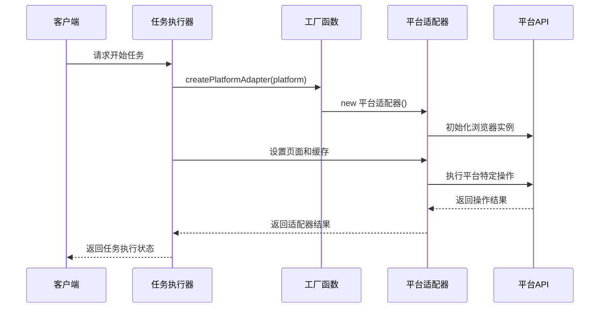
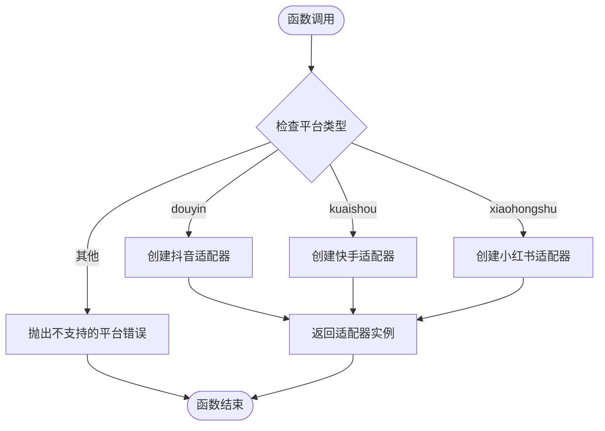
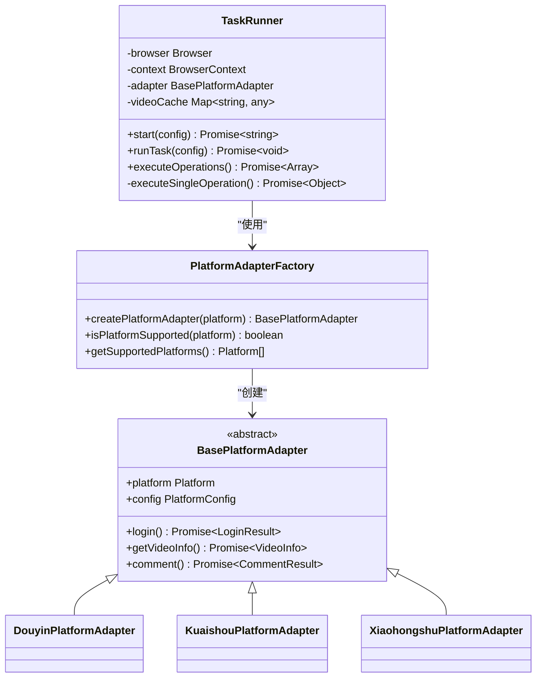

# 工厂模式实现

<cite>
**本文档引用的文件**
- [src/main/platform/factory.ts](file://src/main/platform/factory.ts)
- [src/main/platform/base.ts](file://src/main/platform/base.ts)
- [src/shared/platform.ts](file://src/shared/platform.ts)
- [src/main/platform/douyin/index.ts](file://src/main/platform/douyin/index.ts)
- [src/main/platform/kuaishou/index.ts](file://src/main/platform/kuaishou/index.ts)
- [src/main/platform/xiaohongshu/index.ts](file://src/main/platform/xiaohongshu/index.ts)
- [src/main/service/task-runner.ts](file://src/main/service/task-runner.ts)
- [src/main/ipc/task.ts](file://src/main/ipc/task.ts)
</cite>

## 目录
1. [简介](#简介)
2. [项目结构](#项目结构)
3. [核心组件](#核心组件)
4. [架构概览](#架构概览)
5. [详细组件分析](#详细组件分析)
6. [依赖分析](#依赖分析)
7. [性能考虑](#性能考虑)
8. [故障排除指南](#故障排除指南)
9. [结论](#结论)
10. [附录](#附录)

## 简介

AutoOps项目采用工厂模式实现了平台适配器的动态创建机制。该设计通过PlatformAdapterFactory提供统一的平台适配器创建接口，实现了平台选择的灵活性和运行时扩展能力。工厂模式在此项目中的应用不仅简化了平台适配器的使用，还为未来的平台扩展提供了良好的架构基础。

## 项目结构

AutoOps项目的工厂模式实现主要分布在以下目录结构中：



**图表来源**
- [src/main/platform/factory.ts:1-32](file://src/main/platform/factory.ts#L1-L32)
- [src/main/platform/base.ts:1-105](file://src/main/platform/base.ts#L1-L105)
- [src/shared/platform.ts:1-260](file://src/shared/platform.ts#L1-L260)

**章节来源**
- [src/main/platform/factory.ts:1-32](file://src/main/platform/factory.ts#L1-L32)
- [src/main/platform/base.ts:1-105](file://src/main/platform/base.ts#L1-L105)
- [src/shared/platform.ts:1-260](file://src/shared/platform.ts#L1-L260)

## 核心组件

### 工厂函数实现

PlatformAdapterFactory的核心功能由三个主要工厂函数组成：

1. **createPlatformAdapter**: 主要工厂函数，根据平台类型创建对应的适配器实例
2. **isPlatformSupported**: 平台支持性检查函数
3. **getSupportedPlatforms**: 返回支持的平台列表

这些函数共同构成了工厂模式的核心实现，提供了简洁的接口来管理不同平台的适配器实例。

**章节来源**
- [src/main/platform/factory.ts:7-26](file://src/main/platform/factory.ts#L7-L26)

### 抽象基类设计

BasePlatformAdapter作为所有平台适配器的抽象基类，定义了统一的接口规范：

- **平台标识**: `platform`属性标识具体平台类型
- **配置管理**: `config`属性提供平台特定的配置信息
- **核心操作**: 定义了登录、视频信息获取、评论操作等抽象方法
- **工具方法**: 提供页面管理、缓存管理和日志记录功能

**章节来源**
- [src/main/platform/base.ts:24-80](file://src/main/platform/base.ts#L24-L80)

### 平台类型定义

共享的平台类型定义确保了工厂模式的一致性和可扩展性：

- **Platform类型**: 定义了支持的平台枚举值
- **PlatformConfig接口**: 描述平台特定的选择器、API端点和快捷键配置
- **PLATFORM_CONFIGS常量**: 提供各平台的具体配置信息

**章节来源**
- [src/shared/platform.ts:1-260](file://src/shared/platform.ts#L1-L260)

## 架构概览

AutoOps中的工厂模式架构体现了清晰的关注点分离和职责划分：



**图表来源**
- [src/main/service/task-runner.ts:90-92](file://src/main/service/task-runner.ts#L90-L92)
- [src/main/platform/factory.ts:7-17](file://src/main/platform/factory.ts#L7-L17)

## 详细组件分析

### 工厂函数实现详解

#### createPlatformAdapter函数分析

该函数实现了标准的工厂模式，根据输入的平台类型返回相应的适配器实例：



**图表来源**
- [src/main/platform/factory.ts:7-17](file://src/main/platform/factory.ts#L7-L17)

#### 平台支持性检查机制

工厂模式还包括完整的平台支持性检查机制：

- **isPlatformSupported**: 使用数组包含检查确保平台有效性
- **getSupportedPlatforms**: 提供静态平台列表，便于UI展示和配置

**章节来源**
- [src/main/platform/factory.ts:20-26](file://src/main/platform/factory.ts#L20-L26)

### 平台适配器实现分析

#### 抖音平台适配器

DouyinPlatformAdapter展示了工厂模式的最佳实践：

- **继承关系**: 继承BasePlatformAdapter，实现平台特定功能
- **配置集成**: 使用PLATFORM_CONFIGS.douyin提供平台配置
- **数据缓存**: 实现视频数据缓存机制，提升性能
- **异步操作**: 处理复杂的异步操作和事件监听

**章节来源**
- [src/main/platform/douyin/index.ts:60-494](file://src/main/platform/douyin/index.ts#L60-L494)

#### 快手平台适配器

KuaishouPlatformAdapter体现了相似的实现模式：

- **统一接口**: 保持与BasePlatformAdapter的接口一致性
- **平台差异**: 处理快手平台特有的元素选择器和交互方式
- **错误处理**: 实现健壮的错误处理和状态检查

**章节来源**
- [src/main/platform/kuaishou/index.ts:22-253](file://src/main/platform/kuaishou/index.ts#L22-L253)

#### 小红书平台适配器

XiaohongshuPlatformAdapter展示了最小实现原则：

- **精简设计**: 专注于核心功能，避免过度复杂化
- **配置复用**: 充分利用共享配置减少重复代码
- **扩展性**: 为未来功能扩展预留空间

**章节来源**
- [src/main/platform/xiaohongshu/index.ts:23-264](file://src/main/platform/xiaohongshu/index.ts#L23-L264)

### 任务执行器中的工厂模式应用

TaskRunner展示了工厂模式在实际业务场景中的应用：



**图表来源**
- [src/main/service/task-runner.ts:25-760](file://src/main/service/task-runner.ts#L25-L760)
- [src/main/platform/factory.ts:7-31](file://src/main/platform/factory.ts#L7-L31)

**章节来源**
- [src/main/service/task-runner.ts:90-92](file://src/main/service/task-runner.ts#L90-L92)

## 依赖分析

工厂模式的依赖关系体现了清晰的层次结构：

```mermaid
graph TB
subgraph "外部依赖"
Playwright[@playwright/test]
Electron[electron-log]
Events[events]
end
subgraph "内部依赖"
SharedPlatform[src/shared/platform.ts]
BaseAdapter[src/main/platform/base.ts]
Factory[src/main/platform/factory.ts]
DouyinAdapter[src/main/platform/douyin/index.ts]
KuaishouAdapter[src/main/platform/kuaishou/index.ts]
XiaohongshuAdapter[src/main/platform/xiaohongshu/index.ts]
TaskRunner[src/main/service/task-runner.ts]
IPC[src/main/ipc/task.ts]
end
Playwright --> BaseAdapter
Electron --> TaskRunner
Events --> BaseAdapter
SharedPlatform --> BaseAdapter
SharedPlatform --> Factory
SharedPlatform --> DouyinAdapter
SharedPlatform --> KuaishouAdapter
SharedPlatform --> XiaohongshuAdapter
BaseAdapter --> Factory
Factory --> DouyinAdapter
Factory --> KuaishouAdapter
Factory --> XiaohongshuAdapter
TaskRunner --> Factory
IPC --> TaskRunner
```

**图表来源**
- [src/main/platform/base.ts:1-12](file://src/main/platform/base.ts#L1-L12)
- [src/main/platform/factory.ts:1-5](file://src/main/platform/factory.ts#L1-L5)
- [src/main/service/task-runner.ts:1-13](file://src/main/service/task-runner.ts#L1-L13)

**章节来源**
- [src/main/platform/base.ts:1-12](file://src/main/platform/base.ts#L1-L12)
- [src/main/platform/factory.ts:1-5](file://src/main/platform/factory.ts#L1-L5)
- [src/main/service/task-runner.ts:1-13](file://src/main/service/task-runner.ts#L1-L13)

## 性能考虑

工厂模式在AutoOps中的性能优化体现在多个方面：

### 缓存策略
- **视频数据缓存**: 各平台适配器都实现了本地缓存机制，减少重复请求
- **浏览器实例复用**: TaskRunner支持共享BrowserContext，提高资源利用率
- **配置缓存**: 平台配置信息在应用启动时加载并缓存

### 异步处理优化
- **事件驱动**: 使用EventEmitter实现异步事件处理
- **Promise链式调用**: 减少回调地狱，提高代码可读性
- **超时控制**: 实现合理的超时机制，避免长时间阻塞

### 内存管理
- **适配器生命周期管理**: 明确的创建和销毁流程
- **资源清理**: 确保浏览器实例和页面对象的正确释放

## 故障排除指南

### 常见问题及解决方案

#### 平台适配器创建失败
**问题**: `不支持的平台`错误
**原因**: 传入了工厂函数不支持的平台类型
**解决方案**: 
1. 检查平台类型是否在支持列表中
2. 确认平台名称拼写正确
3. 如需支持新平台，扩展工厂函数

#### 浏览器实例初始化失败
**问题**: 无法创建浏览器实例
**原因**: 浏览器路径配置错误或权限问题
**解决方案**:
1. 检查浏览器可执行文件路径
2. 确认浏览器版本兼容性
3. 验证系统权限设置

#### 页面元素定位失败
**问题**: 无法找到平台特定的元素
**原因**: DOM结构变化或选择器失效
**解决方案**:
1. 更新平台配置中的选择器
2. 检查平台API变更
3. 实现更健壮的元素查找逻辑

**章节来源**
- [src/main/platform/factory.ts:15-16](file://src/main/platform/factory.ts#L15-L16)
- [src/main/platform/douyin/index.ts:85-109](file://src/main/platform/douyin/index.ts#L85-L109)

## 结论

AutoOps项目中的工厂模式实现展现了现代JavaScript应用中设计模式的最佳实践。通过PlatformAdapterFactory，项目实现了：

1. **高度的可扩展性**: 新平台的添加只需实现BasePlatformAdapter接口
2. **清晰的职责分离**: 工厂负责创建，适配器负责业务逻辑
3. **良好的封装性**: 平台差异被有效封装在各自的适配器中
4. **强大的运行时灵活性**: 支持动态平台选择和配置

这种设计模式的应用不仅简化了平台适配器的使用，还为AutoOps的未来发展奠定了坚实的基础。通过工厂模式，开发者可以轻松地扩展新的平台支持，同时保持代码的整洁性和可维护性。

## 附录

### 最佳实践建议

1. **平台扩展指南**
   - 实现BasePlatformAdapter抽象类
   - 在factory.ts中注册新平台
   - 提供完整的平台配置

2. **错误处理策略**
   - 实现统一的错误处理机制
   - 提供详细的错误信息
   - 实现优雅降级

3. **性能优化建议**
   - 合理使用缓存机制
   - 优化异步操作
   - 实现资源池管理

4. **测试策略**
   - 为每个适配器编写单元测试
   - 实现集成测试覆盖
   - 建立回归测试机制