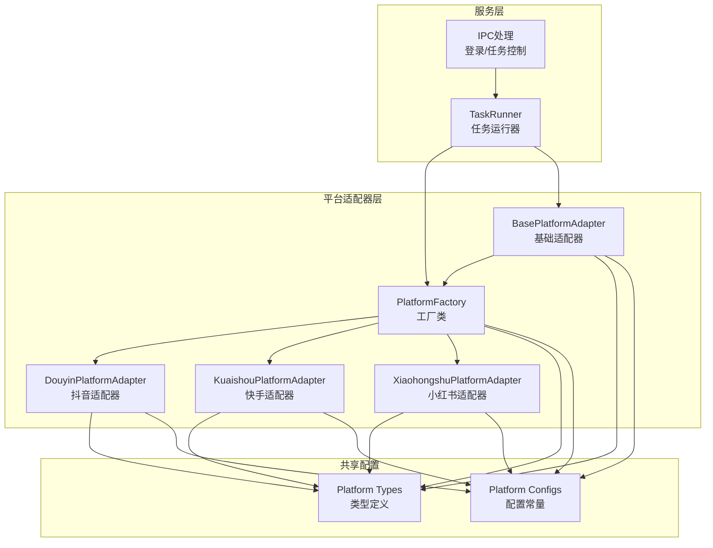
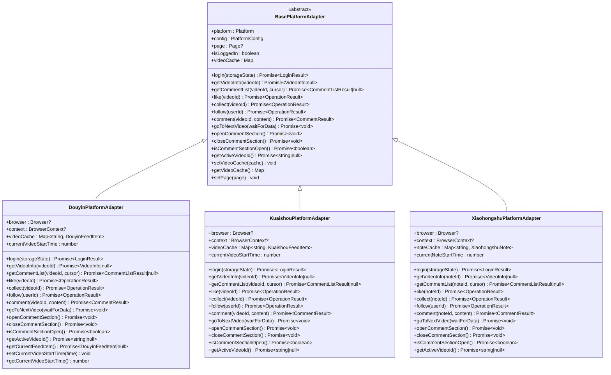
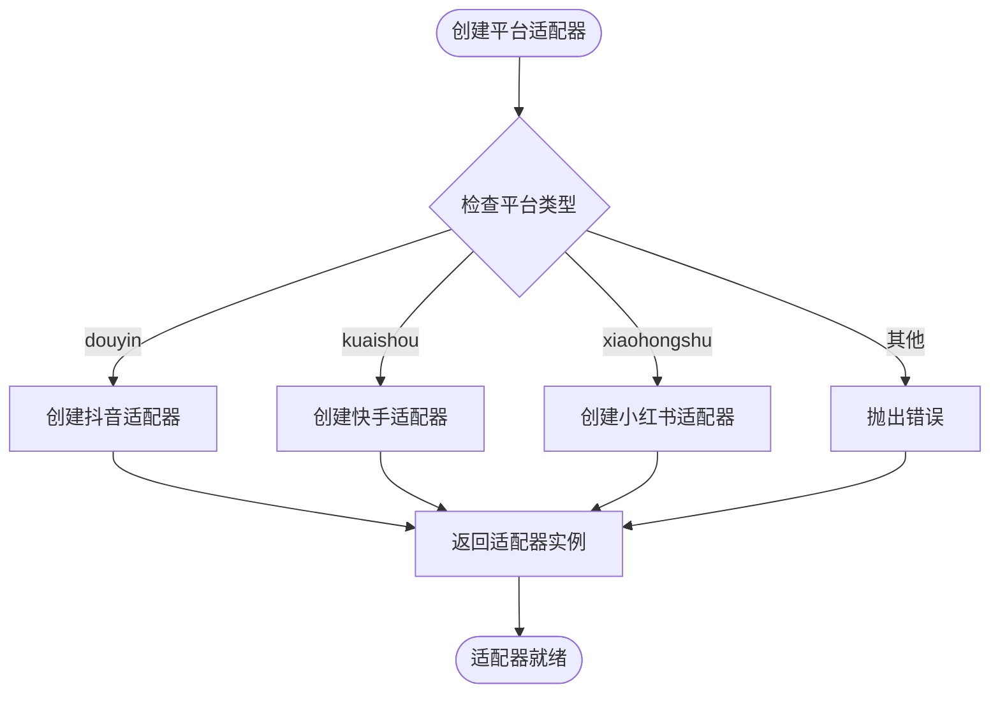
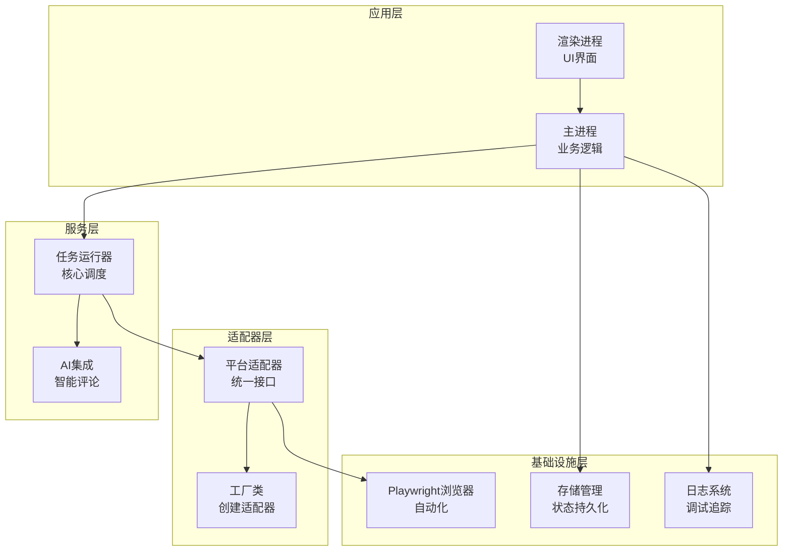
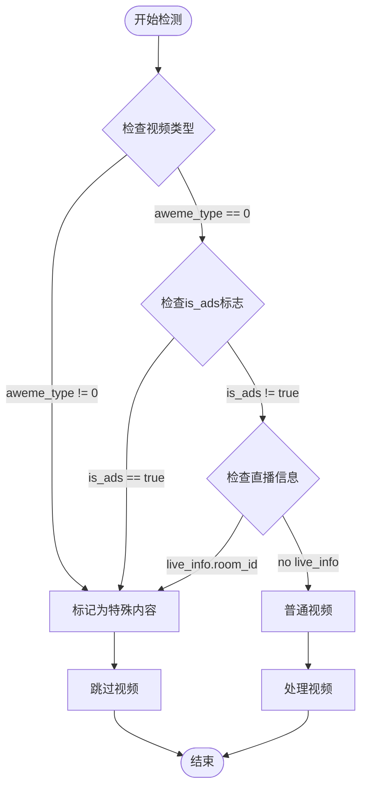
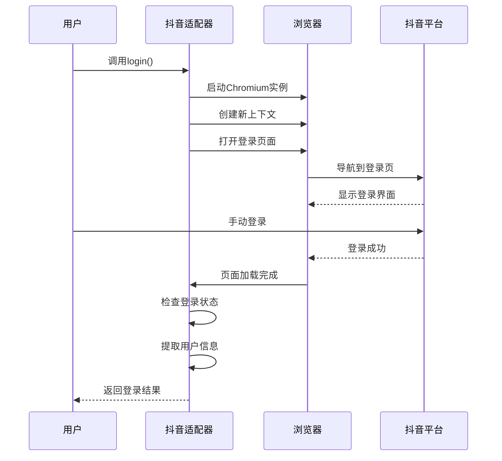
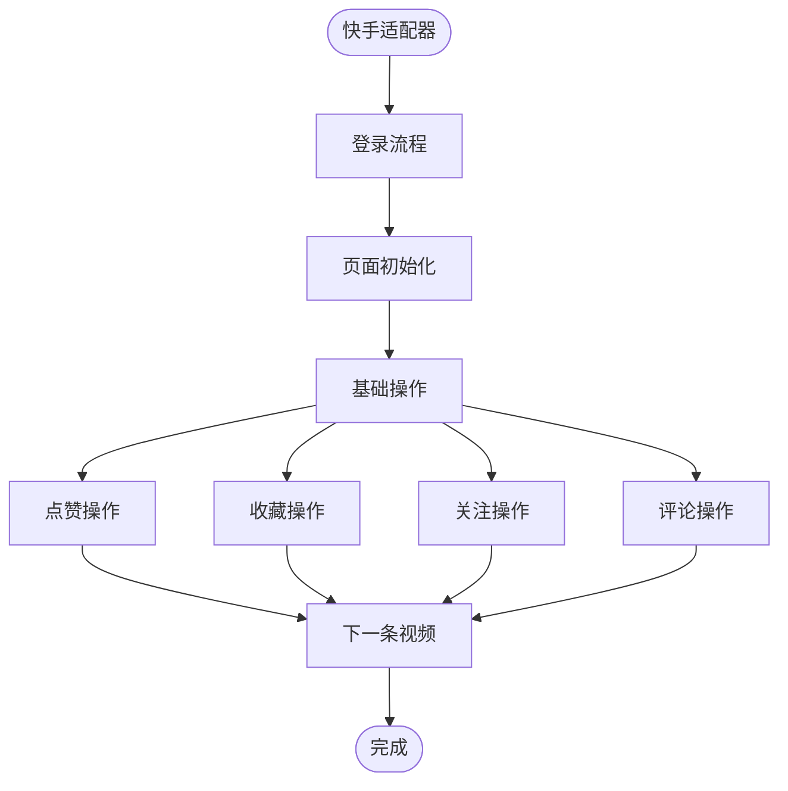
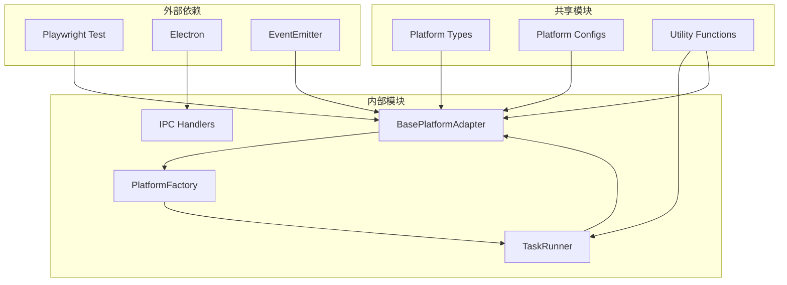

# 平台适配器实现

<cite>
**本文档引用的文件**
- [src/main/platform/base.ts](file://src/main/platform/base.ts)
- [src/main/platform/factory.ts](file://src/main/platform/factory.ts)
- [src/main/platform/douyin/index.ts](file://src/main/platform/douyin/index.ts)
- [src/main/platform/kuaishou/index.ts](file://src/main/platform/kuaishou/index.ts)
- [src/main/platform/xiaohongshu/index.ts](file://src/main/platform/xiaohongshu/index.ts)
- [src/shared/platform.ts](file://src/shared/platform.ts)
- [src/main/elements/douyin.ts](file://src/main/elements/douyin.ts)
- [src/main/service/task-runner.ts](file://src/main/service/task-runner.ts)
- [src/main/ipc/login.ts](file://src/main/ipc/login.ts)
</cite>

## 目录
1. [简介](#简介)
2. [项目结构](#项目结构)
3. [核心组件](#核心组件)
4. [架构概览](#架构概览)
5. [详细组件分析](#详细组件分析)
6. [依赖关系分析](#依赖关系分析)
7. [性能考虑](#性能考虑)
8. [故障排除指南](#故障排除指南)
9. [结论](#结论)

## 简介

本项目是一个跨平台短视频内容自动化操作框架，支持抖音、快手、小红书等多个平台。通过统一的适配器模式，实现了对不同平台API差异的抽象封装，提供了统一的操作接口，包括登录认证、内容获取、交互操作等功能。

该系统采用Electron + Playwright技术栈，通过浏览器自动化实现对各平台的无头访问和操作。每个平台都有专门的适配器实现，负责处理平台特定的元素定位、API调用和业务逻辑。

## 项目结构

项目采用模块化设计，主要分为以下几个核心模块：

**图表来源**
- [src/main/platform/base.ts:1-105](file://src/main/platform/base.ts#L1-L105)
- [src/main/platform/factory.ts:1-32](file://src/main/platform/factory.ts#L1-L32)
- [src/shared/platform.ts:1-260](file://src/shared/platform.ts#L1-L260)

**章节来源**
- [src/main/platform/base.ts:1-105](file://src/main/platform/base.ts#L1-L105)
- [src/main/platform/factory.ts:1-32](file://src/main/platform/factory.ts#L1-L32)
- [src/shared/platform.ts:1-260](file://src/shared/platform.ts#L1-L260)

## 核心组件

### 基础适配器类

所有平台适配器都继承自 `BasePlatformAdapter` 抽象类，该类定义了统一的接口规范：

**图表来源**
- [src/main/platform/base.ts:24-80](file://src/main/platform/base.ts#L24-L80)
- [src/main/platform/douyin/index.ts:60-494](file://src/main/platform/douyin/index.ts#L60-L494)
- [src/main/platform/kuaishou/index.ts:22-253](file://src/main/platform/kuaishou/index.ts#L22-L253)
- [src/main/platform/xiaohongshu/index.ts:23-264](file://src/main/platform/xiaohongshu/index.ts#L23-L264)

### 工厂模式实现

平台适配器采用工厂模式进行创建和管理：

**图表来源**
- [src/main/platform/factory.ts:7-18](file://src/main/platform/factory.ts#L7-L18)

**章节来源**
- [src/main/platform/base.ts:24-80](file://src/main/platform/base.ts#L24-L80)
- [src/main/platform/factory.ts:1-32](file://src/main/platform/factory.ts#L1-L32)

## 架构概览

系统采用分层架构设计，从上到下分别为：

**图表来源**
- [src/main/service/task-runner.ts:25-760](file://src/main/service/task-runner.ts#L25-L760)
- [src/main/platform/base.ts:24-80](file://src/main/platform/base.ts#L24-L80)

## 详细组件分析

### 抖音平台适配器

抖音适配器是最复杂的实现，具有以下特点：

#### 核心特性

1. **广告检测机制**：能够识别广告、直播和图集等特殊内容
2. **实时数据监听**：通过WebSocket监听视频数据流
3. **验证码处理**：自动检测和处理人机验证
4. **热门评论提取**：支持基于AI的评论生成

#### 广告检测算法

**图表来源**
- [src/main/platform/douyin/index.ts:162-183](file://src/main/platform/douyin/index.ts#L162-L183)

#### 登录流程

**图表来源**
- [src/main/platform/douyin/index.ts:73-109](file://src/main/platform/douyin/index.ts#L73-L109)

#### 关键实现细节

1. **视频缓存管理**：维护视频数据的内存缓存
2. **键盘快捷键**：使用ArrowDown、Z、C、X、F等快捷键
3. **评论处理**：支持AI生成评论和验证码处理
4. **数据监听**：监听抖音的API端点获取实时数据

**章节来源**
- [src/main/platform/douyin/index.ts:60-494](file://src/main/platform/douyin/index.ts#L60-L494)

### 快手平台适配器

快手适配器相对简单，专注于基本的视频操作：

#### 核心功能

1. **基础视频操作**：点赞、收藏、关注、评论
2. **简洁的UI交互**：使用标准的键盘快捷键
3. **直接的数据获取**：通过GraphQL API获取数据

#### 特殊处理

**图表来源**
- [src/main/platform/kuaishou/index.ts:22-253](file://src/main/platform/kuaishou/index.ts#L22-L253)

**章节来源**
- [src/main/platform/kuaishou/index.ts:22-253](file://src/main/platform/kuaishou/index.ts#L22-L253)

### 小红书平台适配器

小红书适配器针对图文内容进行了优化：

#### 内容类型

小红书主要提供图文内容，适配器针对这种内容类型进行了专门优化：

1. **笔记缓存**：维护笔记数据的缓存
2. **简化操作**：针对图文内容的简化操作流程
3. **特定选择器**：使用小红书特有的元素选择器

**章节来源**
- [src/main/platform/xiaohongshu/index.ts:23-264](file://src/main/platform/xiaohongshu/index.ts#L23-L264)

### 配置系统

平台配置系统提供了统一的配置管理：

```mermaid
erDiagram
PLATFORM_CONFIGS {
Platform platform PK
PlatformSelectors selectors
PlatformAPIEndpoints apiEndpoints
KeyboardShortcuts keyboardShortcuts
}
PLATFORMS {
Platform id PK
string name
string icon
string homeUrl
string loginUrl
string color
}
PlatformSelectors {
string activeVideo
string videoIdAttr
string likeButton
string collectButton
string followButton
string commentInput
string commentSubmit
string commentSection
string verifyDialog
string loginPanel
string videoSideCard
}
PlatformAPIEndpoints {
string feed
string commentList
string commentPublish
string like
string collect
string follow
}
PLATFORM_CONFIGS ||--|| PLATFORMS : "配置对应"
```

**图表来源**
- [src/shared/platform.ts:88-200](file://src/shared/platform.ts#L88-L200)

**章节来源**
- [src/shared/platform.ts:88-200](file://src/shared/platform.ts#L88-L200)

## 依赖关系分析

系统采用松耦合的设计，通过接口和工厂模式实现模块间的解耦：

**图表来源**
- [src/main/platform/base.ts:1-12](file://src/main/platform/base.ts#L1-L12)
- [src/main/service/task-runner.ts:1-13](file://src/main/service/task-runner.ts#L1-L13)

### 关键依赖关系

1. **适配器与配置**：适配器依赖平台配置常量
2. **工厂与适配器**：工厂负责创建和管理适配器实例
3. **任务运行器与适配器**：任务运行器通过适配器执行具体操作
4. **IPC与任务运行器**：IPC层控制任务运行器的生命周期

**章节来源**
- [src/main/platform/base.ts:1-12](file://src/main/platform/base.ts#L1-L12)
- [src/main/service/task-runner.ts:1-13](file://src/main/service/task-runner.ts#L1-L13)

## 性能考虑

### 缓存策略

1. **视频数据缓存**：在内存中缓存视频元数据，减少重复请求
2. **浏览器上下文复用**：支持多任务共享浏览器上下文
3. **异步操作优化**：使用Promise和async/await避免阻塞

### 错误处理

1. **超时机制**：为网络请求和页面操作设置合理的超时时间
2. **重试机制**：对关键操作提供重试逻辑
3. **降级策略**：当某些功能不可用时提供替代方案

### 资源管理

1. **内存管理**：及时清理不再使用的缓存数据
2. **浏览器资源**：正确关闭浏览器实例和页面
3. **事件监听器**：及时移除不需要的事件监听器

## 故障排除指南

### 常见问题及解决方案

#### 登录问题

1. **登录失败**：检查浏览器可执行文件路径配置
2. **验证码弹窗**：系统会自动等待用户完成验证
3. **Cookie失效**：重新登录获取新的认证状态

#### 视频获取问题

1. **视频ID为空**：检查页面元素选择器是否正确
2. **API调用失败**：检查网络连接和API端点可用性
3. **数据格式异常**：添加数据验证和错误处理

#### 操作执行问题

1. **元素未找到**：检查选择器是否过时，更新为最新的元素标识
2. **操作超时**：增加等待时间和重试次数
3. **权限不足**：检查账号权限和平台限制

### 调试技巧

1. **启用详细日志**：查看系统日志了解执行过程
2. **监控网络请求**：使用开发者工具观察API调用
3. **断点调试**：在关键位置设置断点进行调试

**章节来源**
- [src/main/platform/douyin/index.ts:335-342](file://src/main/platform/douyin/index.ts#L335-L342)
- [src/main/service/task-runner.ts:746-758](file://src/main/service/task-runner.ts#L746-L758)

## 结论

本项目通过精心设计的适配器模式，成功实现了对多个短视频平台的统一抽象。每个平台适配器都针对其特定的API和UI结构进行了优化，同时保持了统一的接口规范。

### 主要优势

1. **可扩展性**：新增平台只需实现基础适配器接口
2. **可维护性**：清晰的模块划分和职责分离
3. **稳定性**：完善的错误处理和重试机制
4. **性能**：合理的缓存策略和异步处理

### 改进建议

1. **配置热更新**：支持动态更新平台配置而无需重启
2. **监控指标**：添加更详细的性能监控和统计
3. **测试覆盖**：增加单元测试和集成测试
4. **文档完善**：为每个适配器添加详细的使用文档

该系统为短视频内容自动化操作提供了一个坚实的技术基础，通过持续的优化和改进，可以适应不断变化的平台环境和业务需求。