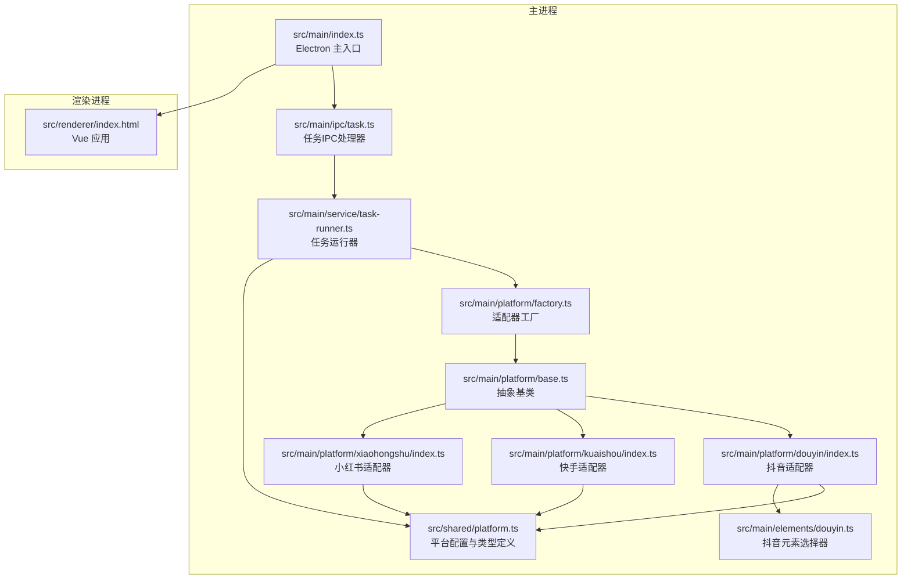
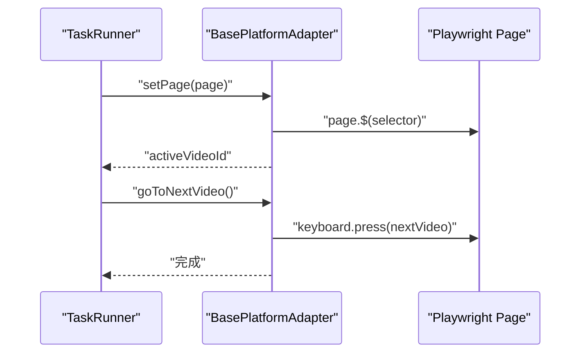
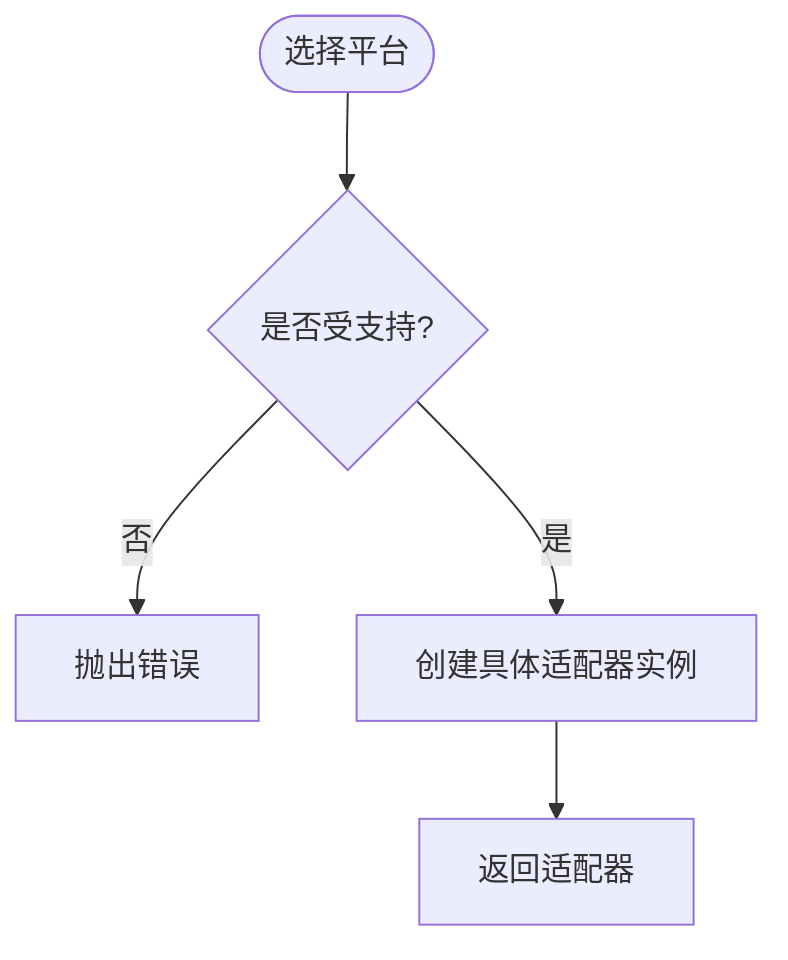
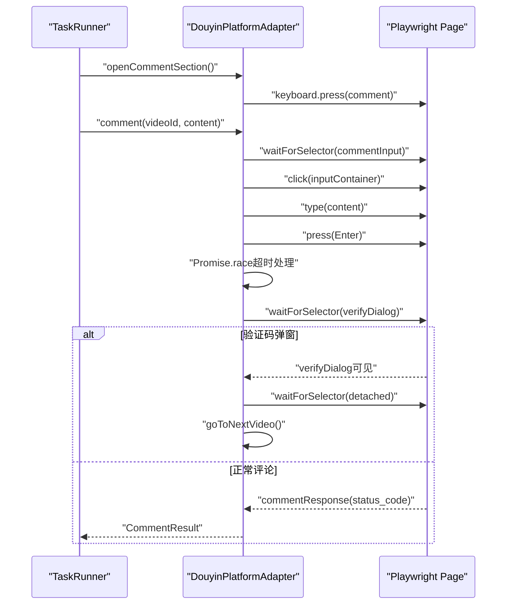
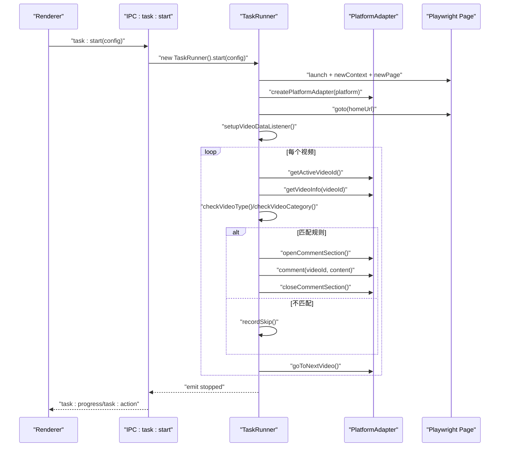
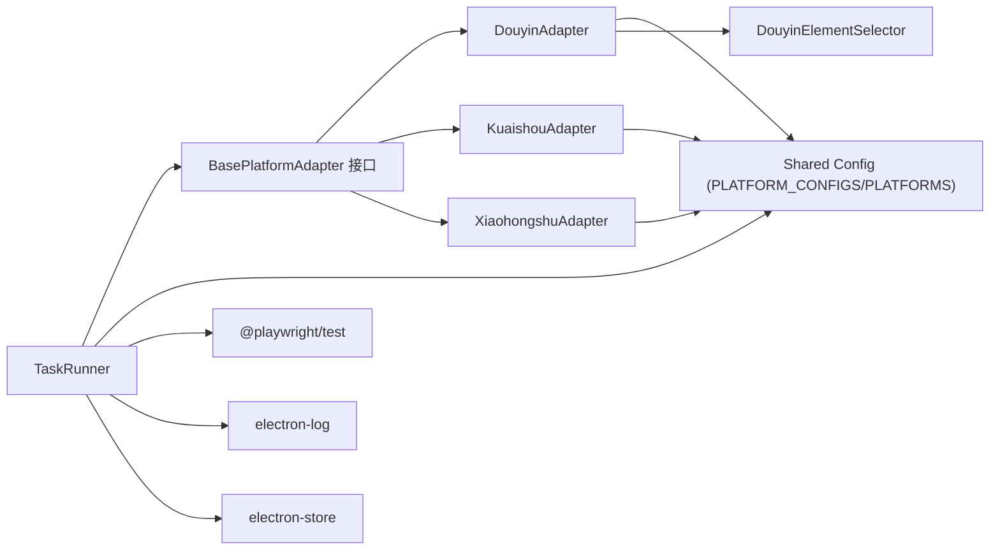

# 平台适配器系统

<cite>
**本文档引用的文件**
- [src/main/platform/base.ts](file://src/main/platform/base.ts)
- [src/main/platform/factory.ts](file://src/main/platform/factory.ts)
- [src/main/platform/douyin/index.ts](file://src/main/platform/douyin/index.ts)
- [src/main/platform/kuaishou/index.ts](file://src/main/platform/kuaishou/index.ts)
- [src/main/platform/xiaohongshu/index.ts](file://src/main/platform/xiaohongshu/index.ts)
- [src/shared/platform.ts](file://src/shared/platform.ts)
- [src/main/service/task-runner.ts](file://src/main/service/task-runner.ts)
- [src/main/ipc/task.ts](file://src/main/ipc/task.ts)
- [src/main/index.ts](file://src/main/index.ts)
- [src/main/elements/douyin.ts](file://src/main/elements/douyin.ts)
</cite>

## 更新摘要
**变更内容**
- 抖音适配器评论发布逻辑优化：移除条件检查，简化评论输入框打开逻辑
- 增强超时处理和竞态条件保护：通过Promise.race机制确保评论发布过程的稳定性
- 优化验证码处理流程：改进验证码弹窗检测和自动刷新机制
- 任务运行器评论执行流程增强：支持验证码处理后的自动继续

## 目录
1. [简介](#简介)
2. [项目结构](#项目结构)
3. [核心组件](#核心组件)
4. [架构总览](#架构总览)
5. [详细组件分析](#详细组件分析)
6. [依赖关系分析](#依赖关系分析)
7. [性能考虑](#性能考虑)
8. [故障排除指南](#故障排除指南)
9. [结论](#结论)
10. [附录](#附录)

## 简介
本文件系统性阐述 AutoOps 平台适配器系统的设计与实现，重点覆盖：
- 抽象基类 BasePlatformAdapter 的设计模式与职责边界
- 工厂模式在平台适配器中的应用与扩展机制
- 抖音、快手、小红书三大平台适配器的差异化实现与 API 差异处理
- 适配器与 TaskRunner 的协作流程与跨平台一致性保障
- 面向未来的平台扩展指南与最佳实践

**更新** 本次更新重点关注抖音平台适配器的重大优化，包括评论发布逻辑的简化、超时处理机制的增强以及竞态条件保护的改进。

该系统采用 Electron + Playwright 架构，通过统一的适配器接口屏蔽不同平台的前端差异，结合任务运行器实现可配置、可扩展的自动化运营能力。

## 项目结构
平台适配器系统位于 `src/main/platform` 目录，配合共享配置与任务运行器共同构成完整的自动化框架。



**图表来源**
- [src/main/index.ts:1-106](file://src/main/index.ts#L1-L106)
- [src/main/ipc/task.ts:1-104](file://src/main/ipc/task.ts#L1-L104)
- [src/main/service/task-runner.ts:1-922](file://src/main/service/task-runner.ts#L1-L922)
- [src/main/platform/factory.ts:1-32](file://src/main/platform/factory.ts#L1-L32)
- [src/main/platform/base.ts:1-105](file://src/main/platform/base.ts#L1-L105)
- [src/main/platform/douyin/index.ts:1-557](file://src/main/platform/douyin/index.ts#L1-L557)
- [src/main/platform/kuaishou/index.ts:1-253](file://src/main/platform/kuaishou/index.ts#L1-L253)
- [src/main/platform/xiaohongshu/index.ts:1-264](file://src/main/platform/xiaohongshu/index.ts#L1-L264)
- [src/shared/platform.ts:1-260](file://src/shared/platform.ts#L1-L260)
- [src/main/elements/douyin.ts:1-106](file://src/main/elements/douyin.ts#L1-L106)

**章节来源**
- [src/main/index.ts:1-106](file://src/main/index.ts#L1-L106)
- [src/main/ipc/task.ts:1-104](file://src/main/ipc/task.ts#L1-L104)
- [src/main/service/task-runner.ts:1-922](file://src/main/service/task-runner.ts#L1-L922)
- [src/main/platform/factory.ts:1-32](file://src/main/platform/factory.ts#L1-L32)
- [src/shared/platform.ts:1-260](file://src/shared/platform.ts#L1-L260)

## 核心组件
- 抽象基类 BasePlatformAdapter：定义统一的平台操作契约（登录、视频信息、评论、点赞、收藏、关注、导航等），提供日志事件、页面管理、缓存与通用选择器访问能力。
- 适配器工厂 createPlatformAdapter：基于平台枚举返回对应的具体适配器实例，支持平台能力查询与枚举。
- 共享配置 PLATFORM_CONFIGS/PLATFORMS：集中定义各平台的选择器、API 端点、键盘快捷键等，确保跨平台一致性与可维护性。
- 任务运行器 TaskRunner：负责任务生命周期管理、视频流监听、规则匹配、AI 评论生成、与适配器协作执行操作。
- **新增** 抖音元素选择器 DouyinElementSelector：提供专门的抖音页面元素选择器管理，支持评论区状态检测和视频导航。

**章节来源**
- [src/main/platform/base.ts:24-80](file://src/main/platform/base.ts#L24-L80)
- [src/main/platform/factory.ts:7-26](file://src/main/platform/factory.ts#L7-L26)
- [src/shared/platform.ts:88-200](file://src/shared/platform.ts#L88-L200)
- [src/main/service/task-runner.ts:25-113](file://src/main/service/task-runner.ts#L25-L113)
- [src/main/elements/douyin.ts:1-106](file://src/main/elements/douyin.ts#L1-L106)

## 架构总览
系统采用"抽象基类 + 工厂 + 共享配置"的分层架构，通过 EventEmitter 实现日志与进度事件的解耦广播，通过 Page 对象驱动 Playwright 自动化。

**更新** 抖音适配器经过重大优化，新增了智能缓存系统、视频内容处理能力和增强的评论发布逻辑，任务运行器也集成了AI评论生成与热门评论提取的深度协作。

```mermaid
classDiagram
class BasePlatformAdapter {
<<abstract>>
+platform : Platform
+config : PlatformConfig
+login(storageState) Promise~LoginResult~
+getVideoInfo(videoId) Promise~VideoInfo|null~
+getCommentList(videoId, cursor) Promise~CommentListResult|null~
+like(videoId) Promise~OperationResult~
+collect(videoId) Promise~OperationResult~
+follow(userId) Promise~OperationResult~
+comment(videoId, content) Promise~CommentResult~
+goToNextVideo(waitForData) Promise~void~
+openCommentSection() Promise~void~
+closeCommentSection() Promise~void~
+isCommentSectionOpen() Promise~boolean~
+getActiveVideoId() Promise~string|null~
+setPage(page) void
+setVideoCache(cache) void
+getVideoCache() Map
+log(level, message) void
}
class DouyinPlatformAdapter {
+login(storageState) Promise~LoginResult~
+setupPage(page, storageState) Promise~void~
+getVideoInfo(videoId) Promise~VideoInfo|null~
+getCommentList(videoId, cursor) Promise~CommentListResult|null~
+like(videoId) Promise~OperationResult~
+collect(videoId) Promise~OperationResult~
+follow(userId) Promise~OperationResult~
+comment(videoId, content) Promise~CommentResult~
+goToNextVideo(waitForData) Promise~void~
+openCommentSection() Promise~void~
+closeCommentSection() Promise~void~
+isCommentSectionOpen() Promise~boolean~
+getActiveVideoId() Promise~string|null~
+getCurrentFeedItem() Promise~DouyinFeedItem|null~
+getTopComments(videoId, count) Promise~Array~
+isAdOrLive(feedItem) Promise~boolean~
+getVideoTypeDesc(feedItem) Promise~string~
+setupVideoDataListener() Promise~void~
+setVideoCache(cache) void
+getVideoCache() Map
+setCurrentVideoStartTime(time) void
+getCurrentVideoStartTime() number
+close() Promise~void~
}
class KuaishouPlatformAdapter {
+login(storageState) Promise~LoginResult~
+setupPage(page, storageState) Promise~void~
+getVideoInfo(videoId) Promise~VideoInfo|null~
+getCommentList(videoId, cursor) Promise~CommentListResult|null~
+like(videoId) Promise~OperationResult~
+collect(videoId) Promise~OperationResult~
+follow(userId) Promise~OperationResult~
+comment(videoId, content) Promise~CommentResult~
+goToNextVideo(waitForData) Promise~void~
+openCommentSection() Promise~void~
+closeCommentSection() Promise~void~
+isCommentSectionOpen() Promise~boolean~
+getActiveVideoId() Promise~string|null~
+close() Promise~void~
}
class XiaohongshuPlatformAdapter {
+login(storageState) Promise~LoginResult~
+setupPage(page, storageState) Promise~void~
+getVideoInfo(noteId) Promise~VideoInfo|null~
+getCommentList(noteId, cursor) Promise~CommentListResult|null~
+like(noteId) Promise~OperationResult~
+collect(noteId) Promise~OperationResult~
+follow(userId) Promise~OperationResult~
+comment(noteId, content) Promise~CommentResult~
+goToNextVideo(waitForData) Promise~void~
+openCommentSection() Promise~void~
+closeCommentSection() Promise~void~
+isCommentSectionOpen() Promise~boolean~
+getActiveVideoId() Promise~string|null~
+close() Promise~void~
}
class TaskRunner {
+start(config) Promise~string~
+startWithContext(config, context) Promise~string~
+pause() Promise~void~
+resume() Promise~void~
+stop() Promise~void~
+runTask(config) Promise~void~
+executeOperations(...) Promise~Array~
+executeComment(...) Promise~{success,error}~
+executeLike(videoId) Promise~{success,error}~
+executeCollect(videoId) Promise~{success,error}~
+executeFollow(userId) Promise~{success,error}~
+checkVideoType(...) {shouldSkip,reason}
+checkVideoCategory(...) Promise~{shouldSkip,reason}~
+matchRules(...) Promise~RuleGroup|null~
+goToNextVideo() Promise~void~
+getCurrentVideoInfo(maxRetries) Promise~VideoInfo|null~
+recordSkip(videoInfo, reason) Promise~void~
+setupVideoDataListener() void
}
class DouyinElementSelector {
+setPage(page) void
+activeVideoSelector string
+videoIdAttribute string
+commentInputContainerSelector string
+commentSubmitSelector string
+commentImageUploadSelector string
+likeButtonSelector string
+collectButtonSelector string
+followButtonSelector string
+commentIconSelector string
+verifyDialogSelector string
+loginPanelSelector string
+videoSideCardSelector string
+isCommentSectionOpen() Promise~boolean~
+goToNextVideo() Promise~void~
+openCommentSection() Promise~void~
+closeCommentSection() Promise~void~
+like() Promise~void~
+getActiveVideoElement() Promise~{element,videoId}|null~
}
BasePlatformAdapter <|-- DouyinPlatformAdapter
BasePlatformAdapter <|-- KuaishouPlatformAdapter
BasePlatformAdapter <|-- XiaohongshuPlatformAdapter
TaskRunner --> BasePlatformAdapter : "依赖"
TaskRunner --> DouyinPlatformAdapter : "可选实例"
DouyinPlatformAdapter --> DouyinElementSelector : "使用"
```

**图表来源**
- [src/main/platform/base.ts:24-80](file://src/main/platform/base.ts#L24-L80)
- [src/main/platform/douyin/index.ts:60-557](file://src/main/platform/douyin/index.ts#L60-L557)
- [src/main/platform/kuaishou/index.ts:22-253](file://src/main/platform/kuaishou/index.ts#L22-L253)
- [src/main/platform/xiaohongshu/index.ts:23-264](file://src/main/platform/xiaohongshu/index.ts#L23-L264)
- [src/main/service/task-runner.ts:25-922](file://src/main/service/task-runner.ts#L25-L922)
- [src/main/elements/douyin.ts:1-106](file://src/main/elements/douyin.ts#L1-L106)

## 详细组件分析

### 抽象基类 BasePlatformAdapter 设计
- 职责边界清晰：统一声明平台标识、配置对象、登录与内容操作方法、UI 导航方法、缓存与日志事件。
- 事件驱动：通过 EventEmitter 发出日志事件，便于上层统一收集与展示。
- 页面与缓存：提供 setPage/setVideoCache/getVideoCache 等方法，支持跨适配器共享状态。
- 通用工具：提供 getActiveVideoElement、日志格式化等辅助方法，减少重复实现。



**图表来源**
- [src/main/platform/base.ts:55-66](file://src/main/platform/base.ts#L55-L66)
- [src/main/service/task-runner.ts:484-487](file://src/main/service/task-runner.ts#L484-L487)

**章节来源**
- [src/main/platform/base.ts:24-80](file://src/main/platform/base.ts#L24-L80)

### 工厂模式与平台扩展
- createPlatformAdapter：根据平台枚举返回具体适配器实例，新增平台只需在此处注册。
- isPlatformSupported/getSupportedPlatforms：提供平台能力查询与枚举，便于 UI 展示与配置校验。
- 扩展指南：新增平台需实现 BasePlatformAdapter 接口，并在工厂中注册；同时完善共享配置。



**图表来源**
- [src/main/platform/factory.ts:7-26](file://src/main/platform/factory.ts#L7-L26)

**章节来源**
- [src/main/platform/factory.ts:1-32](file://src/main/platform/factory.ts#L1-L32)

### 抖音适配器（DouyinPlatformAdapter）重大优化
**更新** 抖音适配器经过重大优化，主要体现在评论发布逻辑的简化和增强的稳定性保障：

#### 评论发布逻辑优化
- **移除条件检查**：简化了评论输入框的存在性检查，直接进行评论操作
- **简化输入框打开逻辑**：通过键盘快捷键直接打开评论区，无需复杂的等待和检查
- **增强超时处理**：使用 Promise.race 机制确保评论发布过程不会无限等待
- **竞态条件保护**：通过超时机制和Promise竞争确保操作的原子性和稳定性

#### 超时处理和竞态条件保护
- **评论发布超时**：设置5秒超时，防止评论发布接口响应超时导致的阻塞
- **验证码处理超时**：验证码弹窗等待最多60秒，超过时间自动继续执行
- **Promise.race 竞争**：评论发布结果通过Promise.race与超时处理竞争，确保及时返回

#### 验证码处理流程优化
- **智能检测机制**：自动检测验证码弹窗并等待用户处理
- **自动刷新机制**：验证码处理完成后自动刷新到下一个视频
- **错误处理优化**：验证码处理后的错误信息包含"验证码已处理"提示



**图表来源**
- [src/main/platform/douyin/index.ts:359-411](file://src/main/platform/douyin/index.ts#L359-L411)
- [src/main/platform/douyin/index.ts:413-438](file://src/main/platform/douyin/index.ts#L413-L438)
- [src/main/service/task-runner.ts:770-841](file://src/main/service/task-runner.ts#L770-L841)

**章节来源**
- [src/main/platform/douyin/index.ts:359-411](file://src/main/platform/douyin/index.ts#L359-L411)
- [src/main/platform/douyin/index.ts:413-438](file://src/main/platform/douyin/index.ts#L413-L438)
- [src/main/service/task-runner.ts:770-841](file://src/main/service/task-runner.ts#L770-L841)

### 快手适配器（KuaishouPlatformAdapter）
- 登录流程：启动 Chromium，进入登录页，等待固定时间后检查登录状态。
- 评论流程：打开评论区，等待输入框出现，输入文本并提交，随后关闭评论区。
- 键盘交互：统一键盘快捷键，与抖音保持一致。
- 缓存与信息映射：使用 Map 存储视频信息，提供 getVideoInfo 映射。

**章节来源**
- [src/main/platform/kuaishou/index.ts:35-69](file://src/main/platform/kuaishou/index.ts#L35-L69)
- [src/main/platform/kuaishou/index.ts:165-199](file://src/main/platform/kuaishou/index.ts#L165-L199)
- [src/main/platform/kuaishou/index.ts:201-211](file://src/main/platform/kuaishou/index.ts#L201-L211)

### 小红书适配器（XiaohongshuPlatformAdapter）
- 登录流程：启动 Chromium，进入登录页，等待固定时间后检查登录状态。
- 评论流程：打开评论区，等待输入框出现，输入文本并提交，随后关闭评论区。
- 按钮交互：通过选择器定位点赞、收藏、关注按钮并点击。
- 缓存与信息映射：使用 Map 存储笔记信息，提供 getVideoInfo 映射。

**章节来源**
- [src/main/platform/xiaohongshu/index.ts:36-69](file://src/main/platform/xiaohongshu/index.ts#L36-L69)
- [src/main/platform/xiaohongshu/index.ts:176-210](file://src/main/platform/xiaohongshu/index.ts#L176-L210)
- [src/main/platform/xiaohongshu/index.ts:212-222](file://src/main/platform/xiaohongshu/index.ts#L212-L222)

### 任务运行器与适配器协作
**更新** 任务运行器与抖音适配器的协作得到显著增强：

- 生命周期管理：支持独立浏览器与共享上下文两种启动模式，便于多任务并行。
- **智能视频流监听**：监听平台 feed API，将视频数据写入共享缓存，供适配器读取。
- **AI评论深度集成**：在抖音场景下可获取热门评论作为AI参考，提升评论质量。
- **规则匹配**：支持关键词白/黑名单、AI 分类、手动规则组等，灵活筛选目标视频。
- **操作执行**：根据任务类型与概率执行点赞、收藏、关注、评论等操作，支持组合任务。
- **验证码处理优化**：任务运行器能够识别并处理验证码处理后的特殊错误信息，自动继续执行。



**图表来源**
- [src/main/ipc/task.ts:11-84](file://src/main/ipc/task.ts#L11-L84)
- [src/main/service/task-runner.ts:55-113](file://src/main/service/task-runner.ts#L55-L113)
- [src/main/service/task-runner.ts:235-371](file://src/main/service/task-runner.ts#L235-L371)
- [src/main/service/task-runner.ts:614-679](file://src/main/service/task-runner.ts#L614-L679)

**章节来源**
- [src/main/ipc/task.ts:1-104](file://src/main/ipc/task.ts#L1-L104)
- [src/main/service/task-runner.ts:25-922](file://src/main/service/task-runner.ts#L25-L922)

## 依赖关系分析
- 组件耦合：TaskRunner 仅依赖 BasePlatformAdapter 接口，通过工厂注入具体实现，降低耦合度。
- 外部依赖：Playwright 提供页面自动化能力；electron-log 提供日志输出；electron-store 提供持久化存储。
- 配置依赖：所有平台差异通过共享配置文件集中管理，避免硬编码。
- **新增** 抖音元素选择器：提供专门的页面元素管理，支持评论区状态检测和视频导航。



**图表来源**
- [src/main/service/task-runner.ts:4-8](file://src/main/service/task-runner.ts#L4-L8)
- [src/shared/platform.ts:88-200](file://src/shared/platform.ts#L88-L200)
- [src/main/elements/douyin.ts:1-106](file://src/main/elements/douyin.ts#L1-L106)

**章节来源**
- [src/main/service/task-runner.ts:1-14](file://src/main/service/task-runner.ts#L1-L14)
- [src/shared/platform.ts:1-51](file://src/shared/platform.ts#L1-L51)

## 性能考虑
- 等待策略：在关键 UI 操作前后使用 waitForSelector/waitForTimeout，避免竞态条件。
- **智能缓存利用**：通过 videoCache 减少重复网络请求，提高视频信息获取效率。
- 随机延迟：在输入、点击、切换视频之间插入随机延迟，降低被风控概率。
- **超时控制优化**：对评论发布、评论列表等异步操作设置超时，防止长时间阻塞。
- 并行优化：多任务模式下共享 BrowserContext，减少浏览器实例开销。
- **视频类型过滤**：通过 isAdOrLive() 方法跳过广告和直播视频，提高任务效率。
- **竞态条件保护**：通过 Promise.race 机制确保评论发布过程的稳定性和及时性。

## 故障排除指南
- 登录失败：检查登录 URL 与登录面板选择器配置，确认页面元素存在且可交互。
- 评论失败：检查评论输入框选择器与验证码弹窗处理逻辑，必要时增加等待时间。
- 视频切换无效：确认键盘快捷键与 activeVideo 选择器正确，检查视频 ID 变更等待逻辑。
- 规则匹配异常：核对关键词、AI 分类与手动规则组配置，确保字段映射一致。
- **智能缓存问题**：检查 feed API 监听器是否正常工作，确认视频缓存大小和数据完整性。
- **热门评论提取失败**：验证评论列表 API 响应格式，检查网络连接和权限设置。
- **评论超时问题**：检查网络连接状态，确认评论发布接口可用性。
- **验证码处理异常**：确认验证码弹窗检测逻辑，检查等待超时设置。
- **竞态条件问题**：检查 Promise.race 机制是否正确处理超时和响应竞争。
- 日志定位：通过 TaskRunner 与适配器的日志事件，结合 electron-log 输出快速定位问题。

**章节来源**
- [src/main/platform/douyin/index.ts:335-342](file://src/main/platform/douyin/index.ts#L335-L342)
- [src/main/service/task-runner.ts:746-758](file://src/main/service/task-runner.ts#L746-L758)

## 结论
平台适配器系统通过抽象基类与工厂模式实现了高度可扩展的跨平台自动化能力。**本次更新特别强化了抖音适配器的稳定性与可靠性**，通过移除不必要的条件检查、增强超时处理机制和改进竞态条件保护，使得评论发布流程更加简洁高效。新增的 Promise.race 机制确保了评论发布过程不会因网络延迟或平台响应问题而阻塞，验证码处理流程的优化提升了用户体验。共享配置确保了平台差异的最小化，而 TaskRunner 则提供了强大的任务编排与规则引擎。该架构既保证了现有抖音、快手、小红书的稳定运行，也为未来扩展更多平台奠定了坚实基础。

## 附录

### 扩展新平台适配器指南
- 步骤一：实现 BasePlatformAdapter 接口
  - 完成登录、视频信息、评论、点赞、收藏、关注、导航等方法。
  - 在构造函数中设置 platform 与 config。
  - 使用 config.selectors 与 config.keyboardShortcuts 进行 UI 操作。
- 步骤二：完善共享配置
  - 在 PLATFORM_CONFIGS 中添加新平台的选择器、API 端点与键盘快捷键。
  - 在 PLATFORMS 中添加平台元信息（名称、图标、登录/首页 URL）。
- 步骤三：注册到工厂
  - 在 createPlatformAdapter 中添加新平台分支。
  - 更新 isPlatformSupported 与 getSupportedPlatforms。
- 步骤四：测试与验证
  - 在 TaskRunner 中验证 feed 监听与视频信息映射。
  - 测试评论、点赞、收藏、关注等操作的稳定性。
- 最佳实践
  - 保持键盘快捷键与选择器的一致性，减少平台间差异。
  - 为每个平台提供健壮的等待与超时处理，提升鲁棒性。
  - 使用缓存与事件驱动日志，便于调试与监控。
  - **新增** 考虑实现智能缓存和视频内容处理能力，提升用户体验。
  - **新增** 实现超时处理和竞态条件保护机制，确保操作的稳定性。

**章节来源**
- [src/main/platform/base.ts:24-80](file://src/main/platform/base.ts#L24-L80)
- [src/shared/platform.ts:88-200](file://src/shared/platform.ts#L88-L200)
- [src/main/platform/factory.ts:7-26](file://src/main/platform/factory.ts#L7-L26)

### 抖音适配器优化功能详解

#### 评论发布逻辑优化
- **简化条件检查**：移除了复杂的评论输入框存在性检查，直接进行评论操作
- **优化输入框打开**：通过键盘快捷键直接打开评论区，减少等待时间
- **增强超时处理**：使用 Promise.race 机制确保评论发布过程不会无限等待
- **竞态条件保护**：通过超时机制确保操作的原子性和稳定性

#### 超时处理机制
- **评论发布超时**：设置5秒超时，防止评论发布接口响应超时导致的阻塞
- **验证码处理超时**：验证码弹窗等待最多60秒，超过时间自动继续执行
- **Promise.race 竞争**：评论发布结果通过Promise.race与超时处理竞争，确保及时返回

#### 验证码处理流程
- **智能检测机制**：自动检测验证码弹窗并等待用户处理
- **自动刷新机制**：验证码处理完成后自动刷新到下一个视频
- **错误处理优化**：验证码处理后的错误信息包含"验证码已处理"提示

#### 高级导航功能
- **视频切换**：智能等待视频ID变化和缓存数据到达
- **评论区管理**：完善的评论区打开/关闭和状态检测
- **元素选择器**：集成 DouyinElementSelector 提供统一的元素操作

**章节来源**
- [src/main/platform/douyin/index.ts:359-411](file://src/main/platform/douyin/index.ts#L359-L411)
- [src/main/platform/douyin/index.ts:413-438](file://src/main/platform/douyin/index.ts#L413-L438)
- [src/main/elements/douyin.ts:1-106](file://src/main/elements/douyin.ts#L1-L106)