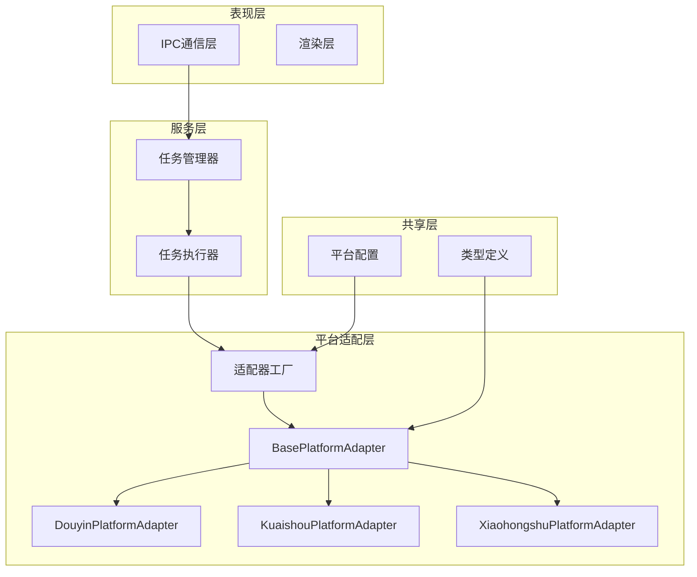
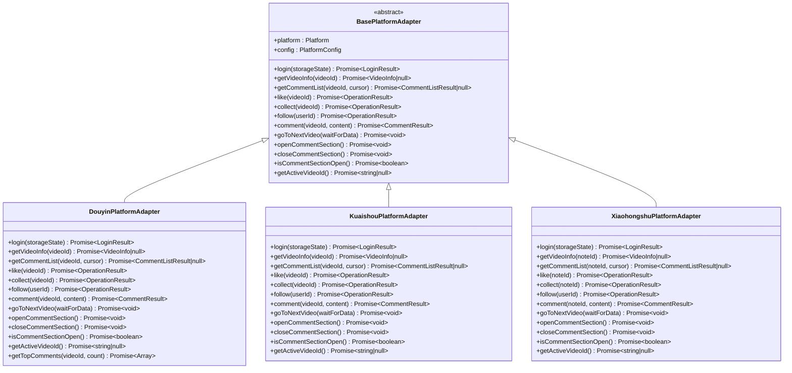
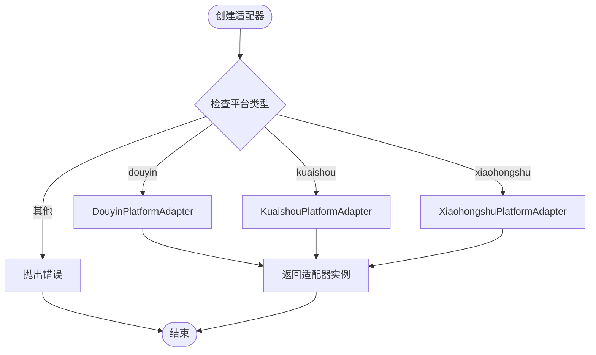
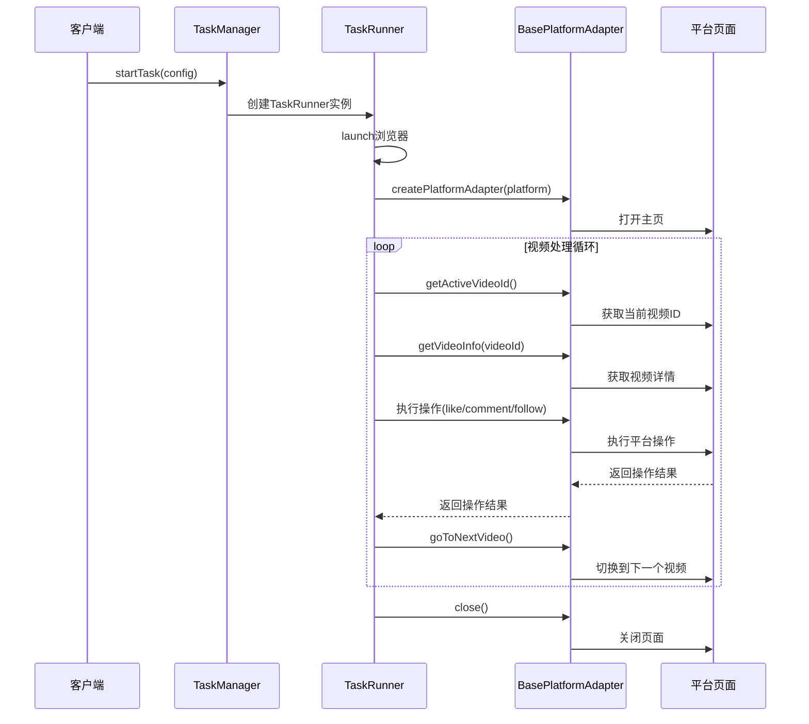
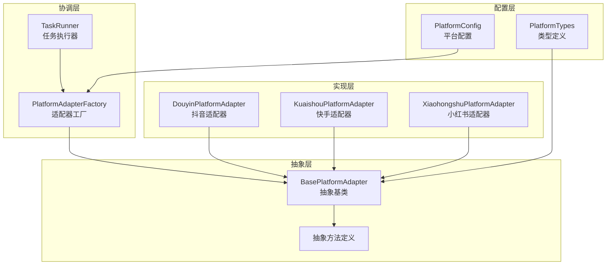
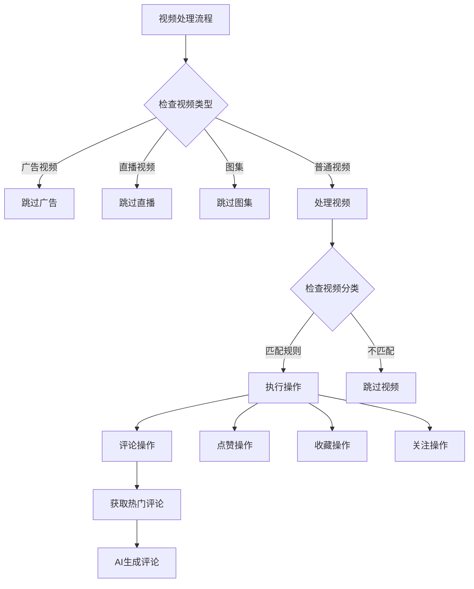
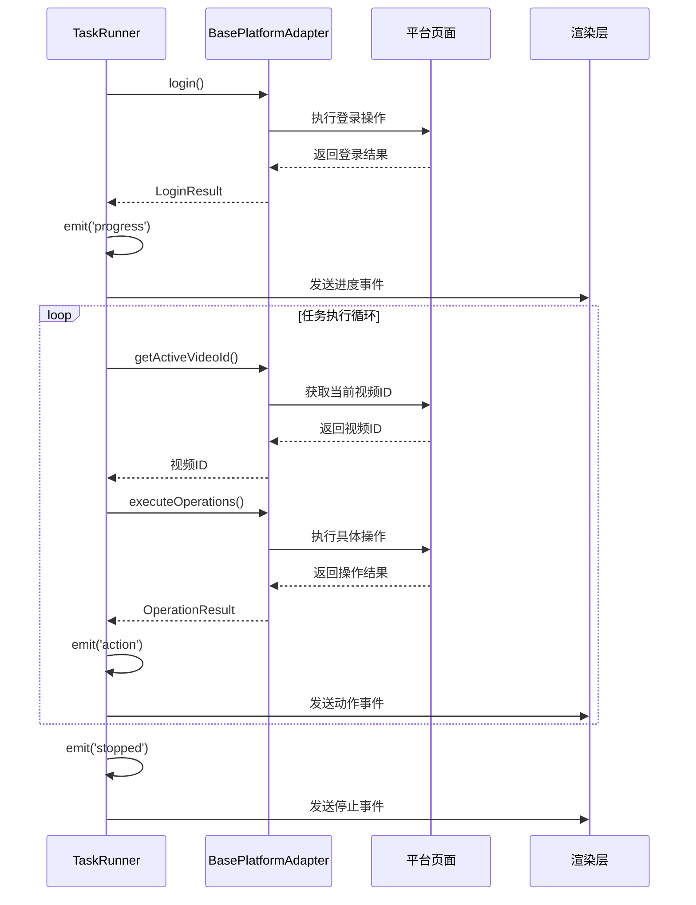
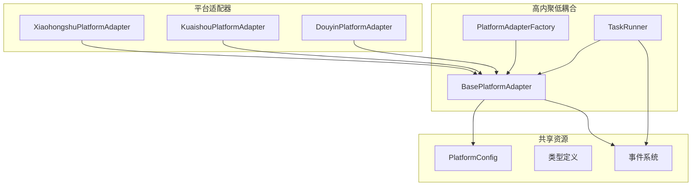

# 适配器架构设计

<cite>
**本文档引用的文件**
- [src/main/platform/base.ts](file://src/main/platform/base.ts)
- [src/main/platform/factory.ts](file://src/main/platform/factory.ts)
- [src/main/platform/douyin/index.ts](file://src/main/platform/douyin/index.ts)
- [src/main/platform/kuaishou/index.ts](file://src/main/platform/kuaishou/index.ts)
- [src/main/platform/xiaohongshu/index.ts](file://src/main/platform/xiaohongshu/index.ts)
- [src/main/service/task-runner.ts](file://src/main/service/task-runner.ts)
- [src/shared/platform.ts](file://src/shared/platform.ts)
- [src/main/ipc/task.ts](file://src/main/ipc/task.ts)
- [src/main/service/task-manager.ts](file://src/main/service/task-manager.ts)
</cite>

## 目录
1. [简介](#简介)
2. [项目结构](#项目结构)
3. [核心组件](#核心组件)
4. [架构概览](#架构概览)
5. [详细组件分析](#详细组件分析)
6. [依赖关系分析](#依赖关系分析)
7. [性能考虑](#性能考虑)
8. [故障排除指南](#故障排除指南)
9. [结论](#结论)

## 简介

AutoOps项目采用适配器模式构建了一个高度可扩展的多平台自动化系统。该架构通过BasePlatformAdapter抽象基类实现了统一的接口定义，使得不同社交平台（抖音、快手、小红书）能够以一致的方式进行操作，同时保持各自的平台特定实现。

本架构的核心设计理念是：
- **统一接口**：通过抽象基类定义标准化的操作方法
- **平台无关**：上层逻辑无需关心具体平台差异
- **可扩展性**：轻松添加新的平台支持
- **代码复用**：共享通用的业务逻辑和控制流程

## 项目结构

AutoOps项目采用分层架构设计，主要分为以下几个层次：

**图表来源**
- [src/main/platform/base.ts:24-80](file://src/main/platform/base.ts#L24-L80)
- [src/main/platform/factory.ts:7-18](file://src/main/platform/factory.ts#L7-L18)
- [src/main/service/task-runner.ts:25-50](file://src/main/service/task-runner.ts#L25-L50)

**章节来源**
- [src/main/platform/base.ts:1-105](file://src/main/platform/base.ts#L1-L105)
- [src/main/platform/factory.ts:1-32](file://src/main/platform/factory.ts#L1-L32)
- [src/shared/platform.ts:1-260](file://src/shared/platform.ts#L1-L260)

## 核心组件

### BasePlatformAdapter 抽象基类

BasePlatformAdapter是整个适配器架构的核心，它定义了所有平台必须实现的标准接口：

#### 抽象方法定义

**图表来源**
- [src/main/platform/base.ts:24-44](file://src/main/platform/base.ts#L24-L44)
- [src/main/platform/douyin/index.ts:60-71](file://src/main/platform/douyin/index.ts#L60-L71)
- [src/main/platform/kuaishou/index.ts:22-33](file://src/main/platform/kuaishou/index.ts#L22-L33)
- [src/main/platform/xiaohongshu/index.ts:23-34](file://src/main/platform/xiaohongshu/index.ts#L23-L34)

#### 默认实现和扩展点

BasePlatformAdapter提供了以下默认实现：

1. **页面管理**：setPage()和clearPage()方法管理Playwright页面实例
2. **缓存机制**：getVideoCache()和setVideoCache()提供视频数据缓存
3. **日志系统**：log()方法提供统一的日志格式化输出
4. **元素查找**：getActiveVideoElement()提供通用的视频元素查找

**章节来源**
- [src/main/platform/base.ts:24-80](file://src/main/platform/base.ts#L24-L80)

### 平台适配器工厂

PlatformAdapterFactory负责根据平台类型创建相应的适配器实例：

**图表来源**
- [src/main/platform/factory.ts:7-18](file://src/main/platform/factory.ts#L7-L18)

**章节来源**
- [src/main/platform/factory.ts:1-32](file://src/main/platform/factory.ts#L1-L32)

### TaskRunner 任务执行器

TaskRunner是任务调度的核心组件，它协调适配器与平台之间的交互：

**图表来源**
- [src/main/service/task-runner.ts:55-113](file://src/main/service/task-runner.ts#L55-L113)
- [src/main/service/task-runner.ts:235-371](file://src/main/service/task-runner.ts#L235-L371)

**章节来源**
- [src/main/service/task-runner.ts:25-760](file://src/main/service/task-runner.ts#L25-L760)

## 架构概览

AutoOps的适配器架构遵循了经典的适配器模式设计原则：

**图表来源**
- [src/main/platform/base.ts:24-44](file://src/main/platform/base.ts#L24-L44)
- [src/main/platform/factory.ts:7-18](file://src/main/platform/factory.ts#L7-L18)
- [src/main/service/task-runner.ts:25-50](file://src/main/service/task-runner.ts#L25-L50)

### 设计模式应用

1. **适配器模式**：BasePlatformAdapter作为抽象接口，各平台适配器实现具体功能
2. **工厂模式**：PlatformAdapterFactory负责对象创建
3. **策略模式**：不同平台的操作策略通过适配器实现
4. **观察者模式**：EventEmitter用于事件通信

**章节来源**
- [src/main/platform/base.ts:24-80](file://src/main/platform/base.ts#L24-L80)
- [src/main/platform/factory.ts:7-18](file://src/main/platform/factory.ts#L7-L18)
- [src/main/service/task-runner.ts:25-50](file://src/main/service/task-runner.ts#L25-L50)

## 详细组件分析

### BasePlatformAdapter 抽象基类详解

BasePlatformAdapter定义了完整的平台抽象接口：

#### 统一接口定义

| 方法类别 | 方法签名 | 描述 |
|---------|----------|------|
| 登录认证 | `login(storageState)` | 用户登录验证 |
| 视频操作 | `getVideoInfo(videoId)` | 获取视频详细信息 |
| 评论操作 | `getCommentList(videoId, cursor)` | 获取评论列表 |
| 互动操作 | `like(videoId)`, `collect(videoId)`, `follow(userId)` | 基础互动操作 |
| 评论功能 | `comment(videoId, content)` | 发布评论 |
| 导航控制 | `goToNextVideo(waitForData)`, `openCommentSection()`, `closeCommentSection()` | 页面导航和交互 |
| 状态查询 | `isCommentSectionOpen()`, `getActiveVideoId()` | 页面状态检查 |

#### 平台无关的操作方法

BasePlatformAdapter提供了多个平台无关的方法：

1. **缓存管理**：通过setVideoCache()和getVideoCache()实现跨平台的数据缓存
2. **页面管理**：setPage()方法统一管理Playwright页面实例
3. **日志系统**：log()方法提供统一的日志格式化输出，包含平台标识和表情符号
4. **元素查找**：getActiveVideoElement()提供通用的视频元素查找机制

**章节来源**
- [src/main/platform/base.ts:24-80](file://src/main/platform/base.ts#L24-L80)

### 平台特定实现策略

#### 抖音平台适配器 (DouyinPlatformAdapter)

DouyinPlatformAdapter实现了抖音平台特有的功能：

**图表来源**
- [src/main/platform/douyin/index.ts:188-196](file://src/main/platform/douyin/index.ts#L188-L196)
- [src/main/service/task-runner.ts:614-679](file://src/main/service/task-runner.ts#L614-L679)

#### 快手平台适配器 (KuaishouPlatformAdapter)

KuaishouPlatformAdapter专注于快手平台的特色功能：

1. **简化实现**：相比抖音，快手的评论功能相对简单
2. **统一接口**：通过抽象基类实现与其他平台的一致性
3. **平台特定优化**：针对快手的UI结构进行优化

#### 小红书平台适配器 (XiaohongshuPlatformAdapter)

XiaohongshuPlatformAdapter处理小红书笔记内容：

1. **笔记概念**：小红书使用"笔记"而非"视频"的概念
2. **UI差异**：针对小红书独特的界面布局进行适配
3. **功能映射**：将小红书的功能映射到统一的抽象接口

**章节来源**
- [src/main/platform/douyin/index.ts:60-494](file://src/main/platform/douyin/index.ts#L60-L494)
- [src/main/platform/kuaishou/index.ts:22-253](file://src/main/platform/kuaishou/index.ts#L22-L253)
- [src/main/platform/xiaohongshu/index.ts:23-264](file://src/main/platform/xiaohongshu/index.ts#L23-L264)

### 适配器与TaskRunner的交互机制

#### 事件通信机制

TaskRunner通过EventEmitter与上层系统进行通信：

**图表来源**
- [src/main/service/task-runner.ts:63-64](file://src/main/service/task-runner.ts#L63-L64)
- [src/main/service/task-runner.ts:339-340](file://src/main/service/task-runner.ts#L339-L340)
- [src/main/service/task-runner.ts:370-371](file://src/main/service/task-runner.ts#L370-L371)

#### 数据传递方式

1. **配置传递**：TaskRunner通过TaskRunConfig传递平台配置
2. **状态同步**：通过EventEmitter在各组件间传递状态变化
3. **缓存共享**：视频数据通过Map缓存实现跨组件共享
4. **错误传播**：异常通过Promise链路向上传播

**章节来源**
- [src/main/service/task-runner.ts:15-21](file://src/main/service/task-runner.ts#L15-L21)
- [src/main/service/task-runner.ts:63-64](file://src/main/service/task-runner.ts#L63-L64)
- [src/main/service/task-runner.ts:339-340](file://src/main/service/task-runner.ts#L339-L340)

## 依赖关系分析

### 组件耦合度分析

**图表来源**
- [src/main/platform/base.ts:1-12](file://src/main/platform/base.ts#L1-L12)
- [src/main/service/task-runner.ts:1-13](file://src/main/service/task-runner.ts#L1-L13)

### 外部依赖集成

AutoOps项目的主要外部依赖：

1. **Playwright**：用于浏览器自动化和页面操作
2. **Electron**：提供桌面应用框架和IPC通信
3. **EventEmitter**：实现事件驱动的异步通信
4. **TypeScript**：提供类型安全的开发体验

**章节来源**
- [src/main/platform/base.ts:1-2](file://src/main/platform/base.ts#L1-L2)
- [src/main/service/task-runner.ts:1-13](file://src/main/service/task-runner.ts#L1-L13)

## 性能考虑

### 缓存策略

1. **视频数据缓存**：通过Map结构缓存视频元数据，避免重复请求
2. **页面状态缓存**：缓存登录状态和用户信息
3. **配置缓存**：缓存平台配置信息减少重复初始化

### 并发控制

1. **任务队列**：TaskManager实现任务排队和并发控制
2. **浏览器共享**：多个任务可以共享同一个浏览器实例
3. **账号策略**：支持基于账号的并发限制和冷却时间

### 错误处理

1. **重试机制**：对网络请求和页面操作实现重试逻辑
2. **超时控制**：为关键操作设置合理的超时时间
3. **降级策略**：当AI服务不可用时提供备用方案

## 故障排除指南

### 常见问题及解决方案

#### 适配器创建失败

**问题症状**：创建适配器时抛出"不支持的平台"错误

**可能原因**：
1. 平台类型不在支持列表中
2. 适配器类未正确导入
3. 平台配置缺失

**解决步骤**：
1. 检查平台类型是否在supportedPlatforms列表中
2. 确认适配器类已正确导入
3. 验证平台配置是否完整

#### 页面操作失败

**问题症状**：适配器无法找到页面元素或执行操作

**可能原因**：
1. 页面元素选择器过期
2. 页面加载时机不当
3. 网络请求失败

**解决步骤**：
1. 更新平台选择器配置
2. 添加适当的等待和重试逻辑
3. 检查网络连接和代理设置

#### 事件通信异常

**问题症状**：任务状态更新无法到达前端

**可能原因**：
1. IPC通道断开
2. 事件监听器未正确注册
3. 序列化错误

**解决步骤**：
1. 检查IPC连接状态
2. 确认事件监听器注册顺序
3. 验证事件数据格式

**章节来源**
- [src/main/platform/factory.ts:15-17](file://src/main/platform/factory.ts#L15-L17)
- [src/main/platform/base.ts:68-79](file://src/main/platform/base.ts#L68-L79)
- [src/main/ipc/task.ts:22-76](file://src/main/ipc/task.ts#L22-L76)

## 结论

AutoOps项目的适配器架构设计体现了良好的软件工程实践：

### 架构优势

1. **高度可扩展性**：通过抽象基类和工厂模式，轻松添加新平台支持
2. **代码复用性**：共享的业务逻辑和控制流程减少了重复代码
3. **维护便利性**：平台特定的实现与通用逻辑分离，便于维护
4. **测试友好性**：抽象接口便于单元测试和模拟对象的创建

### 设计亮点

1. **统一抽象**：BasePlatformAdapter提供了清晰的抽象边界
2. **事件驱动**：基于EventEmitter的异步通信机制
3. **配置驱动**：通过配置文件实现平台差异的最小化
4. **错误处理**：完善的错误处理和重试机制

### 改进建议

1. **类型安全**：进一步利用TypeScript的类型系统增强类型安全性
2. **监控集成**：添加更详细的性能监控和日志记录
3. **配置热更新**：支持运行时修改平台配置而无需重启
4. **插件系统**：考虑引入插件机制支持第三方扩展

该架构为AutoOps项目提供了一个坚实的基础，使其能够在不断演进的社交媒体环境中保持灵活性和可维护性。