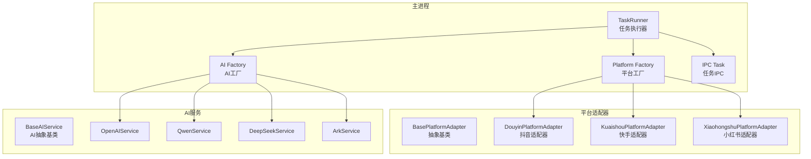
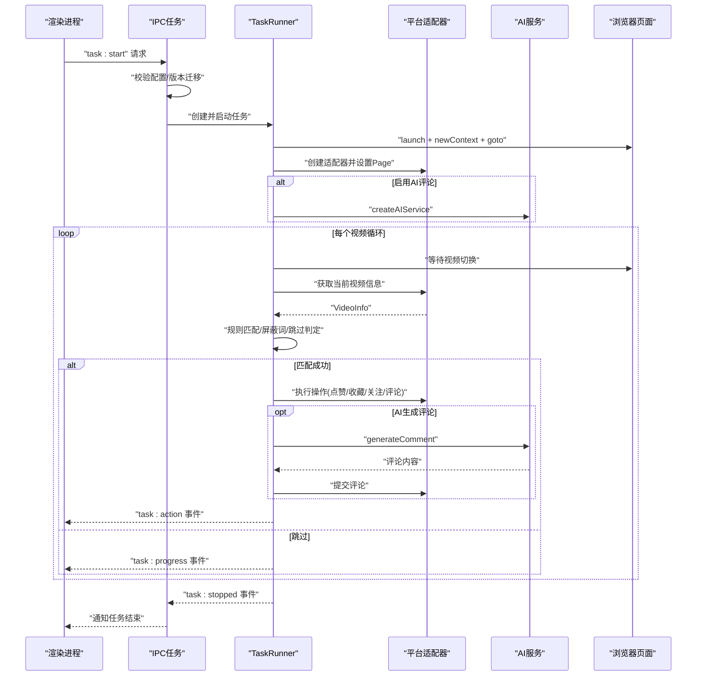
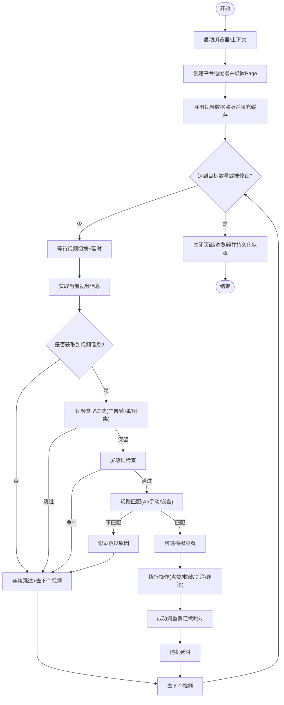
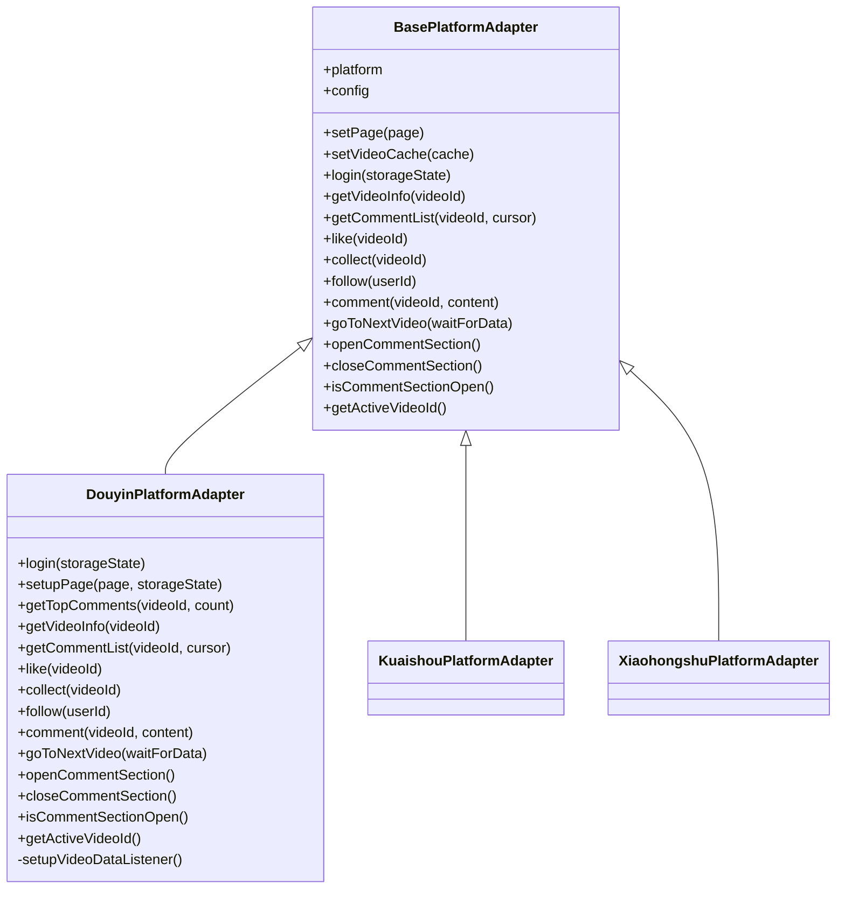
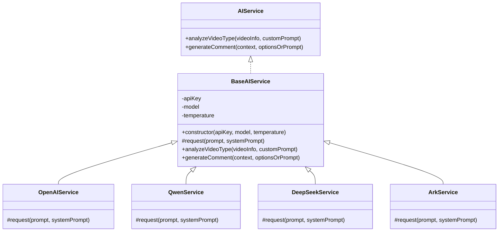
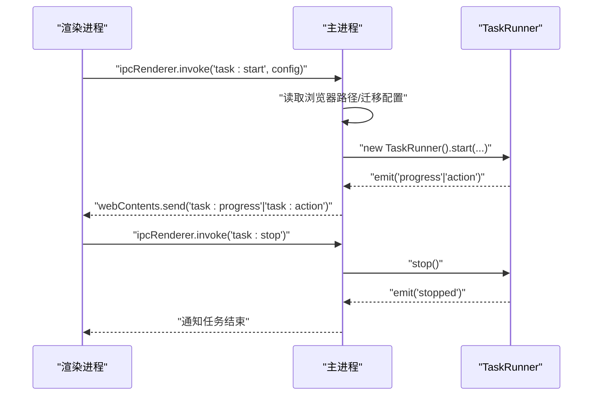
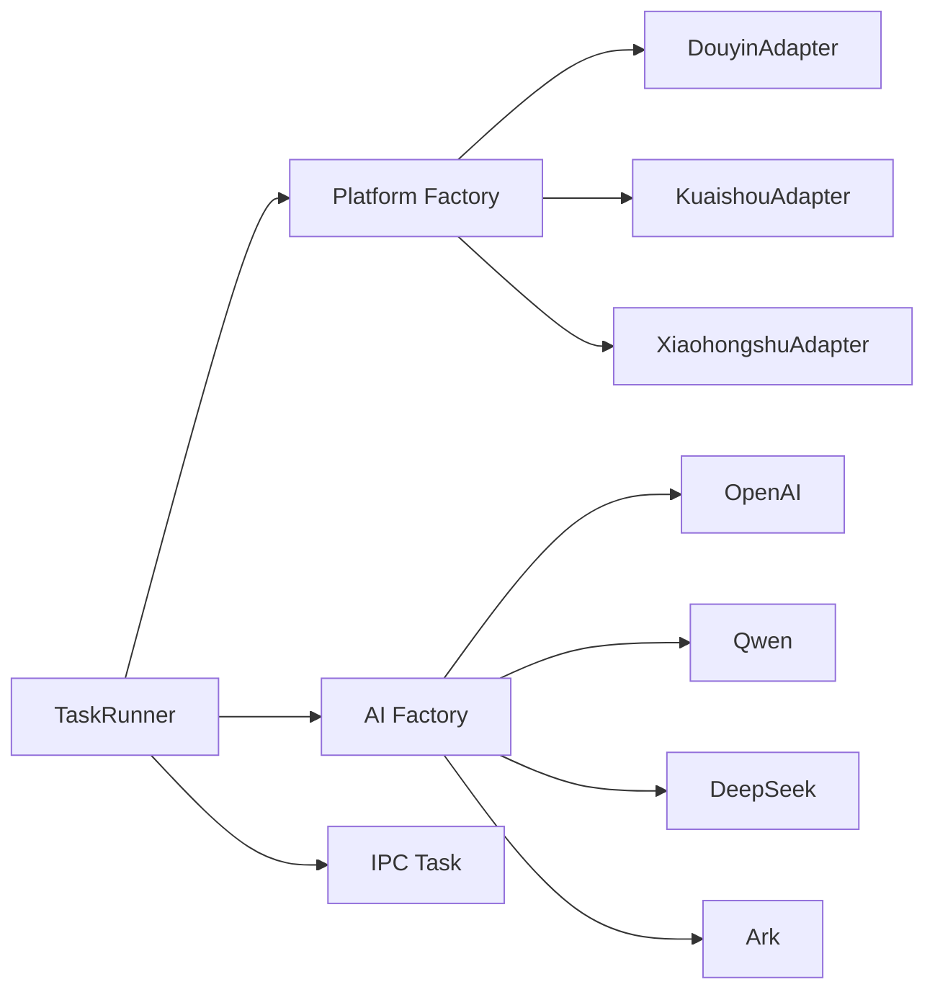

# 核心模块

<cite>
**本文引用的文件**
- [src/main/service/task-runner.ts](file://src/main/service/task-runner.ts)
- [src/main/platform/base.ts](file://src/main/platform/base.ts)
- [src/main/platform/factory.ts](file://src/main/platform/factory.ts)
- [src/main/platform/douyin/index.ts](file://src/main/platform/douyin/index.ts)
- [src/main/integration/ai/base.ts](file://src/main/integration/ai/base.ts)
- [src/main/integration/ai/factory.ts](file://src/main/integration/ai/factory.ts)
- [src/main/integration/ai/openai.ts](file://src/main/integration/ai/openai.ts)
- [src/main/integration/ai/qwen.ts](file://src/main/integration/ai/qwen.ts)
- [src/main/integration/ai/deepseek.ts](file://src/main/integration/ai/deepseek.ts)
- [src/main/integration/ai/ark.ts](file://src/main/integration/ai/ark.ts)
- [src/main/ipc/task.ts](file://src/main/ipc/task.ts)
- [src/shared/platform.ts](file://src/shared/platform.ts)
- [src/shared/ai-setting.ts](file://src/shared/ai-setting.ts)
- [src/shared/feed-ac-setting.ts](file://src/shared/feed-ac-setting.ts)
</cite>

## 目录
1. [简介](#简介)
2. [项目结构](#项目结构)
3. [核心组件](#核心组件)
4. [架构总览](#架构总览)
5. [详细组件分析](#详细组件分析)
6. [依赖分析](#依赖分析)
7. [性能考虑](#性能考虑)
8. [故障排查指南](#故障排查指南)
9. [结论](#结论)
10. [附录](#附录)

## 简介
本文件面向AutoOps核心模块，系统性梳理任务执行器（TaskRunner）、平台适配器体系、AI服务集成与IPC通信机制。文档聚焦以下目标：
- 阐述TaskRunner的任务生命周期、规则匹配、操作执行与错误处理策略
- 解释平台适配器的抽象设计、工厂模式与扩展点
- 描述AI服务统一接口、多厂商适配与评论生成流程
- 展示IPC层如何桥接主进程与渲染进程，驱动任务启停与状态回传
- 提供模块间依赖关系、数据流与事件流图示，并给出可落地的最佳实践与扩展建议

## 项目结构
AutoOps采用“主进程服务 + 平台适配器 + AI服务 + IPC桥接”的分层组织方式：
- 主进程服务层：任务执行器负责浏览器自动化、规则匹配、操作调度与日志事件
- 平台适配器层：基于Playwright封装各平台的页面交互细节，统一抽象接口
- AI服务层：统一AI服务接口，按平台实现具体请求逻辑
- IPC层：提供任务启停、状态上报等主渲染通信能力

图表来源
- [src/main/service/task-runner.ts:23-85](file://src/main/service/task-runner.ts#L23-L85)
- [src/main/platform/factory.ts:7-18](file://src/main/platform/factory.ts#L7-L18)
- [src/main/platform/base.ts:24-80](file://src/main/platform/base.ts#L24-L80)
- [src/main/platform/douyin/index.ts:56-105](file://src/main/platform/douyin/index.ts#L56-L105)
- [src/main/integration/ai/base.ts:23-60](file://src/main/integration/ai/base.ts#L23-L60)
- [src/main/integration/ai/factory.ts:16-25](file://src/main/integration/ai/factory.ts#L16-L25)
- [src/main/ipc/task.ts:11-103](file://src/main/ipc/task.ts#L11-L103)

章节来源
- [src/main/service/task-runner.ts:1-608](file://src/main/service/task-runner.ts#L1-L608)
- [src/main/platform/base.ts:1-105](file://src/main/platform/base.ts#L1-L105)
- [src/main/platform/factory.ts:1-32](file://src/main/platform/factory.ts#L1-L32)
- [src/main/platform/douyin/index.ts:1-507](file://src/main/platform/douyin/index.ts#L1-L507)
- [src/main/integration/ai/base.ts:1-131](file://src/main/integration/ai/base.ts#L1-L131)
- [src/main/integration/ai/factory.ts:1-27](file://src/main/integration/ai/factory.ts#L1-L27)
- [src/main/ipc/task.ts:1-104](file://src/main/ipc/task.ts#L1-L104)
- [src/shared/platform.ts:1-260](file://src/shared/platform.ts#L1-L260)
- [src/shared/ai-setting.ts:1-29](file://src/shared/ai-setting.ts#L1-L29)
- [src/shared/feed-ac-setting.ts:1-149](file://src/shared/feed-ac-setting.ts#L1-L149)

## 核心组件
- 任务执行器（TaskRunner）
  - 职责：启动/停止浏览器上下文、注入平台适配器、监听视频数据、执行规则匹配与操作、上报进度与动作事件、管理账号存储状态
  - 关键流程：启动 -> 导航首页 -> 初始化适配器与AI服务 -> 循环处理视频 -> 执行操作 -> 结束清理
- 平台适配器（BasePlatformAdapter + 各平台实现）
  - 职责：封装平台特定的选择器、键盘快捷键、API端点、页面交互（点赞/收藏/关注/评论/切视频）
  - 设计：抽象基类定义统一接口，子类实现具体页面逻辑
- AI服务（BaseAIService + 多厂商实现）
  - 职责：统一分析视频是否值得评论、生成评论内容；各厂商实现HTTP请求
- IPC任务（IPC Task）
  - 职责：接收渲染进程任务请求，创建/停止TaskRunner，向所有窗口广播进度与动作事件

章节来源
- [src/main/service/task-runner.ts:23-85](file://src/main/service/task-runner.ts#L23-L85)
- [src/main/platform/base.ts:24-80](file://src/main/platform/base.ts#L24-L80)
- [src/main/integration/ai/base.ts:23-60](file://src/main/integration/ai/base.ts#L23-L60)
- [src/main/ipc/task.ts:11-103](file://src/main/ipc/task.ts#L11-L103)

## 架构总览
下图展示从IPC触发到任务执行、平台适配与AI服务协作的整体流程。

图表来源
- [src/main/ipc/task.ts:11-103](file://src/main/ipc/task.ts#L11-L103)
- [src/main/service/task-runner.ts:35-245](file://src/main/service/task-runner.ts#L35-L245)
- [src/main/platform/douyin/index.ts:136-153](file://src/main/platform/douyin/index.ts#L136-L153)
- [src/main/integration/ai/base.ts:62-130](file://src/main/integration/ai/base.ts#L62-L130)

## 详细组件分析

### 任务执行器（TaskRunner）工作原理
- 生命周期与启动
  - 接收配置（浏览器路径、平台、任务类型、设置、账号ID），创建浏览器上下文并导航至平台首页
  - 注入平台适配器与共享视频缓存，监听feed响应填充缓存
  - 若启用AI评论且存在有效设置，则初始化对应AI服务实例
- 规则与过滤
  - 连续跳过阈值控制、屏蔽关键词、视频类型（广告/直播/图集）过滤
  - 支持AI规则组与手动规则组，支持父子规则组嵌套与“与/或”关系
- 操作执行
  - 单任务与组合任务两种模式，支持概率触发与最大次数限制
  - 评论前可检查活跃度、AI生成评论或回退备选文案
- 事件与日志
  - 通过EventEmitter发布进度与动作事件，便于UI实时反馈
  - 统一日志格式，带级别与表情符号，便于排障

图表来源
- [src/main/service/task-runner.ts:132-245](file://src/main/service/task-runner.ts#L132-L245)
- [src/main/service/task-runner.ts:299-406](file://src/main/service/task-runner.ts#L299-L406)
- [src/main/service/task-runner.ts:408-437](file://src/main/service/task-runner.ts#L408-L437)

章节来源
- [src/main/service/task-runner.ts:35-245](file://src/main/service/task-runner.ts#L35-L245)

### 平台适配器系统设计模式
- 抽象基类（BasePlatformAdapter）
  - 定义统一接口：登录、视频信息、评论列表、点赞/收藏/关注、评论、切视频、评论区开关等
  - 提供通用工具：页面注入、日志、选择器访问、视频缓存共享
- 工厂模式（createPlatformAdapter）
  - 根据平台枚举返回对应适配器实例，便于扩展新平台
- 抖音适配器（DouyinPlatformAdapter）
  - 基于Playwright实现：登录面板检测、键盘快捷键、评论区监听、验证码弹窗处理、视频ID变化等待、feed数据缓存
  - 提供热门评论抓取、活跃度判断、评论发布响应监听等

图表来源
- [src/main/platform/base.ts:24-80](file://src/main/platform/base.ts#L24-L80)
- [src/main/platform/douyin/index.ts:56-105](file://src/main/platform/douyin/index.ts#L56-L105)
- [src/main/platform/factory.ts:7-18](file://src/main/platform/factory.ts#L7-L18)

章节来源
- [src/main/platform/base.ts:24-80](file://src/main/platform/base.ts#L24-L80)
- [src/main/platform/factory.ts:7-18](file://src/main/platform/factory.ts#L7-L18)
- [src/main/platform/douyin/index.ts:69-105](file://src/main/platform/douyin/index.ts#L69-L105)

### AI服务集成架构
- 统一接口（AIService/BaseAIService）
  - analyzeVideoType：AI判断是否值得评论
  - generateComment：生成评论内容，支持风格、长度、自定义提示词与热门评论参考
- 多厂商适配（OpenAI/Qwen/DeepSeek/Ark）
  - 各自实现HTTP请求，统一超时控制与错误兜底
- 与TaskRunner协作
  - 在规则匹配阶段或评论执行阶段调用AI服务，失败时回退备选文案

图表来源
- [src/main/integration/ai/base.ts:23-60](file://src/main/integration/ai/base.ts#L23-L60)
- [src/main/integration/ai/base.ts:62-130](file://src/main/integration/ai/base.ts#L62-L130)
- [src/main/integration/ai/openai.ts:3-44](file://src/main/integration/ai/openai.ts#L3-L44)
- [src/main/integration/ai/qwen.ts:3-44](file://src/main/integration/ai/qwen.ts#L3-L44)
- [src/main/integration/ai/deepseek.ts:3-44](file://src/main/integration/ai/deepseek.ts#L3-L44)
- [src/main/integration/ai/ark.ts:3-44](file://src/main/integration/ai/ark.ts#L3-L44)
- [src/main/integration/ai/factory.ts:16-25](file://src/main/integration/ai/factory.ts#L16-L25)

章节来源
- [src/main/integration/ai/base.ts:23-130](file://src/main/integration/ai/base.ts#L23-L130)
- [src/main/integration/ai/factory.ts:9-25](file://src/main/integration/ai/factory.ts#L9-L25)

### IPC通信机制
- 任务启停
  - 渲染进程通过ipcRenderer调用ipcMain.handle('task:start'|'task:stop')
  - 主进程校验配置、创建/停止TaskRunner，并在事件回调中向所有窗口发送任务进度与动作事件
- 事件广播
  - progress/action/stopped事件通过webContents.send广播到渲染进程，驱动UI更新

图表来源
- [src/main/ipc/task.ts:11-103](file://src/main/ipc/task.ts#L11-L103)

章节来源
- [src/main/ipc/task.ts:11-103](file://src/main/ipc/task.ts#L11-L103)

## 依赖分析
- 模块耦合
  - TaskRunner依赖平台工厂与AI工厂，通过接口解耦具体实现
  - 平台适配器依赖共享配置（选择器、API端点、快捷键）与Playwright Page对象
  - AI服务依赖统一接口，通过工厂按平台注入
- 外部依赖
  - Playwright用于浏览器自动化
  - Electron IPC用于主渲染通信
  - 存储（Electron Store）用于持久化认证状态与设置
- 潜在循环依赖
  - 当前结构清晰，无明显循环导入；新增平台或AI服务需遵循工厂注入原则避免耦合

图表来源
- [src/main/service/task-runner.ts:67-80](file://src/main/service/task-runner.ts#L67-L80)
- [src/main/platform/factory.ts:7-18](file://src/main/platform/factory.ts#L7-L18)
- [src/main/integration/ai/factory.ts:16-25](file://src/main/integration/ai/factory.ts#L16-L25)
- [src/main/ipc/task.ts:49-71](file://src/main/ipc/task.ts#L49-L71)

章节来源
- [src/main/service/task-runner.ts:67-80](file://src/main/service/task-runner.ts#L67-L80)
- [src/main/platform/factory.ts:7-18](file://src/main/platform/factory.ts#L7-L18)
- [src/main/integration/ai/factory.ts:9-25](file://src/main/integration/ai/factory.ts#L9-L25)
- [src/main/ipc/task.ts:49-71](file://src/main/ipc/task.ts#L49-L71)

## 性能考虑
- 浏览器与上下文复用
  - 任务期间保持同一浏览器与上下文，减少启动开销；任务结束后持久化storageState，避免重复登录
- 数据缓存与异步监听
  - 通过feed响应监听填充视频缓存，降低重复请求与DOM查询成本
- 随机化与节流
  - 模拟人类行为（随机延时、随机概率触发），降低风控风险
- AI请求超时与回退
  - 设置统一超时与JSON解析兜底，确保任务不因AI失败而中断

## 故障排查指南
- 无法启动任务
  - 检查浏览器可执行路径是否配置；确认当前无任务运行
- 页面未登录或状态丢失
  - 查看storageState持久化是否成功；必要时重新登录并保存状态
- 评论失败或验证码弹窗
  - 适配器已处理验证码等待；若长时间未消失，检查网络与账号安全策略
- 规则不生效或频繁跳过
  - 检查屏蔽词、规则组配置与连续跳过阈值；适当提高阈值或调整规则
- AI评论异常
  - 确认AI平台、模型与密钥配置；查看日志中的AI请求与解析错误

章节来源
- [src/main/ipc/task.ts:27-36](file://src/main/ipc/task.ts#L27-L36)
- [src/main/platform/douyin/index.ts:335-342](file://src/main/platform/douyin/index.ts#L335-L342)
- [src/main/integration/ai/base.ts:48-59](file://src/main/integration/ai/base.ts#L48-L59)

## 结论
AutoOps通过TaskRunner统一编排、平台适配器抽象与AI服务插件化，构建了高内聚、低耦合的核心执行框架。IPC层将主进程能力暴露给渲染进程，形成完整的任务生命周期闭环。该架构便于扩展新平台与新AI服务，同时提供完善的事件与日志体系，便于运维与排障。

## 附录
- 最佳实践
  - 新增平台：实现BasePlatformAdapter并注册到工厂；补充选择器、API端点与快捷键配置
  - 新增AI服务：实现BaseAIService并注册到AI工厂；确保超时与错误处理一致
  - 规则设计：优先使用AI规则组结合热门评论参考，提升评论质量与互动率
  - 任务参数：合理设置连续跳过阈值、视频切换等待时间与模拟观看区间，平衡效率与稳定性
- 扩展点
  - 平台扩展：在platform目录新增适配器并在factory导出
  - AI扩展：在integration/ai新增服务并在factory映射
  - 事件扩展：在TaskRunner中增加新的事件类型，IPC广播到渲染进程