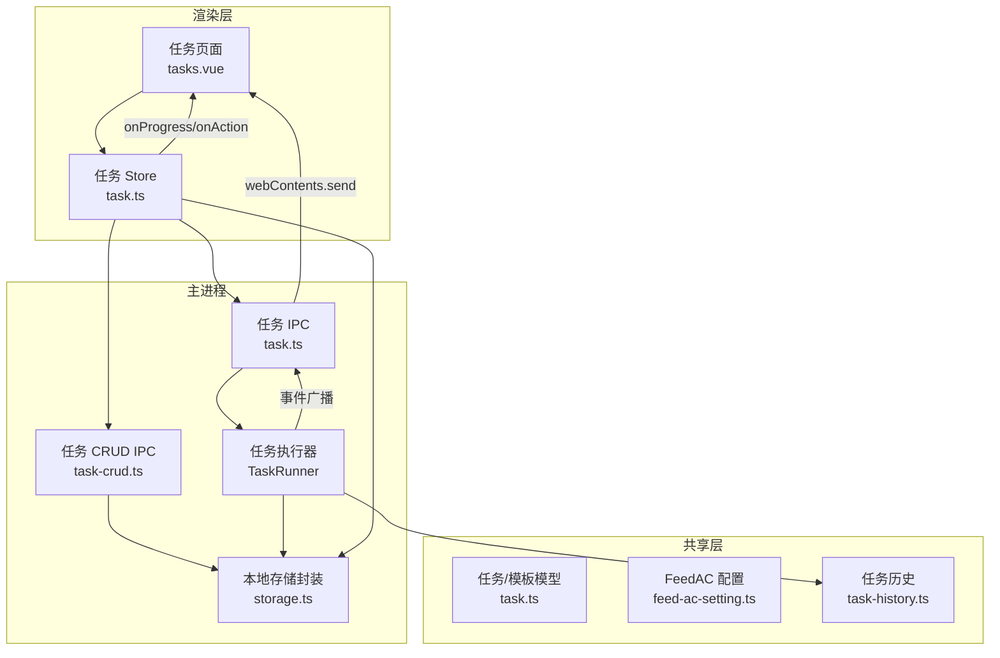
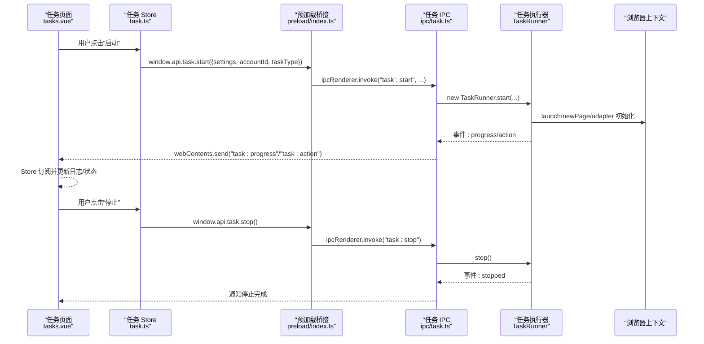
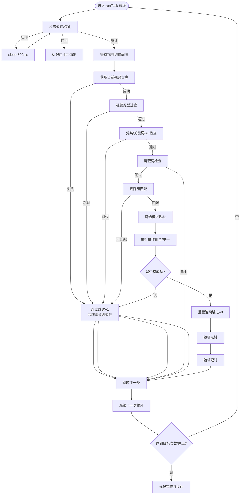
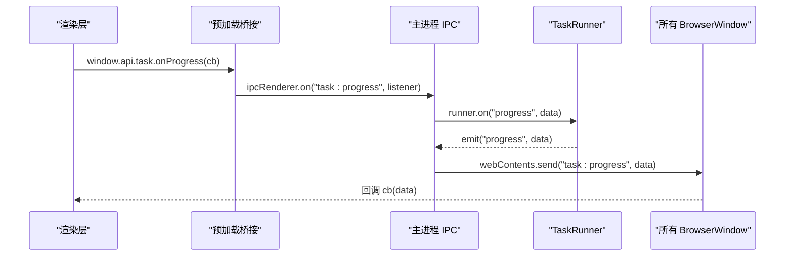
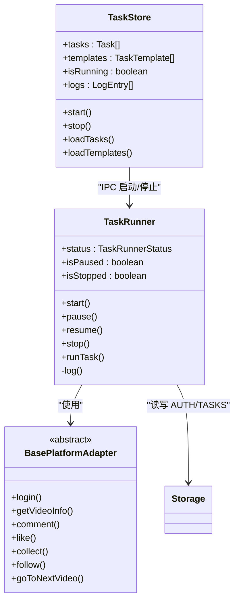

# 任务状态管理

<cite>
**本文引用的文件**
- [src/main/service/task-runner.ts](file://src/main/service/task-runner.ts)
- [src/renderer/src/stores/task.ts](file://src/renderer/src/stores/task.ts)
- [src/shared/task.ts](file://src/shared/task.ts)
- [src/main/ipc/task.ts](file://src/main/ipc/task.ts)
- [src/main/ipc/task-crud.ts](file://src/main/ipc/task-crud.ts)
- [src/shared/feed-ac-setting.ts](file://src/shared/feed-ac-setting.ts)
- [src/main/utils/storage.ts](file://src/main/utils/storage.ts)
- [src/preload/index.ts](file://src/preload/index.ts)
- [src/renderer/src/pages/tasks.vue](file://src/renderer/src/pages/tasks.vue)
- [src/shared/task-history.ts](file://src/shared/task-history.ts)
- [src/main/platform/base.ts](file://src/main/platform/base.ts)
- [src/main/ipc/task-detail.ts](file://src/main/ipc/task-detail.ts)
- [src/main/ipc/task-history.ts](file://src/main/ipc/task-history.ts)
</cite>

## 目录
1. [简介](#简介)
2. [项目结构](#项目结构)
3. [核心组件](#核心组件)
4. [架构总览](#架构总览)
5. [详细组件分析](#详细组件分析)
6. [依赖关系分析](#依赖关系分析)
7. [性能考量](#性能考量)
8. [故障排查指南](#故障排查指南)
9. [结论](#结论)
10. [附录](#附录)

## 简介
本文件系统化阐述 AutoOps 的任务状态管理模块，围绕 TaskStore 的设计与实现展开，覆盖任务列表管理、模板管理、任务执行状态跟踪与日志记录机制；详解任务生命周期（创建、启动、执行、停止）、响应式更新机制、IPC 通信集成与异步处理；同时给出任务模板的保存与加载、任务克隆实现、状态持久化策略、性能优化建议与错误处理方案，并解释日志系统与调试方法。

## 项目结构
任务状态管理涉及三层：渲染层（Vue + Pinia Store）、主进程（Electron IPC + 业务服务）、共享层（数据模型与配置）。关键路径如下：
- 渲染层：任务页面与 Store 负责用户交互、状态展示与 IPC 调用
- 主进程：IPC 注册与路由、TaskRunner 执行引擎、存储封装
- 共享层：任务与模板数据模型、FeedAC 配置、任务历史记录

图表来源
- [src/renderer/src/pages/tasks.vue:1-867](file://src/renderer/src/pages/tasks.vue#L1-L867)
- [src/renderer/src/stores/task.ts:1-192](file://src/renderer/src/stores/task.ts#L1-L192)
- [src/main/ipc/task.ts:1-104](file://src/main/ipc/task.ts#L1-L104)
- [src/main/ipc/task-crud.ts:1-108](file://src/main/ipc/task-crud.ts#L1-L108)
- [src/main/service/task-runner.ts:1-760](file://src/main/service/task-runner.ts#L1-L760)
- [src/main/utils/storage.ts:1-46](file://src/main/utils/storage.ts#L1-L46)
- [src/shared/task.ts:1-54](file://src/shared/task.ts#L1-L54)
- [src/shared/feed-ac-setting.ts:1-149](file://src/shared/feed-ac-setting.ts#L1-L149)
- [src/shared/task-history.ts:1-26](file://src/shared/task-history.ts#L1-L26)

章节来源
- [src/renderer/src/pages/tasks.vue:1-867](file://src/renderer/src/pages/tasks.vue#L1-L867)
- [src/renderer/src/stores/task.ts:1-192](file://src/renderer/src/stores/task.ts#L1-L192)
- [src/main/ipc/task.ts:1-104](file://src/main/ipc/task.ts#L1-L104)
- [src/main/ipc/task-crud.ts:1-108](file://src/main/ipc/task-crud.ts#L1-L108)
- [src/main/service/task-runner.ts:1-760](file://src/main/service/task-runner.ts#L1-L760)
- [src/main/utils/storage.ts:1-46](file://src/main/utils/storage.ts#L1-L46)
- [src/shared/task.ts:1-54](file://src/shared/task.ts#L1-L54)
- [src/shared/feed-ac-setting.ts:1-149](file://src/shared/feed-ac-setting.ts#L1-L149)
- [src/shared/task-history.ts:1-26](file://src/shared/task-history.ts#L1-L26)

## 核心组件
- 任务 Store（Pinia）
  - 负责任务列表、模板列表、当前任务、运行状态、日志队列的响应式状态
  - 提供任务 CRUD、克隆、模板保存/删除、启动/停止任务等接口
  - 通过 window.api 与主进程 IPC 通信，订阅进度与动作事件
- 任务执行器（TaskRunner）
  - 基于 Playwright 控制浏览器上下文，驱动平台适配器执行具体操作
  - 内部维护任务状态（运行/暂停/停止/完成/失败）、并发控制与重试逻辑
  - 通过事件发射器向主进程广播进度与动作，最终触发 UI 更新
- IPC 层
  - 任务 IPC：启动/停止/查询状态；将 Runner 事件广播至所有窗口
  - 任务 CRUD IPC：任务与模板的增删改查、克隆
  - 任务历史 IPC：历史记录的增删改查与状态更新
- 存储层
  - electron-store 封装，键空间包含任务、模板、历史、账号、浏览器路径等
- 共享模型
  - 任务/模板数据结构、FeedAC 配置（含规则组、屏蔽词、AI 评论等）、任务历史记录

章节来源
- [src/renderer/src/stores/task.ts:1-192](file://src/renderer/src/stores/task.ts#L1-L192)
- [src/main/service/task-runner.ts:1-760](file://src/main/service/task-runner.ts#L1-L760)
- [src/main/ipc/task.ts:1-104](file://src/main/ipc/task.ts#L1-L104)
- [src/main/ipc/task-crud.ts:1-108](file://src/main/ipc/task-crud.ts#L1-L108)
- [src/main/ipc/task-detail.ts:1-39](file://src/main/ipc/task-detail.ts#L1-L39)
- [src/main/ipc/task-history.ts:1-45](file://src/main/ipc/task-history.ts#L1-L45)
- [src/main/utils/storage.ts:1-46](file://src/main/utils/storage.ts#L1-L46)
- [src/shared/task.ts:1-54](file://src/shared/task.ts#L1-L54)
- [src/shared/feed-ac-setting.ts:1-149](file://src/shared/feed-ac-setting.ts#L1-L149)
- [src/shared/task-history.ts:1-26](file://src/shared/task-history.ts#L1-L26)

## 架构总览
任务状态管理采用“渲染层 Store + 主进程 IPC + 执行器”的分层设计，配合共享模型与本地存储，形成完整的任务生命周期闭环。

图表来源
- [src/renderer/src/pages/tasks.vue:226-250](file://src/renderer/src/pages/tasks.vue#L226-L250)
- [src/renderer/src/stores/task.ts:100-157](file://src/renderer/src/stores/task.ts#L100-L157)
- [src/preload/index.ts:102-116](file://src/preload/index.ts#L102-L116)
- [src/main/ipc/task.ts:11-103](file://src/main/ipc/task.ts#L11-L103)
- [src/main/service/task-runner.ts:55-233](file://src/main/service/task-runner.ts#L55-L233)

## 详细组件分析

### 任务 Store（Pinia）
- 状态与行为
  - 任务列表、模板列表、当前任务 ID、运行状态、任务 ID、日志队列
  - 提供 loadTasks/loadTemplates/createTask/updateTask/deleteTask/duplicateTask/saveAsTemplate/deleteTemplate/setCurrentTask/getTaskById/getTasksByAccount/checkStatus/start/stop
  - 订阅主进程的 progress 与 action 事件，写入本地日志并限制长度
- 生命周期与异步
  - start 中清理旧监听、清空日志、发起 IPC 启动请求、注册事件回调
  - stop 中清理监听并更新运行状态
- 与 UI 的集成
  - 通过 window.api.* 调用主进程能力，事件驱动 UI 响应式更新

章节来源
- [src/renderer/src/stores/task.ts:12-192](file://src/renderer/src/stores/task.ts#L12-L192)
- [src/renderer/src/pages/tasks.vue:226-250](file://src/renderer/src/pages/tasks.vue#L226-L250)

### 任务执行器（TaskRunner）
- 设计要点
  - 继承 EventEmitter，内部状态包括运行状态、暂停标志、停止标志、任务 ID、视频缓存、AI 服务等
  - 提供 start/startWithContext（单实例/共享上下文）、pause/resume/stop/close/runTask 等方法
  - 通过监听页面响应，构建视频缓存；根据配置执行规则匹配、类型过滤、屏蔽词检查、AI 分类与评论生成等
- 任务循环
  - 读取设置、目标次数、连续跳过阈值；在每次循环中处理暂停、等待、获取视频、类型/分类/屏蔽词校验、规则匹配、执行操作、统计与记录
  - 达到目标次数或被停止后，汇总统计并关闭资源
- 日志与事件
  - log 方法统一格式化输出并广播 progress 事件；动作成功/失败通过 action 事件上报

图表来源
- [src/main/service/task-runner.ts:235-371](file://src/main/service/task-runner.ts#L235-L371)

章节来源
- [src/main/service/task-runner.ts:25-760](file://src/main/service/task-runner.ts#L25-L760)

### IPC 通信与事件广播
- 任务 IPC
  - 提供 task:start/task:stop/task:status；启动时创建 TaskRunner 并注册 progress/action 事件广播至所有窗口
- 任务 CRUD IPC
  - 提供任务与模板的增删改查、克隆；支持按账号/平台筛选
- 任务历史 IPC
  - 提供历史记录的增删改查与状态更新；任务结束时更新结束时间与状态

图表来源
- [src/main/ipc/task.ts:51-63](file://src/main/ipc/task.ts#L51-L63)
- [src/preload/index.ts:106-115](file://src/preload/index.ts#L106-L115)

章节来源
- [src/main/ipc/task.ts:11-103](file://src/main/ipc/task.ts#L11-L103)
- [src/main/ipc/task-crud.ts:8-108](file://src/main/ipc/task-crud.ts#L8-L108)
- [src/main/ipc/task-history.ts:5-45](file://src/main/ipc/task-history.ts#L5-L45)
- [src/main/ipc/task-detail.ts:5-39](file://src/main/ipc/task-detail.ts#L5-L39)

### 数据模型与持久化
- 任务/模板模型
  - 任务包含 id、name、accountId、platform、taskType、config、createdAt、updatedAt
  - 模板包含 id、name、platform、taskType、config、createdAt
  - 默认任务生成器与模板 ID 生成器
- FeedAC 配置
  - V3 版本包含任务类型、规则组、屏蔽词、AI 评论、视频类型跳过、切换等待、连续跳过阈值等
  - 提供默认配置与版本迁移（V2->V3）
- 任务历史
  - 包含任务历史记录、视频记录、状态与统计字段
- 本地存储
  - electron-store 键空间：AUTH、FEED_AC_SETTINGS、AI_SETTINGS、BROWSER_EXEC_PATH、TASK_HISTORY、ACCOUNTS、TASKS、TASK_TEMPLATES
  - CRUD/历史/详情 IPC 读写对应键值

章节来源
- [src/shared/task.ts:5-54](file://src/shared/task.ts#L5-L54)
- [src/shared/feed-ac-setting.ts:22-149](file://src/shared/feed-ac-setting.ts#L22-L149)
- [src/shared/task-history.ts:14-26](file://src/shared/task-history.ts#L14-L26)
- [src/main/utils/storage.ts:3-46](file://src/main/utils/storage.ts#L3-L46)
- [src/main/ipc/task-crud.ts:9-108](file://src/main/ipc/task-crud.ts#L9-L108)
- [src/main/ipc/task-history.ts:5-45](file://src/main/ipc/task-history.ts#L5-L45)
- [src/main/ipc/task-detail.ts:5-39](file://src/main/ipc/task-detail.ts#L5-L39)

### 任务生命周期管理
- 创建
  - 页面创建任务，Store 调用 window.api.taskCRUD.create，主进程写入 TASKS 键
- 启动
  - Store 调用 window.api.task.start，主进程创建 TaskRunner 并初始化浏览器上下文与适配器
  - Runner 开始循环，事件广播到 UI
- 执行
  - 按配置进行类型/分类/屏蔽词/规则匹配与操作执行，记录日志与统计
- 停止
  - Store 调用 window.api.task.stop，主进程调用 Runner.stop，关闭上下文与浏览器（如适用）

章节来源
- [src/renderer/src/pages/tasks.vue:158-224](file://src/renderer/src/pages/tasks.vue#L158-L224)
- [src/renderer/src/stores/task.ts:100-157](file://src/renderer/src/stores/task.ts#L100-L157)
- [src/main/ipc/task.ts:11-103](file://src/main/ipc/task.ts#L11-L103)
- [src/main/service/task-runner.ts:55-233](file://src/main/service/task-runner.ts#L55-L233)

### 任务模板与克隆
- 模板保存
  - Store 调用 window.api['task-template'].save，主进程写入 TASK_TEMPLATES 键
- 模板加载
  - Store 调用 window.api['task-template'].getAll，主进程返回模板列表
- 任务克隆
  - Store 调用 window.api.taskCRUD.duplicate，主进程复制原任务并写回 TASKS 键

章节来源
- [src/renderer/src/stores/task.ts:61-70](file://src/renderer/src/stores/task.ts#L61-L70)
- [src/main/ipc/task-crud.ts:64-79](file://src/main/ipc/task-crud.ts#L64-L79)
- [src/renderer/src/pages/tasks.vue:212-224](file://src/renderer/src/pages/tasks.vue#L212-L224)

### 日志系统与调试
- 日志来源
  - TaskRunner.log 统一格式化并 emit progress；主进程将 progress/action 广播给所有窗口
  - Store 订阅事件并写入本地日志队列，限制长度以避免内存膨胀
- 调试建议
  - 在 preload 中保留 onProgress/onAction 的监听清理逻辑
  - 使用 window.api.debug.getEnv 获取环境信息辅助定位问题
  - 任务历史记录可用于回溯执行轨迹与统计

章节来源
- [src/main/service/task-runner.ts:746-758](file://src/main/service/task-runner.ts#L746-L758)
- [src/main/ipc/task.ts:51-63](file://src/main/ipc/task.ts#L51-L63)
- [src/renderer/src/stores/task.ts:159-167](file://src/renderer/src/stores/task.ts#L159-L167)
- [src/preload/index.ts:182-184](file://src/preload/index.ts#L182-L184)

## 依赖关系分析
- 组件耦合
  - Store 通过 window.api 与主进程解耦；主进程通过 TaskRunner 与浏览器/平台适配器解耦
  - 事件驱动（EventEmitter）降低直接依赖，便于扩展与测试
- 外部依赖
  - Playwright 浏览器自动化
  - electron-store 本地存储
  - electron-log 日志
- 潜在风险
  - 多任务共享上下文时需确保上下文隔离与资源释放
  - 事件监听器需在合适时机清理，避免内存泄漏

图表来源
- [src/renderer/src/stores/task.ts:12-192](file://src/renderer/src/stores/task.ts#L12-L192)
- [src/main/service/task-runner.ts:25-760](file://src/main/service/task-runner.ts#L25-L760)
- [src/main/platform/base.ts:24-105](file://src/main/platform/base.ts#L24-L105)
- [src/main/utils/storage.ts:14-46](file://src/main/utils/storage.ts#L14-L46)

章节来源
- [src/renderer/src/stores/task.ts:12-192](file://src/renderer/src/stores/task.ts#L12-L192)
- [src/main/service/task-runner.ts:25-760](file://src/main/service/task-runner.ts#L25-L760)
- [src/main/platform/base.ts:24-105](file://src/main/platform/base.ts#L24-L105)
- [src/main/utils/storage.ts:14-46](file://src/main/utils/storage.ts#L14-L46)

## 性能考量
- 浏览器与上下文管理
  - 单实例启动与共享上下文两种模式，合理选择以平衡资源占用与并发需求
- 事件与日志
  - 限制日志队列长度，避免 UI 卡顿；仅在必要时发送大量 progress 事件
- 网络与重试
  - 获取视频信息带重试与退避；网络请求失败时及时中断并记录
- 操作概率与组合
  - 组合任务按概率与最大次数控制，避免过度频繁操作导致风控
- 存储与序列化
  - 任务与模板使用 electron-store，注意大对象序列化成本；必要时拆分键空间

[本节为通用指导，无需列出章节来源]

## 故障排查指南
- 启动失败
  - 检查浏览器路径是否配置（BROWSER_EXEC_PATH）；确认主进程日志与 Store 的错误提示
- 无法接收进度/动作
  - 确认 onProgress/onAction 监听是否正确注册与清理；检查主进程事件广播
- 任务卡住/长时间无响应
  - 查看日志队列与最近事件；检查网络请求与页面响应监听是否正常
- 停止无效
  - 确认 isRunning 状态与 stop 返回值；检查 Runner 的停止标志位
- 任务历史缺失
  - 检查 TASK_HISTORY 键是否存在与权限；确认历史 IPC 接口调用

章节来源
- [src/main/ipc/task.ts:17-84](file://src/main/ipc/task.ts#L17-L84)
- [src/renderer/src/stores/task.ts:100-157](file://src/renderer/src/stores/task.ts#L100-L157)
- [src/main/ipc/task-history.ts:5-45](file://src/main/ipc/task-history.ts#L5-L45)

## 结论
AutoOps 的任务状态管理以 Store + IPC + 执行器为核心，结合共享模型与本地存储，实现了从创建、启动、执行到停止的完整生命周期管理。通过事件驱动与响应式更新，UI 能够实时反映任务状态与日志；通过模板与克隆功能提升配置复用效率；通过持久化与历史记录支撑审计与回溯。建议在高并发场景下谨慎使用共享上下文模式，并持续优化日志与事件频率以保证性能与稳定性。

[本节为总结性内容，无需列出章节来源]

## 附录
- 关键接口速览
  - Store：createTask/updateTask/deleteTask/duplicateTask/saveAsTemplate/loadTasks/loadTemplates/start/stop
  - IPC：task:start/task:stop/task:status、task:getAll/getById/update/delete/duplicate、task-template:getAll/save/delete
  - Runner：start/startWithContext/pause/resume/stop/runTask/log
- 最佳实践
  - 启动前校验浏览器路径与账号状态
  - 合理设置连续跳过阈值与视频切换等待时间
  - 使用模板快速复用配置，定期清理无用模板
  - 定期导出/备份任务与历史记录

[本节为补充说明，无需列出章节来源]