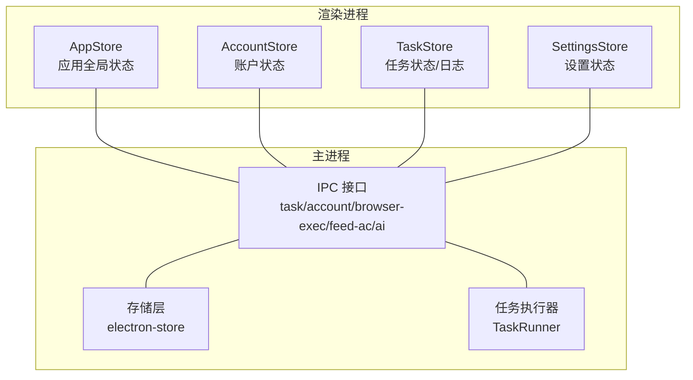
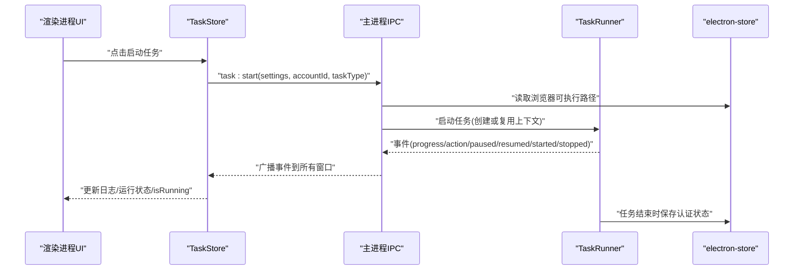
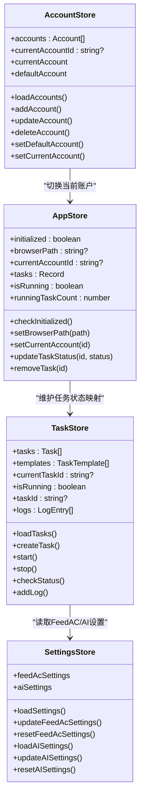

# 应用状态管理

<cite>
**本文引用的文件**
- [src/renderer/src/stores/app.ts](file://src/renderer/src/stores/app.ts)
- [src/renderer/src/stores/settings.ts](file://src/renderer/src/stores/settings.ts)
- [src/renderer/src/stores/account.ts](file://src/renderer/src/stores/account.ts)
- [src/renderer/src/stores/task.ts](file://src/renderer/src/stores/task.ts)
- [src/main/utils/storage.ts](file://src/main/utils/storage.ts)
- [src/shared/task.ts](file://src/shared/task.ts)
- [src/shared/feed-ac-setting.ts](file://src/shared/feed-ac-setting.ts)
- [src/shared/ai-setting.ts](file://src/shared/ai-setting.ts)
- [src/main/ipc/task.ts](file://src/main/ipc/task.ts)
- [src/main/ipc/account.ts](file://src/main/ipc/account.ts)
- [src/main/ipc/browser-exec.ts](file://src/main/ipc/browser-exec.ts)
- [src/main/ipc/feed-ac-setting.ts](file://src/main/ipc/feed-ac-setting.ts)
- [src/main/ipc/ai-setting.ts](file://src/main/ipc/ai-setting.ts)
- [src/main/service/task-runner.ts](file://src/main/service/task-runner.ts)
- [src/renderer/src/main.ts](file://src/renderer/src/main.ts)
</cite>

## 目录
1. [简介](#简介)
2. [项目结构](#项目结构)
3. [核心组件](#核心组件)
4. [架构总览](#架构总览)
5. [详细组件分析](#详细组件分析)
6. [依赖关系分析](#依赖关系分析)
7. [性能考量](#性能考量)
8. [故障排查指南](#故障排查指南)
9. [结论](#结论)
10. [附录](#附录)

## 简介
本文件面向AutoOps的应用状态管理模块，系统性阐述AppStore的设计与实现，覆盖应用全局状态、用户界面状态与系统状态的统一管理；详解应用启动状态、窗口状态、主题切换与语言选择的响应式管理；解释状态持久化策略、状态恢复机制与内存优化方案；给出应用生命周期管理、错误边界处理与异常状态恢复机制；提供调试工具、状态快照与性能监控建议；最后说明与其他Store模块的协调与冲突解决策略。

## 项目结构
AutoOps采用Electron + Vue + Pinia的前端状态管理架构，主进程负责系统级状态持久化与任务执行，渲染进程通过Pinia Store管理UI状态，并通过IPC与主进程交互。状态主要分为三类：
- 应用全局状态：应用初始化、浏览器可执行路径等
- 用户界面状态：账户列表、当前账户、任务列表、日志等
- 系统状态：任务运行状态、设置、AI配置等

**图表来源**
- [src/renderer/src/stores/app.ts:1-71](file://src/renderer/src/stores/app.ts#L1-L71)
- [src/renderer/src/stores/account.ts:1-82](file://src/renderer/src/stores/account.ts#L1-L82)
- [src/renderer/src/stores/task.ts:1-192](file://src/renderer/src/stores/task.ts#L1-L192)
- [src/renderer/src/stores/settings.ts:1-46](file://src/renderer/src/stores/settings.ts#L1-L46)
- [src/main/ipc/task.ts:1-243](file://src/main/ipc/task.ts#L1-L243)
- [src/main/ipc/account.ts:1-101](file://src/main/ipc/account.ts#L1-L101)
- [src/main/ipc/browser-exec.ts:1-13](file://src/main/ipc/browser-exec.ts#L1-L13)
- [src/main/ipc/feed-ac-setting.ts:1-44](file://src/main/ipc/feed-ac-setting.ts#L1-L44)
- [src/main/ipc/ai-setting.ts:1-27](file://src/main/ipc/ai-setting.ts#L1-L27)
- [src/main/utils/storage.ts:1-46](file://src/main/utils/storage.ts#L1-L46)
- [src/main/service/task-runner.ts:1-760](file://src/main/service/task-runner.ts#L1-L760)

**章节来源**
- [src/renderer/src/main.ts:1-12](file://src/renderer/src/main.ts#L1-L12)
- [src/renderer/src/stores/app.ts:1-71](file://src/renderer/src/stores/app.ts#L1-L71)
- [src/renderer/src/stores/account.ts:1-82](file://src/renderer/src/stores/account.ts#L1-L82)
- [src/renderer/src/stores/task.ts:1-192](file://src/renderer/src/stores/task.ts#L1-L192)
- [src/renderer/src/stores/settings.ts:1-46](file://src/renderer/src/stores/settings.ts#L1-L46)
- [src/main/ipc/task.ts:1-243](file://src/main/ipc/task.ts#L1-L243)
- [src/main/ipc/account.ts:1-101](file://src/main/ipc/account.ts#L1-L101)
- [src/main/ipc/browser-exec.ts:1-13](file://src/main/ipc/browser-exec.ts#L1-L13)
- [src/main/ipc/feed-ac-setting.ts:1-44](file://src/main/ipc/feed-ac-setting.ts#L1-L44)
- [src/main/ipc/ai-setting.ts:1-27](file://src/main/ipc/ai-setting.ts#L1-L27)
- [src/main/utils/storage.ts:1-46](file://src/main/utils/storage.ts#L1-L46)
- [src/main/service/task-runner.ts:1-760](file://src/main/service/task-runner.ts#L1-L760)

## 核心组件
- AppStore：管理应用初始化标志、浏览器可执行路径、当前账户ID以及任务状态映射。提供计算属性用于快速判断整体运行态与运行中的任务数量。
- AccountStore：维护账户列表、当前账户、默认账户；支持加载、新增、更新、删除、设置默认账户与切换当前账户。
- TaskStore：维护任务列表、模板、当前任务ID、运行状态、日志；封装任务启动/停止/暂停/恢复、进度与动作事件订阅、日志截断等。
- SettingsStore：维护FeedAC与AI设置，提供加载、更新、重置、导出导入等操作。
- 主进程存储与IPC：electron-store作为持久化存储，提供键空间管理；各IPC模块负责与渲染进程交互，转发事件到所有窗口。

**章节来源**
- [src/renderer/src/stores/app.ts:18-70](file://src/renderer/src/stores/app.ts#L18-L70)
- [src/renderer/src/stores/account.ts:14-80](file://src/renderer/src/stores/account.ts#L14-L80)
- [src/renderer/src/stores/task.ts:12-190](file://src/renderer/src/stores/task.ts#L12-L190)
- [src/renderer/src/stores/settings.ts:8-45](file://src/renderer/src/stores/settings.ts#L8-L45)
- [src/main/utils/storage.ts:14-46](file://src/main/utils/storage.ts#L14-L46)
- [src/main/ipc/task.ts:81-240](file://src/main/ipc/task.ts#L81-L240)

## 架构总览
应用状态管理遵循“渲染进程Store + 主进程IPC + 存储层”的分层设计。渲染进程通过defineStore定义状态，主进程通过ipcMain.handle暴露方法，electron-store提供跨会话持久化。任务执行由TaskRunner在主进程中异步驱动，通过事件广播到渲染进程。

**图表来源**
- [src/renderer/src/stores/task.ts:100-144](file://src/renderer/src/stores/task.ts#L100-L144)
- [src/main/ipc/task.ts:81-132](file://src/main/ipc/task.ts#L81-L132)
- [src/main/service/task-runner.ts:55-113](file://src/main/service/task-runner.ts#L55-L113)
- [src/main/utils/storage.ts:14-25](file://src/main/utils/storage.ts#L14-L25)

## 详细组件分析

### AppStore：应用全局状态
- 关键字段
  - initialized：应用是否完成初始化（基于浏览器可执行路径是否存在）
  - browserPath：浏览器可执行路径
  - currentAccountId：当前账户ID
  - tasks：任务状态映射（taskId -> TaskStatus）
- 计算属性
  - isRunning：任一任务处于运行中即为true
  - runningTaskCount：运行中任务计数
- 方法
  - checkInitialized：从IPC读取浏览器路径并设置initialized
  - setBrowserPath：写入浏览器路径并标记初始化完成
  - setCurrentAccount：切换当前账户
  - updateTaskStatus/removeTask：维护任务状态映射
- 设计要点
  - 将“初始化”与“浏览器路径”解耦，便于后续扩展其他初始化条件
  - 任务状态以轻量映射存储，避免频繁深拷贝

**章节来源**
- [src/renderer/src/stores/app.ts:4-70](file://src/renderer/src/stores/app.ts#L4-L70)

### AccountStore：账户状态
- 关键字段
  - accounts：账户数组
  - currentAccountId：当前账户ID
- 计算属性
  - currentAccount/defaultAccount：基于currentAccountId派生当前与默认账户
- 方法
  - loadAccounts：从IPC读取账户列表；若无currentAccountId且存在账户，则选择默认账户
  - add/update/delete/setDefault：对账户进行增删改与默认账户设置
  - setCurrentAccount：仅修改当前账户ID
- 设计要点
  - 默认账户逻辑在加载时自动补齐，保证启动一致性
  - 删除账户后自动修正currentAccountId，避免悬挂引用

**章节来源**
- [src/renderer/src/stores/account.ts:14-80](file://src/renderer/src/stores/account.ts#L14-L80)

### TaskStore：任务状态与日志
- 关键字段
  - tasks/templates：任务与模板列表
  - currentTaskId/isRunning/taskId/logs：任务运行期状态与日志
- 方法
  - 生命周期：loadTasks/loadTemplates/create/update/delete/duplicate/saveAsTemplate/deleteTemplate
  - 运行控制：checkStatus/start/stop/cleanupListeners
  - 日志：addLog（保留最近100条，超过上限截断至50条）
  - 事件订阅：onProgress/onAction（订阅主进程广播）
- 错误处理
  - start中捕获异常并记录日志
  - stop返回结果并根据success更新状态
- 设计要点
  - 通过cleanupListeners确保重复启动前清理旧订阅
  - 日志截断避免内存膨胀

**章节来源**
- [src/renderer/src/stores/task.ts:12-190](file://src/renderer/src/stores/task.ts#L12-L190)

### SettingsStore：设置状态
- 关键字段
  - feedAcSettings/aiSettings：FeedAC与AI设置
- 方法
  - loadSettings/loadAISettings：从IPC读取设置
  - updateFeedAcSettings/updateAISettings/resetFeedAcSettings/resetAISettings：更新与重置
- 设计要点
  - 使用toRaw序列化写入，避免Vue响应式代理污染存储

**章节来源**
- [src/renderer/src/stores/settings.ts:8-45](file://src/renderer/src/stores/settings.ts#L8-L45)

### 主进程存储与IPC
- 存储层
  - electron-store提供键空间：auth、feedAcSettings、aiSettings、browserExecPath、taskHistory、accounts、tasks、taskTemplates
  - defaults提供初始值，确保首次运行可用
- IPC接口
  - task：启动/停止/暂停/恢复/状态查询/队列管理/并发度设置等
  - account：列表、新增、更新、删除、设置默认、查询等
  - browser-exec：读取/设置浏览器可执行路径
  - feed-ac-settings：读取/更新/重置/导出/导入
  - ai-settings：读取/更新/重置/测试占位
- 事件广播
  - TaskManager向所有BrowserWindow广播progress/action/paused/resumed/started/stopped/scheduled等事件

**章节来源**
- [src/main/utils/storage.ts:14-46](file://src/main/utils/storage.ts#L14-L46)
- [src/main/ipc/task.ts:81-240](file://src/main/ipc/task.ts#L81-L240)
- [src/main/ipc/account.ts:32-100](file://src/main/ipc/account.ts#L32-L100)
- [src/main/ipc/browser-exec.ts:4-12](file://src/main/ipc/browser-exec.ts#L4-L12)
- [src/main/ipc/feed-ac-setting.ts:16-43](file://src/main/ipc/feed-ac-setting.ts#L16-L43)
- [src/main/ipc/ai-setting.ts:5-26](file://src/main/ipc/ai-setting.ts#L5-L26)

### 任务执行器：TaskRunner
- 生命周期
  - start/startWithContext：创建或复用浏览器上下文，注入storageState，进入runTask循环
  - pause/resume/stop/close：暂停、恢复、停止与资源回收
- 执行流程
  - 循环处理视频：等待、获取视频信息、类型过滤、分类过滤、屏蔽词检查、规则匹配、模拟观看、执行操作、跳转下一条
  - 连续跳过阈值触发暂停保护
- AI与适配器
  - 根据AI设置按平台创建AI服务
  - 通过平台适配器执行具体动作（评论/点赞/收藏/关注）
- 状态持久化
  - 任务结束保存storageState回存储

**章节来源**
- [src/main/service/task-runner.ts:25-371](file://src/main/service/task-runner.ts#L25-L371)

## 依赖关系分析
- 渲染进程Store依赖window.api（通过IPC）访问主进程能力
- TaskStore依赖TaskManager/TaskRunner，后者在主进程执行真实任务
- SettingsStore依赖FeedAC与AI设置的共享类型定义
- AccountStore依赖账户共享模型
- AppStore与TaskStore共同依赖任务状态映射

**图表来源**
- [src/renderer/src/stores/app.ts:4-70](file://src/renderer/src/stores/app.ts#L4-L70)
- [src/renderer/src/stores/account.ts:4-82](file://src/renderer/src/stores/account.ts#L4-L82)
- [src/renderer/src/stores/task.ts:12-190](file://src/renderer/src/stores/task.ts#L12-L190)
- [src/renderer/src/stores/settings.ts:8-45](file://src/renderer/src/stores/settings.ts#L8-L45)

**章节来源**
- [src/renderer/src/stores/app.ts:18-70](file://src/renderer/src/stores/app.ts#L18-L70)
- [src/renderer/src/stores/account.ts:14-80](file://src/renderer/src/stores/account.ts#L14-L80)
- [src/renderer/src/stores/task.ts:12-190](file://src/renderer/src/stores/task.ts#L12-L190)
- [src/renderer/src/stores/settings.ts:8-45](file://src/renderer/src/stores/settings.ts#L8-L45)

## 性能考量
- 内存优化
  - TaskStore日志上限与截断策略，避免长期运行内存膨胀
  - AppStore任务状态映射为轻量对象，减少深拷贝成本
- 并发与资源
  - TaskRunner支持共享上下文，降低浏览器实例创建开销
  - 事件广播到所有窗口，注意订阅清理与去抖
- I/O与持久化
  - electron-store默认延迟写入，结合业务关键节点手动落盘（如任务结束保存storageState）

[本节为通用指导，无需特定文件引用]

## 故障排查指南
- 启动失败
  - 检查浏览器可执行路径是否配置（AppStore.checkInitialized与IPC browser-exec）
  - 查看TaskStore.start异常分支的日志与返回值
- 任务无响应
  - 确认TaskStore是否正确订阅onProgress/onAction
  - 检查TaskManager事件广播是否正常（主进程日志）
- 设置不生效
  - 确认SettingsStore.update后的值已被持久化（feed-ac-settings/ai-settings IPC）
  - 若版本迁移，确认从V2到V3的迁移逻辑
- 账户切换异常
  - 确保AccountStore.setCurrentAccount后AppStore.setCurrentAccount同步更新
  - 删除账户后验证currentAccountId自动修正

**章节来源**
- [src/renderer/src/stores/task.ts:100-144](file://src/renderer/src/stores/task.ts#L100-L144)
- [src/main/ipc/task.ts:81-132](file://src/main/ipc/task.ts#L81-L132)
- [src/main/ipc/browser-exec.ts:4-12](file://src/main/ipc/browser-exec.ts#L4-L12)
- [src/renderer/src/stores/settings.ts:12-34](file://src/renderer/src/stores/settings.ts#L12-L34)
- [src/main/ipc/feed-ac-setting.ts:16-43](file://src/main/ipc/feed-ac-setting.ts#L16-L43)
- [src/renderer/src/stores/account.ts:50-67](file://src/renderer/src/stores/account.ts#L50-L67)

## 结论
本状态管理模块以Pinia为核心，结合主进程IPC与electron-store，实现了应用全局状态、用户界面状态与系统状态的清晰分离与高效协同。通过事件驱动与持久化策略，保障了状态的一致性与可恢复性；通过日志截断与共享上下文等手段，兼顾了性能与稳定性。后续可在调试工具与可视化监控方面进一步增强，以提升可观测性与可运维性。

[本节为总结，无需特定文件引用]

## 附录

### 状态持久化与恢复清单
- 浏览器可执行路径：browserExecPath
- 账户列表：accounts
- FeedAC设置：feedAcSettings
- AI设置：aiSettings
- 任务历史：taskHistory
- 任务与模板：tasks、taskTemplates
- 认证状态：auth（TaskRunner在任务结束时保存）

**章节来源**
- [src/main/utils/storage.ts:14-46](file://src/main/utils/storage.ts#L14-L46)
- [src/main/service/task-runner.ts:212-233](file://src/main/service/task-runner.ts#L212-L233)

### 状态恢复机制
- 应用启动时优先读取browserExecPath并标记initialized
- 账户加载时自动选择默认账户，保证启动一致性
- 任务日志在TaskStore中按需截断，避免溢出
- 任务结束后保存storageState，下次启动可复用登录态

**章节来源**
- [src/renderer/src/stores/app.ts:32-43](file://src/renderer/src/stores/app.ts#L32-L43)
- [src/renderer/src/stores/account.ts:26-33](file://src/renderer/src/stores/account.ts#L26-L33)
- [src/renderer/src/stores/task.ts:159-167](file://src/renderer/src/stores/task.ts#L159-L167)
- [src/main/service/task-runner.ts:212-233](file://src/main/service/task-runner.ts#L212-L233)

### 与其他Store模块的协调与冲突解决
- AppStore与AccountStore：AccountStore负责账户变更，AppStore负责当前账户ID同步
- TaskStore与SettingsStore：TaskStore在启动时读取最新设置，避免旧配置影响
- TaskStore与AppStore：AppStore维护任务状态映射，TaskStore负责运行期状态与日志

**章节来源**
- [src/renderer/src/stores/account.ts:65-67](file://src/renderer/src/stores/account.ts#L65-L67)
- [src/renderer/src/stores/app.ts:45-55](file://src/renderer/src/stores/app.ts#L45-L55)
- [src/renderer/src/stores/task.ts:100-144](file://src/renderer/src/stores/task.ts#L100-L144)