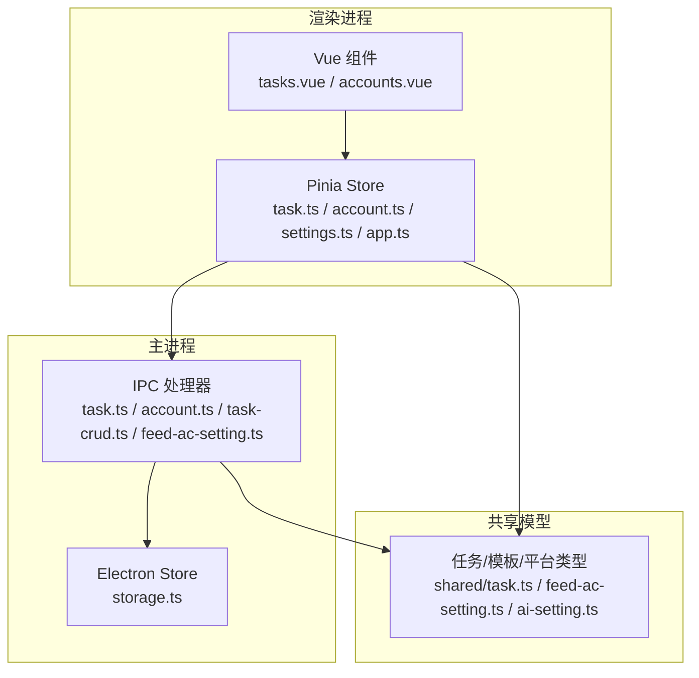
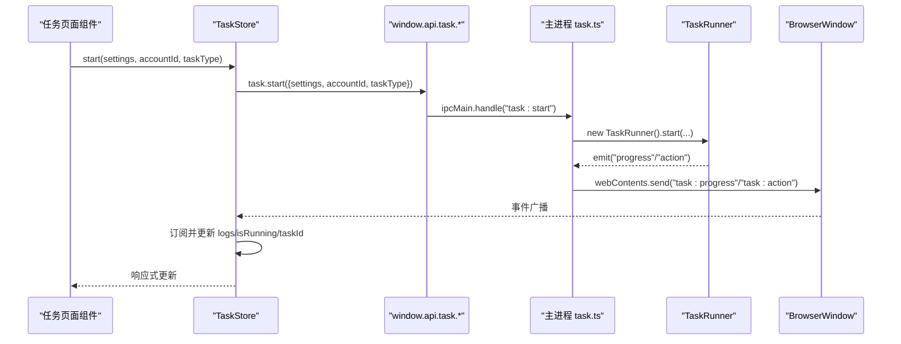
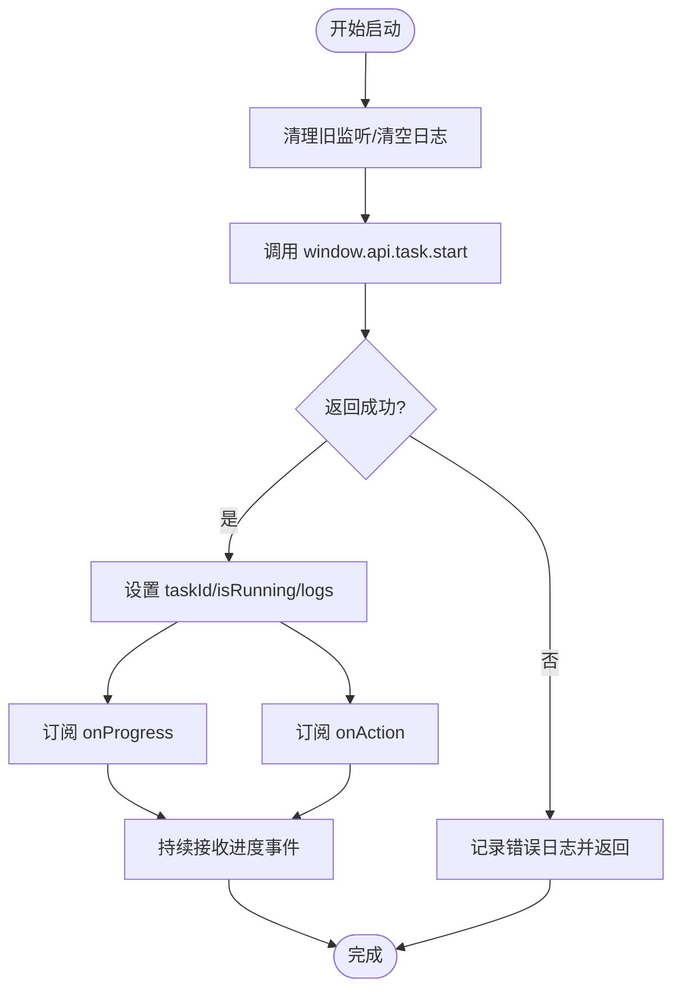
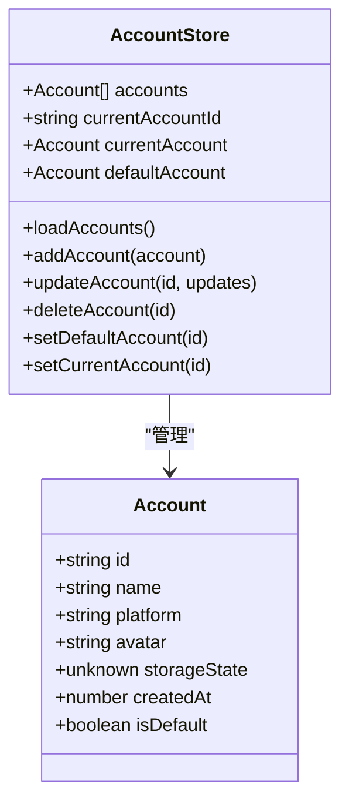
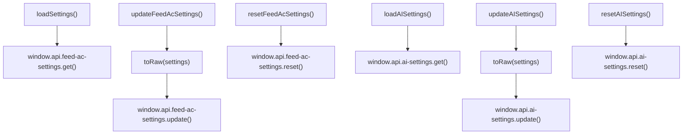
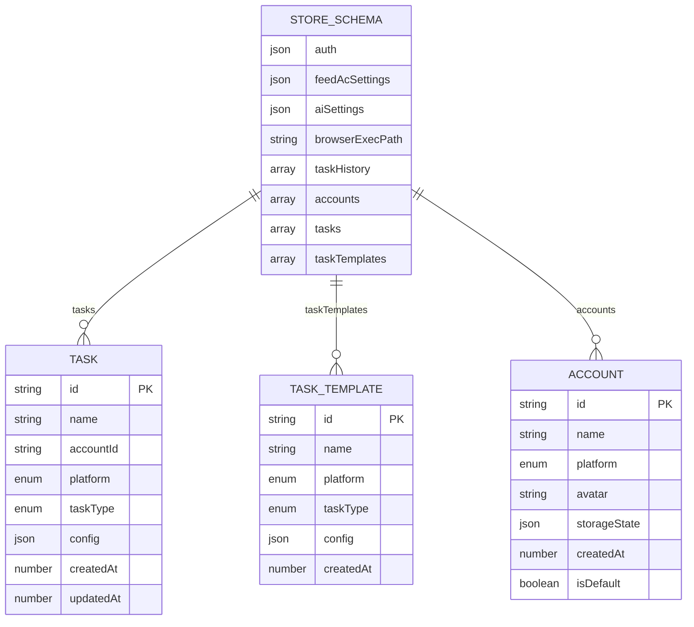
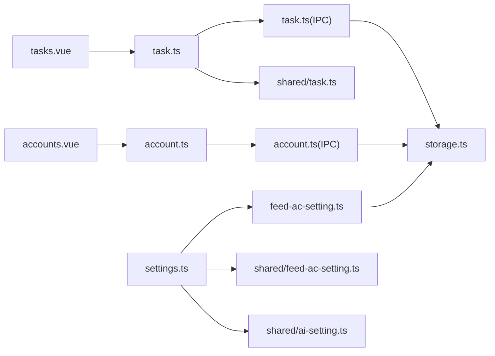

# 状态管理

<cite>
**本文引用的文件**
- [src/renderer/src/stores/task.ts](file://src/renderer/src/stores/task.ts)
- [src/renderer/src/stores/account.ts](file://src/renderer/src/stores/account.ts)
- [src/renderer/src/stores/settings.ts](file://src/renderer/src/stores/settings.ts)
- [src/renderer/src/stores/app.ts](file://src/renderer/src/stores/app.ts)
- [src/main/utils/storage.ts](file://src/main/utils/storage.ts)
- [src/shared/task.ts](file://src/shared/task.ts)
- [src/shared/feed-ac-setting.ts](file://src/shared/feed-ac-setting.ts)
- [src/shared/ai-setting.ts](file://src/shared/ai-setting.ts)
- [src/main/ipc/task.ts](file://src/main/ipc/task.ts)
- [src/main/ipc/account.ts](file://src/main/ipc/account.ts)
- [src/main/ipc/task-crud.ts](file://src/main/ipc/task-crud.ts)
- [src/main/ipc/feed-ac-setting.ts](file://src/main/ipc/feed-ac-setting.ts)
- [src/renderer/src/pages/tasks.vue](file://src/renderer/src/pages/tasks.vue)
- [src/renderer/src/pages/accounts.vue](file://src/renderer/src/pages/accounts.vue)
- [src/renderer/src/main.ts](file://src/renderer/src/main.ts)
</cite>

## 目录
1. [简介](#简介)
2. [项目结构](#项目结构)
3. [核心组件](#核心组件)
4. [架构总览](#架构总览)
5. [详细组件分析](#详细组件分析)
6. [依赖关系分析](#依赖关系分析)
7. [性能考量](#性能考量)
8. [故障排查指南](#故障排查指南)
9. [结论](#结论)
10. [附录](#附录)

## 简介
本文件系统性阐述 AutoOps 的状态管理系统，围绕 Pinia 状态管理的设计原理、Store 模块组织、状态持久化策略展开，并详解任务状态、账号状态、设置状态与应用状态的管理机制。文档覆盖状态变更触发方式、异步操作处理、状态同步策略，提供最佳实践、性能优化与调试方法，解释状态与 UI 组件的绑定、响应式更新与内存管理，并给出状态迁移、版本兼容与数据恢复方案。

## 项目结构
AutoOps 的状态管理采用“渲染进程 Store + 主进程 IPC + Electron Store”的分层设计：
- 渲染进程使用 Pinia 定义 Store，封装业务逻辑与异步调用。
- 主进程通过 IPC 对接 Electron Store，实现跨会话持久化。
- 共享模型定义在 shared 目录，确保前后端一致的数据契约。

图表来源
- [src/renderer/src/stores/task.ts:1-192](file://src/renderer/src/stores/task.ts#L1-L192)
- [src/renderer/src/stores/account.ts:1-82](file://src/renderer/src/stores/account.ts#L1-L82)
- [src/renderer/src/stores/settings.ts:1-46](file://src/renderer/src/stores/settings.ts#L1-L46)
- [src/renderer/src/stores/app.ts:1-71](file://src/renderer/src/stores/app.ts#L1-L71)
- [src/main/ipc/task.ts:1-104](file://src/main/ipc/task.ts#L1-L104)
- [src/main/ipc/account.ts:1-101](file://src/main/ipc/account.ts#L1-L101)
- [src/main/ipc/task-crud.ts:1-108](file://src/main/ipc/task-crud.ts#L1-L108)
- [src/main/ipc/feed-ac-setting.ts:1-44](file://src/main/ipc/feed-ac-setting.ts#L1-L44)
- [src/main/utils/storage.ts:1-46](file://src/main/utils/storage.ts#L1-L46)
- [src/shared/task.ts:1-54](file://src/shared/task.ts#L1-L54)
- [src/shared/feed-ac-setting.ts:1-149](file://src/shared/feed-ac-setting.ts#L1-L149)
- [src/shared/ai-setting.ts:1-29](file://src/shared/ai-setting.ts#L1-L29)

章节来源
- [src/renderer/src/main.ts:1-12](file://src/renderer/src/main.ts#L1-L12)

## 核心组件
- 任务状态 Store：负责任务 CRUD、模板管理、任务运行控制、日志与进度事件订阅。
- 账号状态 Store：负责账号列表、默认账号、当前账号选择与持久化。
- 设置状态 Store：负责 Feed 动态配置与 AI 配置的加载、更新与重置。
- 应用状态 Store：负责应用初始化状态、浏览器路径、全局任务状态聚合与运行计数。

章节来源
- [src/renderer/src/stores/task.ts:12-192](file://src/renderer/src/stores/task.ts#L12-L192)
- [src/renderer/src/stores/account.ts:14-82](file://src/renderer/src/stores/account.ts#L14-L82)
- [src/renderer/src/stores/settings.ts:8-46](file://src/renderer/src/stores/settings.ts#L8-L46)
- [src/renderer/src/stores/app.ts:18-71](file://src/renderer/src/stores/app.ts#L18-L71)

## 架构总览
渲染进程 Store 通过 window.api.* 方法调用主进程 IPC，主进程读写 Electron Store 实现持久化。任务运行时，主进程 TaskRunner 发出进度与动作事件，主进程通过 BrowserWindow 广播到所有渲染窗口，渲染侧 Store 订阅并更新本地状态。

图表来源
- [src/renderer/src/stores/task.ts:100-144](file://src/renderer/src/stores/task.ts#L100-L144)
- [src/main/ipc/task.ts:11-104](file://src/main/ipc/task.ts#L11-L104)

章节来源
- [src/renderer/src/pages/tasks.vue:226-250](file://src/renderer/src/pages/tasks.vue#L226-L250)
- [src/renderer/src/stores/task.ts:100-144](file://src/renderer/src/stores/task.ts#L100-L144)
- [src/main/ipc/task.ts:11-104](file://src/main/ipc/task.ts#L11-L104)

## 详细组件分析

### 任务状态 Store（task）
职责与能力
- 数据结构：任务数组、模板数组、当前任务 ID、运行标志、任务 ID、日志数组。
- 异步 CRUD：加载任务、创建、更新、删除、克隆；模板保存与删除。
- 运行控制：启动/停止任务、检查运行状态；清理事件监听。
- 事件订阅：订阅任务进度与动作事件，维护日志队列（限制长度）。
- 查询工具：按 ID 查找任务、按账号筛选任务。

关键流程与交互
- 启动流程：清理旧监听 → 清空日志 → 调用 window.api.task.start → 成功后订阅 onProgress/onAction → 更新 isRunning/taskId/logs。
- 停止流程：清理监听 → 调用 window.api.task.stop → 更新 isRunning/logs。
- 日志管理：最多保留 100 条，超过一半截断，避免内存膨胀。

图表来源
- [src/renderer/src/stores/task.ts:100-144](file://src/renderer/src/stores/task.ts#L100-L144)

章节来源
- [src/renderer/src/stores/task.ts:12-192](file://src/renderer/src/stores/task.ts#L12-L192)
- [src/main/ipc/task.ts:11-104](file://src/main/ipc/task.ts#L11-L104)

### 账号状态 Store（account）
职责与能力
- 数据结构：账号数组、当前账号 ID；计算属性 currentAccount/defaultAccount。
- 异步操作：加载账号列表、新增、更新、删除、设置默认账号、设置当前账号。
- 默认账号策略：首次加载若无默认账号且存在账号，则将首个账号设为默认。

图表来源
- [src/renderer/src/stores/account.ts:4-24](file://src/renderer/src/stores/account.ts#L4-L24)

章节来源
- [src/renderer/src/stores/account.ts:14-82](file://src/renderer/src/stores/account.ts#L14-L82)
- [src/main/ipc/account.ts:32-101](file://src/main/ipc/account.ts#L32-L101)

### 设置状态 Store（settings）
职责与能力
- 数据结构：Feed 动态配置、AI 配置。
- 加载与更新：分别加载/更新 Feed 配置与 AI 配置；支持重置为默认值。
- 数据转换：toRaw 包装以避免响应式代理影响序列化存储。

图表来源
- [src/renderer/src/stores/settings.ts:12-34](file://src/renderer/src/stores/settings.ts#L12-L34)
- [src/main/ipc/feed-ac-setting.ts:16-44](file://src/main/ipc/feed-ac-setting.ts#L16-L44)

章节来源
- [src/renderer/src/stores/settings.ts:8-46](file://src/renderer/src/stores/settings.ts#L8-L46)
- [src/shared/feed-ac-setting.ts:74-118](file://src/shared/feed-ac-setting.ts#L74-L118)
- [src/shared/ai-setting.ts:10-22](file://src/shared/ai-setting.ts#L10-L22)

### 应用状态 Store（app）
职责与能力
- 数据结构：初始化标志、浏览器可执行路径、当前账号、任务状态映射。
- 计算属性：是否运行中、运行中任务数量。
- 初始化：检查浏览器路径并标记初始化；设置浏览器路径并标记初始化。
- 任务状态聚合：更新/移除任务状态，供 UI 展示全局运行概览。

章节来源
- [src/renderer/src/stores/app.ts:18-71](file://src/renderer/src/stores/app.ts#L18-L71)

### 状态持久化与版本迁移
- Electron Store Schema：统一管理 auth、feedAcSettings、aiSettings、browserExecPath、taskHistory、accounts、tasks、taskTemplates 等键。
- Feed 配置迁移：V2 → V3 自动迁移，保留关键字段并补充新字段默认值。
- 任务与模板：通过主进程 IPC 写入/读取 Electron Store，实现跨会话持久化。

图表来源
- [src/main/utils/storage.ts:3-25](file://src/main/utils/storage.ts#L3-L25)
- [src/shared/task.ts:5-23](file://src/shared/task.ts#L5-L23)
- [src/shared/feed-ac-setting.ts:22-70](file://src/shared/feed-ac-setting.ts#L22-L70)

章节来源
- [src/main/utils/storage.ts:1-46](file://src/main/utils/storage.ts#L1-L46)
- [src/shared/feed-ac-setting.ts:120-145](file://src/shared/feed-ac-setting.ts#L120-L145)
- [src/main/ipc/task-crud.ts:8-108](file://src/main/ipc/task-crud.ts#L8-L108)
- [src/main/ipc/feed-ac-setting.ts:16-44](file://src/main/ipc/feed-ac-setting.ts#L16-L44)

### 状态与 UI 绑定、响应式更新与内存管理
- 绑定方式：组件通过组合式 API 使用 Store 实例，直接响应式访问 Store 的 ref/computed。
- 响应式更新：Store 中的 ref 变更自动驱动组件重新渲染。
- 内存管理：任务日志限制长度、任务停止时清理事件监听，避免泄漏。

章节来源
- [src/renderer/src/pages/tasks.vue:120-136](file://src/renderer/src/pages/tasks.vue#L120-L136)
- [src/renderer/src/pages/accounts.vue:40-42](file://src/renderer/src/pages/accounts.vue#L40-L42)
- [src/renderer/src/stores/task.ts:89-98](file://src/renderer/src/stores/task.ts#L89-L98)
- [src/renderer/src/stores/task.ts:159-167](file://src/renderer/src/stores/task.ts#L159-L167)

### 异步操作处理与状态同步
- 异步调用：Store 方法统一通过 window.api.* 与主进程通信，主进程 IPC 处理耗时任务并返回结果。
- 状态同步：主进程 TaskRunner 事件通过 BrowserWindow 广播，渲染侧 Store 订阅并更新本地状态，保证 UI 与实际运行状态一致。

章节来源
- [src/renderer/src/stores/task.ts:100-144](file://src/renderer/src/stores/task.ts#L100-L144)
- [src/main/ipc/task.ts:51-76](file://src/main/ipc/task.ts#L51-L76)

## 依赖关系分析
- Store 依赖共享模型：任务、模板、平台类型、Feed 配置等。
- Store 依赖主进程 IPC：通过 window.api.* 调用主进程处理器。
- 主进程依赖 Electron Store：持久化存储与读取。
- 组件依赖 Store：页面组件直接使用 Store 实例进行状态读取与变更。

图表来源
- [src/renderer/src/pages/tasks.vue:59-70](file://src/renderer/src/pages/tasks.vue#L59-L70)
- [src/renderer/src/pages/accounts.vue](file://src/renderer/src/pages/accounts.vue#L3-C6)
- [src/renderer/src/stores/task.ts:1-10](file://src/renderer/src/stores/task.ts#L1-L10)
- [src/renderer/src/stores/account.ts:1-2](file://src/renderer/src/stores/account.ts#L1-L2)
- [src/renderer/src/stores/settings.ts:1-6](file://src/renderer/src/stores/settings.ts#L1-L6)
- [src/main/ipc/task.ts:1-7](file://src/main/ipc/task.ts#L1-L7)
- [src/main/ipc/account.ts:1-4](file://src/main/ipc/account.ts#L1-L4)
- [src/main/ipc/feed-ac-setting.ts:1-8](file://src/main/ipc/feed-ac-setting.ts#L1-L8)
- [src/main/utils/storage.ts:1-12](file://src/main/utils/storage.ts#L1-L12)
- [src/shared/task.ts:1-3](file://src/shared/task.ts#L1-L3)
- [src/shared/feed-ac-setting.ts:1-6](file://src/shared/feed-ac-setting.ts#L1-L6)
- [src/shared/ai-setting.ts:1-2](file://src/shared/ai-setting.ts#L1-L2)

章节来源
- [src/renderer/src/main.ts:9-9](file://src/renderer/src/main.ts#L9-L9)

## 性能考量
- 日志截断：任务日志最多保留 100 条，超过后只保留最近 50 条，降低内存占用。
- 事件监听清理：每次启动前清理旧监听，防止重复订阅导致的内存泄漏。
- 计算属性复用：使用 computed 缓存派生状态，减少不必要渲染。
- 批量初始化：页面挂载时并发加载任务、模板与账号，缩短首屏等待时间。
- 配置序列化：更新设置时使用 toRaw 避免响应式代理带来的额外开销。

章节来源
- [src/renderer/src/stores/task.ts:159-167](file://src/renderer/src/stores/task.ts#L159-L167)
- [src/renderer/src/stores/task.ts:89-98](file://src/renderer/src/stores/task.ts#L89-L98)
- [src/renderer/src/pages/tasks.vue:120-126](file://src/renderer/src/pages/tasks.vue#L120-L126)

## 故障排查指南
常见问题与定位建议
- 任务无法启动
  - 检查浏览器路径是否已配置（应用初始化状态）。
  - 查看任务启动返回结果与日志，确认异常信息。
  - 确认未重复启动任务（已有运行实例）。
- 任务运行但 UI 不更新
  - 检查主进程是否正确广播 task:progress 与 task:action。
  - 确认 Store 是否正确订阅并更新状态。
- 账号删除后默认账号丢失
  - 删除账号后若无默认账号，主进程会将首个账号设为默认；如仍异常，检查存储键值。
- 设置未生效
  - 确认使用 toRaw 包装后再提交更新。
  - 检查主进程 IPC 是否正确合并并写入 Electron Store。

章节来源
- [src/renderer/src/stores/task.ts:100-144](file://src/renderer/src/stores/task.ts#L100-L144)
- [src/main/ipc/task.ts:11-104](file://src/main/ipc/task.ts#L11-L104)
- [src/renderer/src/stores/account.ts:50-56](file://src/renderer/src/stores/account.ts#L50-L56)
- [src/main/ipc/account.ts:62-79](file://src/main/ipc/account.ts#L62-L79)
- [src/renderer/src/stores/settings.ts:16-18](file://src/renderer/src/stores/settings.ts#L16-L18)
- [src/main/ipc/feed-ac-setting.ts:22-26](file://src/main/ipc/feed-ac-setting.ts#L22-L26)

## 结论
AutoOps 的状态管理以 Pinia 为核心，结合主进程 IPC 与 Electron Store，实现了清晰的职责分离与可靠的持久化。通过严格的事件订阅与清理、日志截断与计算属性缓存，系统在功能完整性与性能之间取得平衡。配合明确的版本迁移与数据恢复策略，满足长期演进需求。

## 附录

### 最佳实践清单
- 在 Store 中统一处理异步调用，避免在组件内直接操作 IPC。
- 使用 computed 管理派生状态，减少不必要的渲染。
- 启动任务前清理监听，停止任务后及时释放资源。
- 更新设置时使用 toRaw 包装，避免响应式代理影响序列化。
- 对于大列表与日志，设定上限并定期截断，控制内存增长。

### 版本兼容与迁移
- Feed 配置从 V2 迁移到 V3：保留关键字段，补齐默认值与新增字段。
- 模板与任务配置随版本演进，保持向后兼容读取与自动迁移。

章节来源
- [src/shared/feed-ac-setting.ts:120-145](file://src/shared/feed-ac-setting.ts#L120-L145)
- [src/main/ipc/feed-ac-setting.ts:10-14](file://src/main/ipc/feed-ac-setting.ts#L10-L14)