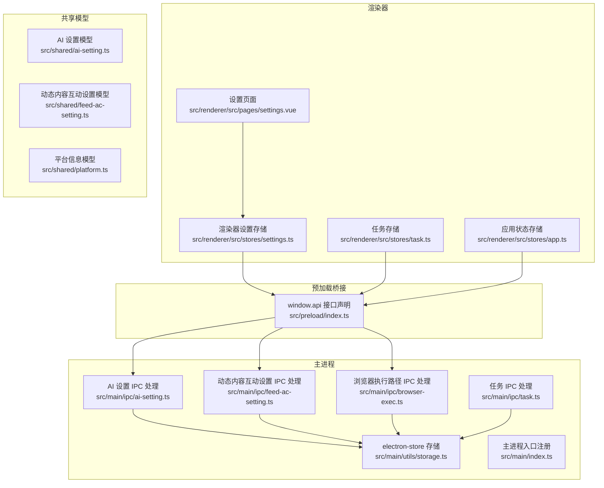
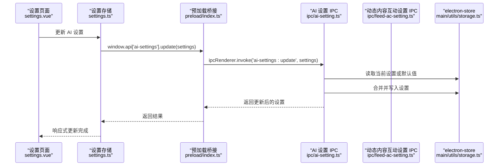
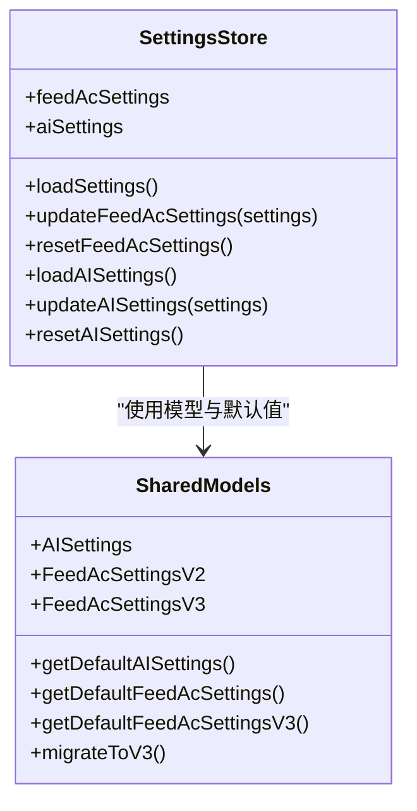
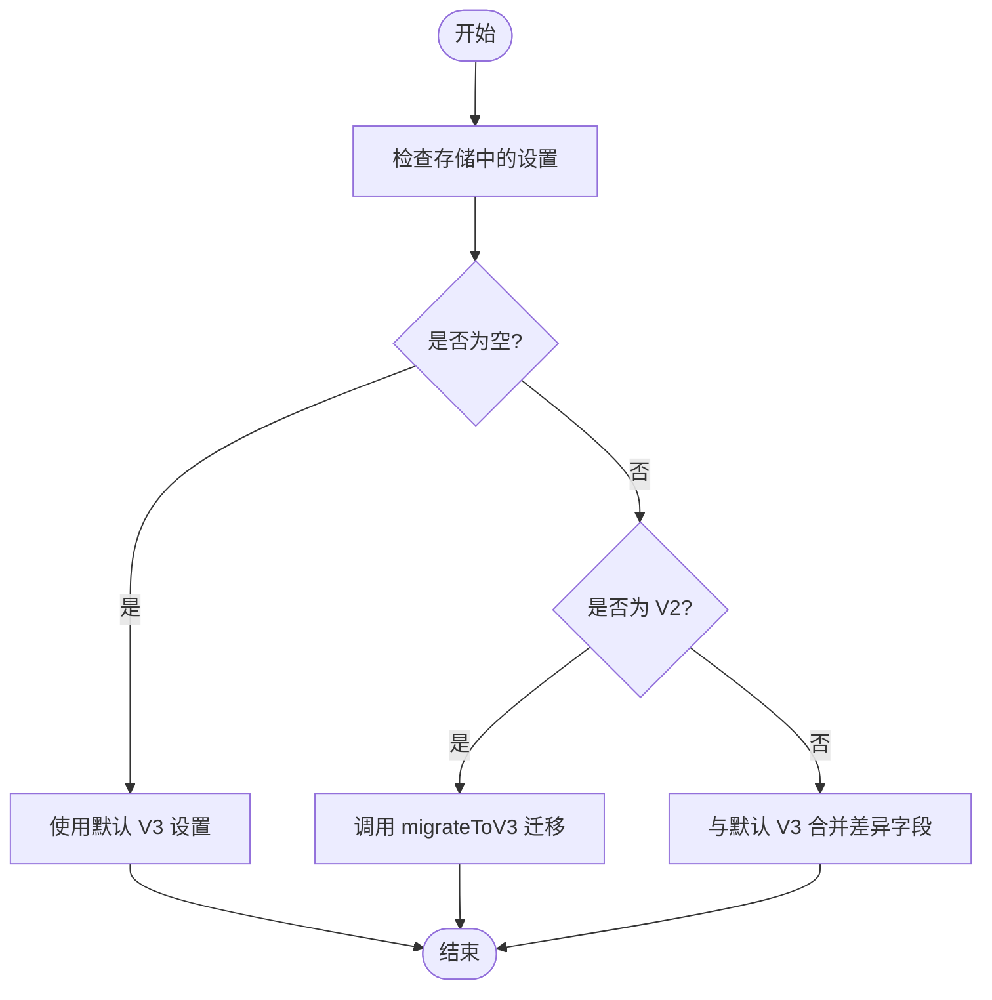
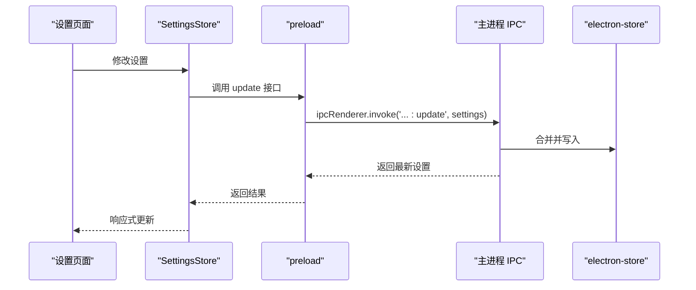
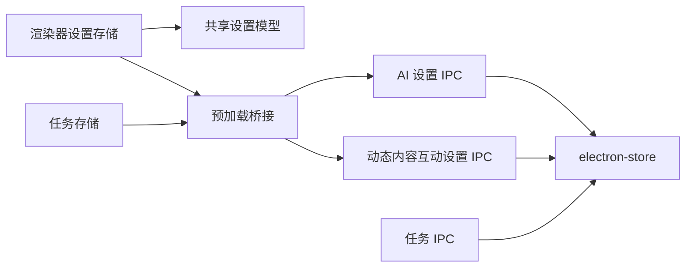

# 设置状态管理

<cite>
**本文引用的文件**
- [settings.ts](file://src/renderer/src/stores/settings.ts)
- [ai-setting.ts](file://src/shared/ai-setting.ts)
- [feed-ac-setting.ts](file://src/shared/feed-ac-setting.ts)
- [storage.ts](file://src/main/utils/storage.ts)
- [index.ts](file://src/preload/index.ts)
- [settings.vue](file://src/renderer/src/pages/settings.vue)
- [app.ts](file://src/renderer/src/stores/app.ts)
- [feed-ac-setting.ts（主进程）](file://src/main/ipc/feed-ac-setting.ts)
- [ai-setting.ts（主进程）](file://src/main/ipc/ai-setting.ts)
- [browser-exec.ts](file://src/main/ipc/browser-exec.ts)
- [task.ts](file://src/main/ipc/task.ts)
- [index.ts（主进程入口）](file://src/main/index.ts)
- [task.ts（渲染器存储）](file://src/renderer/src/stores/task.ts)
- [platform.ts](file://src/shared/platform.ts)
</cite>

## 目录
1. [简介](#简介)
2. [项目结构](#项目结构)
3. [核心组件](#核心组件)
4. [架构总览](#架构总览)
5. [详细组件分析](#详细组件分析)
6. [依赖关系分析](#依赖关系分析)
7. [性能考量](#性能考量)
8. [故障排查指南](#故障排查指南)
9. [结论](#结论)
10. [附录](#附录)

## 简介
本文件系统性阐述 AutoOps 的设置状态管理模块，重点覆盖 SettingsStore 的设计与实现、全局应用设置与平台特定配置、AI 服务设置的管理与校验、设置项的分类与默认值处理、持久化策略与版本迁移、响应式更新与热重载、配置导入导出与模板管理、以及设置状态与各功能模块的集成与生效时机控制。

## 项目结构
设置状态管理涉及三层：共享数据模型层（shared）、渲染器状态层（renderer stores）、主进程 IPC 层（main ipc）。渲染器通过 preload 暴露的 window.api 调用主进程接口，主进程基于 electron-store 将设置持久化到本地。

**图表来源**
- [settings.ts:1-46](file://src/renderer/src/stores/settings.ts#L1-L46)
- [settings.vue:1-165](file://src/renderer/src/pages/settings.vue#L1-L165)
- [app.ts:1-71](file://src/renderer/src/stores/app.ts#L1-L71)
- [task.ts（渲染器存储）:1-192](file://src/renderer/src/stores/task.ts#L1-L192)
- [ai-setting.ts:1-29](file://src/shared/ai-setting.ts#L1-L29)
- [feed-ac-setting.ts:1-179](file://src/shared/feed-ac-setting.ts#L1-L179)
- [index.ts:1-187](file://src/preload/index.ts#L1-L187)
- [storage.ts:1-46](file://src/main/utils/storage.ts#L1-L46)
- [ai-setting.ts（主进程）:1-27](file://src/main/ipc/ai-setting.ts#L1-L27)
- [feed-ac-setting.ts（主进程）:1-44](file://src/main/ipc/feed-ac-setting.ts#L1-L44)
- [browser-exec.ts:1-13](file://src/main/ipc/browser-exec.ts#L1-L13)
- [task.ts:1-35](file://src/main/ipc/task.ts#L1-L35)
- [index.ts（主进程入口）:1-106](file://src/main/index.ts#L1-L106)

**章节来源**
- [settings.ts:1-46](file://src/renderer/src/stores/settings.ts#L1-L46)
- [index.ts:1-187](file://src/preload/index.ts#L1-L187)
- [storage.ts:1-46](file://src/main/utils/storage.ts#L1-L46)
- [feed-ac-setting.ts（主进程）:1-44](file://src/main/ipc/feed-ac-setting.ts#L1-L44)
- [ai-setting.ts（主进程）:1-27](file://src/main/ipc/ai-setting.ts#L1-L27)
- [browser-exec.ts:1-13](file://src/main/ipc/browser-exec.ts#L1-L13)
- [task.ts:1-35](file://src/main/ipc/task.ts#L1-L35)
- [index.ts（主进程入口）:1-106](file://src/main/index.ts#L1-L106)

## 核心组件
- 渲染器设置存储（SettingsStore）
  - 提供 feedAcSettings 与 aiSettings 的响应式状态与 CRUD 操作。
  - 通过 window.api 的 feed-ac-settings 与 ai-settings 接口与主进程交互。
- 共享设置模型
  - AI 设置模型：平台枚举、API Key 映射、默认模型与温度等。
  - 动态内容互动设置模型：规则组、屏蔽词、观看时长、AI 评论开关、操作集合、视频分类等；包含 v2 到 v3 的迁移逻辑。
- 主进程 IPC
  - feed-ac-settings：读取、更新、重置、导出、导入；确保返回 v3 结构。
  - ai-settings：读取、更新、重置、测试（占位）。
  - browser-exec：读取与设置浏览器可执行路径。
- 预加载桥接
  - 统一暴露 window.api 接口，封装 ipcRenderer.invoke/on 调用。
- 应用状态与任务集成
  - app store 管理初始化状态与浏览器路径；task store 在启动任务时消费设置并订阅进度事件。

**章节来源**
- [settings.ts:1-46](file://src/renderer/src/stores/settings.ts#L1-L46)
- [ai-setting.ts:1-29](file://src/shared/ai-setting.ts#L1-L29)
- [feed-ac-setting.ts:1-179](file://src/shared/feed-ac-setting.ts#L1-L179)
- [feed-ac-setting.ts（主进程）:1-44](file://src/main/ipc/feed-ac-setting.ts#L1-L44)
- [ai-setting.ts（主进程）:1-27](file://src/main/ipc/ai-setting.ts#L1-L27)
- [browser-exec.ts:1-13](file://src/main/ipc/browser-exec.ts#L1-L13)
- [index.ts:1-187](file://src/preload/index.ts#L1-L187)
- [app.ts:1-71](file://src/renderer/src/stores/app.ts#L1-L71)
- [task.ts（渲染器存储）:1-192](file://src/renderer/src/stores/task.ts#L1-L192)

## 架构总览
设置状态管理采用“渲染器 Pinia Store + 预加载桥接 + 主进程 IPC + electron-store 持久化”的分层架构。渲染器通过 SettingsStore 与 UI 交互，调用 window.api 同步到主进程；主进程负责数据合并、默认值与版本迁移，并写入持久化存储。

**图表来源**
- [settings.vue:1-165](file://src/renderer/src/pages/settings.vue#L1-L165)
- [settings.ts:1-46](file://src/renderer/src/stores/settings.ts#L1-L46)
- [index.ts:1-187](file://src/preload/index.ts#L1-L187)
- [ai-setting.ts（主进程）:1-27](file://src/main/ipc/ai-setting.ts#L1-L27)
- [storage.ts:1-46](file://src/main/utils/storage.ts#L1-L46)

## 详细组件分析

### SettingsStore 设计与实现
- 状态结构
  - feedAcSettings：FeedAcSettingsV2/V3，用于动态内容互动任务的规则与行为配置。
  - aiSettings：AISettings，用于 AI 平台、API Key、模型与温度等。
- 方法职责
  - 加载与更新：loadSettings/loadAISettings、updateFeedAcSettings/updateAISettings。
  - 重置：resetFeedAcSettings/resetAISettings。
  - 与主进程交互：通过 window.api 的 feed-ac-settings 与 ai-settings 接口进行异步调用。
- 响应式更新
  - 使用 ref 包裹状态，配合 toRaw 序列化避免代理问题，确保与主进程通信的数据结构稳定。
- 与 UI 集成
  - settings.vue 页面在挂载时加载 AI 设置，并在保存时调用 store.updateAISettings。

**图表来源**
- [settings.ts:1-46](file://src/renderer/src/stores/settings.ts#L1-L46)
- [ai-setting.ts:1-29](file://src/shared/ai-setting.ts#L1-L29)
- [feed-ac-setting.ts:1-179](file://src/shared/feed-ac-setting.ts#L1-L179)

**章节来源**
- [settings.ts:1-46](file://src/renderer/src/stores/settings.ts#L1-L46)
- [settings.vue:1-165](file://src/renderer/src/pages/settings.vue#L1-L165)

### 设置项分类与默认值处理
- 分类
  - 全局应用设置：浏览器可执行路径（browser-exec），由 app store 初始化与设置。
  - 平台特定配置：通过 platform.ts 定义平台信息与选择器/API 端点，但具体平台配置不直接存于设置存储，而是运行时按平台注入。
  - AI 服务设置：AISettings，包含平台枚举、API Key 映射、默认模型与温度。
  - 动态内容互动设置：FeedAcSettingsV2/V3，包含规则组、屏蔽词、观看时长、AI 评论、操作集合、视频分类等。
- 默认值
  - AISettings 默认值：平台、API Key 映射、模型、温度。
  - FeedAcSettingsV2 默认值：版本、规则组、屏蔽词、观看时长范围、最大数量、AI 评论开关等。
  - FeedAcSettingsV3 默认值：在 V2 基础上扩展任务类型、操作集合、视频切换与跳过控制、AI 评论参数、视频分类配置等。
- 版本迁移
  - ensureV3：当存储中为 null 或 V2 时，自动迁移到 V3；V3 时仅合并差异字段。

**图表来源**
- [feed-ac-setting.ts（主进程）:10-14](file://src/main/ipc/feed-ac-setting.ts#L10-L14)
- [feed-ac-setting.ts:148-174](file://src/shared/feed-ac-setting.ts#L148-L174)
- [feed-ac-setting.ts:101-146](file://src/shared/feed-ac-setting.ts#L101-L146)

**章节来源**
- [ai-setting.ts:10-22](file://src/shared/ai-setting.ts#L10-L22)
- [feed-ac-setting.ts:101-146](file://src/shared/feed-ac-setting.ts#L101-L146)
- [feed-ac-setting.ts:148-174](file://src/shared/feed-ac-setting.ts#L148-L174)
- [feed-ac-setting.ts（主进程）:10-14](file://src/main/ipc/feed-ac-setting.ts#L10-L14)

### 配置验证机制
- 类型约束
  - AISettings 与 FeedAcSettingsV2/V3 通过 TypeScript 接口定义字段与可选值，确保数据结构正确。
- 平台与模型联动
  - settings.vue 中根据所选平台动态更新可用模型列表，减少无效配置。
- 运行时校验
  - 主进程在启动任务前读取浏览器执行路径，若未配置则拒绝启动，避免无效运行。

**章节来源**
- [settings.vue:82-118](file://src/renderer/src/pages/settings.vue#L82-L118)
- [task.ts:32-35](file://src/main/ipc/task.ts#L32-L35)

### 持久化策略、迁移与版本兼容
- 持久化
  - electron-store 统一键名：auth、feedAcSettings、aiSettings、browserExecPath、taskHistory、accounts、tasks、taskTemplates。
  - 设置项分别存储在 feedAcSettings 与 aiSettings 键下，浏览器路径单独存储。
- 迁移
  - ensureV3 在读取时保证返回 V3；更新时先读取当前 V3 再合并差异；导入时同样转换为 V3 并写回。
- 兼容性
  - V2 到 V3 的字段映射与默认值补齐，确保旧用户无需手动升级即可获得新能力。

**章节来源**
- [storage.ts:3-38](file://src/main/utils/storage.ts#L3-L38)
- [feed-ac-setting.ts（主进程）:17-43](file://src/main/ipc/feed-ac-setting.ts#L17-L43)
- [feed-ac-setting.ts:148-174](file://src/shared/feed-ac-setting.ts#L148-L174)

### 响应式更新、热重载与配置同步
- 响应式更新
  - SettingsStore 使用 ref 包裹状态，UI 通过 v-model 双向绑定，修改后立即触发响应式更新。
- 热重载支持
  - 通过 window.api 异步更新设置，主进程合并后返回最新值，渲染器即时反映。
- 配置同步
  - 任务启动时，task store 会将当前 FeedAcSettingsV3 传入主进程，确保运行时使用最新配置。

**图表来源**
- [settings.ts:16-34](file://src/renderer/src/stores/settings.ts#L16-L34)
- [index.ts:117-129](file://src/preload/index.ts#L117-L129)
- [ai-setting.ts（主进程）:11-16](file://src/main/ipc/ai-setting.ts#L11-L16)
- [feed-ac-setting.ts（主进程）:22-27](file://src/main/ipc/feed-ac-setting.ts#L22-L27)

**章节来源**
- [settings.ts:1-46](file://src/renderer/src/stores/settings.ts#L1-L46)
- [index.ts:1-187](file://src/preload/index.ts#L1-L187)
- [task.ts（渲染器存储）:100-144](file://src/renderer/src/stores/task.ts#L100-L144)

### 备份恢复、导入导出与模板管理
- 导出
  - feed-ac-settings:export 返回当前 V3 设置对象，可用于备份。
- 导入
  - feed-ac-settings:import 接收 V2/V3 设置，统一转换为 V3 并写回。
- 模板管理
  - task store 提供保存为模板与删除模板的能力，模板以 FeedAcSettingsV3 形式存储，便于复用。

**章节来源**
- [feed-ac-setting.ts（主进程）:35-43](file://src/main/ipc/feed-ac-setting.ts#L35-L43)
- [task.ts（渲染器存储）:61-70](file://src/renderer/src/stores/task.ts#L61-L70)

### 与功能模块的集成与配置生效时机
- 与任务模块集成
  - task store 在 start 时调用 window.api.task.start，并将 FeedAcSettingsV3 作为配置传入；主进程在启动前读取浏览器路径与设置，确保配置生效。
- 与应用初始化集成
  - app store 在启动时检查浏览器路径，若未配置则标记未初始化，阻止任务启动。
- 与平台模块集成
  - platform.ts 定义平台信息与选择器/API 端点，设置模块不直接存储平台配置，运行时按平台注入。

**章节来源**
- [task.ts（渲染器存储）:100-144](file://src/renderer/src/stores/task.ts#L100-L144)
- [task.ts:12-35](file://src/main/ipc/task.ts#L12-L35)
- [app.ts:32-43](file://src/renderer/src/stores/app.ts#L32-L43)
- [platform.ts:1-260](file://src/shared/platform.ts#L1-L260)

## 依赖关系分析
- 渲染器依赖
  - SettingsStore 依赖 shared 的设置模型与默认值函数。
  - settings.vue 依赖 SettingsStore 与 shared 的平台模型常量。
- 主进程依赖
  - feed-ac-settings 与 ai-settings IPC 依赖 electron-store 进行持久化。
  - task IPC 依赖 feed-ac-settings 的 ensureV3 与默认值函数。
- 预加载桥接
  - 统一暴露 window.api 接口，屏蔽 ipcRenderer 实现细节。

**图表来源**
- [settings.ts:1-46](file://src/renderer/src/stores/settings.ts#L1-L46)
- [ai-setting.ts:1-29](file://src/shared/ai-setting.ts#L1-L29)
- [feed-ac-setting.ts:1-179](file://src/shared/feed-ac-setting.ts#L1-L179)
- [index.ts:1-187](file://src/preload/index.ts#L1-L187)
- [ai-setting.ts（主进程）:1-27](file://src/main/ipc/ai-setting.ts#L1-L27)
- [feed-ac-setting.ts（主进程）:1-44](file://src/main/ipc/feed-ac-setting.ts#L1-L44)
- [storage.ts:1-46](file://src/main/utils/storage.ts#L1-L46)
- [task.ts（渲染器存储）:1-192](file://src/renderer/src/stores/task.ts#L1-L192)
- [task.ts:1-35](file://src/main/ipc/task.ts#L1-L35)

**章节来源**
- [index.ts（主进程入口）:54-76](file://src/main/index.ts#L54-L76)
- [index.ts:95-185](file://src/preload/index.ts#L95-L185)

## 性能考量
- 数据序列化
  - 使用 toRaw 避免 Vue 代理导致的序列化问题，减少 IPC 传输开销。
- 合并策略
  - 主进程对部分更新采用浅合并，避免深拷贝带来的性能损耗。
- 事件监听清理
  - task store 在启动新任务前清理旧的进度与动作监听，防止内存泄漏。

[本节为通用指导，无需列出具体文件来源]

## 故障排查指南
- 设置无法保存
  - 检查 SettingsStore 的 update 方法是否被调用，确认 window.api 对应接口是否注册。
  - 查看主进程 IPC 的更新逻辑是否抛错。
- 设置未生效
  - 确认 task store 在启动任务时是否传入了最新的 FeedAcSettingsV3。
  - 检查 ensureV3 是否正确返回 V3 结构。
- 浏览器路径未配置
  - app store 初始化失败，需先在设置页面配置浏览器路径。
- AI 设置测试未实现
  - 当前 ai-settings:test 为占位返回，实际测试逻辑尚未接入。

**章节来源**
- [settings.ts:16-34](file://src/renderer/src/stores/settings.ts#L16-L34)
- [index.ts:117-129](file://src/preload/index.ts#L117-L129)
- [ai-setting.ts（主进程）:24-26](file://src/main/ipc/ai-setting.ts#L24-L26)
- [task.ts（渲染器存储）:100-144](file://src/renderer/src/stores/task.ts#L100-L144)
- [app.ts:32-43](file://src/renderer/src/stores/app.ts#L32-L43)

## 结论
AutoOps 的设置状态管理通过清晰的分层设计实现了全局与平台特定配置的统一管理。借助 electron-store 的持久化、主进程的合并与迁移、以及渲染器的响应式更新，系统在易用性与稳定性之间取得平衡。未来可在 AI 设置测试、配置校验与 UI 反馈方面进一步增强。

## 附录
- 关键流程回顾
  - 设置加载：preload -> 主进程 IPC -> electron-store -> 返回最新设置。
  - 设置更新：渲染器 -> preload -> 主进程 IPC 合并 -> electron-store 写入 -> 返回最新设置。
  - 任务启动：渲染器 -> preload -> 主进程 IPC 读取设置与浏览器路径 -> 启动任务。

[本节为总结性内容，无需列出具体文件来源]