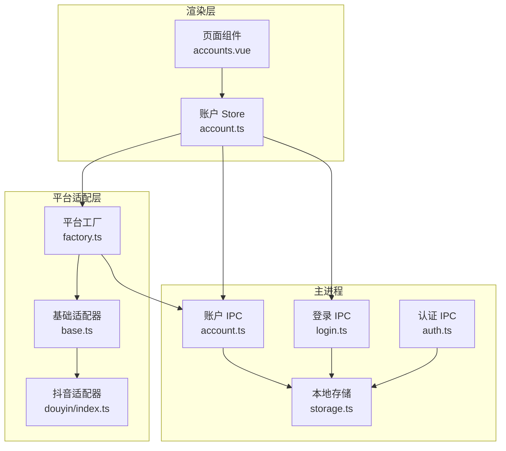
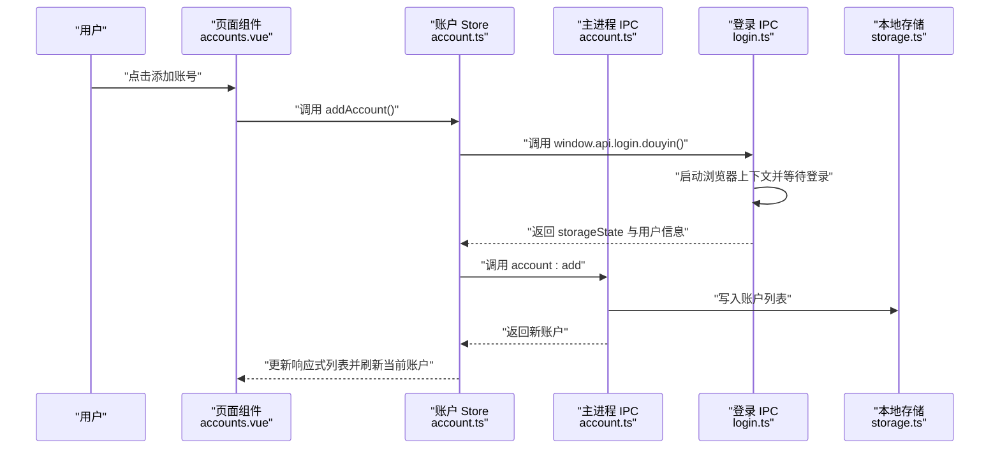
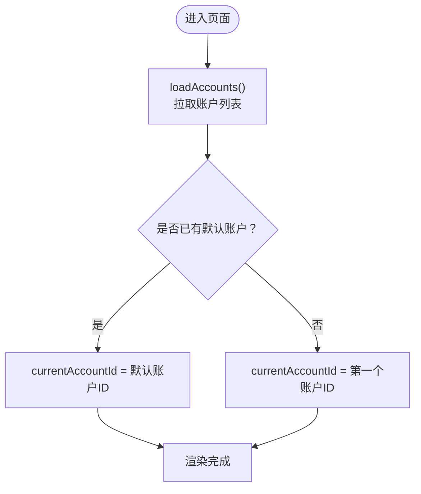
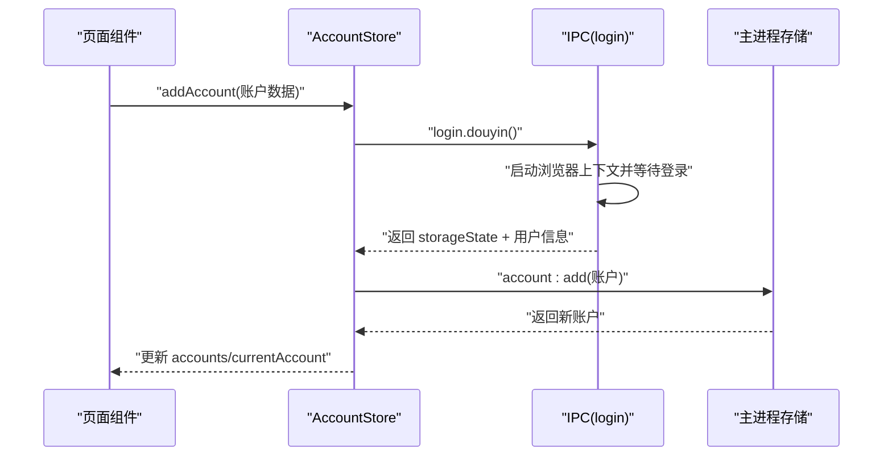
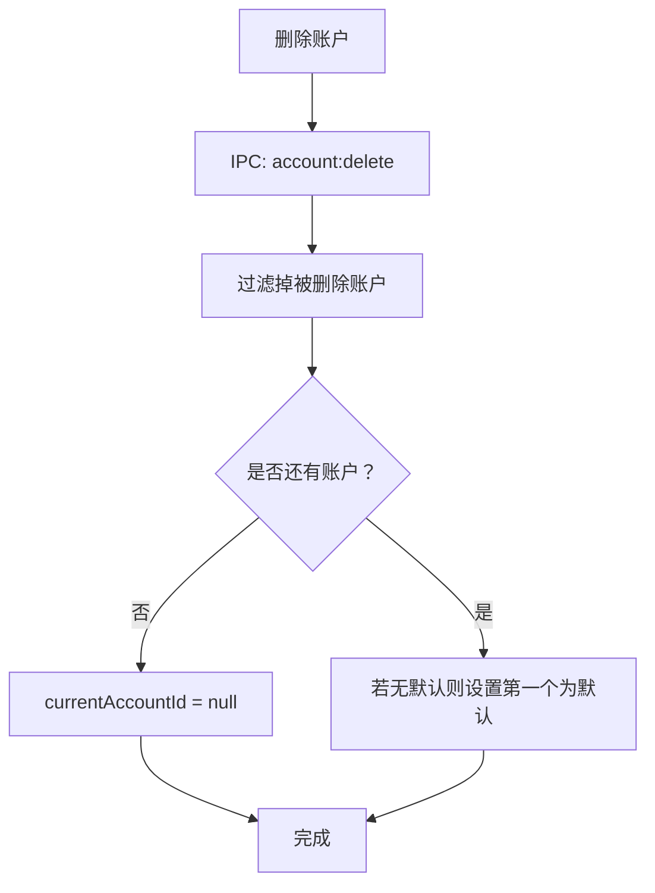
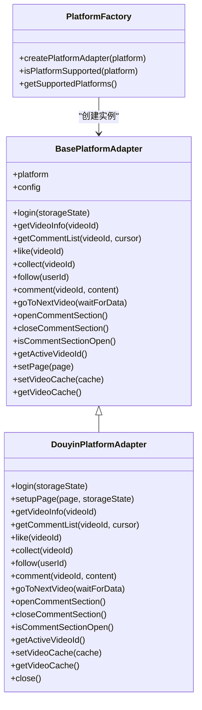
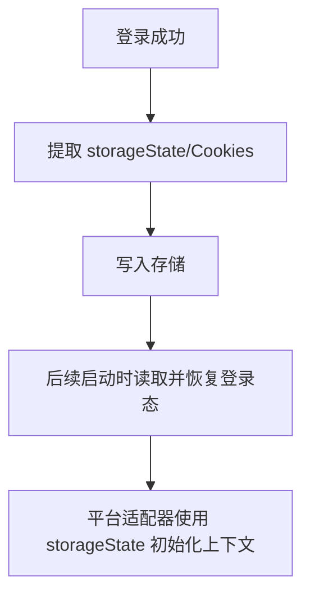
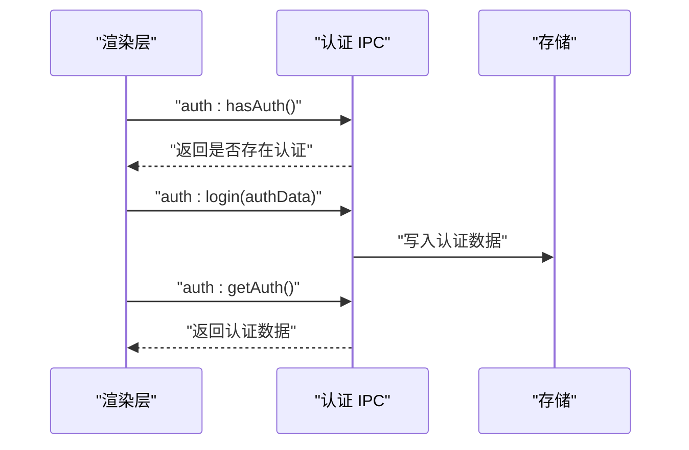
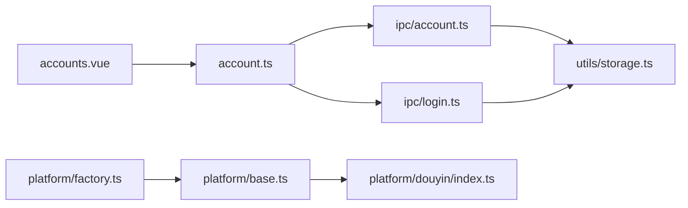

# 账号状态管理

<cite>
**本文引用的文件**
- [src/renderer/src/stores/account.ts](file://src/renderer/src/stores/account.ts)
- [src/shared/account.ts](file://src/shared/account.ts)
- [src/main/ipc/account.ts](file://src/main/ipc/account.ts)
- [src/renderer/src/pages/accounts.vue](file://src/renderer/src/pages/accounts.vue)
- [src/main/platform/base.ts](file://src/main/platform/base.ts)
- [src/main/platform/factory.ts](file://src/main/platform/factory.ts)
- [src/main/platform/douyin/index.ts](file://src/main/platform/douyin/index.ts)
- [src/main/ipc/login.ts](file://src/main/ipc/login.ts)
- [src/main/ipc/auth.ts](file://src/main/ipc/auth.ts)
- [src/shared/platform.ts](file://src/shared/platform.ts)
- [src/main/utils/storage.ts](file://src/main/utils/storage.ts)
- [src/main/index.ts](file://src/main/index.ts)
- [src/renderer/src/main.ts](file://src/renderer/src/main.ts)
</cite>

## 目录
1. [简介](#简介)
2. [项目结构](#项目结构)
3. [核心组件](#核心组件)
4. [架构总览](#架构总览)
5. [详细组件分析](#详细组件分析)
6. [依赖关系分析](#依赖关系分析)
7. [性能考量](#性能考量)
8. [故障排查指南](#故障排查指南)
9. [结论](#结论)
10. [附录](#附录)

## 简介
本文件系统性阐述 AutoOps 的账号状态管理模块，围绕 AccountStore 的设计与实现展开，覆盖多账号支持、认证状态管理、账号配置的响应式更新、账号的增删改查与切换机制、账号状态与平台适配器的集成方式、认证信息的安全存储与同步策略、账号验证流程、登录状态检查与会话管理、持久化最佳实践、数据迁移与故障恢复，以及账号状态与 UI 组件的绑定与响应式更新策略。

## 项目结构
账号状态管理涉及三层协作：
- 渲染层（Vue + Pinia）：负责 UI 响应式与用户交互，调用账户 Store 完成增删改查与切换。
- 主进程（Electron IPC）：负责与系统存储交互，提供账户列表、新增、更新、删除、默认账号设置等能力。
- 平台适配层（Playwright）：负责登录态维护、页面操作与业务动作执行，使用存储的认证状态进行会话复用。

图表来源
- [src/renderer/src/pages/accounts.vue:1-203](file://src/renderer/src/pages/accounts.vue#L1-L203)
- [src/renderer/src/stores/account.ts:1-82](file://src/renderer/src/stores/account.ts#L1-L82)
- [src/main/ipc/account.ts:1-101](file://src/main/ipc/account.ts#L1-L101)
- [src/main/ipc/login.ts:1-173](file://src/main/ipc/login.ts#L1-L173)
- [src/main/ipc/auth.ts:1-23](file://src/main/ipc/auth.ts#L1-L23)
- [src/main/utils/storage.ts:1-46](file://src/main/utils/storage.ts#L1-L46)
- [src/main/platform/factory.ts:1-32](file://src/main/platform/factory.ts#L1-L32)
- [src/main/platform/base.ts:1-105](file://src/main/platform/base.ts#L1-L105)
- [src/main/platform/douyin/index.ts:1-507](file://src/main/platform/douyin/index.ts#L1-L507)

章节来源
- [src/renderer/src/pages/accounts.vue:1-203](file://src/renderer/src/pages/accounts.vue#L1-L203)
- [src/renderer/src/stores/account.ts:1-82](file://src/renderer/src/stores/account.ts#L1-L82)
- [src/main/ipc/account.ts:1-101](file://src/main/ipc/account.ts#L1-L101)
- [src/main/ipc/login.ts:1-173](file://src/main/ipc/login.ts#L1-L173)
- [src/main/ipc/auth.ts:1-23](file://src/main/ipc/auth.ts#L1-L23)
- [src/main/utils/storage.ts:1-46](file://src/main/utils/storage.ts#L1-L46)
- [src/main/platform/factory.ts:1-32](file://src/main/platform/factory.ts#L1-L32)
- [src/main/platform/base.ts:1-105](file://src/main/platform/base.ts#L1-L105)
- [src/main/platform/douyin/index.ts:1-507](file://src/main/platform/douyin/index.ts#L1-L507)

## 核心组件
- 账户模型与工具
  - 账户模型定义与生成：共享模型定义了完整的账户字段，包含平台标识、头像、认证状态、创建时间、默认标记、状态与过期时间等；并提供账户 ID 生成与账户创建工厂方法。
  - 关键路径参考：[src/shared/account.ts:1-39](file://src/shared/account.ts#L1-L39)

- 渲染层账户 Store（Pinia）
  - 提供账户集合、当前账户、默认账户的计算属性；封装加载、新增、更新、删除、设置默认、切换当前账户等方法；所有操作均通过 IPC 调用主进程实现。
  - 关键路径参考：[src/renderer/src/stores/account.ts:1-82](file://src/renderer/src/stores/account.ts#L1-L82)

- 主进程账户 IPC
  - 实现账户列表、新增、更新、删除、设置默认、查询默认、按平台筛选、获取活跃账户等接口；基于本地存储进行持久化。
  - 关键路径参考：[src/main/ipc/account.ts:1-101](file://src/main/ipc/account.ts#L1-L101)

- 登录与认证 IPC
  - 登录流程：启动浏览器上下文、等待用户登录、提取用户信息与 Cookie/StorageState，并返回给渲染层保存。
  - 认证状态：提供认证存在性检查、登录、登出、获取认证信息等接口。
  - 关键路径参考：[src/main/ipc/login.ts:1-173](file://src/main/ipc/login.ts#L1-L173), [src/main/ipc/auth.ts:1-23](file://src/main/ipc/auth.ts#L1-L23)

- 平台适配器与工厂
  - 工厂根据平台类型创建对应适配器；基础适配器抽象了登录、视频/笔记信息、评论、关注、点赞、收藏等通用能力；抖音适配器具体实现登录态维护、页面交互与缓存。
  - 关键路径参考：[src/main/platform/factory.ts:1-32](file://src/main/platform/factory.ts#L1-L32), [src/main/platform/base.ts:1-105](file://src/main/platform/base.ts#L1-L105), [src/main/platform/douyin/index.ts:1-507](file://src/main/platform/douyin/index.ts#L1-L507)

- 本地存储
  - 使用 electron-store 统一管理账户、任务、AI 设置等数据；提供键枚举与读写工具。
  - 关键路径参考：[src/main/utils/storage.ts:1-46](file://src/main/utils/storage.ts#L1-L46)

章节来源
- [src/shared/account.ts:1-39](file://src/shared/account.ts#L1-L39)
- [src/renderer/src/stores/account.ts:1-82](file://src/renderer/src/stores/account.ts#L1-L82)
- [src/main/ipc/account.ts:1-101](file://src/main/ipc/account.ts#L1-L101)
- [src/main/ipc/login.ts:1-173](file://src/main/ipc/login.ts#L1-L173)
- [src/main/ipc/auth.ts:1-23](file://src/main/ipc/auth.ts#L1-L23)
- [src/main/platform/factory.ts:1-32](file://src/main/platform/factory.ts#L1-L32)
- [src/main/platform/base.ts:1-105](file://src/main/platform/base.ts#L1-L105)
- [src/main/platform/douyin/index.ts:1-507](file://src/main/platform/douyin/index.ts#L1-L507)
- [src/main/utils/storage.ts:1-46](file://src/main/utils/storage.ts#L1-L46)

## 架构总览
账号状态管理采用“渲染层 Store + 主进程 IPC + 平台适配器”的分层架构：
- 渲染层通过 Store 暴露响应式状态与方法，用户操作触发 Store 方法，Store 通过 window.api（IPC）与主进程通信。
- 主进程负责数据持久化与跨会话状态管理，提供统一的账户与认证接口。
- 平台适配器负责具体平台的登录态维护与业务操作，可从存储中恢复登录态，也可将最终状态回写存储。

图表来源
- [src/renderer/src/pages/accounts.vue:62-95](file://src/renderer/src/pages/accounts.vue#L62-L95)
- [src/renderer/src/stores/account.ts:35-39](file://src/renderer/src/stores/account.ts#L35-L39)
- [src/main/ipc/account.ts:37-49](file://src/main/ipc/account.ts#L37-L49)
- [src/main/ipc/login.ts:18-167](file://src/main/ipc/login.ts#L18-L167)
- [src/main/utils/storage.ts:14-25](file://src/main/utils/storage.ts#L14-L25)

## 详细组件分析

### AccountStore 设计与实现
- 数据结构
  - accounts：账户数组，由主进程提供。
  - currentAccountId：当前选中账户 ID。
  - currentAccount / defaultAccount：基于计算属性派生当前与默认账户。
- 生命周期与初始化
  - loadAccounts：首次加载账户列表；若未设置 currentAccountId，则优先选择 isDefault，否则选择首个账户。
- 账号操作
  - addAccount：调用 IPC 新增账户并追加到本地数组。
  - updateAccount：调用 IPC 更新后替换本地对应项。
  - deleteAccount：调用 IPC 删除后过滤本地数组；若删除的是当前账户则重置为第一个账户或空。
  - setDefaultAccount：调用 IPC 设置默认后同步更新本地 isDefault 标记。
  - setCurrentAccount：仅更新当前账户 ID（不持久化），用于临时切换。
- 响应式更新
  - 所有变更均通过主进程持久化，渲染层通过 ref/computed 自动响应。

图表来源
- [src/renderer/src/stores/account.ts:26-33](file://src/renderer/src/stores/account.ts#L26-L33)

章节来源
- [src/renderer/src/stores/account.ts:1-82](file://src/renderer/src/stores/account.ts#L1-L82)

### 账号添加流程（登录态采集与保存）
- 用户点击“添加账号”，页面组件触发登录流程。
- 主进程登录 IPC 启动浏览器上下文，等待用户登录完成后提取用户信息与 storageState。
- 返回 storageState 与用户信息，渲染层构造账户对象并调用 Store.addAccount。
- Store 通过 IPC 将账户写入本地存储，同时刷新当前账户。

图表来源
- [src/renderer/src/pages/accounts.vue:62-95](file://src/renderer/src/pages/accounts.vue#L62-L95)
- [src/main/ipc/login.ts:18-167](file://src/main/ipc/login.ts#L18-L167)
- [src/main/ipc/account.ts:37-49](file://src/main/ipc/account.ts#L37-L49)

章节来源
- [src/renderer/src/pages/accounts.vue:62-95](file://src/renderer/src/pages/accounts.vue#L62-L95)
- [src/main/ipc/login.ts:1-173](file://src/main/ipc/login.ts#L1-L173)
- [src/main/ipc/account.ts:1-101](file://src/main/ipc/account.ts#L1-L101)

### 账号删除与切换
- 删除：调用 IPC 删除后，若删除的是当前账户则自动切换到下一个账户或清空。
- 切换：setCurrentAccount 仅修改 currentAccountId，不改变存储；适合临时切换预览。
- 默认账号：setDefaultAccount 会同步更新所有账户的 isDefault 标记，确保唯一默认。

图表来源
- [src/renderer/src/stores/account.ts:50-56](file://src/renderer/src/stores/account.ts#L50-L56)
- [src/main/ipc/account.ts:62-70](file://src/main/ipc/account.ts#L62-L70)

章节来源
- [src/renderer/src/stores/account.ts:50-67](file://src/renderer/src/stores/account.ts#L50-L67)
- [src/main/ipc/account.ts:62-70](file://src/main/ipc/account.ts#L62-L70)

### 账号状态与平台适配器集成
- 平台工厂：根据平台类型创建对应适配器实例。
- 抖音适配器：在登录时接收 storageState，建立带登录态的浏览器上下文；任务结束后可将最终状态写回存储。
- 基础适配器：抽象登录、视频/笔记信息、评论、关注、点赞、收藏等通用能力，便于扩展新平台。

图表来源
- [src/main/platform/base.ts:24-80](file://src/main/platform/base.ts#L24-L80)
- [src/main/platform/douyin/index.ts:56-507](file://src/main/platform/douyin/index.ts#L56-L507)
- [src/main/platform/factory.ts:7-18](file://src/main/platform/factory.ts#L7-L18)

章节来源
- [src/main/platform/base.ts:1-105](file://src/main/platform/base.ts#L1-L105)
- [src/main/platform/douyin/index.ts:1-507](file://src/main/platform/douyin/index.ts#L1-L507)
- [src/main/platform/factory.ts:1-32](file://src/main/platform/factory.ts#L1-L32)

### 认证信息安全存储与同步策略
- 存储位置：electron-store，键空间包含 accounts、auth、tasks 等。
- 登录态存储：登录 IPC 返回的 storageState 与 Cookie 在主进程写入存储；平台适配器在关闭时可将最终状态写回存储，确保下次启动可恢复登录态。
- 同步策略：Store 的所有变更均通过 IPC 写入存储，渲染层通过响应式状态自动更新 UI。

图表来源
- [src/main/ipc/login.ts:135-159](file://src/main/ipc/login.ts#L135-L159)
- [src/main/platform/douyin/index.ts:493-505](file://src/main/platform/douyin/index.ts#L493-L505)
- [src/main/utils/storage.ts:14-25](file://src/main/utils/storage.ts#L14-L25)

章节来源
- [src/main/ipc/login.ts:1-173](file://src/main/ipc/login.ts#L1-L173)
- [src/main/platform/douyin/index.ts:493-505](file://src/main/platform/douyin/index.ts#L493-L505)
- [src/main/utils/storage.ts:1-46](file://src/main/utils/storage.ts#L1-L46)

### 账号验证流程、登录状态检查与会话管理
- 验证流程：页面组件调用 window.api.login.douyin，主进程启动浏览器上下文，等待用户完成登录，提取用户信息与 storageState。
- 登录状态检查：主进程提供 auth:hasAuth 接口，渲染层可据此判断是否需要引导用户登录。
- 会话管理：平台适配器在登录时使用 storageState 创建上下文；任务结束时可将最终状态写回存储，保证会话持久化。

图表来源
- [src/main/ipc/auth.ts:4-23](file://src/main/ipc/auth.ts#L4-L23)
- [src/main/utils/storage.ts:14-25](file://src/main/utils/storage.ts#L14-L25)

章节来源
- [src/main/ipc/auth.ts:1-23](file://src/main/ipc/auth.ts#L1-L23)
- [src/main/utils/storage.ts:1-46](file://src/main/utils/storage.ts#L1-L46)

### 账号状态持久化最佳实践、数据迁移与故障恢复
- 最佳实践
  - 使用统一的存储键空间，避免键冲突；对敏感数据（如 storageState）进行序列化存储。
  - 所有账户变更通过 IPC 进行，确保一致性与可观测性。
  - 在关键生命周期（如退出应用）将状态落盘，防止异常断电丢失。
- 数据迁移
  - 当模型字段变更时，主进程在读取时进行兼容处理（例如新增字段默认值），避免破坏历史数据。
- 故障恢复
  - 若默认账户不存在，删除逻辑会自动为剩余账户设置默认；登录失败时回退到空状态并提示用户重新登录。

章节来源
- [src/main/ipc/account.ts:62-70](file://src/main/ipc/account.ts#L62-L70)
- [src/main/utils/storage.ts:14-25](file://src/main/utils/storage.ts#L14-L25)

### 账号状态与 UI 组件绑定及响应式更新
- 绑定方式：页面组件通过 useAccountStore 获取账户列表、当前账户、默认账户等响应式状态；按钮与表格等 UI 组件直接绑定这些状态。
- 响应式更新：Store 中的 ref/computed 与主进程 IPC 协同工作，任何账户变更都会触发 UI 自动刷新。

章节来源
- [src/renderer/src/pages/accounts.vue:1-203](file://src/renderer/src/pages/accounts.vue#L1-L203)
- [src/renderer/src/stores/account.ts:1-82](file://src/renderer/src/stores/account.ts#L1-L82)

## 依赖关系分析
- 渲染层依赖
  - 页面组件依赖 AccountStore；AccountStore 依赖 window.api（IPC）。
- 主进程依赖
  - 账户 IPC 依赖存储；登录 IPC 依赖 Playwright 浏览器上下文；认证 IPC 依赖存储。
- 平台适配器依赖
  - 工厂依赖基础适配器；抖音适配器依赖平台配置与通用工具。

图表来源
- [src/renderer/src/pages/accounts.vue:1-203](file://src/renderer/src/pages/accounts.vue#L1-L203)
- [src/renderer/src/stores/account.ts:1-82](file://src/renderer/src/stores/account.ts#L1-L82)
- [src/main/ipc/account.ts:1-101](file://src/main/ipc/account.ts#L1-L101)
- [src/main/ipc/login.ts:1-173](file://src/main/ipc/login.ts#L1-L173)
- [src/main/utils/storage.ts:1-46](file://src/main/utils/storage.ts#L1-L46)
- [src/main/platform/factory.ts:1-32](file://src/main/platform/factory.ts#L1-L32)
- [src/main/platform/base.ts:1-105](file://src/main/platform/base.ts#L1-L105)
- [src/main/platform/douyin/index.ts:1-507](file://src/main/platform/douyin/index.ts#L1-L507)

章节来源
- [src/renderer/src/pages/accounts.vue:1-203](file://src/renderer/src/pages/accounts.vue#L1-L203)
- [src/renderer/src/stores/account.ts:1-82](file://src/renderer/src/stores/account.ts#L1-L82)
- [src/main/ipc/account.ts:1-101](file://src/main/ipc/account.ts#L1-L101)
- [src/main/ipc/login.ts:1-173](file://src/main/ipc/login.ts#L1-L173)
- [src/main/utils/storage.ts:1-46](file://src/main/utils/storage.ts#L1-L46)
- [src/main/platform/factory.ts:1-32](file://src/main/platform/factory.ts#L1-L32)
- [src/main/platform/base.ts:1-105](file://src/main/platform/base.ts#L1-L105)
- [src/main/platform/douyin/index.ts:1-507](file://src/main/platform/douyin/index.ts#L1-L507)

## 性能考量
- 响应式更新成本：Store 中的 ref/computed 在账户数量较多时仍保持较低开销；建议避免频繁重建大数组。
- IPC 调用：所有账户变更走 IPC，网络与序列化开销可控；批量操作可考虑合并请求。
- 登录态复用：平台适配器使用 storageState 复用登录态，减少重复登录带来的延迟。
- 缓存策略：平台适配器内部对视频/笔记数据进行缓存，降低重复请求成本。

## 故障排查指南
- 登录失败
  - 检查浏览器执行路径是否正确配置；确认登录 IPC 能够启动浏览器上下文。
  - 查看登录结果中的错误信息，定位用户未完成登录或平台 URL 变更导致的问题。
- 账户无法删除或默认账户丢失
  - 确认删除后是否仍有账户；若无账户，需手动设置新的默认账户。
- 会话未恢复
  - 检查存储中是否存在 auth 或 accounts；确认平台适配器在关闭时是否正确写回状态。
- UI 不更新
  - 确认 Store 方法调用链是否完整；检查 IPC 是否返回成功；确认页面组件是否正确绑定响应式状态。

章节来源
- [src/main/ipc/login.ts:18-167](file://src/main/ipc/login.ts#L18-L167)
- [src/main/ipc/account.ts:62-70](file://src/main/ipc/account.ts#L62-L70)
- [src/main/platform/douyin/index.ts:493-505](file://src/main/platform/douyin/index.ts#L493-L505)
- [src/renderer/src/pages/accounts.vue:1-203](file://src/renderer/src/pages/accounts.vue#L1-L203)
- [src/renderer/src/stores/account.ts:1-82](file://src/renderer/src/stores/account.ts#L1-L82)

## 结论
AutoOps 的账号状态管理以 Pinia Store 为核心，结合 Electron IPC 与平台适配器，实现了多账号支持、认证状态管理与响应式 UI 更新。通过统一的存储与 IPC 接口，系统在安全性、可扩展性与用户体验之间取得平衡。未来可在以下方面持续优化：完善数据迁移与版本兼容、增强错误恢复与日志追踪、引入更细粒度的状态锁与并发控制。

## 附录
- 平台配置与选择器：不同平台的 DOM 选择器与 API 端点集中定义，便于扩展与维护。
- 应用入口注册：主进程在启动时集中注册各类 IPC 处理器，确保模块解耦与职责清晰。

章节来源
- [src/shared/platform.ts:1-260](file://src/shared/platform.ts#L1-L260)
- [src/main/index.ts:54-76](file://src/main/index.ts#L54-L76)
- [src/renderer/src/main.ts:1-12](file://src/renderer/src/main.ts#L1-L12)