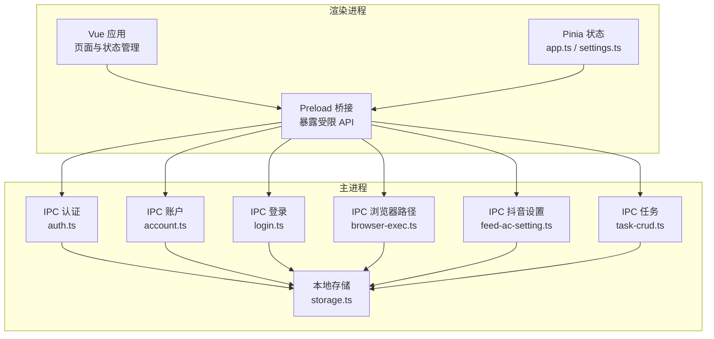
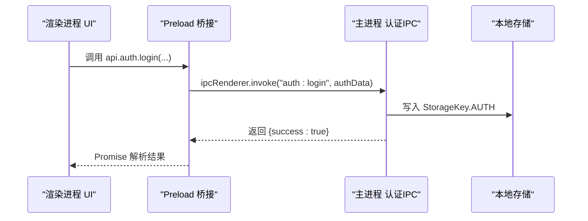
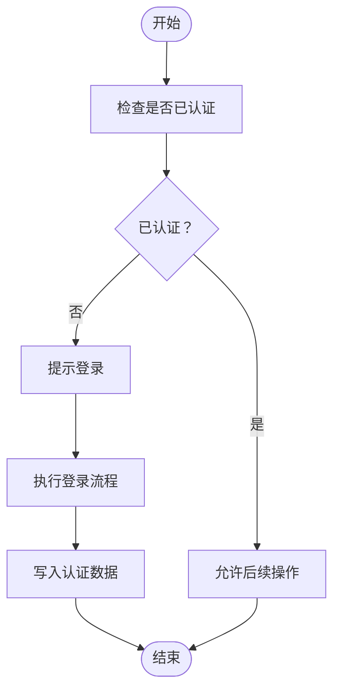
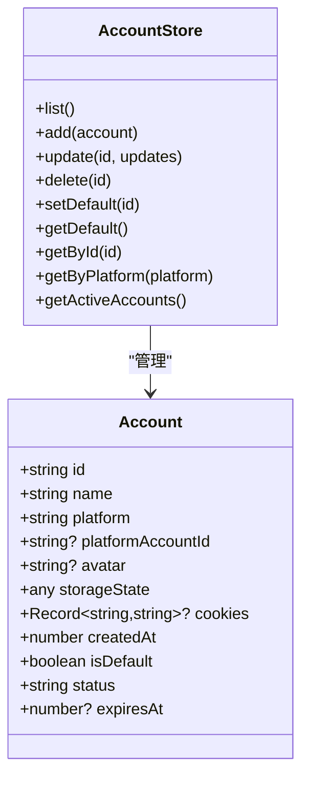
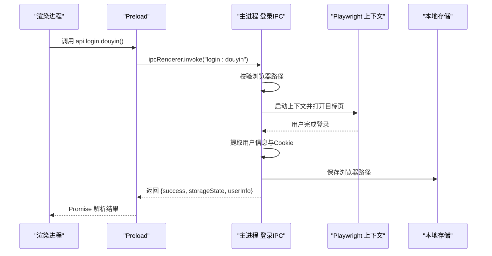
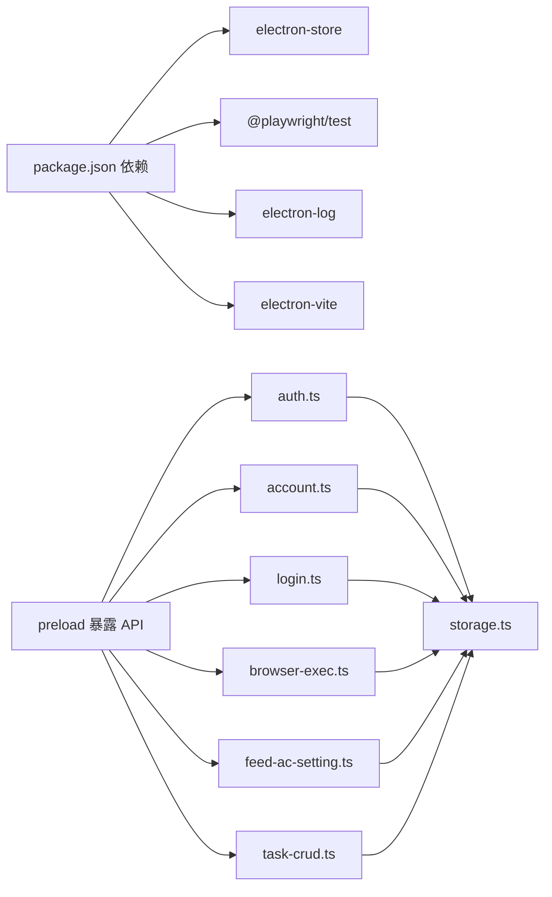

# 安全考虑

<cite>
**本文引用的文件**
- [src/main/ipc/auth.ts](file://src/main/ipc/auth.ts)
- [src/main/ipc/account.ts](file://src/main/ipc/account.ts)
- [src/shared/account.ts](file://src/shared/account.ts)
- [src/main/utils/storage.ts](file://src/main/utils/storage.ts)
- [src/preload/index.ts](file://src/preload/index.ts)
- [src/main/ipc/login.ts](file://src/main/ipc/login.ts)
- [src/main/ipc/browser-exec.ts](file://src/main/ipc/browser-exec.ts)
- [src/renderer/src/stores/app.ts](file://src/renderer/src/stores/app.ts)
- [src/renderer/src/stores/settings.ts](file://src/renderer/src/stores/settings.ts)
- [src/main/ipc/feed-ac-setting.ts](file://src/main/ipc/feed-ac-setting.ts)
- [src/main/ipc/task-crud.ts](file://src/main/ipc/task-crud.ts)
- [package.json](file://package.json)
</cite>

## 目录
1. [引言](#引言)
2. [项目结构](#项目结构)
3. [核心组件](#核心组件)
4. [架构总览](#架构总览)
5. [详细组件分析](#详细组件分析)
6. [依赖关系分析](#依赖关系分析)
7. [性能与安全权衡](#性能与安全权衡)
8. [故障排查指南](#故障排查指南)
9. [结论](#结论)
10. [附录](#附录)

## 引言
本指南面向AutoOps项目的安全设计与实践，聚焦于应用的安全架构、威胁模型、认证与授权、敏感信息存储与传输、网络安全配置、数据隐私保护、代码安全审计与漏洞扫描、安全更新与补丁管理、常见威胁防护（注入、XSS、CSRF）以及应急响应与事件处理流程。文档以仓库现有实现为基础，结合可操作建议，帮助开发者与运维人员建立系统化的安全基线。

## 项目结构
AutoOps采用Electron + Vue 3的桌面应用架构，主进程负责系统级能力（IPC、存储、浏览器上下文），渲染进程负责UI与业务状态管理，preload桥接层暴露受控API给渲染进程。账户与任务等敏感数据通过本地存储进行持久化，登录流程使用Playwright驱动浏览器上下文采集平台Cookie与StorageState。

**图表来源**
- [src/preload/index.ts:130-234](file://src/preload/index.ts#L130-L234)
- [src/main/ipc/auth.ts:4-23](file://src/main/ipc/auth.ts#L4-L23)
- [src/main/ipc/account.ts:32-100](file://src/main/ipc/account.ts#L32-L100)
- [src/main/ipc/login.ts:17-172](file://src/main/ipc/login.ts#L17-L172)
- [src/main/ipc/browser-exec.ts:4-13](file://src/main/ipc/browser-exec.ts#L4-L13)
- [src/main/ipc/feed-ac-setting.ts:16-44](file://src/main/ipc/feed-ac-setting.ts#L16-L44)
- [src/main/ipc/task-crud.ts:8-107](file://src/main/ipc/task-crud.ts#L8-L107)
- [src/main/utils/storage.ts:14-25](file://src/main/utils/storage.ts#L14-L25)

**章节来源**
- [src/preload/index.ts:130-234](file://src/preload/index.ts#L130-L234)
- [src/main/ipc/auth.ts:4-23](file://src/main/ipc/auth.ts#L4-L23)
- [src/main/ipc/account.ts:32-100](file://src/main/ipc/account.ts#L32-L100)
- [src/main/ipc/login.ts:17-172](file://src/main/ipc/login.ts#L17-L172)
- [src/main/ipc/browser-exec.ts:4-13](file://src/main/ipc/browser-exec.ts#L4-L13)
- [src/main/ipc/feed-ac-setting.ts:16-44](file://src/main/ipc/feed-ac-setting.ts#L16-L44)
- [src/main/ipc/task-crud.ts:8-107](file://src/main/ipc/task-crud.ts#L8-L107)
- [src/main/utils/storage.ts:14-25](file://src/main/utils/storage.ts#L14-L25)

## 核心组件
- 认证与授权
  - 主进程提供认证相关IPC：检查是否已认证、登录、登出、获取认证信息。
  - 渲染进程通过preload桥接调用，避免直接访问主进程内部逻辑。
- 账户与会话
  - 账户信息包含平台、头像、存储状态（StorageState）、Cookie等，用于跨设备/会话复用登录态。
  - 默认账户策略：首次添加自动设为默认；删除后若存在其他账户则重新指定默认。
- 存储与密钥
  - 使用electron-store进行本地键值存储，包含认证、账户、任务、设置等。
  - 当前未对存储内容进行加密，属于安全薄弱点。
- 登录流程
  - 通过Playwright启动浏览器上下文，等待用户完成平台登录，提取用户信息与Cookie，生成可复用的StorageState。
  - 该流程涉及敏感Cookie与用户信息的采集与序列化，需严格控制作用域与生命周期。

**章节来源**
- [src/main/ipc/auth.ts:4-23](file://src/main/ipc/auth.ts#L4-L23)
- [src/main/ipc/account.ts:32-100](file://src/main/ipc/account.ts#L32-L100)
- [src/shared/account.ts:3-15](file://src/shared/account.ts#L3-L15)
- [src/main/utils/storage.ts:14-25](file://src/main/utils/storage.ts#L14-L25)
- [src/main/ipc/login.ts:17-172](file://src/main/ipc/login.ts#L17-L172)

## 架构总览
下图展示从用户操作到主进程处理、再到本地存储的关键交互路径，强调了敏感数据在渲染进程与主进程之间的流转边界。

**图表来源**
- [src/preload/index.ts:130-136](file://src/preload/index.ts#L130-L136)
- [src/main/ipc/auth.ts:10-12](file://src/main/ipc/auth.ts#L10-L12)
- [src/main/utils/storage.ts:40-46](file://src/main/utils/storage.ts#L40-L46)

## 详细组件分析

### 组件A：认证与授权机制
- 设计要点
  - 渲染进程仅能通过preload暴露的接口发起认证请求，避免越权调用。
  - 主进程统一管理认证状态，提供has/get/login/logout四个核心能力。
- 安全风险
  - 当前未实现密码校验、会话令牌签发与校验、权限范围控制。
  - 认证数据直接写入本地存储，未做加密或完整性校验。
- 建议改进
  - 引入强口令策略与本地加密存储（如基于操作系统凭据库）。
  - 实施短期会话令牌与刷新机制，限制令牌有效期。
  - 在主进程侧增加权限矩阵与细粒度授权检查。

**图表来源**
- [src/main/ipc/auth.ts:5-8](file://src/main/ipc/auth.ts#L5-L8)
- [src/main/ipc/auth.ts:10-12](file://src/main/ipc/auth.ts#L10-L12)

**章节来源**
- [src/main/ipc/auth.ts:4-23](file://src/main/ipc/auth.ts#L4-L23)
- [src/preload/index.ts:130-136](file://src/preload/index.ts#L130-L136)

### 组件B：账户与会话管理
- 设计要点
  - 账户对象包含平台、头像、StorageState、Cookie、状态与过期时间等字段。
  - 支持列表、新增、更新、删除、设置默认、按平台筛选、查询活跃账户等操作。
- 安全风险
  - Cookie与StorageState可能包含敏感登录态，当前未加密存储。
  - 删除账户后若无默认账户，将自动设置首个账户为默认，存在潜在误操作风险。
- 建议改进
  - 对Cookie与StorageState进行加密存储，并在读取时解密。
  - 在删除默认账户时进行二次确认与提示。
  - 引入账户状态轮询与过期检测，定期刷新或提示续期。

**图表来源**
- [src/shared/account.ts:3-15](file://src/shared/account.ts#L3-L15)
- [src/main/ipc/account.ts:32-100](file://src/main/ipc/account.ts#L32-L100)

**章节来源**
- [src/shared/account.ts:3-15](file://src/shared/account.ts#L3-L15)
- [src/main/ipc/account.ts:32-100](file://src/main/ipc/account.ts#L32-L100)

### 组件C：登录与会话采集（Playwright）
- 设计要点
  - 通过Playwright启动浏览器上下文，等待用户完成平台登录，提取用户信息与Cookie，生成可复用的StorageState。
  - 登录前需校验浏览器可执行文件路径，否则返回错误。
- 安全风险
  - 临时用户数据目录位于系统目录，需确保路径隔离与清理。
  - 页面内容解析依赖DOM选择器，存在被平台UI变更影响的风险。
  - 采集到的Cookie与StorageState在IPC层传递，需限制可见范围。
- 建议改进
  - 为临时上下文设置独立沙箱目录并启用最小权限参数。
  - 对返回的StorageState进行白名单过滤，仅保留必要字段。
  - 在渲染层对敏感数据进行只读展示，不暴露原始序列化字符串。

**图表来源**
- [src/preload/index.ts:194-196](file://src/preload/index.ts#L194-L196)
- [src/main/ipc/login.ts:17-172](file://src/main/ipc/login.ts#L17-L172)
- [src/main/ipc/browser-exec.ts:4-13](file://src/main/ipc/browser-exec.ts#L4-L13)

**章节来源**
- [src/main/ipc/login.ts:17-172](file://src/main/ipc/login.ts#L17-L172)
- [src/main/ipc/browser-exec.ts:4-13](file://src/main/ipc/browser-exec.ts#L4-L13)
- [src/renderer/src/stores/app.ts:32-43](file://src/renderer/src/stores/app.ts#L32-L43)

### 组件D：设置与敏感配置
- 设计要点
  - 设置项包括FeedAc与AI配置，支持加载、更新、重置、导入导出。
  - 配置变更通过IPC写入本地存储。
- 安全风险
  - 导入/导出功能可能被滥用，导致配置污染或敏感参数泄露。
  - 配置中可能包含第三方服务密钥，当前未加密存储。
- 建议改进
  - 导入/导出增加签名校验与版本兼容性检查。
  - 对包含密钥的配置项进行加密存储与访问控制。

**章节来源**
- [src/main/ipc/feed-ac-setting.ts:16-44](file://src/main/ipc/feed-ac-setting.ts#L16-L44)
- [src/renderer/src/stores/settings.ts:12-34](file://src/renderer/src/stores/settings.ts#L12-L34)

### 组件E：任务与模板
- 设计要点
  - 支持任务的增删改查与模板保存/删除，任务配置默认继承平台默认设置。
- 安全风险
  - 任务配置可能包含敏感参数，当前未加密存储。
  - 模板导入未做完整性校验，存在注入风险。
- 建议改进
  - 对任务与模板配置进行加密存储与访问控制。
  - 导入模板时进行白名单校验与最小权限原则评估。

**章节来源**
- [src/main/ipc/task-crud.ts:8-107](file://src/main/ipc/task-crud.ts#L8-L107)

## 依赖关系分析
- 外部依赖
  - electron-store：本地键值存储，承载认证、账户、任务、设置等数据。
  - @playwright/test：用于自动化登录与会话采集。
  - electron-log：日志记录，便于审计与问题定位。
- 内部耦合
  - preload桥接层集中暴露API，主进程各IPC模块围绕存储与业务逻辑协作。
  - 渲染层通过Pinia状态管理与IPC交互，降低直接依赖主进程细节。

**图表来源**
- [package.json:16-34](file://package.json#L16-L34)
- [src/preload/index.ts:130-234](file://src/preload/index.ts#L130-L234)
- [src/main/ipc/auth.ts:4-23](file://src/main/ipc/auth.ts#L4-L23)
- [src/main/ipc/account.ts:32-100](file://src/main/ipc/account.ts#L32-L100)
- [src/main/ipc/login.ts:17-172](file://src/main/ipc/login.ts#L17-L172)
- [src/main/ipc/browser-exec.ts:4-13](file://src/main/ipc/browser-exec.ts#L4-L13)
- [src/main/ipc/feed-ac-setting.ts:16-44](file://src/main/ipc/feed-ac-setting.ts#L16-L44)
- [src/main/ipc/task-crud.ts:8-107](file://src/main/ipc/task-crud.ts#L8-L107)
- [src/main/utils/storage.ts:14-25](file://src/main/utils/storage.ts#L14-L25)

**章节来源**
- [package.json:16-34](file://package.json#L16-L34)
- [src/main/utils/storage.ts:14-25](file://src/main/utils/storage.ts#L14-L25)

## 性能与安全权衡
- 性能
  - Playwright上下文启动与页面加载会消耗资源，建议在后台运行且限制并发。
  - 本地存储读写频繁，建议批量写入与去抖。
- 安全
  - 为减少内存暴露，避免在渲染层长期持有敏感数据；仅在需要时通过IPC获取。
  - 对外输出的日志应脱敏，避免泄露Cookie、Token等。

[本节为通用指导，无需特定文件引用]

## 故障排查指南
- 认证相关
  - 若hasAuth返回false，检查是否已调用login并成功写入存储。
  - 登录失败时查看主进程日志，确认浏览器路径是否正确。
- 账户相关
  - 新增账户后未成为默认账户：检查账户列表是否为空，确保首次添加自动设为默认。
  - 删除账户后无法继续操作：确认是否存在其他账户，必要时重新设置默认。
- 登录流程
  - 页面未识别用户信息：检查DOM选择器是否匹配平台UI，或尝试手动刷新。
  - Cookie数量异常：确认平台登录状态与浏览器上下文配置。
- 设置与模板
  - 导入失败：检查配置格式与版本兼容性，确保白名单字段齐全。
  - 更新后未生效：确认IPC写入成功与存储键一致。

**章节来源**
- [src/main/ipc/auth.ts:5-8](file://src/main/ipc/auth.ts#L5-L8)
- [src/main/ipc/account.ts:40-48](file://src/main/ipc/account.ts#L40-L48)
- [src/main/ipc/login.ts:16-23](file://src/main/ipc/login.ts#L16-L23)
- [src/main/ipc/feed-ac-setting.ts:39-43](file://src/main/ipc/feed-ac-setting.ts#L39-L43)

## 结论
AutoOps当前实现了基础的认证、账户与登录采集能力，但尚未覆盖加密存储、细粒度授权、会话令牌与权限控制等关键安全要素。建议优先补齐本地敏感数据加密、引入短期会话令牌与权限矩阵、完善导入导出校验与最小权限原则，并建立持续的安全审计与应急响应流程，以满足生产环境的安全要求。

[本节为总结性内容，无需特定文件引用]

## 附录

### A. 威胁模型与缓解清单
- 威胁类型
  - 本地存储泄露：Cookie、StorageState、配置密钥等。
  - 会话劫持：未签发短期令牌，易被窃取。
  - 权限滥用：缺乏权限矩阵，可能导致越权操作。
  - 配置注入：导入/导出未校验，可能写入恶意配置。
- 缓解措施
  - 对敏感数据进行加密存储与访问控制。
  - 引入短期令牌与刷新机制，限制有效期。
  - 建立权限矩阵与主进程侧授权检查。
  - 导入/导出增加签名与白名单校验。

[本节为概念性内容，无需特定文件引用]

### B. 网络安全配置建议
- 代理设置
  - 在应用内提供HTTP/HTTPS代理配置入口，并在启动时注入到Playwright上下文。
- SSL证书
  - 仅信任受信CA签发证书；对自签名证书进行白名单管理。
- 防火墙规则
  - 限制对外出站连接，仅放行必要域名；对反爬/风控站点进行速率限制与IP轮换。

[本节为通用指导，无需特定文件引用]

### C. 数据隐私保护
- 收集与处理
  - 明确最小化原则：仅采集完成登录所必需的信息。
  - 对用户头像、昵称等个人数据进行匿名化处理。
- 存储与传输
  - 本地存储加密；传输通道使用TLS 1.3以上版本。
- 用户权利
  - 提供一键清除所有账户与历史记录的功能，并在卸载时清理残留数据。

[本节为通用指导，无需特定文件引用]

### D. 代码安全审计与漏洞扫描
- 工具链
  - 使用ESLint与TypeScript类型检查，禁用eval与动态代码执行。
  - 集成SAST工具（如SonarQube）与依赖漏洞扫描（如npm audit）。
- 扫描范围
  - 主进程IPC、preload桥接、渲染层组件与路由守卫。
- 回归测试
  - 将安全扫描纳入CI流水线，失败即阻断发布。

[本节为通用指导，无需特定文件引用]

### E. 安全更新与补丁管理
- 版本策略
  - 对依赖进行定期升级，优先修复高危漏洞。
  - 采用语义化版本与变更日志，明确安全修复范围。
- 发布流程
  - 安全补丁通过热修复分支合并，经安全评审后再合并主干。

[本节为通用指导，无需特定文件引用]

### F. 常见威胁防护
- 注入攻击
  - 严格校验与转义用户输入；避免在渲染层拼接HTML。
- XSS
  - 使用内容安全策略（CSP），限制内联脚本与远程资源。
- CSRF
  - 在主进程侧引入CSRF令牌与同源校验，避免渲染层直接发起跨站请求。

[本节为通用指导，无需特定文件引用]

### G. 应急响应与事件处理
- 事件分类
  - 认证失效、账户数据泄露、配置被篡改、登录流程失败。
- 处置流程
  - 快速隔离受影响账户；撤销短期令牌；回滚可疑配置；通知用户并提供自检工具。
- 复盘与改进
  - 记录事件时间线与根因，补充监控告警与自动化处置脚本。

[本节为通用指导，无需特定文件引用]