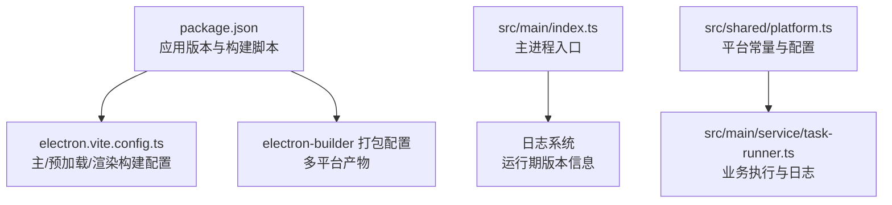
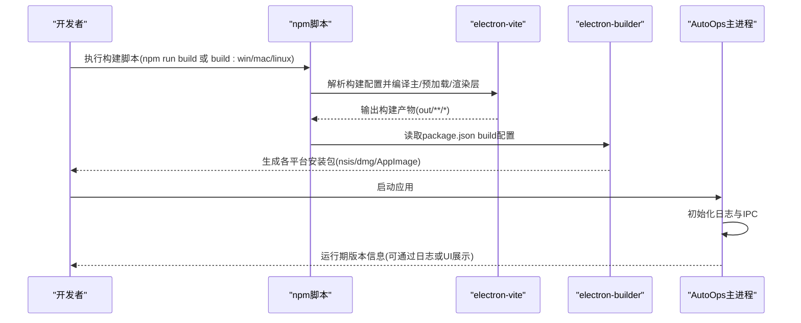
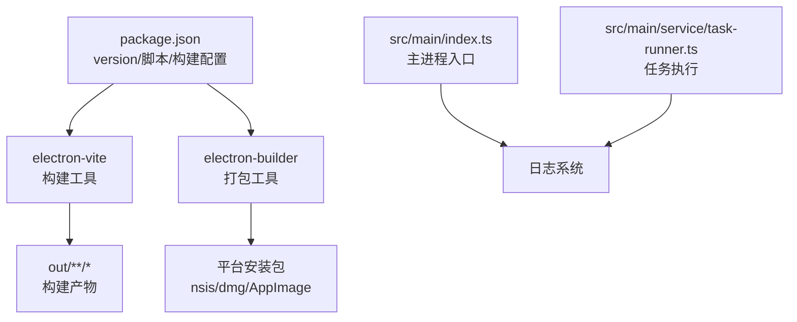

# 版本管理

<cite>
**本文引用的文件**
- [package.json](file://package.json)
- [electron.vite.config.ts](file://electron.vite.config.ts)
- [src/main/index.ts](file://src/main/index.ts)
- [src/shared/platform.ts](file://src/shared/platform.ts)
- [src/main/service/task-runner.ts](file://src/main/service/task-runner.ts)
- [README.md](file://README.md)
</cite>

## 目录
1. [简介](#简介)
2. [项目结构](#项目结构)
3. [核心组件](#核心组件)
4. [架构总览](#架构总览)
5. [详细组件分析](#详细组件分析)
6. [依赖关系分析](#依赖关系分析)
7. [性能考量](#性能考量)
8. [故障排查指南](#故障排查指南)
9. [结论](#结论)
10. [附录](#附录)

## 简介
本指南面向AutoOps项目的版本管理与发布流程，结合现有仓库配置与实现，给出可落地的语义化版本策略、版本号规则、构建与发布机制、升级与兼容性策略、预发布与正式版本管理、回滚与紧急修复流程、发布检查清单与质量标准，以及多平台版本差异的处理建议。当前仓库未内置CI/CD流水线配置文件，因此本指南以“基于现有构建配置”的方式提供可直接实施的版本管理实践。

## 项目结构
AutoOps采用Electron主进程 + Vue渲染层的桌面应用结构，核心版本相关配置集中在包管理与构建配置中：
- 包管理与版本：通过package.json的version字段声明应用版本，并通过scripts定义构建命令。
- 构建与打包：通过electron-vite与electron-builder进行主进程、预加载与渲染层的构建与多平台打包。
- 运行时入口：主进程入口负责注册IPC、日志初始化与窗口创建，便于在运行期输出版本相关信息。

图表来源
- [package.json:1-85](file://package.json#L1-L85)
- [electron.vite.config.ts:1-34](file://electron.vite.config.ts#L1-L34)
- [src/main/index.ts:1-106](file://src/main/index.ts#L1-L106)
- [src/shared/platform.ts:1-260](file://src/shared/platform.ts#L1-L260)
- [src/main/service/task-runner.ts:1-760](file://src/main/service/task-runner.ts#L1-L760)

章节来源
- [package.json:1-85](file://package.json#L1-L85)
- [electron.vite.config.ts:1-34](file://electron.vite.config.ts#L1-L34)
- [README.md:1-54](file://README.md#L1-L54)

## 核心组件
- 应用版本与构建脚本
  - 版本号：位于package.json的version字段，当前为0.1.0。
  - 构建脚本：包含开发、通用构建与多平台构建命令；类型检查与代码规范检查脚本。
- 构建配置
  - electron-vite用于主进程、预加载与渲染层的构建与别名配置。
- 打包配置
  - electron-builder在package.json的build字段中定义应用ID、产品名、输出目录、平台目标与安装包配置。
- 运行时入口
  - 主进程入口初始化日志、注册IPC处理器、设置App ID，并在开发环境输出运行URL，便于调试与版本信息展示。

章节来源
- [package.json:1-85](file://package.json#L1-L85)
- [electron.vite.config.ts:1-34](file://electron.vite.config.ts#L1-L34)
- [src/main/index.ts:1-106](file://src/main/index.ts#L1-L106)

## 架构总览
下图展示了版本管理在构建与运行阶段的关键交互：

图表来源
- [package.json:6-14](file://package.json#L6-L14)
- [package.json:50-83](file://package.json#L50-L83)
- [electron.vite.config.ts:6-33](file://electron.vite.config.ts#L6-L33)
- [src/main/index.ts:17-20](file://src/main/index.ts#L17-L20)

## 详细组件分析

### 语义化版本控制策略与版本号规则
- 版本号位置与含义
  - 当前版本号位于package.json的version字段，当前为0.1.0，表示初始开发阶段。
- 语义化版本规则建议
  - 主版本号：破坏性变更时递增；新增不兼容API或核心架构调整。
  - 次版本号：向后兼容的功能新增；保持现有API可用。
  - 补丁版本号：向后兼容的问题修复；不引入新功能。
- 预发布版本
  - 使用语义化版本扩展格式：主/次/补丁后追加“-alpha.N”、“-beta.N”、“-rc.N”，其中N为递增序号。
  - 预发布版本优先级低于正式版本，可用于内部测试与外部灰度。
- 版本标签命名
  - 正式版本：v0.1.0、v1.0.0、v2.3.4
  - 预发布版本：v0.1.0-alpha.1、v1.0.0-beta.2、v2.3.4-rc.1
- 版本号一致性
  - 保持package.json与构建配置中的版本一致；如需在运行期展示，可在主进程入口或UI中读取并输出。

章节来源
- [package.json:3](file://package.json#L3)
- [package.json:50-83](file://package.json#L50-L83)

### 构建脚本中的版本管理机制
- 构建命令
  - 开发：dev
  - 通用构建：build（先类型检查再构建）
  - 多平台构建：build:win、build:mac、build:linux
- 类型检查与代码规范
  - typecheck：TypeScript类型检查
  - lint：ESLint代码规范检查
- 构建产物与打包
  - electron-vite输出至out目录，electron-builder的files包含out/**/*，确保构建产物被正确打包。
  - 平台目标：Windows(nsis)、macOS(dmg)、Linux(AppImage)，并配置图标与安装选项。

章节来源
- [package.json:6-14](file://package.json#L6-L14)
- [package.json:57-59](file://package.json#L57-L59)
- [package.json:60-82](file://package.json#L60-L82)
- [electron.vite.config.ts:18-33](file://electron.vite.config.ts#L18-L33)

### CI/CD流水线中的版本标记与发布流程
- 版本标记建议
  - 在合并PR至主分支前，更新package.json的version字段并提交；随后打标签（如v0.1.0）。
  - 预发布版本在测试分支上打对应预发布标签（如v0.1.0-beta.1）。
- 发布流程建议
  - 触发CI：推送tag或合并主分支触发构建。
  - 构建与测试：执行typecheck与lint，确保质量门槛。
  - 打包：按平台执行build:win/mac/linux，产出安装包。
  - 归档：上传安装包至发布页或制品库。
- 与现有配置的映射
  - 构建脚本与打包配置已在package.json中定义，可直接在CI中调用。

章节来源
- [package.json:6-14](file://package.json#L6-L14)
- [package.json:50-83](file://package.json#L50-L83)

### 版本升级策略：向后兼容与破坏性变更
- 向后兼容
  - 新增非破坏性功能时递增次版本号；保持IPC接口与存储结构稳定。
  - 对于渲染层UI组件，遵循设计系统与样式兼容性。
- 破坏性变更
  - 修改或删除现有IPC接口、存储键值、平台配置结构时递增主版本号。
  - 提供迁移脚本或渐进式迁移策略，保留过渡期的兼容逻辑。
- 日志与可观测性
  - 主进程与业务执行模块均使用日志系统输出状态与错误，便于升级后的问题定位。

章节来源
- [src/main/index.ts:17-20](file://src/main/index.ts#L17-L20)
- [src/main/service/task-runner.ts:746-758](file://src/main/service/task-runner.ts#L746-L758)

### 预发布版本、测试版本与正式版本管理
- 预发布版本
  - 使用语义化版本扩展标识（alpha/beta/rc），并配合CI的分支策略进行灰度发布。
- 测试版本
  - 通过预发布标签与渠道区分测试版与正式版；测试版仅对受邀用户开放。
- 正式版本
  - 通过稳定标签与发布流程产出正式安装包；确保文档与变更日志同步更新。

章节来源
- [package.json:3](file://package.json#L3)

### 版本回滚策略与紧急修复流程
- 回滚策略
  - 记录每次发布对应的构建产物与标签；若发现问题，回退到上一稳定标签并重新发布。
  - 对于数据库或存储结构变更，提供降级脚本与数据迁移备份。
- 紧急修复
  - 从上一稳定版本切出热修复分支，修复后在CI中验证并打补丁版本标签（如v0.1.1）。
  - 通过预发布通道快速验证，确认无误后再推送到正式渠道。

章节来源
- [package.json:3](file://package.json#L3)

### 版本发布检查清单与质量保证标准
- 发布前检查
  - 版本号更新与提交：确保package.json版本与标签一致。
  - 本地构建：执行build与多平台构建命令，验证产物完整性。
  - 类型检查与代码规范：typecheck与lint通过。
  - 功能自测：关键路径（登录、任务执行、评论生成）验证。
- 质量标准
  - 无类型错误、无严重代码规范违规。
  - 安装包可正常安装与卸载，应用可正常启动。
  - 日志系统可输出运行期信息，便于问题追踪。

章节来源
- [package.json:6-14](file://package.json#L6-L14)
- [src/main/service/task-runner.ts:746-758](file://src/main/service/task-runner.ts#L746-L758)

### 多平台版本差异与平台特定要求
- 平台目标
  - Windows：nsis安装包，支持桌面快捷方式与安装目录选择。
  - macOS：dmg镜像，符合Apple分发要求。
  - Linux：AppImage，便于分发与运行。
- 平台特定配置
  - 图标与安装选项在package.json的build.win/mac/linux中配置。
  - electron-vite的renderer构建配置确保前端资源正确打包。
- 平台差异处理
  - 若不同平台存在行为差异，应在业务逻辑中通过平台适配层处理；当前平台配置集中于共享类型文件，便于统一维护。

章节来源
- [package.json:50-83](file://package.json#L50-L83)
- [electron.vite.config.ts:18-33](file://electron.vite.config.ts#L18-L33)
- [src/shared/platform.ts:18-200](file://src/shared/platform.ts#L18-L200)

## 依赖关系分析
版本管理涉及的依赖与关系如下：

图表来源
- [package.json:6-14](file://package.json#L6-L14)
- [package.json:50-83](file://package.json#L50-L83)
- [electron.vite.config.ts:6-33](file://electron.vite.config.ts#L6-L33)
- [src/main/index.ts:17-20](file://src/main/index.ts#L17-L20)
- [src/main/service/task-runner.ts:746-758](file://src/main/service/task-runner.ts#L746-L758)

章节来源
- [package.json:1-85](file://package.json#L1-L85)
- [electron.vite.config.ts:1-34](file://electron.vite.config.ts#L1-L34)
- [src/main/index.ts:1-106](file://src/main/index.ts#L1-L106)
- [src/main/service/task-runner.ts:1-760](file://src/main/service/task-runner.ts#L1-L760)

## 性能考量
- 构建性能
  - 使用electron-vite的插件与别名优化构建速度；避免不必要的依赖与大体积资源。
- 运行性能
  - 任务执行模块通过缓存与异步处理提升效率；日志系统应避免高频写入阻塞主线程。
- 打包体积
  - electron-builder的files仅包含out/**/*，确保最小化打包范围；必要时启用代码分割与懒加载。

章节来源
- [electron.vite.config.ts:6-33](file://electron.vite.config.ts#L6-L33)
- [package.json:57-59](file://package.json#L57-L59)
- [src/main/service/task-runner.ts:33-38](file://src/main/service/task-runner.ts#L33-L38)

## 故障排查指南
- 构建失败
  - 检查typecheck与lint结果；核对electron-vite与electron-builder版本兼容性。
- 打包异常
  - 确认build.files包含out/**/*；检查平台目标与图标路径。
- 运行期问题
  - 查看主进程日志初始化与IPC事件；在任务执行模块中定位具体步骤与错误信息。

章节来源
- [package.json:6-14](file://package.json#L6-L14)
- [package.json:50-83](file://package.json#L50-L83)
- [src/main/index.ts:17-20](file://src/main/index.ts#L17-L20)
- [src/main/service/task-runner.ts:106-110](file://src/main/service/task-runner.ts#L106-L110)

## 结论
本指南基于AutoOps现有仓库配置，给出了可直接实施的版本管理实践：以语义化版本为核心，结合package.json与electron-builder的构建配置，形成从开发、构建、测试到发布的闭环。建议在CI中固化版本标签与发布流程，并通过日志与可观测性保障升级后的稳定性与可追溯性。

## 附录
- 快速对照表
  - 版本号：package.json version
  - 构建命令：dev/build/build:win/mac/linux/typecheck/lint
  - 打包配置：package.json build字段
  - 构建配置：electron-vite配置
  - 运行入口：主进程入口与日志初始化

章节来源
- [package.json:1-85](file://package.json#L1-L85)
- [electron.vite.config.ts:1-34](file://electron.vite.config.ts#L1-L34)
- [src/main/index.ts:1-106](file://src/main/index.ts#L1-L106)
- [README.md:1-54](file://README.md#L1-L54)