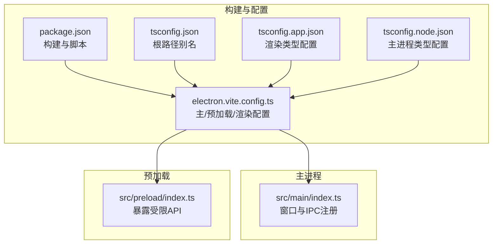
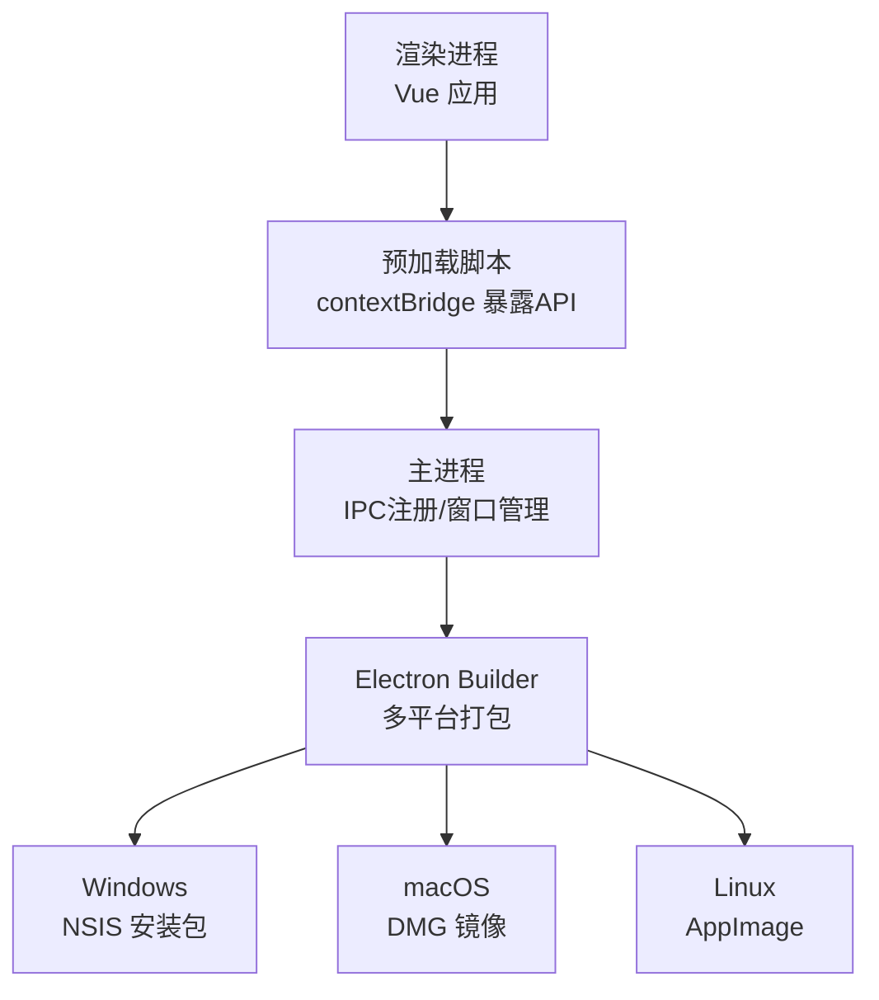
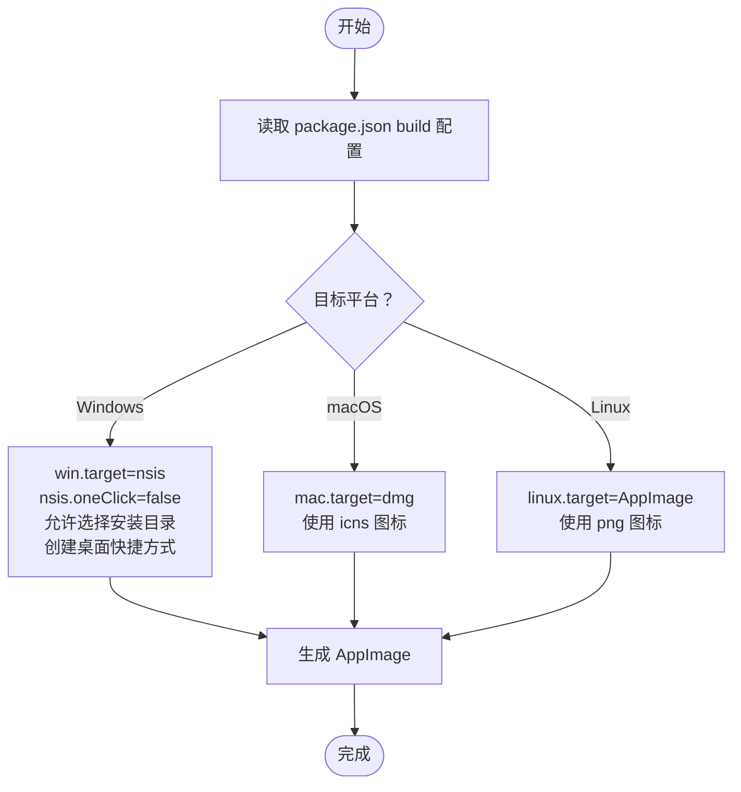
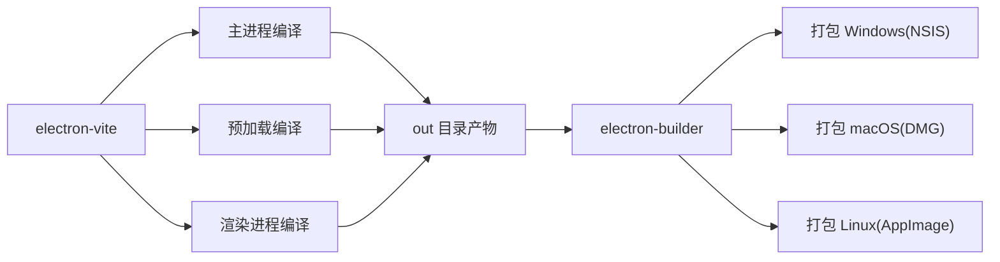

# 生产环境部署

<cite>
**本文引用的文件**
- [package.json](file://package.json)
- [electron.vite.config.ts](file://electron.vite.config.ts)
- [tsconfig.json](file://tsconfig.json)
- [tsconfig.app.json](file://tsconfig.app.json)
- [tsconfig.node.json](file://tsconfig.node.json)
- [src/main/index.ts](file://src/main/index.ts)
- [src/preload/index.ts](file://src/preload/index.ts)
- [.gitignore](file://.gitignore)
</cite>

## 目录
1. [简介](#简介)
2. [项目结构](#项目结构)
3. [核心组件](#核心组件)
4. [架构总览](#架构总览)
5. [详细组件分析](#详细组件分析)
6. [依赖分析](#依赖分析)
7. [性能考虑](#性能考虑)
8. [故障排查指南](#故障排查指南)
9. [结论](#结论)
10. [附录](#附录)

## 简介
本指南面向在生产环境中部署 AutoOps 的工程团队与运维人员，覆盖系统要求与兼容性检查、安装与构建流程、Electron Builder 多平台打包策略（NSIS、DMG、AppImage）、部署前验证清单、防火墙与权限配置、安全加固、增量更新与热修复思路、以及生产监控与健康检查建议。文档严格基于仓库中的配置与源码进行说明，避免臆测。

## 项目结构
AutoOps 是一个基于 Electron + Vue 3 的跨平台桌面应用，采用 Electron-Vite 构建器组织主进程、预加载脚本与渲染进程。主要目录与职责如下：
- src/main：Electron 主进程入口与 IPC 注册，负责窗口生命周期、日志初始化与全局事件处理
- src/preload：预加载脚本，通过 contextBridge 暴露受控 API 至渲染进程
- src/renderer：Vue 渲染进程前端代码
- build：构建资源目录（图标等），由构建配置引用
- 配置文件：package.json（含 Electron Builder 配置）、electron.vite.config.ts（构建入口）、tsconfig.*（类型与路径别名）

图表来源
- [package.json:50-83](file://package.json#L50-L83)
- [electron.vite.config.ts:6-33](file://electron.vite.config.ts#L6-L33)
- [tsconfig.json:1-18](file://tsconfig.json#L1-L18)
- [tsconfig.app.json:1-18](file://tsconfig.app.json#L1-L18)
- [tsconfig.node.json:1-16](file://tsconfig.node.json#L1-L16)
- [src/main/index.ts:1-106](file://src/main/index.ts#L1-L106)
- [src/preload/index.ts:1-187](file://src/preload/index.ts#L1-L187)

章节来源
- [package.json:1-85](file://package.json#L1-L85)
- [electron.vite.config.ts:1-34](file://electron.vite.config.ts#L1-L34)
- [tsconfig.json:1-18](file://tsconfig.json#L1-L18)
- [tsconfig.app.json:1-18](file://tsconfig.app.json#L1-L18)
- [tsconfig.node.json:1-16](file://tsconfig.node.json#L1-L16)

## 核心组件
- 应用入口与窗口管理：主进程负责创建 BrowserWindow、设置 webPreferences、注册 IPC 处理器，并在开发模式下加载本地地址或生产 HTML 文件
- 预加载桥接层：通过 contextBridge 将有限的 IPC 能力暴露给渲染进程，确保上下文隔离与最小权限
- 构建与打包：使用 electron-vite 进行编译，electron-builder 进行多平台分发；package.json 中定义了 Windows（NSIS）、macOS（DMG）与 Linux（AppImage）目标

章节来源
- [src/main/index.ts:22-52](file://src/main/index.ts#L22-L52)
- [src/main/index.ts:54-84](file://src/main/index.ts#L54-L84)
- [src/preload/index.ts:95-187](file://src/preload/index.ts#L95-L187)
- [package.json:50-83](file://package.json#L50-L83)

## 架构总览
下图展示了生产部署的关键交互：主进程负责窗口与 IPC，预加载桥接渲染进程调用，构建产物由 Electron Builder 打包为各平台安装包。

图表来源
- [src/preload/index.ts:95-187](file://src/preload/index.ts#L95-L187)
- [src/main/index.ts:54-84](file://src/main/index.ts#L54-L84)
- [package.json:50-83](file://package.json#L50-L83)

## 详细组件分析

### 系统要求与兼容性检查
- 平台支持：Windows、macOS、Linux 均有对应打包目标（NSIS、DMG、AppImage）
- Node.js 与 Electron：项目使用 Electron 38 与 TypeScript 5，需确保 CI/CD 或生产机器满足版本要求
- 权限与沙箱：主进程 webPreferences 已启用 contextIsolation、禁用 nodeIntegration，sandbox 可按需调整
- 日志：主进程已集成 electron-log，便于生产问题定位

章节来源
- [package.json:41-42](file://package.json#L41-L42)
- [package.json:46-48](file://package.json#L46-L48)
- [src/main/index.ts:30-35](file://src/main/index.ts#L30-L35)
- [src/main/index.ts:17-20](file://src/main/index.ts#L17-L20)

### 安装流程（从 Node.js 到依赖安装）
- 安装 Node.js 与 npm（版本需求以项目 devDependencies 为准）
- 克隆仓库后执行依赖安装，自动触发 electron-builder 的 install-app-deps 钩子
- 开发运行：使用 electron-vite dev 启动
- 生产构建：使用 electron-vite build 或按平台指定脚本（build:win/mac/linux）

章节来源
- [package.json:6-14](file://package.json#L6-L14)

### Electron Builder 配置与多平台打包策略
- 应用标识与输出：appId、productName、输出目录与构建资源目录在 build 字段中定义
- 文件包含：仅打包 out 目录产物
- Windows（NSIS）：目标为 nsis，安装向导允许选择安装目录并创建桌面快捷方式
- macOS（DMG）：目标为 dmg，使用 icns 图标
- Linux（AppImage）：目标为 AppImage，使用 png 图标

图表来源
- [package.json:50-83](file://package.json#L50-L83)

章节来源
- [package.json:50-83](file://package.json#L50-L83)

### 部署前验证清单
- Node 与 npm 版本满足项目要求
- 已执行 npm install，且 postinstall 成功
- out 目录存在且包含预期产物
- 各平台图标文件存在（build/icon.ico、build/icon.icns、build/icon.png）
- 开发与生产构建均能成功产出
- 防火墙与杀软未拦截 Electron 子进程（如浏览器驱动）
- 权限：安装目录写入权限、用户数据目录可写

章节来源
- [package.json:14](file://package.json#L14)
- [.gitignore:1-4](file://.gitignore#L1-L4)
- [package.json:53-59](file://package.json#L53-L59)

### 防火墙配置、权限设置与安全加固
- 防火墙：确保 Electron 主进程与预加载可访问网络；若使用外部服务或 AI 接口，开放相应端口
- 权限：安装目录具备写入权限；用户数据目录（electron-store 默认位置）可写
- 安全加固：
  - 继续保持 contextIsolation=true、nodeIntegration=false
  - 预加载仅暴露必要 API，避免直接暴露敏感 IPC
  - 使用 electron-log 记录关键事件，避免在日志中泄露敏感信息
  - 对外接口（如登录、AI 设置测试）应走受控通道与鉴权

章节来源
- [src/main/index.ts:30-35](file://src/main/index.ts#L30-L35)
- [src/preload/index.ts:95-187](file://src/preload/index.ts#L95-L187)
- [src/main/index.ts:17-20](file://src/main/index.ts#L17-L20)

### 增量更新与热修复部署
- 当前仓库未包含自动更新逻辑或发布渠道配置，无法直接进行“一键增量更新”
- 建议方案（概念性说明，非仓库实现）：
  - 在 CI 中生成签名后的安装包并上传至私有 CDN 或应用商店
  - 在主进程中引入自动更新模块（如基于 GitHub Releases 或自建服务器），在启动时检查版本并提示/静默更新
  - 对于紧急修复，优先发布新版本并引导用户升级；若确需热修复，建议通过后端接口切换策略或前端灰度开关控制风险面
- 本仓库的打包配置支持多平台分发，可作为热修复版本的发布载体

[本节为通用实践建议，不直接分析具体文件，故不附“章节来源”]

### 生产环境监控与健康检查
- 日志：主进程已集成 electron-log，可用于记录启动、IPC、任务状态等关键事件
- 健康检查建议：
  - 启动阶段：检查主进程窗口创建、IPC 注册是否成功
  - 运行阶段：对关键 IPC（如任务启动、账号登录、AI 设置测试）增加超时与重试
  - 异常上报：捕获渲染进程异常并通过 IPC 上报至主进程，结合日志归档
  - 性能：监控内存与 CPU 使用，避免长时间任务导致卡顿

章节来源
- [src/main/index.ts:17-20](file://src/main/index.ts#L17-L20)
- [src/main/index.ts:54-84](file://src/main/index.ts#L54-L84)

## 依赖分析
- 构建链路：electron-vite 负责编译主进程、预加载与渲染进程；electron-builder 负责打包
- 类型系统：通过 tsconfig.* 统一路径别名与复合编译，保证主/渲染类型安全
- 运行时依赖：electron、electron-log、electron-store、Vue 3 生态等

图表来源
- [package.json:6-14](file://package.json#L6-L14)
- [package.json:50-83](file://package.json#L50-L83)
- [electron.vite.config.ts:6-33](file://electron.vite.config.ts#L6-L33)

章节来源
- [package.json:6-14](file://package.json#L6-L14)
- [package.json:50-83](file://package.json#L50-L83)
- [electron.vite.config.ts:6-33](file://electron.vite.config.ts#L6-L33)
- [tsconfig.json:1-18](file://tsconfig.json#L1-L18)
- [tsconfig.app.json:1-18](file://tsconfig.app.json#L1-L18)
- [tsconfig.node.json:1-16](file://tsconfig.node.json#L1-L16)

## 性能考虑
- 构建优化：使用 electron-vite 的 externalizeDepsPlugin 减少打包体积
- 运行时：保持 contextIsolation 与禁用 nodeIntegration，降低攻击面
- 日志：合理分级与轮转，避免频繁 IO 影响性能

章节来源
- [electron.vite.config.ts:13](file://electron.vite.config.ts#L13)
- [electron.vite.config.ts:16](file://electron.vite.config.ts#L16)
- [src/main/index.ts:30-35](file://src/main/index.ts#L30-L35)

## 故障排查指南
- 构建失败：确认已执行 npm install，且 postinstall 成功；检查 out 目录是否存在
- 打包失败：核对图标文件路径与格式；确认各平台 target 配置正确
- 运行异常：查看主进程日志初始化与 IPC 注册是否成功；检查预加载暴露的 API 是否被渲染进程正确调用
- 网络问题：若涉及外部服务或 AI 接口，检查代理与防火墙策略

章节来源
- [package.json:14](file://package.json#L14)
- [.gitignore:3](file://.gitignore#L3)
- [src/main/index.ts:17-20](file://src/main/index.ts#L17-L20)
- [src/main/index.ts:54-84](file://src/main/index.ts#L54-L84)
- [src/preload/index.ts:95-187](file://src/preload/index.ts#L95-L187)

## 结论
本指南基于仓库现有配置与源码，给出了 AutoOps 在 Windows、macOS、Linux 平台上的生产部署路径：从 Node 环境准备、依赖安装、构建与打包，到部署前检查、安全加固与监控建议。由于当前仓库未内置自动更新机制，建议在 CI/CD 中补充版本发布与分发流程，以实现稳定的增量更新与热修复能力。

## 附录
- 关键配置参考路径
  - 构建与打包：[package.json:50-83](file://package.json#L50-L83)
  - 构建入口与插件：[electron.vite.config.ts:6-33](file://electron.vite.config.ts#L6-L33)
  - 类型与路径别名：[tsconfig.json:1-18](file://tsconfig.json#L1-L18)、[tsconfig.app.json:1-18](file://tsconfig.app.json#L1-L18)、[tsconfig.node.json:1-16](file://tsconfig.node.json#L1-L16)
  - 主进程窗口与日志：[src/main/index.ts:22-52](file://src/main/index.ts#L22-L52)、[src/main/index.ts:54-84](file://src/main/index.ts#L54-L84)、[src/main/index.ts:17-20](file://src/main/index.ts#L17-L20)
  - 预加载 API 暴露：[src/preload/index.ts:95-187](file://src/preload/index.ts#L95-L187)
  - 忽略项：[.gitignore:1-4](file://.gitignore#L1-L4)