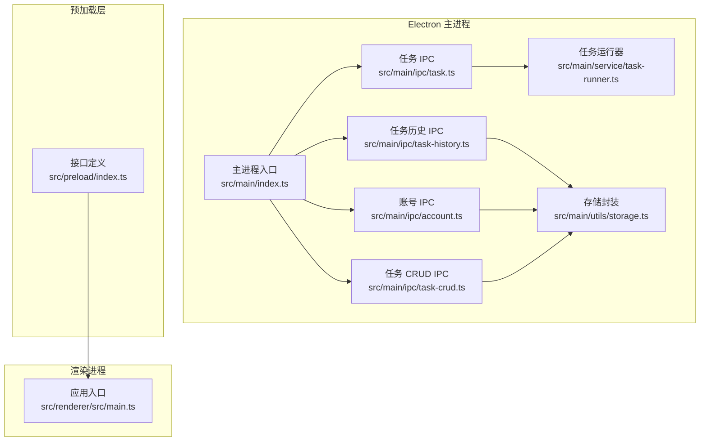
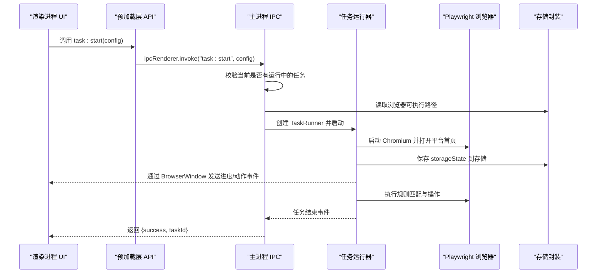
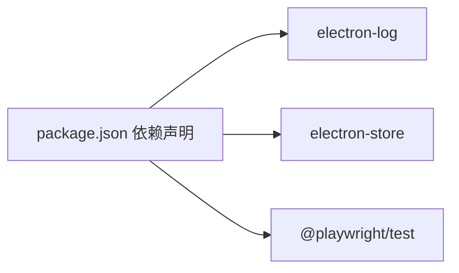

# 维护和监控

<cite>
**本文引用的文件**
- [package.json](file://package.json)
- [主进程入口 index.ts](file://src/main/index.ts)
- [预加载层接口定义 index.ts](file://src/preload/index.ts)
- [渲染进程应用入口 main.ts](file://src/renderer/src/main.ts)
- [调试 IPC 注册 debug.ts](file://src/main/ipc/debug.ts)
- [任务 IPC 注册 task.ts](file://src/main/ipc/task.ts)
- [任务历史 IPC 注册 task-history.ts](file://src/main/ipc/task-history.ts)
- [账号 IPC 注册 account.ts](file://src/main/ipc/account.ts)
- [任务 CRUD IPC 注册 task-crud.ts](file://src/main/ipc/task-crud.ts)
- [任务运行器 task-runner.ts](file://src/main/service/task-runner.ts)
- [存储封装 storage.ts](file://src/main/utils/storage.ts)
- [任务模型 task.ts](file://src/shared/task.ts)
- [账号模型 account.ts](file://src/shared/account.ts)
- [任务历史模型 task-history.ts](file://src/shared/task-history.ts)
</cite>

## 目录
1. [简介](#简介)
2. [项目结构](#项目结构)
3. [核心组件](#核心组件)
4. [架构总览](#架构总览)
5. [详细组件分析](#详细组件分析)
6. [依赖关系分析](#依赖关系分析)
7. [性能考量](#性能考量)
8. [故障排查指南](#故障排查指南)
9. [结论](#结论)
10. [附录](#附录)

## 简介
本指南面向 AutoOps 的运维与监控场景，覆盖日常维护任务（日志清理、缓存管理、数据库维护、临时文件清理）、性能监控指标与工具配置建议（CPU、内存、磁盘、网络）、错误日志分析与常见问题诊断流程、告警与异常通知机制、健康检查自动化脚本与维护计划、备份与恢复策略（配置文件、任务历史、用户数据），以及性能优化与资源调优实践。文档以仓库现有代码为依据，结合 Electron + Vue + Playwright 技术栈的实际实现，提供可落地的操作建议。

## 项目结构
AutoOps 采用 Electron 主进程 + 预加载层 + 渲染进程的三层架构：
- 主进程负责窗口生命周期、IPC 注册、任务调度与执行、日志与存储管理。
- 预加载层通过 contextBridge 暴露受控 API 到渲染进程。
- 渲染进程基于 Vue 应用承载 UI 与交互。
- 业务逻辑由服务层（如任务运行器）与平台适配器协作完成，Playwright 控制浏览器行为。

图表来源
- [主进程入口 index.ts:1-106](file://src/main/index.ts#L1-L106)
- [任务 IPC 注册 task.ts:1-104](file://src/main/ipc/task.ts#L1-L104)
- [任务历史 IPC 注册 task-history.ts:1-45](file://src/main/ipc/task-history.ts#L1-L45)
- [账号 IPC 注册 account.ts:1-101](file://src/main/ipc/account.ts#L1-L101)
- [任务 CRUD IPC 注册 task-crud.ts:1-108](file://src/main/ipc/task-crud.ts#L1-L108)
- [任务运行器 task-runner.ts:1-760](file://src/main/service/task-runner.ts#L1-L760)
- [存储封装 storage.ts:1-46](file://src/main/utils/storage.ts#L1-L46)
- [预加载层接口定义 index.ts:1-187](file://src/preload/index.ts#L1-L187)
- [渲染进程应用入口 main.ts:1-12](file://src/renderer/src/main.ts#L1-L12)

章节来源
- [主进程入口 index.ts:1-106](file://src/main/index.ts#L1-L106)
- [预加载层接口定义 index.ts:1-187](file://src/preload/index.ts#L1-L187)
- [渲染进程应用入口 main.ts:1-12](file://src/renderer/src/main.ts#L1-L12)

## 核心组件
- 日志系统：主进程使用 electron-log 进行统一日志输出，并通过 IPC 接收渲染端日志级别分发。
- 存储系统：electron-store 提供键值持久化，集中管理认证、浏览器路径、任务历史、账号、任务与模板等数据。
- 任务执行：TaskRunner 封装 Playwright 浏览器控制、平台适配器、AI 服务集成与任务循环逻辑。
- IPC 层：主进程注册各类 IPC 处理函数，渲染进程通过预加载层调用，实现 UI 与业务解耦。
- 平台与任务模型：共享模块定义任务、账号、任务历史等数据结构，确保前后端一致。

章节来源
- [主进程入口 index.ts:17-106](file://src/main/index.ts#L17-L106)
- [存储封装 storage.ts:1-46](file://src/main/utils/storage.ts#L1-L46)
- [任务运行器 task-runner.ts:1-760](file://src/main/service/task-runner.ts#L1-L760)
- [任务模型 task.ts:1-62](file://src/shared/task.ts#L1-L62)
- [账号模型 account.ts:1-39](file://src/shared/account.ts#L1-L39)
- [任务历史模型 task-history.ts:1-26](file://src/shared/task-history.ts#L1-L26)

## 架构总览
下图展示从 UI 触发任务到浏览器执行的关键链路，以及日志与存储的交互：

图表来源
- [任务 IPC 注册 task.ts:11-102](file://src/main/ipc/task.ts#L11-L102)
- [任务运行器 task-runner.ts:55-113](file://src/main/service/task-runner.ts#L55-L113)
- [存储封装 storage.ts:14-25](file://src/main/utils/storage.ts#L14-L25)

## 详细组件分析

### 日志系统与日志清理
- 日志来源
  - 主进程：通过 electron-log 输出 info/warn/error/debug 等级别日志。
  - 渲染进程：通过 ipcMain.on('log', ...) 接收前端日志并按级别写入主进程日志。
- 日志位置
  - electron-log 默认输出路径位于应用数据目录下的日志子目录（平台相关）。可通过配置调整输出路径与格式。
- 日志清理策略
  - 定期轮转与删除：保留最近 N 天的日志文件，删除超出保留期的日志。
  - 按大小限制：当日志文件超过阈值时进行压缩或滚动。
  - 告警联动：当错误日志数量在短时间内激增时触发告警。

章节来源
- [主进程入口 index.ts:17-106](file://src/main/index.ts#L17-L106)
- [任务运行器 task-runner.ts:746-758](file://src/main/service/task-runner.ts#L746-L758)

### 缓存管理
- 运行时缓存
  - TaskRunner 内部维护视频缓存 Map，用于加速视频信息获取；任务结束后释放。
- 浏览器上下文缓存
  - storageState 会话状态保存在存储中，避免重复登录；任务停止时更新。
- 缓存清理建议
  - 重启应用后清理过期的视频缓存。
  - 定期检查 storageState 是否有效，无效时提示重新登录。

章节来源
- [任务运行器 task-runner.ts:33-35](file://src/main/service/task-runner.ts#L33-L35)
- [任务运行器 task-runner.ts:212-233](file://src/main/service/task-runner.ts#L212-L233)

### 数据库维护与临时文件清理
- 存储介质
  - electron-store 使用本地文件存储（JSON 文件），键空间包含认证、浏览器路径、任务历史、账号、任务与模板等。
- 临时文件
  - Playwright 会在运行时产生缓存与下载目录，建议定期清理。
- 维护建议
  - 定期巡检存储文件大小，必要时迁移或压缩。
  - 清理 Playwright 缓存目录（如缓存过大）。
  - 对任务历史与账号列表进行归档与裁剪，防止无限增长。

章节来源
- [存储封装 storage.ts:14-25](file://src/main/utils/storage.ts#L14-L25)

### 性能监控指标与工具配置
- 指标建议
  - CPU 使用率：通过系统监控工具采集主进程与浏览器进程 CPU 占用。
  - 内存占用：监控主进程、渲染进程与 Playwright 进程的常驻内存峰值。
  - 磁盘空间：监控日志、缓存与存储文件的磁盘占用趋势。
  - 网络连接：监控平台域名解析与请求成功率、超时率。
- 工具配置
  - 使用系统自带性能监视器或第三方 APM 工具（如 Windows 性能计数器、Prometheus+Grafana）。
  - 在主进程侧增加自定义采样（如定时读取进程资源信息并写入日志）。

章节来源
- [调试 IPC 注册 debug.ts:3-12](file://src/main/ipc/debug.ts#L3-L12)
- [任务运行器 task-runner.ts:67-70](file://src/main/service/task-runner.ts#L67-L70)

### 错误日志分析与常见问题诊断
- 常见问题定位
  - 任务无法启动：检查浏览器可执行路径是否配置；查看主进程日志中“Browser path not configured”相关记录。
  - 任务中途停止：查看 TaskRunner 中的错误日志与状态切换（failed/stopped/completed）。
  - 登录态失效：storageState 保存失败或解析异常，需重新登录。
- 分析方法
  - 以 taskId 为线索串联主进程、任务运行器与浏览器日志。
  - 结合任务历史记录（任务开始/结束时间、状态、操作统计）定位异常区间。
  - 使用调试 IPC 获取平台、架构、Electron 版本等环境信息辅助复现。

章节来源
- [任务 IPC 注册 task.ts:32-36](file://src/main/ipc/task.ts#L32-L36)
- [任务运行器 task-runner.ts:106-110](file://src/main/service/task-runner.ts#L106-L110)
- [任务运行器 task-runner.ts:214-219](file://src/main/service/task-runner.ts#L214-L219)
- [调试 IPC 注册 debug.ts:3-12](file://src/main/ipc/debug.ts#L3-L12)

### 告警机制与异常通知
- 告警维度
  - 错误日志量阈值（如每分钟错误数超过阈值）。
  - 任务失败率（连续失败次数或失败占比）。
  - 资源异常（CPU/内存/磁盘占用持续高位）。
- 通知渠道
  - 邮件、IM 机器人、系统通知等。
- 实施建议
  - 在主进程侧增加周期性采样与阈值检测，达到阈值时触发通知。
  - 将告警与日志分级结合，区分严重与一般问题。

章节来源
- [主进程入口 index.ts:17-106](file://src/main/index.ts#L17-L106)
- [任务运行器 task-runner.ts:746-758](file://src/main/service/task-runner.ts#L746-L758)

### 健康检查自动化与维护计划
- 健康检查项
  - 应用进程存活与响应。
  - 浏览器可执行文件存在且可执行。
  - 存储文件可读写。
  - 最近一次任务运行状态与耗时。
- 自动化脚本
  - Windows：PowerShell 脚本，检查进程、文件与日志。
  - Linux/macOS：Shell 脚本，结合 systemctl/systemd 或 launchctl。
- 维护计划
  - 每日：清理日志与缓存、检查磁盘空间。
  - 每周：备份存储文件、归档任务历史、更新浏览器驱动。
  - 每月：全量备份配置与任务历史、重置临时缓存。

章节来源
- [存储封装 storage.ts:14-25](file://src/main/utils/storage.ts#L14-L25)
- [任务运行器 task-runner.ts:67-70](file://src/main/service/task-runner.ts#L67-L70)

### 备份与恢复策略
- 备份范围
  - 配置文件：electron-store 的存储文件（包含认证、AI 设置、浏览器路径等）。
  - 任务历史：任务历史记录数组，包含每次任务的统计与视频记录。
  - 用户数据：账号列表与默认账号标记。
- 备份方案
  - 文件级备份：直接复制存储文件到安全位置。
  - 结构化导出：导出任务历史与账号列表为 JSON 文件，便于检索与恢复。
- 恢复步骤
  - 停止应用后替换存储文件或导入 JSON。
  - 恢复后验证浏览器可执行路径与登录态有效性。

章节来源
- [存储封装 storage.ts:14-25](file://src/main/utils/storage.ts#L14-L25)
- [任务历史 IPC 注册 task-history.ts:16-21](file://src/main/ipc/task-history.ts#L16-L21)
- [账号 IPC 注册 account.ts:37-49](file://src/main/ipc/account.ts#L37-L49)

### 性能优化与资源调优
- 浏览器与页面
  - 合理设置 headless 模式与视口尺寸，减少资源消耗。
  - 复用 BrowserContext（多任务并行模式）降低浏览器实例成本。
- 任务执行
  - 调整视频切换等待时间、随机延时与最大连续跳过阈值，平衡吞吐与稳定性。
  - 仅在必要时启用 AI 评论，避免频繁调用外部服务。
- 存储与日志
  - 控制日志级别与频率，避免高频写入影响性能。
  - 对任务历史进行定期裁剪，限制最大记录数。

章节来源
- [任务运行器 task-runner.ts:118-156](file://src/main/service/task-runner.ts#L118-L156)
- [任务运行器 task-runner.ts:235-371](file://src/main/service/task-runner.ts#L235-L371)
- [任务运行器 task-runner.ts:638-673](file://src/main/service/task-runner.ts#L638-L673)

## 依赖关系分析
- 组件耦合
  - 主进程通过 IPC 与渲染进程解耦；TaskRunner 与平台适配器、AI 服务松耦合。
  - 存储封装集中管理数据，避免跨模块直接访问底层文件。
- 外部依赖
  - electron-log：统一日志输出与轮转。
  - electron-store：轻量级本地存储。
  - @playwright/test：浏览器自动化与页面控制。
- 循环依赖
  - 当前结构未发现循环依赖；IPC 注册集中在主进程入口统一初始化。

图表来源
- [package.json:16-34](file://package.json#L16-L34)

章节来源
- [package.json:16-34](file://package.json#L16-L34)

## 性能考量
- I/O 与并发
  - 存储读写与日志写入应避免阻塞主线程；对高频写入进行节流或批量提交。
- 任务并发
  - 多任务并行时优先复用 BrowserContext，减少浏览器实例数量。
- 资源回收
  - 明确释放 Page、Context、Browser 实例，及时清理缓存与事件监听。

章节来源
- [任务运行器 task-runner.ts:212-233](file://src/main/service/task-runner.ts#L212-L233)

## 故障排查指南
- 任务启动失败
  - 检查浏览器路径配置与可执行权限。
  - 查看主进程日志中“Browser path not configured”与“Failed to start task”。
- 任务中途退出
  - 关注 TaskRunner 的状态变化与错误日志，定位具体阶段。
- 登录态丢失
  - 检查 storageState 保存与解析过程，必要时重新登录。
- 性能异常
  - 采集 CPU/内存/磁盘与网络指标，结合日志定位瓶颈。

章节来源
- [任务 IPC 注册 task.ts:32-36](file://src/main/ipc/task.ts#L32-L36)
- [任务运行器 task-runner.ts:106-110](file://src/main/service/task-runner.ts#L106-L110)
- [任务运行器 task-runner.ts:214-219](file://src/main/service/task-runner.ts#L214-L219)

## 结论
通过规范化的日志与存储管理、明确的监控与告警机制、完善的备份与恢复策略，以及针对任务执行与资源使用的优化手段，AutoOps 可以在保证稳定性的同时提升整体运维效率。建议将本文的维护与监控流程纳入标准作业手册，并根据实际运行情况持续迭代优化。

## 附录
- 快速检查清单
  - 日志：确认日志轮转与保留策略生效。
  - 存储：核对存储文件大小与可读写状态。
  - 浏览器：确认可执行路径与版本兼容。
  - 任务：验证最近一次任务运行状态与耗时。
  - 备份：确认备份文件完整性与可恢复性。