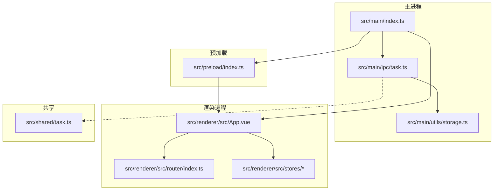
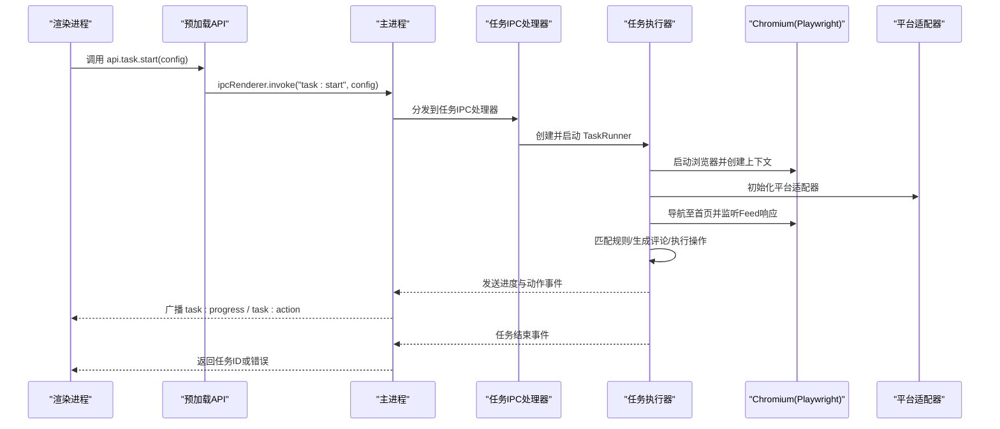
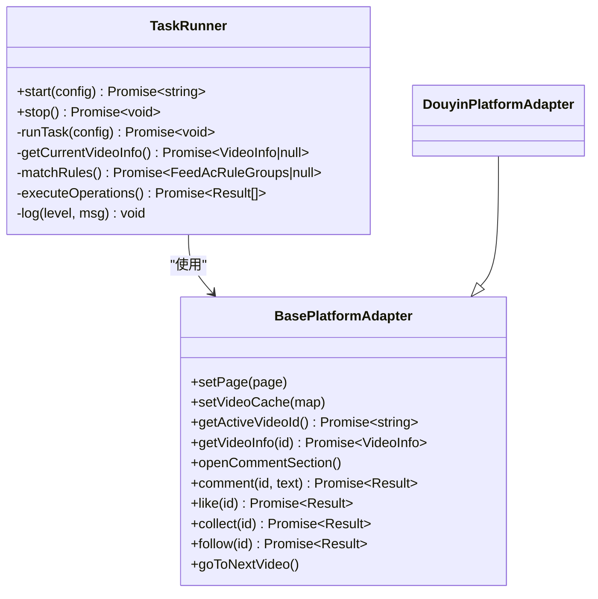
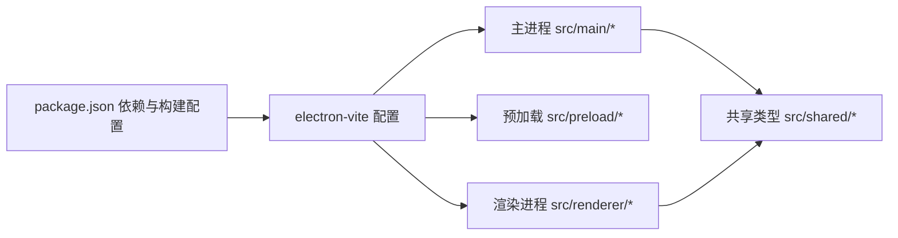

# 部署和维护

<cite>
**本文引用的文件**
- [package.json](file://package.json)
- [electron.vite.config.ts](file://electron.vite.config.ts)
- [src/main/index.ts](file://src/main/index.ts)
- [src/preload/index.ts](file://src/preload/index.ts)
- [src/main/ipc/task.ts](file://src/main/ipc/task.ts)
- [src/main/service/task-runner.ts](file://src/main/service/task-runner.ts)
- [src/main/utils/storage.ts](file://src/main/utils/storage.ts)
- [src/shared/task.ts](file://src/shared/task.ts)
- [README.md](file://README.md)
- [tsconfig.json](file://tsconfig.json)
</cite>

## 目录
1. [简介](#简介)
2. [项目结构](#项目结构)
3. [核心组件](#核心组件)
4. [架构总览](#架构总览)
5. [详细组件分析](#详细组件分析)
6. [依赖关系分析](#依赖关系分析)
7. [性能考量](#性能考量)
8. [故障排除指南](#故障排除指南)
9. [结论](#结论)
10. [附录](#附录)

## 简介
本指南面向运维与开发人员，围绕 AutoOps 的生产部署与长期维护提供系统化方案。内容涵盖：生产环境部署要求与系统兼容性、安装与打包流程、Electron Builder 配置与多平台打包策略、版本管理与自动更新准备、日志与监控、安全与权限、备份策略、常见问题排查与最佳实践。

## 项目结构
AutoOps 是基于 Electron + Vue3 + Vite 的桌面应用，采用主进程-预加载桥接-渲染进程的典型架构。主要目录与职责如下：
- src/main：Electron 主进程代码，负责窗口、IPC 注册、业务服务入口
- src/preload：预加载脚本，通过 contextBridge 暴露受控 API 至渲染进程
- src/renderer：Vue3 渲染进程前端应用
- src/shared：共享类型定义与默认配置
- build：构建资源目录（图标等）
- electron.vite.config.ts：多进程（main/preload/renderer）构建配置
- package.json：脚本、依赖与构建配置（含 electron-builder）

图表来源
- [src/main/index.ts:1-106](file://src/main/index.ts#L1-L106)
- [src/preload/index.ts:1-187](file://src/preload/index.ts#L1-L187)
- [src/main/ipc/task.ts:1-104](file://src/main/ipc/task.ts#L1-L104)
- [src/main/utils/storage.ts:1-46](file://src/main/utils/storage.ts#L1-L46)
- [src/shared/task.ts:1-54](file://src/shared/task.ts#L1-L54)

章节来源
- [README.md:1-54](file://README.md#L1-L54)
- [electron.vite.config.ts:1-34](file://electron.vite.config.ts#L1-L34)
- [tsconfig.json:1-18](file://tsconfig.json#L1-L18)

## 核心组件
- 主进程入口与窗口生命周期：负责创建 BrowserWindow、注册 IPC、设置日志、处理窗口事件与应用生命周期
- 预加载桥接层：通过 contextBridge 暴露受控 API，统一渲染进程调用
- 任务执行器：基于 Playwright 控制浏览器，实现平台适配、AI 评论生成、规则匹配与自动化操作
- 存储与配置：electron-store 提供本地持久化，集中管理认证、账号、任务、模板等数据
- 打包与构建：electron-vite 驱动多进程构建，electron-builder 配置多平台产物

章节来源
- [src/main/index.ts:1-106](file://src/main/index.ts#L1-L106)
- [src/preload/index.ts:1-187](file://src/preload/index.ts#L1-L187)
- [src/main/service/task-runner.ts:1-608](file://src/main/service/task-runner.ts#L1-L608)
- [src/main/utils/storage.ts:1-46](file://src/main/utils/storage.ts#L1-L46)

## 架构总览
下图展示从渲染进程发起任务到主进程执行、浏览器自动化与平台交互的整体流程。

图表来源
- [src/preload/index.ts:102-116](file://src/preload/index.ts#L102-L116)
- [src/main/ipc/task.ts:11-103](file://src/main/ipc/task.ts#L11-L103)
- [src/main/service/task-runner.ts:35-85](file://src/main/service/task-runner.ts#L35-L85)

## 详细组件分析

### 主进程与窗口生命周期
- 创建窗口：设置最小尺寸、菜单栏、webPreferences（禁用 Node 集成、启用上下文隔离、预加载路径）
- 开发/生产加载：开发模式从环境变量地址加载，生产模式加载本地 HTML
- 日志初始化：electron-log 初始化并记录启动信息
- 应用激活与退出：窗口激活、全关闭平台判断、优化快捷键监听

章节来源
- [src/main/index.ts:22-52](file://src/main/index.ts#L22-L52)
- [src/main/index.ts:54-84](file://src/main/index.ts#L54-L84)
- [src/main/index.ts:92-106](file://src/main/index.ts#L92-L106)

### 预加载桥接与 API 暴露
- 通过 contextBridge.exposeInMainWorld 暴露受限 API 接口，包括认证、任务控制、账号、设置、文件选择、调试等
- 渲染进程通过 ipcRenderer.invoke 调用，支持进度与动作事件订阅

章节来源
- [src/preload/index.ts:3-93](file://src/preload/index.ts#L3-L93)
- [src/preload/index.ts:95-187](file://src/preload/index.ts#L95-L187)

### 任务 IPC 与并发控制
- 任务启动：校验是否已有运行中的任务、读取浏览器可执行路径、迁移旧版设置、创建 TaskRunner 并广播进度/动作事件
- 任务停止：停止当前 Runner 并清理状态
- 任务状态：返回是否正在运行

章节来源
- [src/main/ipc/task.ts:11-103](file://src/main/ipc/task.ts#L11-L103)

### 任务执行器（TaskRunner）
- 浏览器与上下文：使用 Chromium 可执行路径启动，按账号存储状态恢复登录态
- 平台适配：根据平台创建适配器，监听 Feed 响应缓存视频数据
- 规则匹配：支持手动规则与 AI 规则组，支持组合操作与概率控制
- 操作执行：评论、点赞、收藏、关注等，支持模拟观看时长与 AI 评论生成
- 运行统计：记录成功次数、操作统计、连续跳过阈值与日志输出

图表来源
- [src/main/service/task-runner.ts:23-85](file://src/main/service/task-runner.ts#L23-L85)
- [src/main/service/task-runner.ts:408-437](file://src/main/service/task-runner.ts#L408-L437)
- [src/main/platform/base.ts](file://src/main/platform/base.ts)
- [src/main/platform/douyin/index.ts](file://src/main/platform/douyin/index.ts)

章节来源
- [src/main/service/task-runner.ts:1-608](file://src/main/service/task-runner.ts#L1-L608)

### 存储与配置
- electron-store 默认键：认证、账号、任务、模板、AI 设置、浏览器路径、任务历史
- 读写封装：统一 get/set 方法，避免直接访问 Store 实例

章节来源
- [src/main/utils/storage.ts:14-46](file://src/main/utils/storage.ts#L14-L46)

### 打包与构建配置
- electron-vite：分别配置 main、preload、renderer 三类进程，别名与插件（外部依赖、Tailwind、Vue）
- electron-builder：应用 ID、产品名、输出目录、资源目录、目标平台与安装包类型（Windows NSIS、macOS DMG、Linux AppImage），NSIS 选项（可选自定义安装目录、桌面快捷方式等）

章节来源
- [electron.vite.config.ts:6-33](file://electron.vite.config.ts#L6-L33)
- [package.json:50-83](file://package.json#L50-L83)

### 版本管理与自动更新准备
- 当前未发现内置自动更新机制配置（如 Squirrel 或 GitHub Releases 更新通道）。建议在 electron-builder 中启用更新通道，并在主进程引入自动更新逻辑（例如基于 GitHub Releases 的更新检查与下载）
- 版本号位于 package.json 的 version 字段，建议遵循语义化版本管理

章节来源
- [package.json:3](file://package.json#L3)
- [package.json:50-83](file://package.json#L50-L83)

## 依赖关系分析
- 主进程依赖：electron、electron-log、electron-store、@electron-toolkit/utils、@playwright/test
- 渲染进程依赖：Vue3、Pinia、Vue Router、Tailwind CSS、UI 组件库等
- 构建工具：electron-vite、electron-builder、Vite、TypeScript

图表来源
- [package.json:16-49](file://package.json#L16-L49)
- [electron.vite.config.ts:1-34](file://electron.vite.config.ts#L1-L34)

章节来源
- [package.json:16-49](file://package.json#L16-L49)
- [electron.vite.config.ts:1-34](file://electron.vite.config.ts#L1-L34)

## 性能考量
- 浏览器启动与上下文：避免频繁重启浏览器，复用上下文以减少登录态重建成本
- 规则匹配与 AI 生成：对热门评论与 AI 生成进行缓存与降频，降低网络与算力开销
- 模拟行为：合理设置随机等待区间与连续跳过阈值，平衡吞吐与稳定性
- 日志级别：生产环境建议提升日志级别，减少高频 debug 输出

## 故障排除指南
- 无法启动任务
  - 检查浏览器可执行路径是否配置（存储键：browserExecPath）
  - 确认未重复启动任务（同一实例仅允许一个任务运行）
  - 查看主进程日志定位错误
- 评论失败或活跃度不足
  - 检查 AI 服务可用性与配置
  - 确认平台适配器与评论区打开逻辑
- 登录态丢失
  - 确认上下文 storageState 是否正确保存与恢复
- Windows 安装问题
  - NSIS 自定义安装目录与桌面快捷方式选项可调整
- Linux/macOS 打包问题
  - 确认图标路径与签名（macOS DMG、Linux AppImage）

章节来源
- [src/main/ipc/task.ts:32-36](file://src/main/ipc/task.ts#L32-L36)
- [src/main/ipc/task.ts:86-98](file://src/main/ipc/task.ts#L86-L98)
- [src/main/service/task-runner.ts:49-61](file://src/main/service/task-runner.ts#L49-L61)
- [src/main/service/task-runner.ts:461-527](file://src/main/service/task-runner.ts#L461-L527)
- [package.json:60-82](file://package.json#L60-L82)

## 结论
本指南提供了 AutoOps 在生产环境下的部署与维护全景视图：从构建与打包、多平台产物、到任务执行链路、日志与存储、以及安全与故障排除建议。建议在现有基础上补充自动更新通道与更完善的监控告警体系，以支撑长期稳定运行与持续改进。

## 附录

### 生产环境部署清单
- 系统要求
  - Windows/macOS/Linux 桌面系统
  - 已安装 Chromium 可执行文件路径（配置于存储）
- 安装流程
  - 安装依赖：npm ci 或 npm install
  - 构建：npm run build（或按平台单独构建）
  - 产物位置：dist 目录（由 electron-builder 配置）
- 多平台打包策略
  - Windows：NSIS 安装包
  - macOS：DMG 镜像
  - Linux：AppImage
- 版本管理与发布
  - 版本号：package.json version
  - 发布前检查：依赖锁定、类型检查、跨平台测试
- 自动更新准备
  - electron-builder 启用更新通道（如 GitHub Releases）
  - 主进程引入自动更新检查与提示逻辑
- 维护与监控
  - 日志：electron-log 记录主进程与任务执行日志
  - 监控：结合系统指标与任务成功率
  - 备份：定期导出账号、任务与设置数据
- 安全与权限
  - 最小权限原则：仅授予必要系统权限
  - 数据加密：敏感配置与令牌建议加密存储
  - 网络安全：AI 与平台接口使用 HTTPS，校验证书
- 常见问题与最佳实践
  - 避免高并发任务导致平台风控
  - 合理设置随机延迟与连续跳过阈值
  - 定期清理临时缓存与过期日志

章节来源
- [package.json:6-14](file://package.json#L6-L14)
- [package.json:50-83](file://package.json#L50-L83)
- [src/main/service/task-runner.ts:132-245](file://src/main/service/task-runner.ts#L132-L245)
- [src/main/utils/storage.ts:14-25](file://src/main/utils/storage.ts#L14-L25)