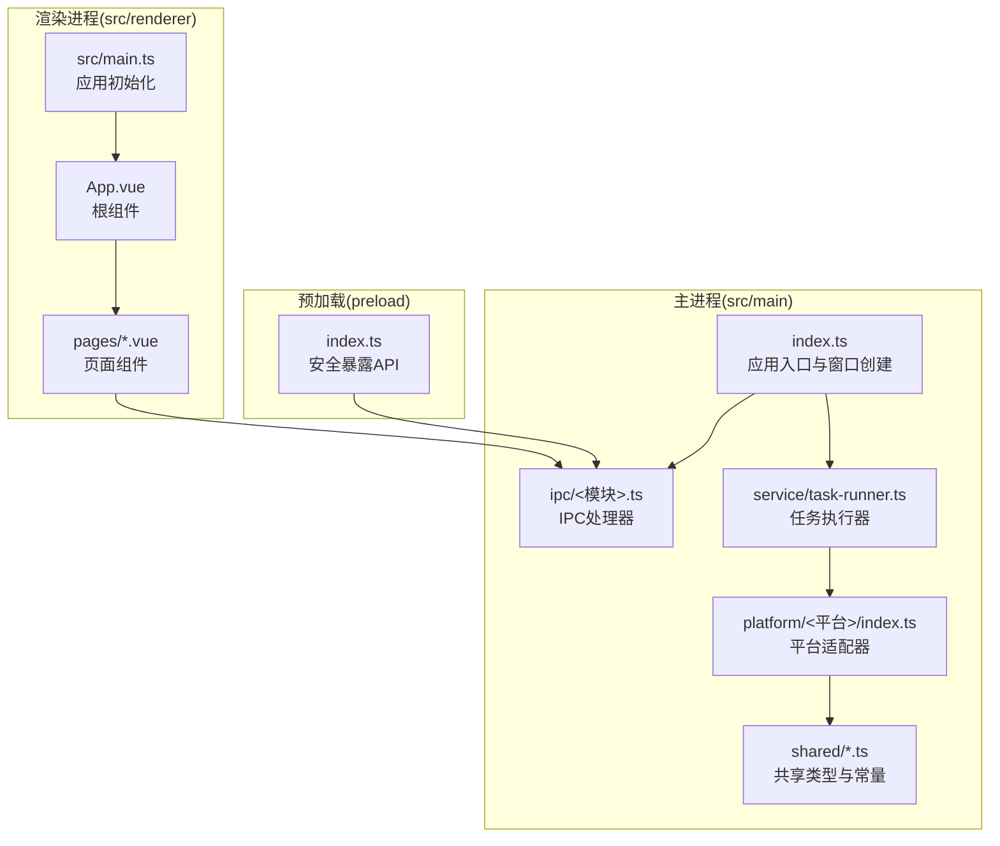
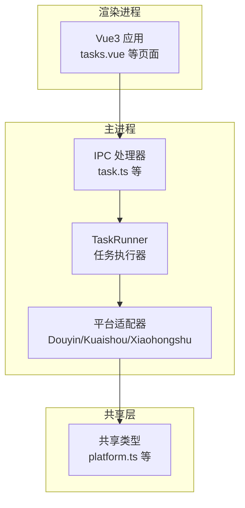
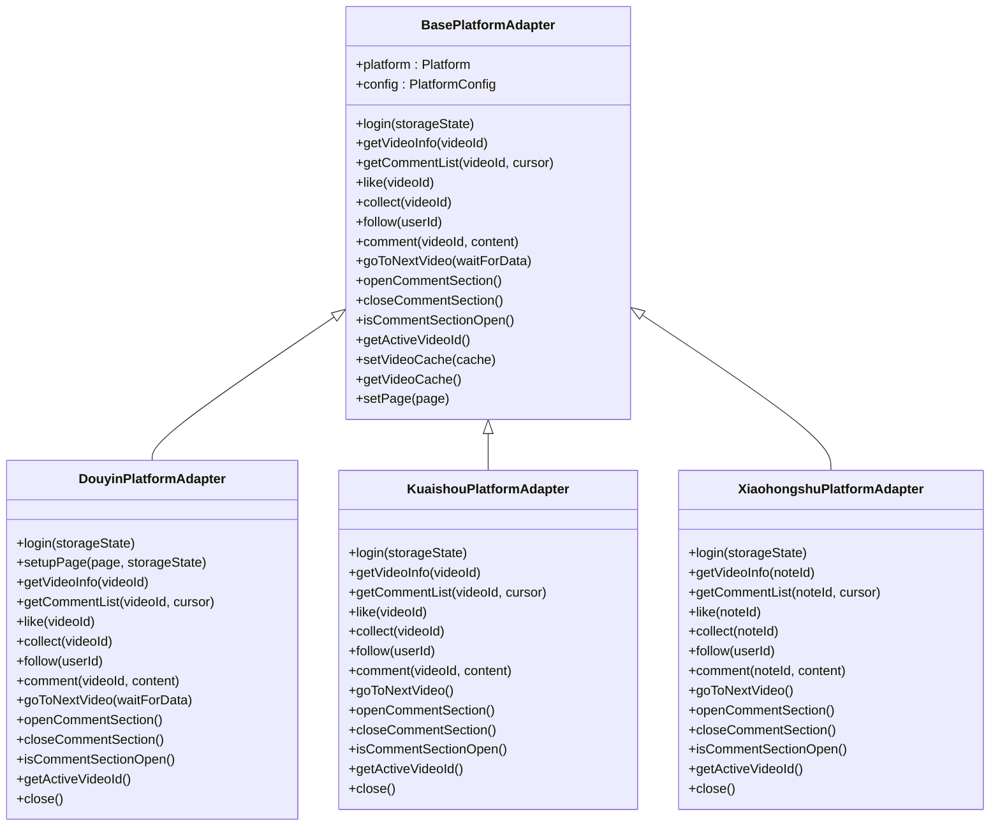
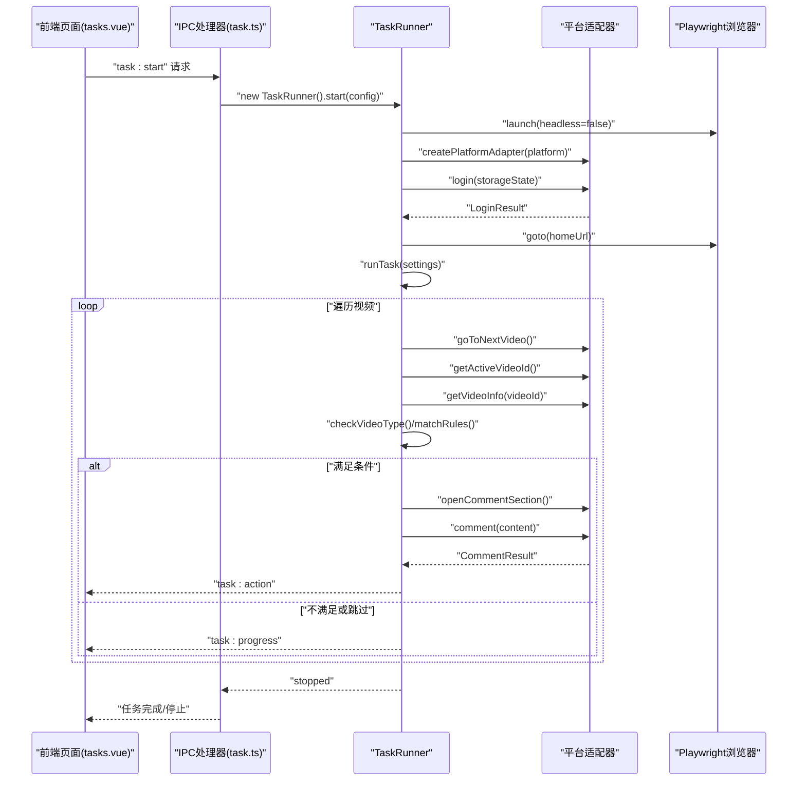
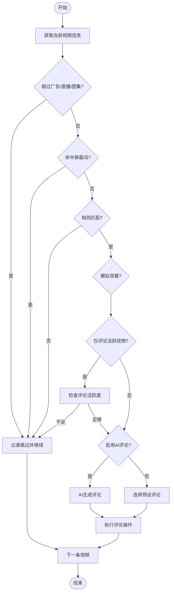
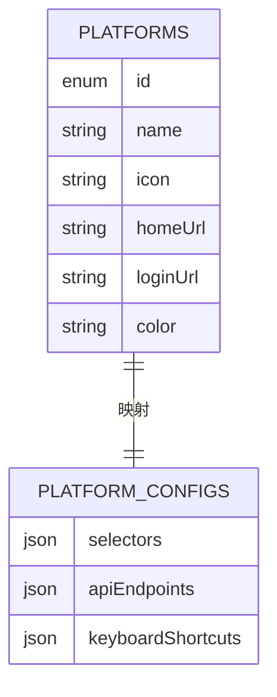
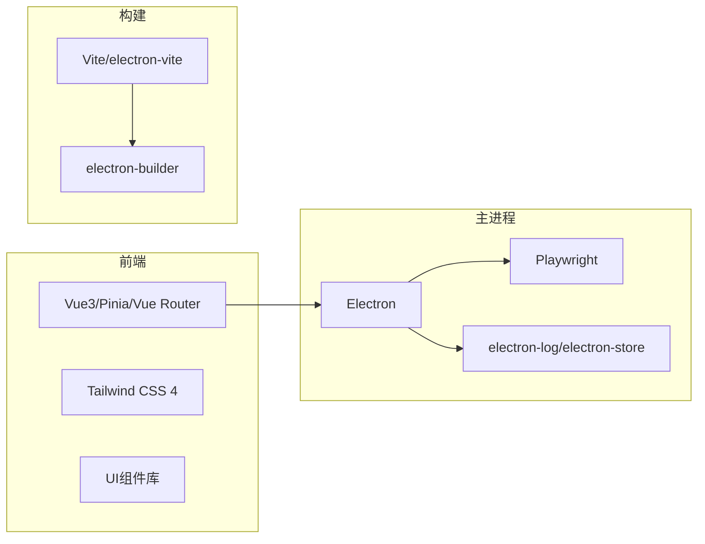

# 项目概述

<cite>
**本文档引用的文件**
- [package.json](file://package.json)
- [README.md](file://README.md)
- [src/main/index.ts](file://src/main/index.ts)
- [src/renderer/src/main.ts](file://src/renderer/src/main.ts)
- [src/shared/platform.ts](file://src/shared/platform.ts)
- [src/main/platform/base.ts](file://src/main/platform/base.ts)
- [src/main/platform/factory.ts](file://src/main/platform/factory.ts)
- [src/main/platform/douyin/index.ts](file://src/main/platform/douyin/index.ts)
- [src/main/platform/kuaishou/index.ts](file://src/main/platform/kuaishou/index.ts)
- [src/main/platform/xiaohongshu/index.ts](file://src/main/platform/xiaohongshu/index.ts)
- [src/main/service/task-runner.ts](file://src/main/service/task-runner.ts)
- [src/main/ipc/task.ts](file://src/main/ipc/task.ts)
- [src/renderer/src/pages/tasks.vue](file://src/renderer/src/pages/tasks.vue)
- [src/renderer/src/App.vue](file://src/renderer/src/App.vue)
</cite>

## 目录
1. [简介](#简介)
2. [项目结构](#项目结构)
3. [核心组件](#核心组件)
4. [架构总览](#架构总览)
5. [详细组件分析](#详细组件分析)
6. [依赖关系分析](#依赖关系分析)
7. [性能考虑](#性能考虑)
8. [故障排除指南](#故障排除指南)
9. [结论](#结论)
10. [附录](#附录)

## 简介
AutoOps 是一款基于 Electron + Vue3 的桌面端多平台自动化运营工具，专注于在抖音、快手、小红书等短视频/社交平台进行批量自动化运营。项目通过 Playwright 驱动浏览器自动化，结合 AI 服务生成智能评论，支持评论、点赞、收藏、关注等多种操作，并具备规则化筛选、模拟真人行为、任务历史追踪等功能。

- **核心目标**：降低人工成本，提升内容运营效率，实现可配置、可扩展、可监控的自动化运营流水线。
- **主要功能特性**：
  - AI 智能评论：支持多平台 AI 服务，基于视频内容与热门评论风格生成个性化评论。
  - 多操作自动化：一键执行评论、点赞、收藏、关注等动作。
  - 模拟真人行为：随机观看时长、输入延迟、操作概率，降低风控风险。
  - 规则配置灵活：支持手动关键词规则与 AI 规则，动态匹配目标内容。
  - 视频活跃度检测：自动识别并跳过低活跃视频，提高转化效率。
  - 任务历史记录：完整记录每次任务的执行状态与结果，便于审计与复盘。

- **技术架构选择**：
  - 桌面端框架：Electron 38.x + electron-vite，提供跨平台原生体验。
  - 前端框架：Vue 3 + TypeScript + Vite，配合 Tailwind CSS 4 实现现代化界面。
  - 自动化引擎：Playwright，稳定驱动浏览器完成页面交互与数据抓取。
  - 状态管理：Pinia，轻量高效的状态管理方案。
  - IPC 通信：主进程与渲染进程间通过 IPC 事件传递任务状态与进度。

- **应用场景**：
  - 内容运营团队：批量提升账号互动率与粉丝增长。
  - 电商/品牌方：在短视频平台进行精准内容推广与用户互动。
  - 自媒体创作者：自动化维护账号活跃度与社区氛围。
  - 个人用户：简化重复性运营工作，专注创意与策略。

- **优势特点**：
  - 跨平台部署：一次构建，Windows/macOS/Linux 均可运行。
  - 插件式平台适配：统一抽象层 + 工厂模式，轻松扩展新平台。
  - 可观测性：任务进度、操作日志、错误告警一体化输出。
  - 易用性：图形化配置界面，无需编程经验即可上手。

- **适用人群**：
  - 运营人员、内容创作者、电商从业者、技术运维人员。

- **版本信息与许可证**：
  - 当前版本：0.1.0
  - 项目未在 package.json 中声明许可证字段，建议在使用前确认具体许可条款。

**章节来源**
- [README.md:1-54](file://README.md#L1-L54)
- [package.json:1-85](file://package.json#L1-L85)

## 项目结构
项目采用“主进程 + 渲染进程 + 共享层”的三层架构，前端使用 Vue3 + TypeScript，后端通过 IPC 与主进程交互，业务逻辑集中在主进程的服务层。

**图表来源**
- [src/main/index.ts:1-106](file://src/main/index.ts#L1-L106)
- [src/renderer/src/main.ts:1-12](file://src/renderer/src/main.ts#L1-L12)
- [src/renderer/src/App.vue:1-11](file://src/renderer/src/App.vue#L1-L11)
- [src/main/ipc/task.ts:1-104](file://src/main/ipc/task.ts#L1-L104)
- [src/main/service/task-runner.ts:1-608](file://src/main/service/task-runner.ts#L1-L608)
- [src/main/platform/douyin/index.ts:1-507](file://src/main/platform/douyin/index.ts#L1-L507)

**章节来源**
- [README.md:36-54](file://README.md#L36-L54)

## 核心组件
- 应用入口与窗口管理：负责创建主窗口、注册 IPC 处理器、加载开发/生产资源。
- 任务执行器：封装自动化流程，包括浏览器启动、页面监听、规则匹配、AI 评论生成、操作执行与历史记录。
- 平台适配器：以抽象基类为基础，针对不同平台实现登录、视频信息获取、评论区交互、操作执行等差异化逻辑。
- IPC 层：提供任务启动/停止、进度通知、动作上报等接口，连接前后端。
- 前端页面：提供任务配置、规则编辑、历史查看、模板管理等可视化界面。

**章节来源**
- [src/main/index.ts:1-106](file://src/main/index.ts#L1-L106)
- [src/main/service/task-runner.ts:1-608](file://src/main/service/task-runner.ts#L1-L608)
- [src/main/platform/base.ts:1-105](file://src/main/platform/base.ts#L1-L105)
- [src/main/ipc/task.ts:1-104](file://src/main/ipc/task.ts#L1-L104)
- [src/renderer/src/pages/tasks.vue:1-867](file://src/renderer/src/pages/tasks.vue#L1-L867)

## 架构总览
AutoOps 采用“主进程 + 渲染进程 + 共享层”分层设计，前端负责配置与展示，主进程负责自动化执行与系统集成。

**图表来源**
- [src/renderer/src/pages/tasks.vue:1-867](file://src/renderer/src/pages/tasks.vue#L1-L867)
- [src/main/ipc/task.ts:1-104](file://src/main/ipc/task.ts#L1-L104)
- [src/main/service/task-runner.ts:1-608](file://src/main/service/task-runner.ts#L1-L608)
- [src/main/platform/douyin/index.ts:1-507](file://src/main/platform/douyin/index.ts#L1-L507)
- [src/shared/platform.ts:1-260](file://src/shared/platform.ts#L1-L260)

## 详细组件分析

### 平台适配器体系
平台适配器通过工厂模式创建，统一抽象登录、视频信息、评论区交互与操作执行等能力，确保多平台一致性。

**图表来源**
- [src/main/platform/base.ts:1-105](file://src/main/platform/base.ts#L1-L105)
- [src/main/platform/douyin/index.ts:1-507](file://src/main/platform/douyin/index.ts#L1-L507)
- [src/main/platform/kuaishou/index.ts:1-253](file://src/main/platform/kuaishou/index.ts#L1-L253)
- [src/main/platform/xiaohongshu/index.ts:1-264](file://src/main/platform/xiaohongshu/index.ts#L1-L264)

**章节来源**
- [src/main/platform/base.ts:1-105](file://src/main/platform/base.ts#L1-L105)
- [src/main/platform/factory.ts:1-32](file://src/main/platform/factory.ts#L1-L32)
- [src/main/platform/douyin/index.ts:1-507](file://src/main/platform/douyin/index.ts#L1-L507)
- [src/main/platform/kuaishou/index.ts:1-253](file://src/main/platform/kuaishou/index.ts#L1-L253)
- [src/main/platform/xiaohongshu/index.ts:1-264](file://src/main/platform/xiaohongshu/index.ts#L1-L264)

### 任务执行流程（序列图）
以下序列图展示了从前端发起任务到主进程执行并返回进度的完整流程。

**图表来源**
- [src/renderer/src/pages/tasks.vue:1-867](file://src/renderer/src/pages/tasks.vue#L1-L867)
- [src/main/ipc/task.ts:1-104](file://src/main/ipc/task.ts#L1-L104)
- [src/main/service/task-runner.ts:1-608](file://src/main/service/task-runner.ts#L1-L608)
- [src/main/platform/base.ts:1-105](file://src/main/platform/base.ts#L1-L105)

**章节来源**
- [src/main/ipc/task.ts:1-104](file://src/main/ipc/task.ts#L1-L104)
- [src/main/service/task-runner.ts:1-608](file://src/main/service/task-runner.ts#L1-L608)

### 规则匹配与AI评论（流程图）
以下流程图展示了任务执行中的规则匹配与AI评论生成决策过程。

**图表来源**
- [src/main/service/task-runner.ts:296-527](file://src/main/service/task-runner.ts#L296-L527)
- [src/main/platform/douyin/index.ts:182-193](file://src/main/platform/douyin/index.ts#L182-L193)

**章节来源**
- [src/main/service/task-runner.ts:296-527](file://src/main/service/task-runner.ts#L296-L527)

### 平台配置与数据模型
项目通过共享类型定义平台信息、选择器、API 端点与键盘快捷键，确保各平台适配器的一致性。

**图表来源**
- [src/shared/platform.ts:1-260](file://src/shared/platform.ts#L1-L260)

**章节来源**
- [src/shared/platform.ts:1-260](file://src/shared/platform.ts#L1-L260)

## 依赖关系分析
- 前端依赖：Vue3、Pinia、Vue Router、Tailwind CSS 4、lucide-vue-next、vue-sonner 等。
- 主进程依赖：Electron、Playwright、electron-log、electron-store、@electron-toolkit 工具库。
- 构建工具：Vite、electron-vite、electron-builder，支持多平台打包与安装程序生成。

**图表来源**
- [package.json:16-49](file://package.json#L16-L49)

**章节来源**
- [package.json:16-83](file://package.json#L16-L83)

## 性能考虑
- 浏览器启动与上下文复用：TaskRunner 在启动时创建浏览器实例与上下文，避免频繁重启带来的开销。
- 数据缓存与监听：通过页面响应监听缓存视频数据，减少重复请求与等待时间。
- 操作节流与随机性：通过随机等待与概率控制，平衡效率与风控规避。
- 任务中断与状态持久化：任务停止时保存浏览器状态，便于后续恢复或调试。

[本节为通用指导，无需特定文件引用]

## 故障排除指南
- 无法启动任务：检查浏览器可执行路径是否配置正确，确认当前无任务正在运行。
- 登录失败：确保平台登录页可见且未出现验证码弹窗阻塞；必要时手动完成验证后再继续。
- 评论未生效：检查评论输入框定位是否正确，确认网络环境与平台反爬策略影响。
- 任务长时间无响应：查看任务进度日志，确认是否因连续跳过达到阈值而暂停。

**章节来源**
- [src/main/ipc/task.ts:1-104](file://src/main/ipc/task.ts#L1-L104)
- [src/main/service/task-runner.ts:113-130](file://src/main/service/task-runner.ts#L113-L130)

## 结论
AutoOps 通过 Electron + Vue3 的桌面端架构，结合 Playwright 的自动化能力与 AI 评论生成，为多平台内容运营提供了高可用、可扩展、易维护的解决方案。其模块化设计与规则化配置使得不同场景下的运营需求都能得到快速响应与落地。

[本节为总结性内容，无需特定文件引用]

## 附录
- 快速开始
  - 安装依赖：npm install
  - 开发模式：npm run dev
  - 构建应用：npm run build（支持 Windows/macOS/Linux）

- 版本信息
  - 当前版本：0.1.0
  - 技术栈：Electron 38.x、Vue 3、Vite、Tailwind CSS 4、Pinia、Playwright

**章节来源**
- [README.md:23-34](file://README.md#L23-L34)
- [package.json:3-4](file://package.json#L3-L4)